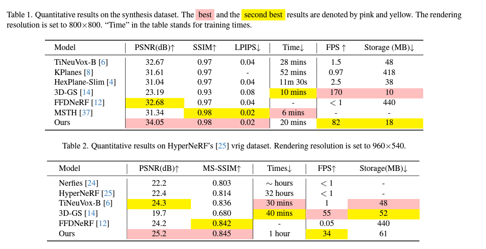
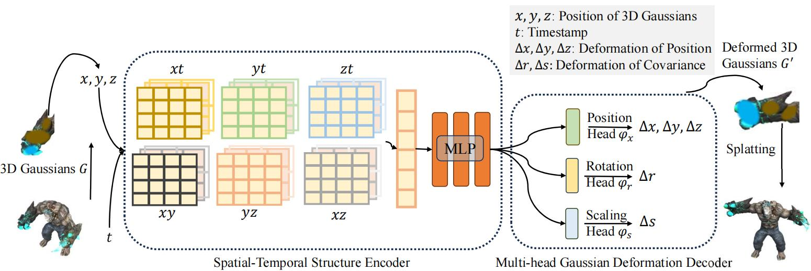

4D Gaussian Splatting for Real-Time Dynamic Scene Rendering

===

Author:Guanjun Wu1* , Taoran Yi2* , Jiemin Fang3† , Lingxi Xie3, Xiaopeng Zhang3, Wei Wei1, Wenyu Liu2, QiTian3, Xinggang Wang2†‡

Organization:[School of CS, Huazhong University of Science and Technology(https://english.hust.edu.cn/) 2School of EIC, Huazhong University of Science and Technology 3Huawei Inc.]

URL：https://guanjunwu.github.io/4dgs/
GitHub：https://github.com/hustvl/4DGaussians

(まとめ：Hisashi Takagi）

---

## どんなもの？

+ 4D Gaussian Splatting (4D-GS)は、動的なシーンをリアルタイムでレンダリングするための新しい手法
+ 3D Gaussianと4D neural voxelsを組み合わせた表現を使用し、高速かつ高品質なレンダリングを実現
+ 動画(https://youtu.be/_wRbq8KnaVg)

## 背景

3Dガウス・スプラッティングについて

※3D Gaussian Splattingについて調べてみた
https://qiita.com/harutine/items/e5bed074067dad429285?utm_source=stock_summary_mail&utm_medium=email&utm_term=jyuan0128&utm_content=3D%20Gaussian%20Splatting%E3%81%AB%E3%81%A4%E3%81%84%E3%81%A6%E8%AA%BF%E3%81%B9%E3%81%A6%E3%81%BF%E3%81%9F&utm_campaign=stock_summary_mail_2024-06-29#%E8%AB%96%E6%96%87

## 先行研究と比べてどこがすごい？
+ リアルタイムレンダリングを実現: 800x800の解像度で82 FPSを達成。
+ 高い訓練・ストレージ効率: 1セットの3D Gaussiansのみを保持し、変形フィールドネットワークで動きを表現。
+ 高品質な結果: 従来の最先端手法と同等以上の品質を維持。

## どうやって有効だと検証した？

+ レンダリング速度(30FPS 以上か?)、画質、学習時間（30分以内？）などの指標で従来手法と比較。
+ 品質：ほかの手法との比較
  

(性能評価)

---

## 技術や手法の肝は？

+ Gaussian変形フィールドネットワーク: 3D Gaussiansの動きと形状変化をモデル化。
+ マルチ解像度エンコーディング: 近接する3D Gaussiansを接続し、豊かな特徴を構築。
+ 時空間構造エンコーダー: 隣接する3D Gaussiansを接続し、より正確な動きと形状変形を予測

（モデルの説明）
+ 3Dガウスの集合 S が与えられた場合、各3Dガウスの中心 X とタイムスタンプ t を抽出し、時空間構造エンコーダーを用いて特徴量を計算
+ マルチヘッドのガウス変形デコーダーを使用してその特徴量をデコードし、タイムスタンプ t における各ガウスの S' を取得

## 議論はある？

+ 4Dガウススプラッティングの効率性：従来の方法に比べて、動的シーンのリアルタイムレンダリングが大幅に向上
+ 空間・時間の統合：3Dガウス表現に時間軸を追加することで、動的なシーンを効果的に捉える新しいアプローチ
+ モノキュラー入力に対する有効性。4Dガウススプラッティングを活用することで、1つのカメラから得られる情報でも、動的シーンの高精度なレンダリングが可能
+ 課題：大きな動き、背景、カメラの動き（位置）の再現性、大容量のデータ（都市の風景など）

（感想）
+ 時間軸の変化も表現できるのは楽しい
+ 学習時間と描画速度、画の品質もガウシアンらしい高精細、しかしデータが大きくなりすぎるのも困る気がする

---

## 次に読むべき論文は？

+ DEGAS: Detailed Expressions on Full-Body Gaussian Avatars(https://initialneil.github.io/DEGAS)

  
+ [Awesome 3D Gaussian Splatting Resources](https://github.com/MrNeRF/awesome-3D-gaussian-splatting)
 

