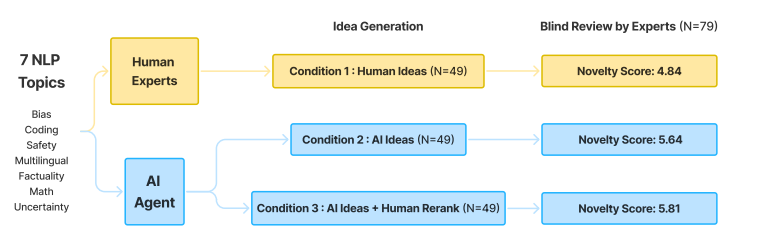
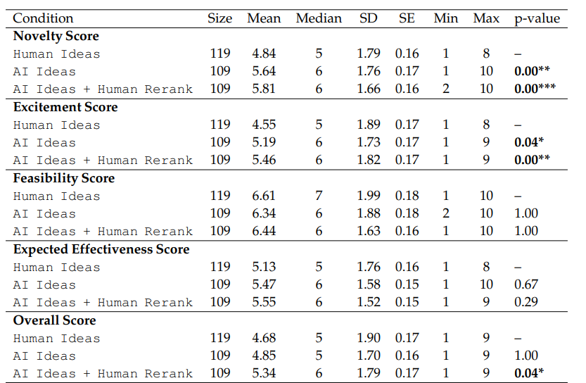
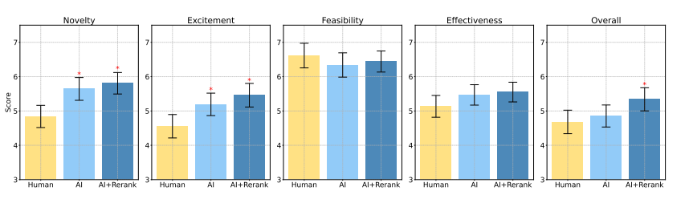

# Can LLMs Generate Novel Research Ideas? A Large-Scale Human Study with 100+ NLP Researchers
[https://arxiv.org/abs/2409.04109](https://arxiv.org/abs/2409.04109)
(まとめ @n-kats)

著者
* Chenglei Si
* Diyi Yang
* Tatsunori Hashimoto

スタンフォード大学の人たち

# どんなもの？
AIScientistのようにAIに研究を行わせる研究。研究アイデアをLLMで生成する部分に注目し、それが人間と比べてどうなのかをNLP分野で調査。

* LLMが優れるところ
  * 数の暴力が可能
  * 人間より新規性が高い
* LLMが苦手なところ
  * 人間より実現可能性を低く評価する
  * アイデアの評価の精度が悪い

# 先行研究と比べてどこがすごい？
アイデア生成の部分に焦点を絞り、100人以上の研究者の協力のもと、実験を行った。

AIScientistに合わせて急いでやった研究ではなくて、1年以上かけて実施した大規模な研究。

各種評価は、多重仮説修正などを行い検証しており、高い信頼性がある。

# 技術や手法の肝は？
## 実験設計
様々な交絡因子が混ざる可能性があり、注意して設計している。

### 研究テーマ
素朴に生成すると、想定外の分野のテーマになり比較できない。

最近のNLP会議（COLM）のcall for papers から7つのテーマ（バイアス、コーディング、安全性、多言語性、事実性、数学、不確実性）を選択。

人間にも同じテーマ・説明を提示して比較する。その中から好みのテーマを選択。
LLMは人間のテーマ分布に合わせて、テーマを選択。

### アイデアの表現形式
人間が研究申請を行う場合、具体的なことを書いて信頼性を高める工夫をする。

比較の際に、その工夫に引っ張られる可能性があるため、人間もLLMも記載内容の粒度を詳しい方にそろえることにした。

具体的には、
* タイトル
* 問題定義
* 動機
* 提案された方法
* ステップバイステップの実験計画
* テストケースの例
* バックアッププラン

を埋めさせることにした。（人間・LLMともに例を提示して指示）

それでも人間が人間らしい表現をするため、LLMで同じ書き方に正規化する処理をした（人間との区別がつかないようになった）。

### 評価
レビューは主観による部分が大きく、レビュー基準を整理してレビューを行った。

ICLRやACＬのレビューを参考に、以下の基準を設定した。
* 独創性
* 興奮度
* 実現可能性
* 予想される効果
* 総合スコア

これらを1から10のスコアと理由を記入してもらった。

### 実験パターン
* 人間のみ
* LLMのみ
* LLMと人間の混合：LLMがアイデアを生成し、人間がよいものを選ぶ

## アイデア生成
アイデア生成エージェントの研究が今回の研究目的ではないので、シンプルなエージェントを用いる方針を取った。

とはいえ、以下の3要素は入れることにした。

* 論文検索
* アイデア生成
* アイデアラインキング

### 論文検索
* 利用API: Semantic Scholar API
  * KeywordQuery(keywords)
  * PaperQuery(paperId)
  * GetReferences(paperId)
* 利用モデル: claude-3-5-sonnet-20240620（とはいえ、なんでもよい）

1回で上位20論文を取得し、最大120論文まで取得する。

LLMでテーマとの関係・実証的な論文か・興味深くてインスピレーションがわくかを判断し、主に上位の論文をアイデア生成に利用する。

### アイデア生成
質の高いアイデアはごく一部で、できるだけ多くの候補を生成する。
具体的には、4000アイデアを生成する。生成には、
* 検索した論文（上位からランダムに10論文）の要約
* 手動で要約した模範的な特定の6論文の例
* 生成したアイデア（重複を避けるため）

を与えた。

また、アイデアの重複除去のため、all-MiniLM-L6-v2でベクトル化し、類似度が0.8以上のものを除去した。（これにより5%=200アイデアに絞れる）

### アイデアラインキング

残ったものをライン付けして、最良のもとを選びたい。

ICLR2024の1200件の投稿のレビュー・判定結果を収集し、LLMに例として与えて判定させた。（ゼロショットでClaude-3.5-Sonnetが優れていたのでClaude-3.5-Sonnetを利用）

これによって、ペアワイズ比較を行って、スイス式トーナメントで最良のものを選ぶ（各アイデアで5案と比較）。(200アイデアとしたら少なくない？力士が600人弱いて、15戦やっているのを見ると・・・)

この判定は完全ではないが、上位10%と下位10%のアイデアを選び比較すると、明確に差があり有効と判断して用いた。

## 人間
### 専門家の募集
OpenNLP slackチャンネル・ツイッター・ほかのNLP slackチャンネル・NAACL2024公式チャットアプリ・名刺交換・リンクが書かれたTシャツ利用などの方法で募集。主要なAI会議で1回以上の発表経験があることを条件にした。

#### 人数
* アイデア作成のみ:25人
* レビューのみ: 55人
* 両方: 24人

の合計104人が参加。

#### 作業量
* アイデア作成・・・10日以内に1アイデア
  * 平均5.5.時間/アイデアで、アイデアの長さは平均902単語
* レビュー・・・2～7アイデアをレビュー（合計298件のレビュー）。各レビューの期限は1週間。（同じ組織の人のアイデアはレビューできない）
  * 平均32分/アイデアで、レビューの長さは平均232単語(実際のICLRと同規模の文量)

#### 報酬
* アイデア作成・・・300ドル
* レビュー・・・25ドル/アイデア
* 専門家レビュー高評価トップ5・・・+1000ドル

#### 参加者の実力
3/4が博士課程の学生

* アイデア作成者: 平均12本の論文と477件の引用があり
* レビュアー: 全員が少なくとも2つの論文を発表しており、平均引用数は635、h-indexは7。72/79が主要会議・ジャーナルでレビュー経験あり。

で優れた実力を持っている。

#### アイデアのクオリティ
37アイデアはその場で思いついたもの。12アイデアはそれまでに考えたことがあるもの。

過去の研究アイデアと比較した印象は、同程度の良さ（上位43%）だった。

# どうやって有効だと検証した？
LLMは、専門家より新規性が高いことがわかった。

p値が太文字のものは、有意差がある。

ExcitementやNoveltyは、LLMが人間より高いスコアを得た。逆にFeasibilityは、人間の方が高いスコアを得た。

レビューの数がアイデアによって違う・レビュアーの癖（甘く評価しやすいなど）を補正しても同じ結果が得られた。

## レビューに偏り
人間のレビュワーは、新規性と興奮度に注目する傾向が多い。逆に実現可能性には注目しない。

同じアイデアへのレビューの一致度をみると、56.1%しかなかった。

# 議論はある？
## 生成数を増やせば
膨大な量のアイデアを生成できる。その中から良いものが選べる可能性があり、これがLLMの強み。

ただし、生成するアイデアを増やしても重複するアイデアが多く、単純に増えるわけではない。

## LLMのレビュー
LLMはアイデアの信頼度の評価が難しい。

## 人間のアイデアの傾向
* 革新性が抑えて、実現可能性を重視する傾向がある。
* 分野内の一般的な問題・データセットにフォーカスする傾向がある。
* 既存の研究に基づいた実際的な考慮が入っている。

## 私見
* 人間より実現可能性を低く評価する・・・LLMは実際に実験をしないから、うまくいくかの経験が全くないからかもしれない。
* 専門家ありの研究の規模はGPQAのときも60人くらいだったが、今回は100人くらいで、これくらいが限界なのかもしれない。

# 次に読むべき論文は？
* [Evaluating Language Models for Mathematics through Interactions](https://arxiv.org/pdf/2306.01694)
  * 証明支援
* [LitSearch: A Retrieval Benchmark for Scientific Literature Search](https://arxiv.org/abs/2407.18940)
  * 科学文献検索のためのベンチマーク
* ボンフェローニ補正
