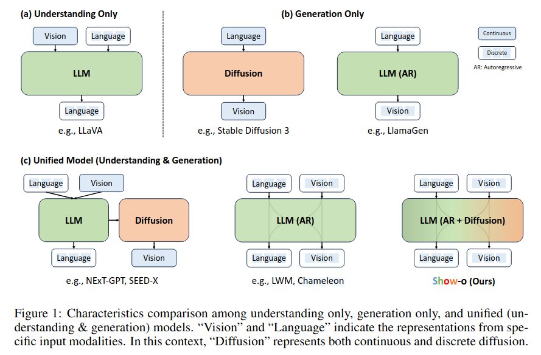
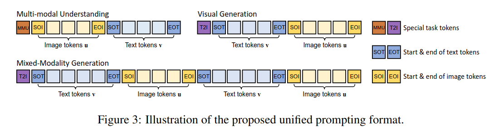
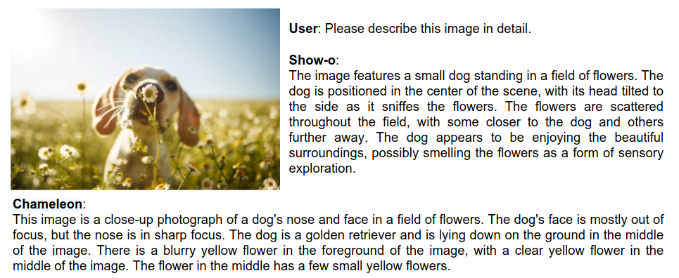
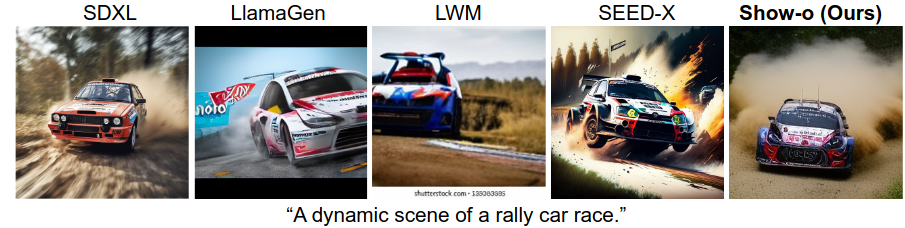
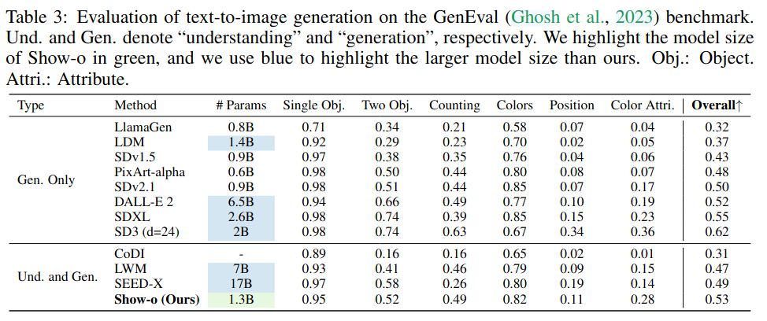
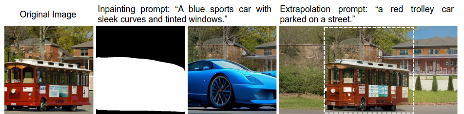
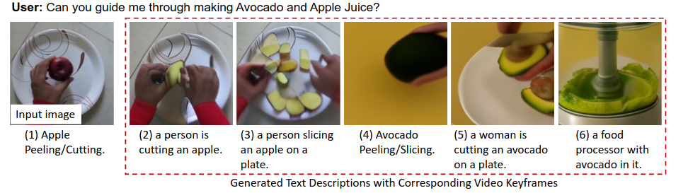
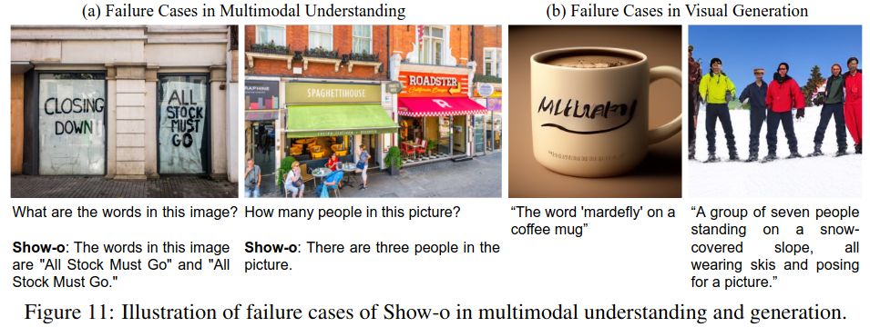

Show-o: One Single Transformer to Unify Multimodal Understanding and Generation
======

Jinheng Xie, Weijia Mao, Zechen Bai, David Junhao Zhang, Weihao Wang, Kevin Qinghong Lin, Yuchao Gu1 Zhijie Chen, Zhenheng Yang, Mike Zheng Shou

Show Lab, National University of Singapore と ByteDance の人たち

http://arxiv.org/abs/2408.12528

@cohama

## どんなもの

- 画像、テキストのマルチモーダル・マルチタスク (認識と生成) を1つの Transformer で行う
- 自己回帰と拡散モデルを融合

## 先行研究と比べて何がすごい?

- LLaVa のような VLM はテキスト以外を出力する能力がない
- 画像生成は Diffusion Model の他に自己回帰を使ったものも出てきている。
- 近年出てきた Chameleon という手法は自己回帰モデルでテキスト、画像の理解と生成ができる。本手法はこれに近いが、画像生成には拡散モデルの手法を援用している。

## 技術や手法の肝は?

以下4つの技術課題を解決した

1. モデルの入出力をどのように扱うか
2. 異なるモダリティのデータをどう融合するか
3. 自己回帰と拡散モデルをどうやって1つの Transformer で実現するか
4. そのようなモデルをどのように効率的に訓練するか

### 1. トークン化

- 言語だけでなく画像もトークンとして扱う
- 言語のトークン化は通常の LLM と同じ
- 画像は MAGVIT-v2 と同じようにトークン化する (語彙は 8,192 個)

### 2. アーキテクチャ

- モデルのアーキテクチャは通常の LLM とほとんど同じ。QK-Norm とう操作だけ追加している
- Embedding は画像トークン用の 8,192 個を追加
- 拡散モデルのように追加のテキストエンコーダは必要ない。(モデル自体が LLM なので)
- マルチモーダルなトークンを融合してマルチタスクさせるための特別なトークン MMU や T2I を容易

- Causal Attention も工夫がある。テキストは過去のトークンとだけ Attention を取るが、画像のトークンは1つの画像の範囲は順番に関わらず Attention を取る
- 訓練の目的関数は
  - LLM と同様の Next Token Predicion (NTP)
  - Mask Token Prediction (MTP)
    - 画像の一部をマスクして、それを復元するタスク
    - [先行研究](https://probml.github.io/pml-book/book2.html) によればマスク予測は離散的な拡散モデルと対応するらしい

### 3. 訓練方法

3ステップで行う。

1. 画像-テキストペアを用意して、テキスト (画像のラベル) からの画像生成および画像からのキャプション生成を行う
2. テキスト (キャプション) からの画像生成を訓練する
3. 指示チューニングする

## どうやって有効だと検証した？

### VQA

### Text-to-Image

### その他

以下のようなタスクもナチュラルに実現可能

## 議論はある?

* VLM 系のアーキテクチャの基礎になりそう。(そういう意味では Chameleon の方が先行しているが)
* LLM を初期値として訓練しているが自然言語処理タスクの性能低下があるのかは気になる。
* 文字列が書かれた画像とか、数を数えるとかは苦手らしい

## 次に読むべき論文
- MAGVIT-v2: Language Model Beats Diffusion — Tokenizer is Key to Visual Generation, https://arxiv.org/abs/2310.05737v2
- Chameleon: Mixed-modal early-fusion foundation models. arXiv preprint arXiv:2405.09818, 2024.

