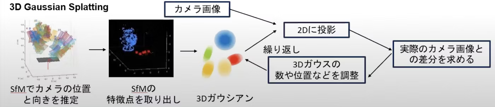
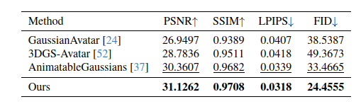
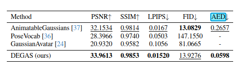

DEGAS: Detailed Expressions on Full-Body Gaussian Avatars

===

Author:Zhijing Shao1,2, Duotun Wang1, Qing-Yao Tian2, Yao-Dong Yang1, Hengyu Meng1,
Zeyu Cai1, Bo Dong4, Yu Zhang2, Kang Zhang1,3, Zeyu Wang1

Organization:The Hong Kong University of Science and Technology (Guangzhou)
2Prometheus Vision Technology Co., Ltd.
3The Hong Kong University of Science and Technology
4Swinburne University of Technology

URL：https://arxiv.org/pdf/2408.10588
GitHub：https://github.com/initialneil/DEGAS

(まとめ：Hisashi Takagi）

---

## どんなもの？

+ 豊かな表情を持つフルボディアバターを作成する3D Gaussian Splatting (3DGS)ベースの新手法「DEGAS」を提案
+ フルボディアバターに詳細な表情を統合する初めての3DGSベースの手法であり、新しいデータセットも提案
+ 動画：(https://github.com/initialneil/DEGAS/raw/master/assets/DEGAS.mp4)

## 背景

3Dガウス・スプラッティングについて
+ "3D Gaussian Splatting for Real-Time Radiance Field Rendering" Bernhard Kerbl, Georgios Kopanas, Thomas Leimkühler, George Drettakis, SIGGRAPH 2023
+ https://arxiv.org/abs/2308.04079

※3D Gaussian Splattingについて調べてみた(上の図もここから引用)
https://qiita.com/harutine/items/e5bed074067dad429285?utm_source=stock_summary_mail&utm_medium=email&utm_term=jyuan0128&utm_content=3D%20Gaussian%20Splatting%E3%81%AB%E3%81%A4%E3%81%84%E3%81%A6%E8%AA%BF%E3%81%B9%E3%81%A6%E3%81%BF%E3%81%9F&utm_campaign=stock_summary_mail_2024-06-29#%E8%AB%96%E6%96%87

## 先行研究と比べてどこがすごい？
+ 顔の表情を制御するために、2D肖像画像のみから学習された表情の潜在空間を採用している。これにより2DのTalking Faceと3Dアバターのギャップを埋めている
+ 3D Morphable Models (3DMMs)の表現力の限界を克服
+ 体の動きと顔の表情の両方を制御信号として使用する条件付き変分オートエンコーダを学習
+ 新しいフルボディの話すアバターのデータセットを提案(DREAMS-Avatar Dataset)
+ 3DGSのレンダリング能力と表情潜在空間の豊かな表現力を組み合わせ、写実的でインタラクティブなアバター生成を実現

## どうやって有効だと検証した？

+ 既存のデータセットと新たに提案されたDREAMSAvatarデータセットでの実験。
+ 定量的評価:PSNR (Peak Signal-to-Noise Ratio),SSIM (Structural Similarity Index),LPIPS (Learned Perceptual Image Patch Similarity)など
+ 定性的評価:
+ 他の最新手法との比較:既存の3D Gaussian Splattingベースの手法や他のアバター生成手法との性能比較
  
(性能評価)

注：これらは画像品質を評価するための代表的な指標:

1. PSNR (Peak Signal-to-Noise Ratio):
   - 信号対雑音比の一種で、画像の品質を数値化。
   - 値が大きいほど、元の画像と再構成された画像の差が小さいことを示す。
   - 単位はデシベル(dB)で表す。
   - 人間の知覚とは必ずしも一致しないという欠点がある。

2. SSIM (Structural Similarity Index):
   - 人間の視覚システムに基づいて設計された指標。
   - 輝度、コントラスト、構造の3つの要素を考慮して類似度を計算。
   - 値は0から1の範囲で、1に近いほど元画像との類似度が高いことを示す。
   - PSNRよりも人間の知覚に近い評価が可能。

3. LPIPS (Learned Perceptual Image Patch Similarity):
   - 深層学習を用いて学習された知覚的類似性指標。
   - 人間の視覚システムをより正確にモデル化することを目指す。
   - 値が小さいほど、知覚的に類似していることを示す。
   - 従来の指標よりも人間の主観的評価に近い結果を提供することが多い。

これらの指標を組み合わせて使用することで、画像の品質をより包括的に評価。PSNRは客観的な数値比較、SSIMは構造的な類似性、LPIPSは知覚的な類似性を評価するのに適している。

Citations:
[1] https://ppl-ai-file-upload.s3.amazonaws.com/web/direct-files/22195290/413d77a8-b290-452e-b786-546532ba484c/Shao2024.pdf

FID (Fréchet Inception Distance)は、生成画像の品質を評価するための指標の1つ。主に生成モデル(GANsなど)の性能評価に使用。FIDの主な特徴は以下の通り:

1. 定義:
   - 実際の画像と生成された画像の特徴空間における分布の距離を測定。
   - Inception v3ネットワークの中間層の出力を使用して特徴を抽出。

2. 計算方法:
   - 実画像と生成画像それぞれの特徴ベクトルの平均(μ)と共分散行列(Σ)を計算。
   - 以下の式でFIDを算出:
     FID = ||μ1 - μ2||^2 + Tr(Σ1 + Σ2 - 2(Σ1Σ2)^(1/2))

3. 解釈:
   - 値が小さいほど、生成画像が実画像に近いことを示す。
   - 理想的には0に近づくが、実際にはそれより大きな値。

4. 利点:
   - 人間の知覚とより一致する評価が可能。
   - モードの崩壊(mode collapse)を検出で。

5. 欠点:
   - 計算コストが比較的高い。
   - 大量のサンプルが必要。

6. 使用場面:
   - GANsやVAEsなどの生成モデルの評価
   - 画像の品質や多様性の比較

FIDは、PSNRやSSIMよりも生成タスクに適した指標とされており、特に生成画像の品質と多様性を同時に評価できる点が重要です。ただし、他の指標と組み合わせて使用することで、より包括的な評価が可能になります。

Citations:
[1] https://ppl-ai-file-upload.s3.amazonaws.com/web/direct-files/22195290/413d77a8-b290-452e-b786-546532ba484c/Shao2024.pdf

---

## 技術や手法の肝は？

+ 3D Gaussian Splatting (3DGS)の活用:
+ 2D表情潜在空間の採用:
+ 条件付き変分オートエンコーダ(cVAE)の設計:
+ Linear Blend Skinning (LBS)ベースのポージング
+ マルチビュー学習:
+ Talking Face生成技術の活用:

（説明）
+ DEGASは、DPEの事前学習済み表情エンコーダーから顔の信号を取得し、それをSMPL-Xから得た体の信号に注入
+ 畳み込みデコーダーによって生成されたポーズ依存のガウシアンマップは、3DGSレンダリングのためにポーズ非依存のマップに適用
+ 注：SMPL-X (Skinned Multi-Person Linear model eXpressive)は、人体の3Dモデリングのための先進的なパラメトリックモデル．SMPL（体のモデル）、FLAME（顔のモデル）、MANO（手のモデル）といった既存のモデルの利点を統合

## 議論はある？

+ フルボディアバターに詳細な表情を統合することの難しさ:3D Morphable Models (3DMMs)を単純に使用する方法には表現力の限界がある
+ 2DTalking face生成技術と3Dアバターのギャップ:2D肖像画像から学習された表情の潜在空間を採用
+ フルボディアバターと頭部アバターの違い：メッシュの登録品質が大きく異なり、フルボディの場合は服の影響で精度が低下　→　2D CNNsを活用したポーズ依存の3DGSパラメータ生成を提案
+ 音声駆動への拡張:　2DのTalking face生成技術を活用

（感想）
+ 
+ 

---

## 次に読むべき論文は？

+ https://ai.meta.com/static-resource/movie-gen-research-paper
+ MovieGen: A Cast of Media Foundation Models
 

