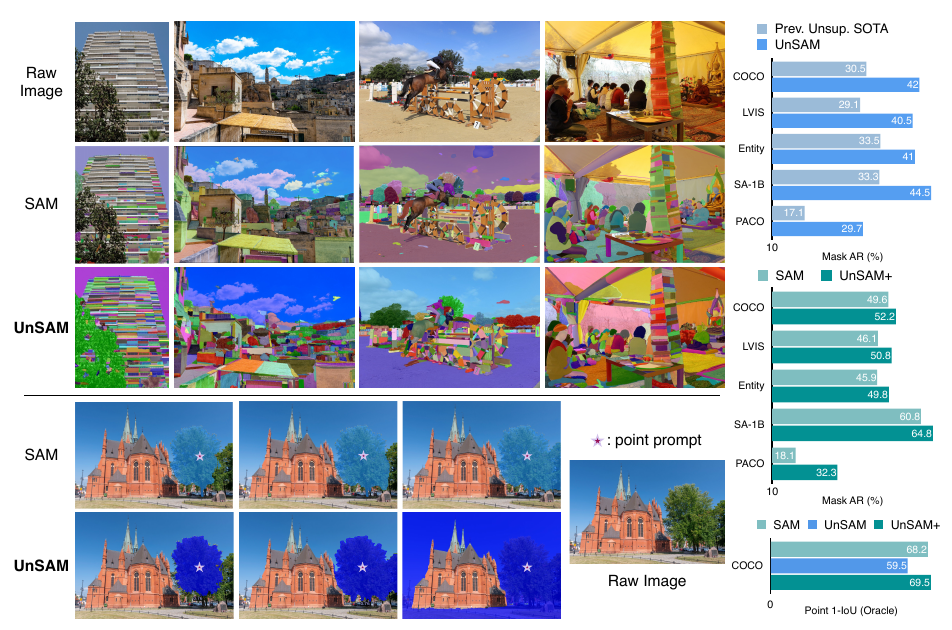
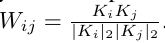
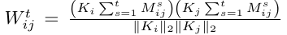
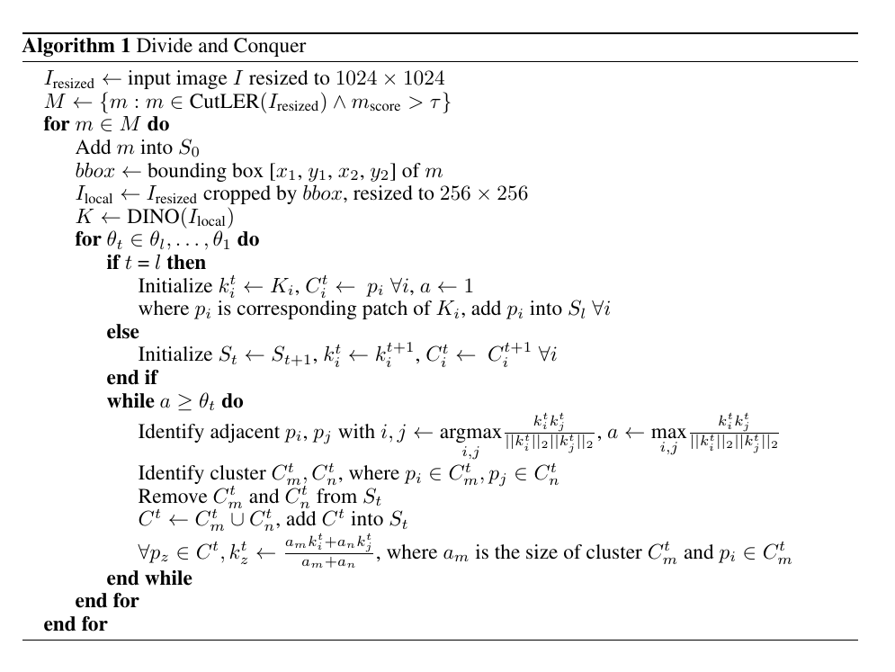
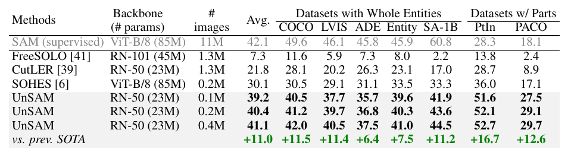
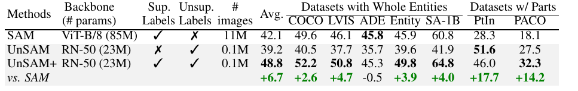
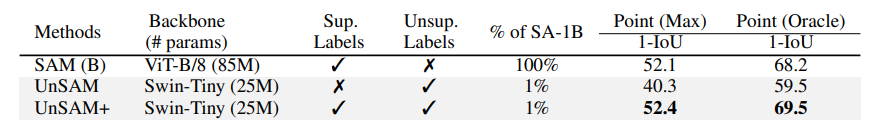

# Segment Anything without Supervision
[https://arxiv.org/abs/2406.20081](https://arxiv.org/abs/2406.20081)
(まとめ @n-kats)

著者
* XuDong Wang
* Jingfeng Yang
* Trevor Darrell

UC Berkeleyの人たち

# どんなもの？
教師無しでSAMを実現する方法（UnSAM）を提案。

# 先行研究と比べてどこがすごい？
教師無しの学習だと、DINO（特徴量）やCutLER（検出＋インスタンスセグメンテーション）がある。
これらをベースに、SAMのような使い方を実現する。

教師無しで、SAM相当の精度を達成。
さらに、SAMのデータセット（SA-1B）の1%の教師データを使って、修正教師データでファインチューニングすると、UnSAMはSAMの性能を上回る（UnSAM+）。

# 技術や手法の肝は？
## 基本アイデア
単純なセグメンテーションモデルではなく、物の階層構造を推論するような認識を行う。

の下の木のように、一つの木の葉の部分・複数の木の葉の部分・背景全体のような複数階層のセグメンテーションを行う。（入力は画像＋点）

DINO（FBの特徴抽出の方）とCulLERを組み合わせて生成教師（複数層のセグメンテーション）を作成し、それを使ってUnSAMを学習する。

## インスタンスの抽出
CutLERで検出とインスタンスセグメンテーションを行う。

CutLERは、DINOの特徴量を使って物体検出・インスタンスセグメンテーションの教師を作成して学習したモデル。

パッチの特徴量（$K_i$）のコサイン類似度行列を計算し、それを使って階層的クラスタリングを行う。

この行列の下から二つ目の固有ベクトル（パッチの重みと思うとよい）を使って、前景・背景に分ける（Normalized Cut）。

前景のマスク$M^s_{i,j}$を重みにして、類似度行列を洗練する。

この行列を使って、マスクを作って・・・というのを繰り返す。

このマスクで学習する。

## インスタンスに対する階層的な教師の作成

1. インスタンスの範囲をクロップ・リサイズ
1. DINOの特徴量を計算
1. パッチ毎を類似度に基づき統合する
  * 複数の閾値を設けて、階層構造を作成（低い閾値ほど、広範囲・統合しまくり）
  * 面積に基づいてDINOの特徴量を重み付き平均していく

閾値は(0.6, 0.5, 0.4, 0.3, 0.2, 0.1)の6つなど。

## 学習
基本は、Mask2Formerで、クロスエントロピー＋Diceロスで学習する。

1ラウンドが終わると、訓練したデータと元の教師を混ぜて（かぶった（IoUが0.5より大）旧教師は除く）ファインチューニングする。

## ポイントプロンプトの学習

クラスタを適当に選び、その中から点をランダムに選ぶ（境界10%より内側を選ぶ）

## UnSAM+

SA-1Bの1%の教師データを使って、UnSAMを学習する。

単にファイルンチューニングするのではなく、UnSAMの2ラウンド目と似た方式で学習する。

つまり、SA-1Bの教師にUnSAMの推論結果を混ぜる（IoUが高ければSA-1Bの教師を優先）。

これは、人間の教師データに漏れがあるのをUnSAMで補いながら学習するというアイデア。

# どうやって有効だと検証した？
## 実験設定
DINO pretrainなResNet-50をバックボーンにするMask2Formerを使う。

ポイントプロンプトを使う場合は、Swin(tiny)を使ったSemantic-SAMを使う。

A100×4 もしくは 3090×8で学習。（日数は記載なし）

## VS 類似手法

比較的少ない画像数で、類似手法から大幅に改善している。

## VS SAM
SA-1Bの評価データで比較。

バックボーンがそろっていない問題があるが、UnSAM+がSAMを上回っている。UnSAMはSAM同等と言っているが、少し差がある。

## ポイントプロンプトの場合

主張のように少ないデータで学習して、SAMに匹敵する性能を達成している。

# 議論はある？
人間による教師データがない・少ない場合でSAMができることを示した。

## 私見
とはいえ、DINOやCutLERを準備しないといけず、プロセスは複雑。

実験比較のバックボーンがそろっていないのも気になる。（軽くなったからいいっしょみたいなノリで書かれている）

DINOやSAMの研究としてちゃんとした研究・学習に反映されるのが楽しみ

# 次に読むべき論文は？
* DINOv2
* SAM
* CutLER
