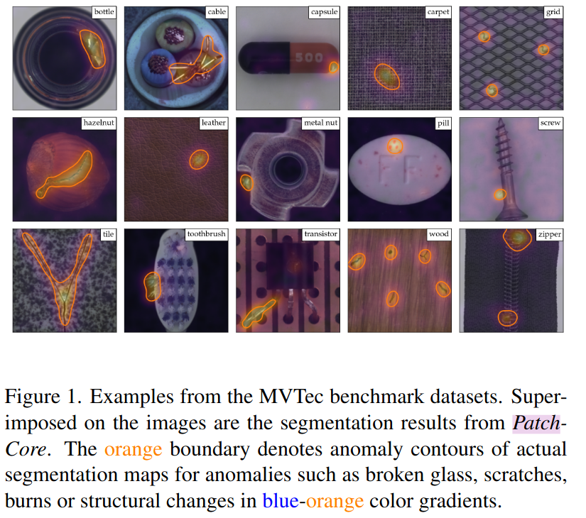
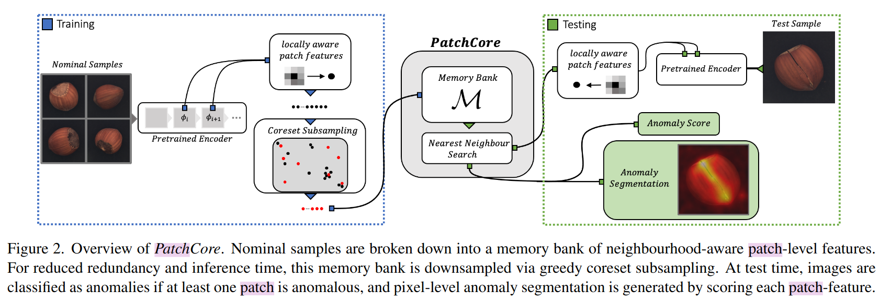
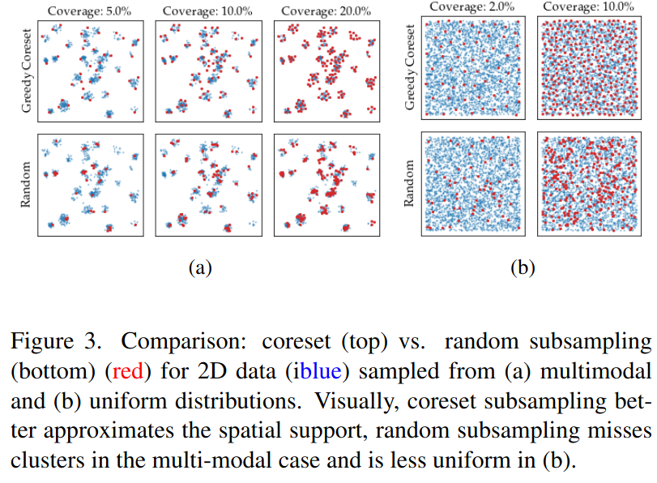
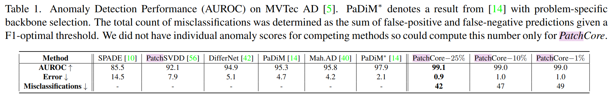
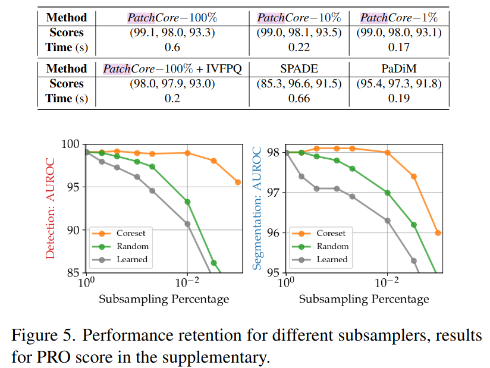

Towards Total Recall in Industrial Anomaly Detection
======

Karsten Roth, Latha Pemula, Joaquin Zepeda, Bernhard Schölkopf, Thomas Brox, Peter Gehler

CVPR 2022 accepted

University of Tubingen と Amazon AWS の人たち

https://arxiv.org/abs/2106.08265

@cohama

## どんなもの

- 工業製品系の異常検知モデル PatchCore を提案
- MVTec というデータセットで AUROC 99.6% を達成

## 先行研究と比べて何がすごい?

- ImageNet pretrain を使うので特徴抽出部分の学習は不要
- パッチレベルのメモリバンクを作り、テスト事例との距離を計算するだけなので推論も早い

## 技術や手法の肝は?

### 訓練時

1. ImageNet pretrain 済みのモデルを持ってきて特徴抽出器とする。ResNet50 など。
2. 訓練画像 (=正常な事例しかない)を特徴抽出器にかける。CNN の最終層ではなく途中の層の特徴を2つ持ってくる。
  - 最終層を使わない理由は局所的な特徴を利用したいのと、最終層は分類に特化した特徴になっているため
3. 特徴マップをパッチに切り分ける。
4. パッチの特徴をメモリバンクにいれる
5. これだけだと全画像の全パッチがメモリバンクに入るので大変。coreset subsampling によりいい感じにサンプリングする

### 推論時

1. テスト画像を特徴抽出器に入れて、パッチに分ける。訓練時と同じ。
2. 各パッチの特徴とメモリバンクにある全特徴で近傍探索する。
3. 1画像内の全パッチの距離が最小、かつ、その1画像の中での距離が最大のものが異常パッチ

## どうやって有効だと検証した？

### MVTec データセット
工業製品の異常検知データセット。

### Ablation sampling の影響

## 議論はある?

* ImageNet の Pretrain に依存しているので問題によっては適用できないかも

## 次に読むべき論文
- DiffusionAD: Norm-guided One-step Denoising Diffusion for Anomaly Detection (https://arxiv.org/abs/2303.08730v3)
- VideoPatchCore: An Effective Method to Memorize Normality for Video Anomaly Detection (https://arxiv.org/abs/2409.16225v4)

