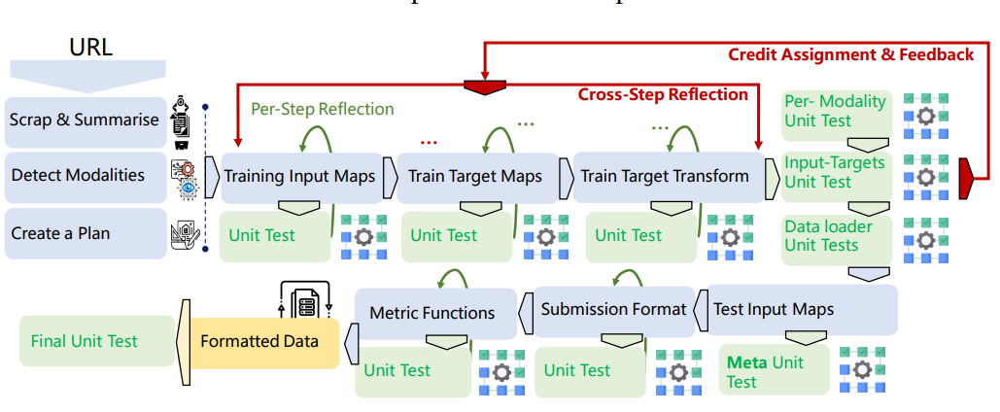
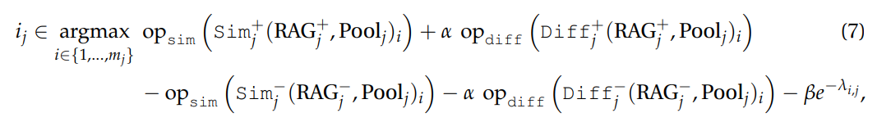
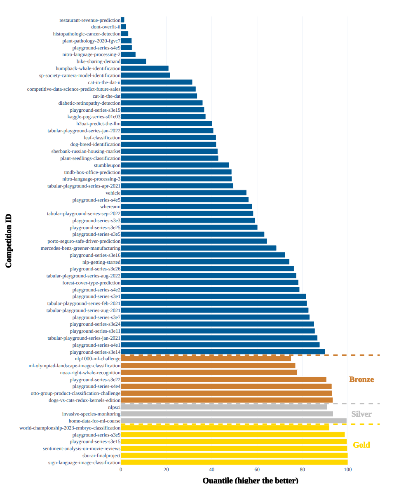
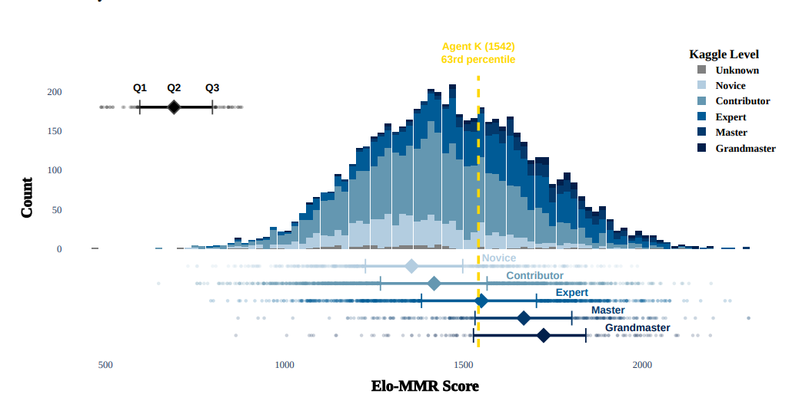

# Large Language Models Orchestrating Structured Reasoning Achieve Kaggle Grandmaster Level
[https://arxiv.org/abs/2411.03562](https://arxiv.org/abs/2411.03562)
(まとめ @n-kats)

著者
* Antoine Grosnit
* Alexandre Maraval
* James Doran
* Giuseppe Paolo
* Albert Thomas
* Refinath Shahul Hameed Nabeezath Beevi
* Jonas Gonzalez
* Khyati Khandelwal
* Ignacio Iacobacci
* Abdelhakim Benechehab
* Hamza Cherkaoui
* Youssef Attia El-Hili
* Kun Shao
* Jianye Hao
* Jun Yao
* Balazs Kegl
* Haitham Bou-Ammar
* Jun Wang

ファーウェイ・ダルムシュタット工科大学などの人たち

# どんなもの？
LLMエージェントでkaggleのグランドマスターレベルの成績を達成したと主張する論文。

kaggleの問題を取得するところから提出まで自動化（AgentK）

# 先行研究と比べてどこがすごい？
H2O-AutoMLのような単なるAutoMLツールではなく、特徴量エンジニアリングやモデルの選択も含めて自動化している。

AutoKaggleのようなツールもあるが、AgentKは多様な問題設定をすべて扱える・問題間の知識を共有する。

# 技術や手法の肝は？
## 基本アイデア
* 短期記憶・長期記憶に相当する概念を用意する
  * 短期記憶には単一の問題の中での反省を、長期記憶には問題間の知識を蓄積する
* 記憶の蓄積基準は、マルコフ決定過程の報酬の最大化として解釈する
* 個別のパートでは、LLMでコード生成や外部ツールの利用・反省を行う

## データ変換系
* kaggleから問題・データを取得
* データの形式を理解して、扱いやすい形式に変換
* モデル作成
* 提出（推論・提出形式に変換・提出）

を行う。各所でコード生成を行うが、一発で上手くいくとは限らないので、テストをしながら（上手くいっていなかったら修正する）進める。

細かいポイントとしては、
* テストの反省内容を短期記憶に記録していく
* 個別のテストだけでなく、ある程度まとまった単位でもテストをして、全体的な処理の問題をチェックする

## モデル作成
問題によって扱うデータが異なり、それに適したものを選択する必要がある。

* 表データ・・・AutoMLツール（内製AutoMLツール利用）
* Deep系・・・torchvisionとtorchtextにあるpretrainモデルを利用。マルチモーダルな場合は、Head側で結合する（late-fusionというらしい）。
* ベイズ最適化・・・HEBOを利用
* 複数モデルの結果統合・・・小規模なMLPを利用。アンサンブル目的。

## 一般化
別の問題に知識を転用したい。
* 他の問題の失敗を繰り返すのは時間の無駄
* いきなり難しい問題を解くのは難しいから、簡単な類似問題の知識を使いたい

どの知識を使うかは、類似度だけでなく、使っていない知識が選ばれやすくなるような仕組みを入れる。

)

（$\lambda_{i,j}$は前回利用から何回目かを意味する。）

## MDP的な定式化
割引率 $\gamma$ を使って、以下のような値を考え、最大化する。

諸々の箇所でこの形の報酬を設定している。

# どうやって有効だと検証した？
## kaggleの成績

金6、銀3、銅7を獲得した。

## kaggle levelは？

論文では、kaggleのレベルを「グランドマスターレベル」としているが、この図を見ると、Expertレベルの中央くらい？

# 議論はある？
グランドマスターレベルといいつつ、実際にはグランドマスターにはなっていない。アクティブな競技に利用して改善をしたい。

# 次に読むべき論文は？
* AutoKaggle
* HEBO