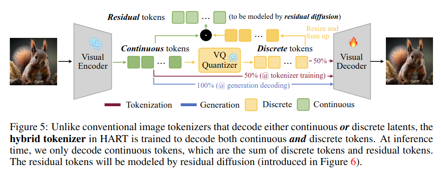
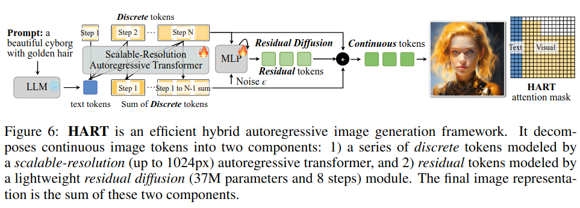
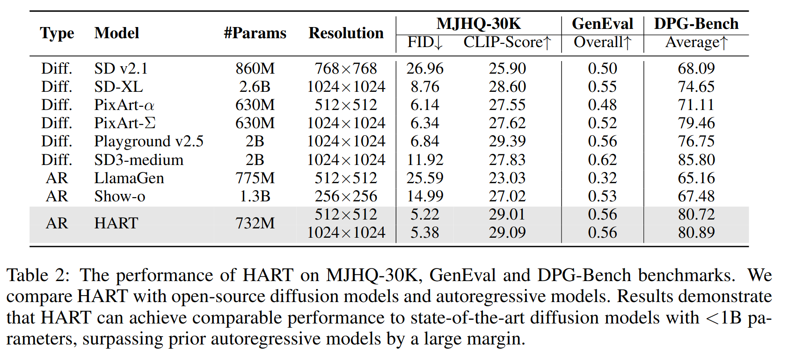
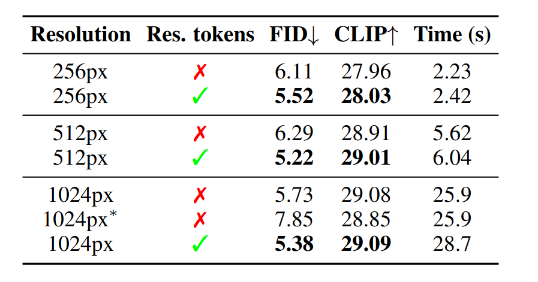
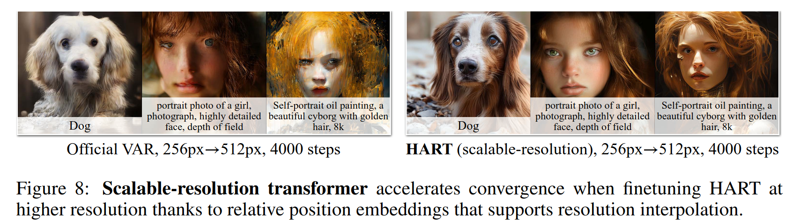

HART: Efficient Visual Generation with Hybrid Autoregressive Transformer
========================================================================

Haotian Tang1∗ Yecheng Wu1,3∗ Shang Yang1 Enze Xie2 Junsong Chen2 Junyu Chen1,3 Zhuoyang Zhang1 Han Cai2 Yao Lu2 Song Han1,2

MIT1 NVIDIA2 Tsinghua University3

http://arxiv.org/abs/2410.10812

## どんなもの

- 自己回帰モデルで画像生成する HART (Hybrid Autoregressive Transformer) を提案
  - 以前読んだ MAR や show-o の仲間
- 画像生成部分のトークンを離散値と連続値のハイブリッドで扱う
- 高解像度の画像を高速にきれいに生成できる

## 先行研究と比べて何がすごい?

- 自己回帰モデルによる画像生成は性能面で拡散モデルに劣っていた
- 従来の自己回帰モデルによる画像生成では 1024px を超える大きさの画像を効率的に生成できる手法はなかった

## 技術や手法の肝は?

- HART では画像を離散化トークンか連続値トークンの両方扱う
- まず Doceder を訓練する。
  - Visual Encoder (CNN) の出力のうち、50%の確率でそのまま、残り50%の確率で VQ Quantizer で離散化したトークンを Decoder に与える
  - そのままの場合は Auto Encoder、離散化した場合は VQ tokenizer として訓練することになる
  - これにより Decoder からみて離散トークンも連続トークンも似たようなものになる

### Scalable-resolution autoregressive transformer

- 超解像や one-token-per-step の方法を使って高解像度の画像も一度に生成できる
- Position Embedding も工夫を入れる。絶対座標を使った位置エンコーディングではなく、補間しても大丈夫な (interpolation-compatible) 相対位置エンコーディングを使う

### Residual Diffusion

- 残差トークン
  - 自己回帰モデルのあとで、残渣トークンを予測する。
  - この残差トークンは MAR と同様軽量な拡散モデルで連続トークンに変換される。
  - 離散トークンで表現しきれない部分のみなので拡散モデルの推論ステップ数を短くできる (MAR 30-50, HART 8)

## どうやって有効だと検証した？

### Ablation

残差トークンの効果

### Scalable resolution transformer の効果

## 議論はある?

## 次に読むべき論文
- Lumina-mgpt: Illuminate flexible photorealistic text-to-image generation with multimodal generative pretraining (https://arxiv.org/abs/2408.02657)
  - one-token-per-step
- Visual Autoregressive Modeling: Scalable Image Generation via Next-Scale Prediction (https://arxiv.org/abs/2404.02905)
  - VAR tokenizer この論文が基盤にしている。
