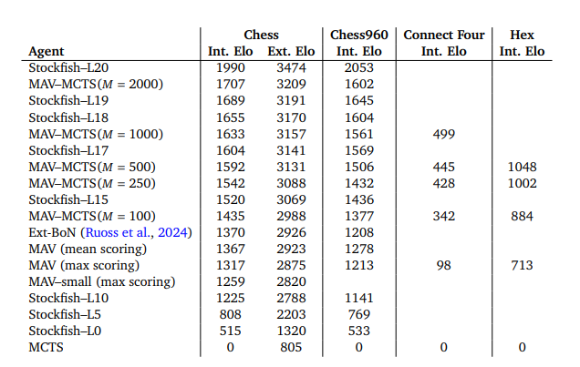

# Mastering Board Games by External and Internal Planning with Language Models
[https://arxiv.org/abs/2412.12119](https://arxiv.org/abs/2412.12119)
(まとめ @n-kats)

著者
* John Schultz
* Jakub Adamek
* Matej Jusup
* Marc Lanctot
* Michael Kaisers
* Sarah Perrin
* Daniel Hennes
* Jeremy Shar
* Cannada Lewis
* Anian Ruoss
* Tom Zahavy
* Petar Veličković
* Laurel Prince
* Satinder Singh
* Eric Malmi
* Nenad Tomašev

Google/DeepMindの人たち

# どんなもの？
LLM＋内部探索＋外部探索でボードゲームをプレイするエージェントを提案。

チェスグランドマスターレベルを達成。

# 先行研究と比べてどこがすごい？
LLMはチェスなどのボードゲームを安定的にプレイすることが苦手。未来を一貫して推論できない。

これを解決したくて行われた研究。

* 安定化させるために、MAVモデルと呼ぶモデルを作成（Multi Action-Value）。
* よくあるシミュレータを使った強化学習ではなく、限られた局面のみを利用して学習。


# 技術や手法の肝は？
## メタアーキテクチャ
* MAVモデル
  * 局面を与えて、候補手とその評価値を返す
* 外部探索
  * モンテカルロ木探索で最善手を探す
* 内部探索
  * 既存モデルを使って作った盤面をN手シミュレーションして、それを学習


## MAVモデル
テキストで表現されてた盤面を入力して、以下のことができるモデル。
* 状態の追跡（次の盤面生成）
* 合法手のリストアップ
* 終端状態の検出

### 学習データの例
「単に盤面＋次の手」の学習だけでなく、盤面の遷移を学習することで、状態遷移が学習できる。


```
<mav game=chess> %prev_FEN %prev_action %FEN %state %top_5 %best_action %FEN </mav>
[%prev_FEN r1b1nr2/pp1np1bk/2pp1pp1/q3P3/3P1P2/2NQB3/PPP1B1PP/R4RK1 w - - 0 13]
[%prev_action e5e6]
[%FEN r1b1nr2/pp1np1bk/2ppPpp1/q7/3P1P2/2NQB3/PPP1B1PP/R4RK1 b - - 0 13]
[%state b || R . . . . R K . P P P . B . P P . . N Q B . . . . . . P . P . . q . . . . . . . . . p p P p p . p p . n p . b k r . b . n r . . |00000000013||]
[%top_5 d7b6:<ctrl28> f6f5:<ctrl33> d7c5:<ctrl28> f8h8:<ctrl29> a5f5:<ctrl29>]
[%best_action f6f5]
[%FEN r1b1nr2/pp1np1bk/2ppP1p1/q4p2/3P1P2/2NQB3/PPP1B1PP/R4RK1 w - - 0 14
```

### 学習のポイント
* top_Nの学習候補はシャッフルする（特定の順番に偏ると、出現しにくい選択肢が学習できない・ハルシネーション対策）
* スコアは64段階で評価され、その確率を計算する。
  * 最大スコアを選択するのではなく、期待値を使う
* top_NのNの数、追跡用の箇所の有無・表現形式（%stateなど）をランダムに変更する
* Geminiの2.7Bモデル・1Bモデルを利用
 

### 既存手法との違い
他手法では、盤面を評価することが多いため、可能な手の分の評価を行う必要がある。


## 外部探索
モンテカルロ木探索を使って、最善手を探す。

MAVモデルが候補手・評価値を返すので、ゲームエンジンを使わずに探索ができる（AlphaZeroなどとの違い）（MuZeroも推論時ゲームエンジン不要）。

### 手の選択優先度
候補手のスコアのsoftmaxによる確率と、一様分布とを混ぜて、探索を行う。

## 内部探索
探索自体をファインチューニングでMAVモデルの内部に組み込む.

* 局面を既存モデルで評価
* 上位5手を展開
* MAVで3手先までシミュレーション

Minimax探索を使う意図を込めた指示を行う。
### 訓練
MAVデータと新規データを混ぜて学習（新規が4割）

### 例
```
Minimax breadth=3 depth=1
Evaluation for node: <root>
<mav game=chess> %state %top all %best action </mav>
[%state 2r3k1/p3p3/4N1Pp/3Q4/8/5Pq1/PPr3P1/1K5R b]
[%top all . . . g3g6:<ctrl33> . . . c2e2:<ctrl32> . . . g3d6:<ctrl35> . . . ]
[%best action g3d6]
Expand from node <root>:
<root g3d6>
<root g3g6>
<root c2e2>
Evaluation for node: <root g3d6>
<mav game=chess> %prev state %prev action %state %top all %best action </mav>
[%prev state 2r3k1/p3p3/4N1Pp/3Q4/8/5Pq1/PPr3P1/1K5R b]
[%prev action g3d6]
[%state 2r3k1/p3p3/3qN1Pp/3Q4/8/5P2/PPr3P1/1K5R w]
[%top all d5d4:<ctrl18> . . . d5b3:<ctrl23> d5d6:<ctrl32> a2a3:<ctrl11> . . . ]
[%best action d5d6]
Decision for node: <root g3d6>
Selecting: d5d6 : "<ctrl32>"
Evaluation for node: <root g3g6>
<mav game=chess> %prev state %prev action %state %top all %best action </mav>
[%prev state 2r3k1/p3p3/4N1Pp/3Q4/8/5Pq1/PPr3P1/1K5R b]
[%prev action g3g6]
[%state 2r3k1/p3p3/4N1qp/3Q4/8/5P2/PPr3P1/1K5R w]
[%top all . . . d5c5:<ctrl1> e6f4:<ctrl22> b2b3:<ctrl1> . . . ]
[%best action e6f4]
Decision for node: <root g3g6>
Selecting: e6f4 : "<ctrl22>"
Evaluation for node: <root c2e2>
<mav game=chess> %prev state %prev action %state %top all %best action </mav>
[%prev state 2r3k1/p3p3/4N1Pp/3Q4/8/5Pq1/PPr3P1/1K5R b]
[%prev action c2e2]
[%state 2r3k1/p3p3/4N1Pp/3Q4/8/5Pq1/PP2r1P1/1K5R w]
[%top all . . . h1h6:<ctrl1> e6f4:<ctrl32> h1c1:<ctrl1> . . . ]
[%best action e6f4]
Decision for node: <root c2e2>
Selecting: e6f4 : "<ctrl32>"
Decision for node: <root> g3d6 : "<ctrl33>" g3g5 : "<ctrl43>" c2e2: "<ctrl33>"
Selecting g3g6 : "<ctrl43>"
Playing g3g6!
```

# どうやって有効だと検証した？



* 外部探索を使わないとかなり弱くなるが、それはstockfishでも同じ。
* 2500-2700くらいがグランドマスターレベル

# 議論はある？
* シミュレーターはいらないけど、大量の学習データが必要。
* あまりにも優勢になると無駄な手を指しまくる（評価値に差がでないため）。

# 次に読むべき論文は？
* Benchmarking Large Language Model (LLM) Performance for Game Playing via Tic-Tac-Toe
  * LLMでボードゲームをする先行研究。

