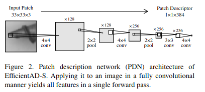
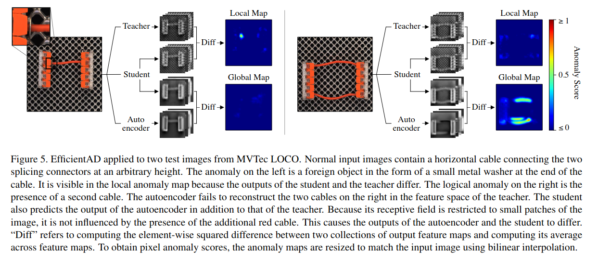
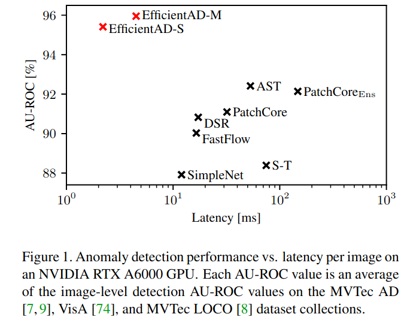
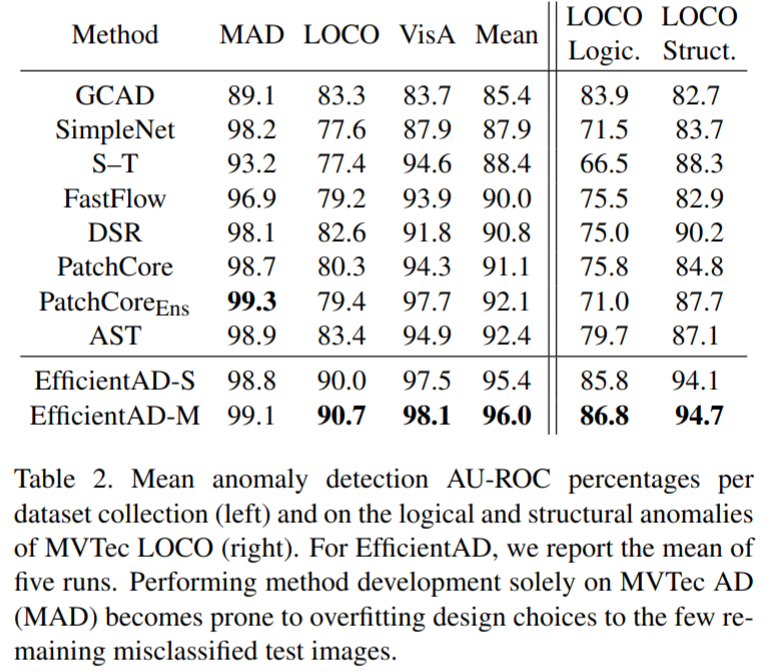

EfficientAD: Accurate Visual Anomaly Detection at Millisecond-Level Latencies
=====
https://arxiv.org/abs/2303.14535

## どんなもの？
- 蒸留により得られた軽量なモデルを使って特徴抽出を行うことで速度と精度を大きく改善

## 先行研究と比べてどこがすごい？

- 異常検知のベンチマークで SOTA を達成しつつさらに軽量
- さらに論理的異常に対しても検知できる
  - 論理的異常は画像の意味的な異常。誤った組み合わせ、誤った順番など
  - 逆は構造的異常。ピクセルのパターンで認識できる異常。傷、汚れなど

## 技術や手法のキモはどこ？

### Efficient Patch Descriptors
- 従来の異常検知モデルでは WideResNet-101 などのパラメータの多いモデルを使用することが多かった。
- EfficientAD ではわずか4層の CNN を用いる。(PDN)
- 
- この PDN は従来でよく用いられた WideResNet-101 などを蒸留することにより訓練する。

### 軽量な生徒ー教師モデルによる訓練
- 異常検知時は Student-Teacher モデルを使う。
  - 通常リッチな表現力を持つ教師モデルの出力と貧弱な表現力を生徒モデルの出力を比べて、異常であればその差が大きいことを利用した検知方法
  - PDN 自体の訓練の蒸留とはまた別
- EfficientAD では教師、生徒モデルともに PDN を用いる。
- 高速である一方で表現力は同じなので工夫が必要。推論時に追加コストがかからないように学習ロスを工夫することでこの問題に対処した。
- 教師モデル (WideResNet-101 などを蒸留した PDN) をもとに生徒モデル (ランダム初期化) を訓練する際に、Loss の大きな上位 (1-p) 個だけを選ぶ
  - この論文では p=0.999 なので 1/1000 個選ぶことに相当
- 背景などの簡単な事例の重要度が下がり、より物体にフォーカスするようになる。
- さらに ImageNet の画像も生徒モデルの訓練中に少しだけ混ぜる。この時 ImageNet の入力した場合のモデルの出力が0に近づくように正則化する。
- これにより、異常な事例に対して過度に汎化することを防ぐ

### 論理的異常に対する対策
- 異常検知のより難易度が高いものとして論理的異常がある。
  - これは画像だけでなくものの意味を理解しないといけないもの
  - 数・量が違う、配置が違う、制約違反など
- これを見つけるためにさらに Auto Encoder を用意する
  - この Auto Encoder は教師モデルの出力を模倣するように訓練される
- さらに生徒モデルも追加の出力チャネルで Auto Encoder の出力を模倣するように訓練する
- 教師、生徒モデルの出力差により構造的異常を、生徒モデルの2つめの出力と AE の出力差により論理的異常を見つける
- 

## どうやって有効だと検証した？

### 論理的異常に対する性能

### Ablation

## 議論はある？

## 次に読むべき論文は？
- Uninformed Students: Student-Teacher Anomaly Detection with Discriminative Latent Embeddings https://arxiv.org/abs/1911.02357
  - Student-Teacher モデル。この手法の先行研究
- PUAD: Frustratingly Simple Method for Robust Anomaly Detection https://arxiv.org/abs/2402.15143v1
  - MVTec LOCO の最先端手法の1つ。
