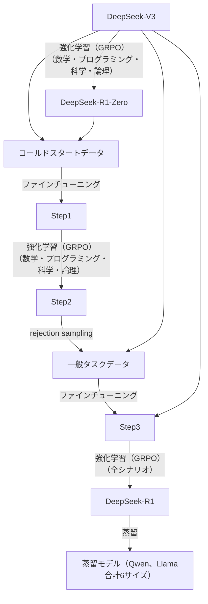
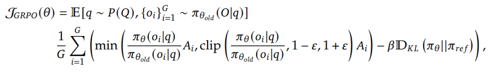
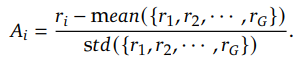
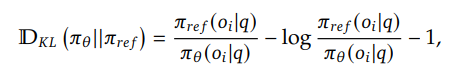
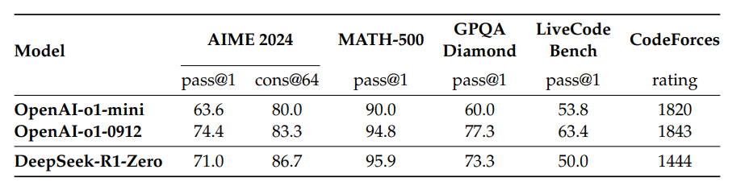
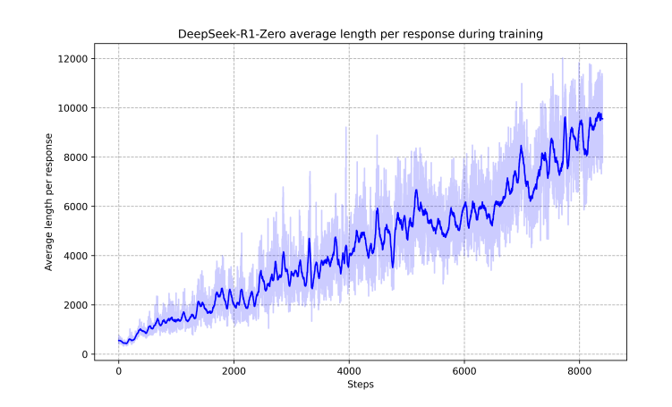
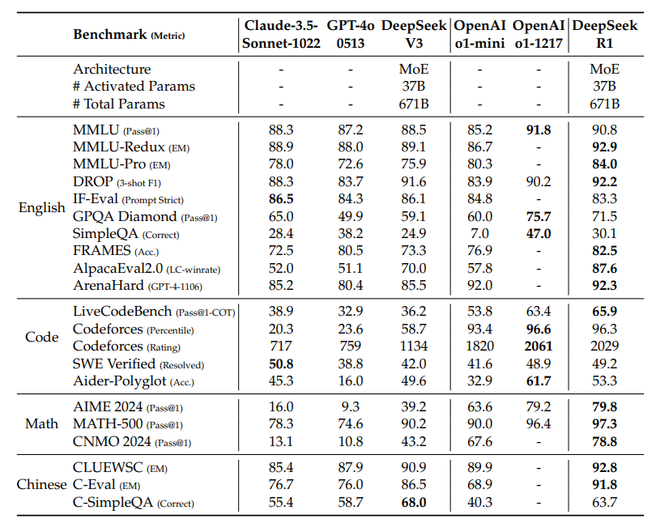
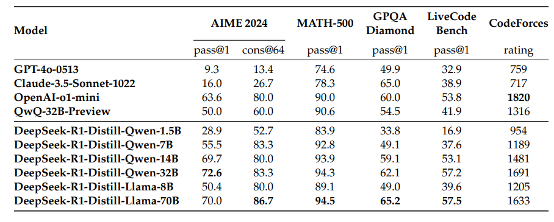
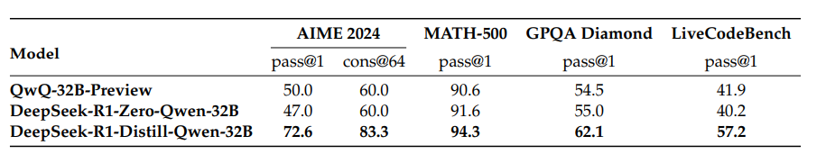

# DeepSeek-R1: Incentivizing Reasoning Capability in LLMs via Reinforcement Learning
[https://arxiv.org/abs/2501.12948](https://arxiv.org/abs/2501.12948)

（まとめ @n-kats）

著者
* DeepSeek-AI

（アブストのページに100人以上名前が書いてある）

# どんなもの？
話題のDeepSeek-R1の論文。OpenAI o1相当のモデルを作成した。

# 先行研究と比べてどこがすごい？
o1で導入された推論の仕組みのモデルを作成・公開した。

学習データ・方法を工夫して、低コストで実現した。

これまでハンドクラフトな推論行程を人間が考えていたが、推論を促すシンプルな学習方法で自力で推論行程を習得させることが観測された。

# 技術や手法の肝は？
## 概要

GRPOでR1-Zeroを作成したが、思考行程（自己検証・内省など）を身に着けたものの可読性が悪い・言語混在が見られるという問題があった。多段階の学習を行い、最終的にR1を作成した。

## GRPO
GRPO（Group Relative Policy Optimization）は(DeepSeekMath)[https://arxiv.org/abs/2402.03300]で導入された手法。PPOの改良版。

PPOなどの強化学習では、推論を行うモデル（Policy Model）とそれの評価値を計算するモデル（Value Model）の二つを用意する。これだと、両方を学習しないといけない。

GRPOは、複数の推論結果を比較して評価値を作成する手法（その比較方法は学習設定によって変わる）。

数式にすると、以下の値を最大化するように学習する。

* ランダムな入力（q）と生成した出力（$o_i$）を用意（Eのカッコの中の意味）
* 出力$o_i$の報酬を計算（$r_i$）（ここが学習設定で変わる部分）
* 報酬の平均分散を計算して、評価値を正規化して評価値とする（$A_i$）
* 評価値をそのまま使うのではなく、clipして安定化を狙う（minやclipを書いている部分。$A_i$がプラスの場合、old（少し前の重みの場合）より生成確率が高すぎたらclipが有効になる。マイナスの場合はその逆。PPOにもあるやり方）
* 正則化のため、少し前の(oldより前)のモデルの場合との差をKLダイバージェンスで計算して、それが大きくなりすぎないようにする
* （refやoldは低頻度で更新する）

ただし、KLダイバージェンスはよく見る式ではなく、以下のように計算する。

## DeepSeek-R1-Zero
### 報酬
ルールベースの評価を行う

* 正解・不正解の評価（数学の問題を正解したか、プログラミングだったらテストケースをパスするか）
* 思考プロセスを行ったかどうか（thinkタブを用いているか）

言語モデルで評価したらどうかという意見がありそうだが、報酬ハックを見つけ出すことが多く、うまくいかない（コスト面の問題もある）。

### プロンプト
thinkタグを使うよう指示をするものの、思考プロセスについてのアドバイスは行わない。

## DeepSeek-R1
DeepSeek-R1-Zeroは、賢いものの、可読性の問題で言語モデルとしては問題がある。その対策を行ったモデル。

### Cold Start

1. DeepSeek-V3を長い思考を行ったCoTのデータを用意
1. DeepSeek-R1-Zero の結果を読みやすい形に変換
1. 人間が修正

を行ってデータセットを作成して（数千規模）、DeepSeek-V3をファインチューニング

### 思考の学習
R1-Zeroと同じように学習。

そのままだと、Cold Startをやっても、複数言語が混在する問題が残っていた。
そのため、単一言語であるときに報酬を与えるようにした。

### 一般タスクの学習
推論タスク約60万件、非推論タスク約20万件のデータを用意して、DeepSeek-V3をファインチューニング

* 推論タスク
  * 前工程のモデルで生成した推論結果をフィルターして用いる
    * 正解しているもののみ（一つの入力で複数の出力を利用）
    * 微妙なもの（言語混在、過剰な段落・コードブロック）
* 非推論タスク（執筆・事実QA・自己認識・翻訳）
  * DeepSeek-V3が生成したものを用いる（プロンプト・CoTの工夫はする）

### 全シナリオ対応強化学習
多様なシナリオでhelpfulかつharmlessなモデルを目指して学習。

R1-Zeroの学習と同様に、GROPで学習するが、helpful/harmlessの報酬をDeepSeek-V3を用いて計算する。

* helpful
  * 最終出力がユーザーの意図にあっているか・わかりやすいかを評価
* harmless
  * 思考過程も含めて、不適切な情報が含まれていないかを評価
  * 有害な思考・バイアス（差別・攻撃的など）

## 蒸留
R1生成結果80万件を使ってファインチューニング。（作り方は、R1の一般タスクのファインチューニングでの学習と同じ）

このとき強化学習は行っていない。

# どうやって有効だと検証した？
## R1-Zero

数学・科学はo1と同程度。競技プログラミングはぼちぼち劣る。

学習の過程で、思考を身に着けている様子が観測された。

### aha moment
学習している過程で「Wait, wait. Wait. That’s an aha moment I can flag here.」というフレーズが入るようになった。

### 思考の長さ

学習をするうちに思考の長さが増加している。

## R1

難しい数学・科学・プログラミングのスコアがV3と比べて大きく向上している。一般的なタスクでも改善がみられる。

GPQAがEnglish？？

## 蒸留モデル

蒸留モデルはo1-miniに匹敵するスコアを出している（o1まではいけない）。

## 小さいモデルで蒸留VS強化学習
R1を蒸留せずに最初から小さいモデルで強化学習したらどうかを検証。

強化学習も有効だが、一度大きなモデルを作成してから蒸留の方が賢いことがわかる。

# 議論はある？
## うまくいかなかったアプローチ
### 思考プロセスに報酬を与える
* 正しい中間ステップの定義が難しい。
* 中間ステップの評価が難しい
  * 自動でするには精度が足りない
  * 人間がやるとコストがかかる
* 報酬ハック

### モンテカルロ木探索
* 解答を細かく分割して探索空間を整理して、より良い解法を見つけることを目指す
* 探索空間が広すぎて、局所最適解にはまる傾向があった
* 状態の評価値を出す必要があるが、テキストでは難しい

## 制約
* 完全上位互換ではない。以下は未対応（学習に含まれない）
  * function calling
  * 長いチャットのやりとり
  * 複雑なロールプレイ
  * json出力
* 中国語と英語に特化
* few-shot promptingをすると逆に性能が落ちる
* 競技プログラミングは強くなったが、他のプログラミング課題はV3と大きく変わらない

## 私見
低コストで良いモデルができると言いつつ、V3をベースにしているので、そのコストが入っているのか怪しい。

# 次に読むべき論文は？
* DeepSeek-V3
* DeepSeek-Math
* Janus