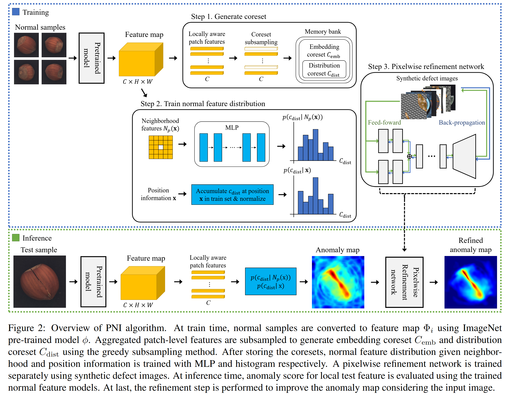
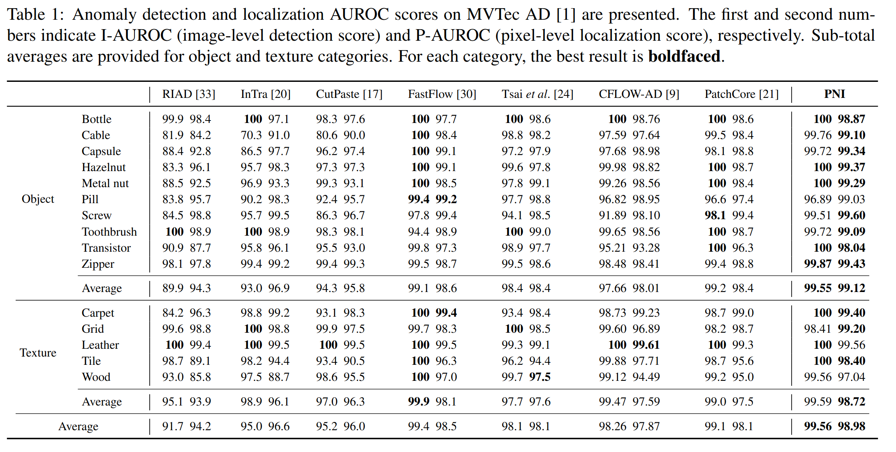

PNI: Industrial Anomaly Detection using Position and Neighborhood Information
=====

https://openaccess.thecvf.com/content/ICCV2023/html/Bae_PNI__Industrial_Anomaly_Detection_using_Position_and_Neighborhood_Information_ICCV_2023_paper.html

(ICCV 2023)

## どんなもの？
- 産業用異常検出手法の1つ
- PatchCore と同様メモリバンク方式で、さらに画像の位置情報と近傍情報を活用する。
- MVTec AD で PatchCore を上回る性能を達成

## 先行研究と比べてどこがすごい？

- この分野では PatchCore 等のメモリバンク方式が有力だが、局所的な位置関係 を考慮しておらず、正常データの分布を完全には表現できない。
- メモリバンク方式以外でも例えば Distribution Map (CFLOW-AD) 方式もある。しかし、これらの手法も特徴マップの空間的な整合性や、近傍の特徴との関係は考慮されていなかった。

## 技術や手法のキモ
PNIの設計は、以下の3つの重要なモジュールで構成される：

### 近傍情報の活用
- 各パッチ特徴の近傍の情報から、それがどの Cemb に近いかの MLP を訓練する。

### 位置情報の活用
- 各パッチ特徴の位置がどの位置にあるかの分布を MLP で訓練する

### 異常マップのリファインメント
- 粗い異常スコアを補正するために、異常マップをピクセル単位で改善するリファインメントネットワーク を導入。

## どうやって有効だと検証した？

### ablation

## 議論はある？
- 計算コストが高そう

## 次に読むべき論文は？
PNIの理解を深め、さらなる応用を考えるために、以下の論文を読むとよい。

- PatchCore
- CFLOW-AD (ICCV 2021) Normalizing Flow を用いて特徴の確率分布を推定し、異常検出を行う手法。
- PyramidFlow: 同様に確率分布を推定を行う手法の一つ
