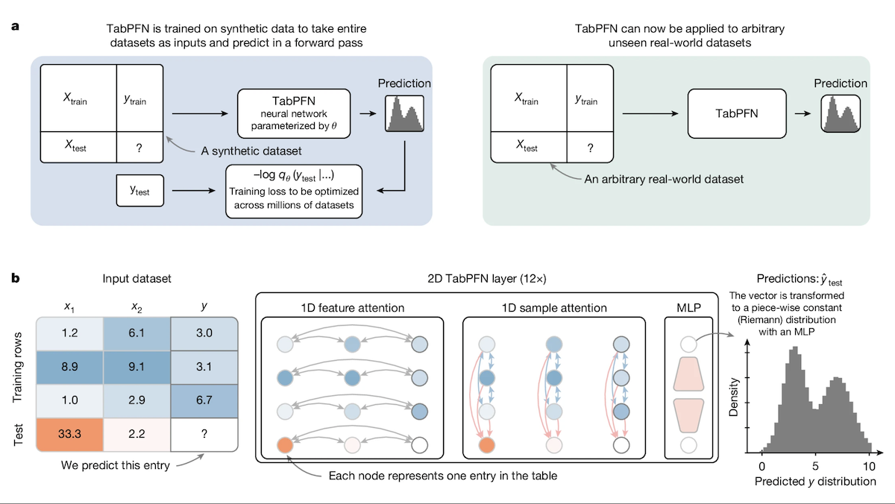

TabPFN: 表形式データにはツリーよりも優れている　Better Than Trees for Tabular Data
===

Noah Hollmann、Samuel Müller 他（フライブルク大学、ベルリン衛生研究所、Prior Labs、ELLIS研究所）

https://info.deeplearning.ai/inside-the-mind-of-claude-llama-4s-mixture-of-vision-language-experts-more-open-multimodal-models-neural-net-for-tabular-data-2?ecid=ACsprvsxl_c5ECTL3PgzjBRT5ZXHpvNlkFza085qBNkmtWGm4C5_U2zGNQFzvt4EM5tCptfcvPL3&utm_campaign=The%20Batch&utm_medium=email&_hsenc=p2ANqtz-9YYMtURH_NMVjD64RBlTUdnwv9VTBp2oDBPOjpDk14L9AM0yTBk2idRuPONEJHqDS2SmJm8pH4p5ybLXfckgM8cbSxSQ&_hsmi=356031851&utm_content=356030788&utm_source=hs_email

元の論文：Accurate predictions on small data with a tabular foundation model
https://doi.org/10.1038/s41586-024-08328-6

（まとめ：ChatGPT&髙木寿）

---

## どんなもの？

+ Tabular Prior-data Fitted Network (TabPFN) というトランスフォーマー型モデルを提案。
+ 表形式データにおいて、決定木ベース（CatBoost, XGBoostなど）よりも優れた性能を発揮。
+ モデルの追加学習なしに任意の分類・回帰タスクを実行できる。

---

## どうやって有効だと検証した？

+ OpenML-CTR23の分類29種、回帰28種データセットで性能を比較。
+ 比較対象はCatBoost, LightGBM, XGBoost。
    + 分類：正規化AUCでTabPFNが平均0.939、CatBoostは0.752。
    + 回帰：正規化RMSEでTabPFNが0.923、CatBoostは0.872。
+ ただし推論時間はCatBoostより遅い（0.2秒 vs 0.0002秒）。

---

## 技術や手法の肝は？

+ 約1億の合成データセットで2種類の小型トランスフォーマーを事前学習。
+ 各データセットは最大2048行(例)・160列(特徴)。
+ モデルは特徴アテンション層・例アテンション層・全結合層で構成。
+ 欠損値やノイズを含む合成データで現実的な学習を実施。

---

## 議論はある？

+ TabPFNは学習済み状態であらゆるタスクに一般化可能。
+ 現状、推論時間が遅いという実用面での制限あり。
+ トランスフォーマーの革新が表形式データにも波及する可能性を示唆。

---

## 先行研究と比べて何がすごい？

+ 決定木ベースの代表的手法（CatBoost等）を性能面で上回る。
+ トランスフォーマーによる事前学習で追加訓練不要の汎化性能を実現。
+ 特徴と例の両方向へのアテンションにより高い柔軟性を持つ。

---

## 次に読むべき論文は？

+ [TabTransformer: Tabular Data Modeling Using Contextual Embeddings](https://arxiv.org/abs/2012.06678)
    + カテゴリデータ処理に特化したトランスフォーマーアーキテクチャ
+ [FT-Transformer: Highly Efficient Tabular Transformer](https://arxiv.org/abs/2106.11959)
    + トランスフォーマーの効率化に焦点を当てた表形式データ手法
