# Gemini Robotics: Bringing AI into the Physical World
[https://arxiv.org/abs/2503.20020](https://arxiv.org/abs/2503.20020)

（まとめ @n-kats）

著者
* Gemini Robotics Team（多数）
* DeepMind（多数）

# どんなもの？
Geminiを使ってロボットを動かす研究。単にやってみたでけではなく、汎用的なロボットを目指した研究。

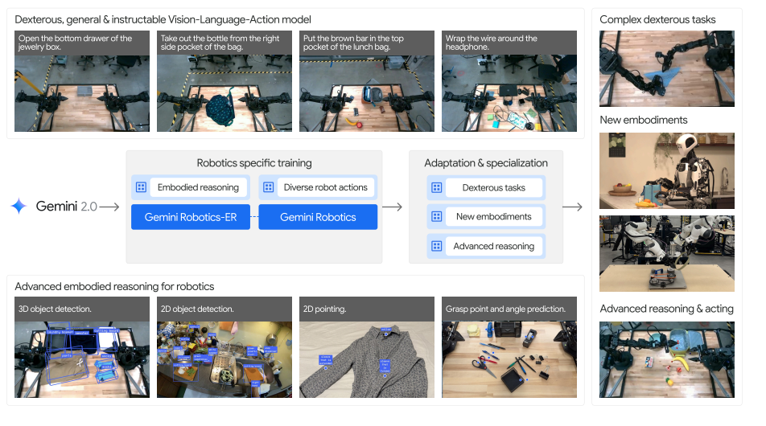

# 先行研究と比べてどこがすごい？
これまでの研究は、ロボットの制御を行うために、様々なモデルを組み合わせて実施していたが、Gemini Roboticsは、1つのモデルがすべての能力をもつ（高速化のために二つに分かれる）。

これによって、器用で様々なタスクができる汎用的なロボットの制御が可能になった。

# 技術や手法の肝は？
## 概要
* まず、Gemini Robotics-ERというモデルを作成して、周辺の状況を見てロボットを大雑把に制御できるモデルを作成。
* そのままだと、計算コストが高すぎる・リアルタイム性がないので、次の二つに分けて実施
  * クラウドで動かすモデル（Gemini Robotics-ERを蒸留）
  * ローカルで動かすモデル
* 50Hzで動作させる

（ER=Embodied Reasoning）

## Gemini Robotics ER
周辺情報を分析するモデル。
Gemini 2.0 Flash をファインチューニングして作成。

以下のスキルを持つ（基本的に、テキストで質問して、座標やパラメータを返す）。

* 2D
  * 物体検出
  * pointing: テキストから該当する対象（物全体or部分）を特定
  * 軌跡予想
  * つかみ位置: Gemini2.0になかった機能（他はGemini2.0もできる）
* 3D
  * 複数視点の統合
  * 3D物体検出

### pointing

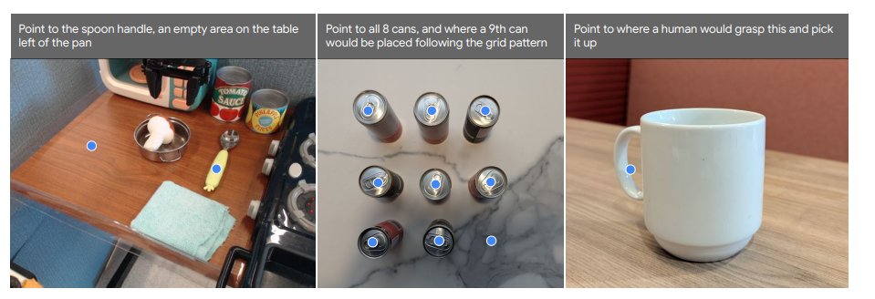

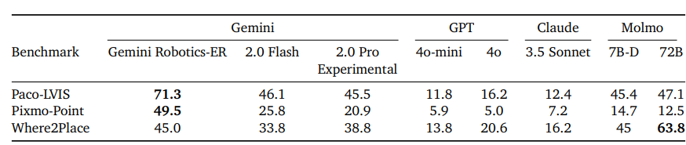

* Paco-LVIS: 実画像の物体が対象
* Pixmo-Point: ウェブ画像が対象（open vocabulary: クラス一覧が固定でない）
* Where2Place: 屋内のフリースペースpointing（なんもないところの位置を特定）

他手法に比べて圧倒的によいものを作成（Molmoも強い）

### 軌跡予想

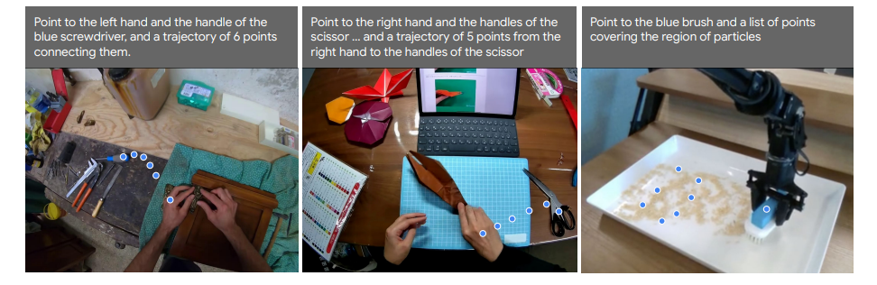

図のように、テキストの指示をもとに、複数の点を予想。

### つかみ位置

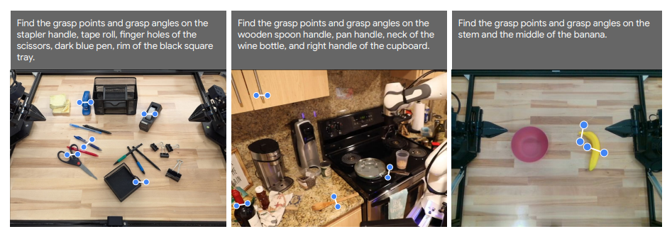

図のように、テキストの指示をもとに、つかむ位置と角度を予想。

### 複数視点の統合

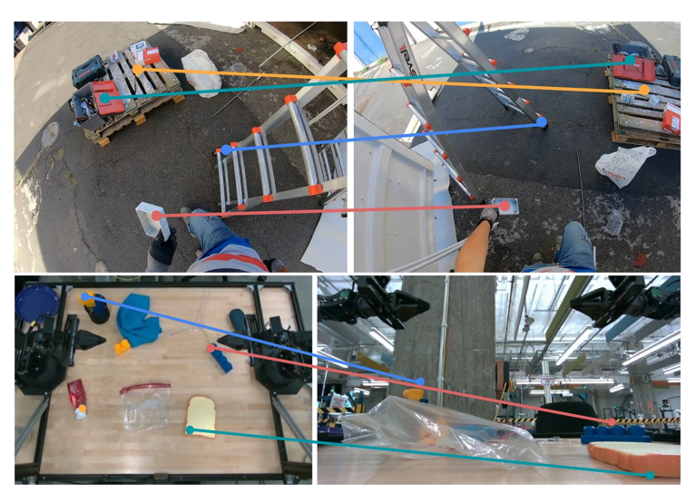

左画像の点の座標と左右の画像を与えて、右の画像の点の座標を予想する。

### Robotの制御
既存の手法では、ロボットの様々なステップごとにモデルを用意して動かす必要があったが、Gemini Roboticsでは、1つのモデルで全てを行う。

ロボットの動きを表現するコードを生成して実現する。

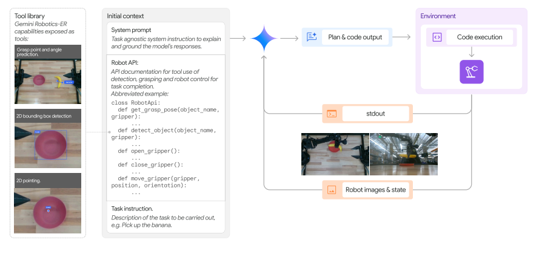

Zero-shotとfew-shot（ICL）の2パターンをGemini 2.0 とGemini Robotics-ERで試した。

結果は、全体的に、ER/few shotがよい傾向にある。

#### ALOHA 2 Sim

#### リアル環境

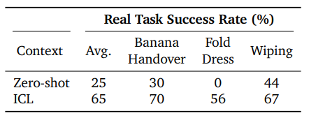

### ERの課題
より器用でなめらかな動作をするには、より細かい制御が必要。そもそもVLMの処理が遅い。

## Gemini Robotics
ERが遅い問題のために、高度な推論をクラウドで行い、ローカルでそれを行動に変換する方法をとる（ローカルといっても4090が乗っている）。

1周が250msになるようにして、50Hzで動作するようにしている。

クラウドはERを蒸留して高速化したもの、ローカルは不明（先行研究に合わせると、gemmaの2Bモデルくらいのサイズで実施していて、この規模感？）

データ収集はALOHA2を用いて1年以上かけて収集。一般的なウェブ文書なども用いて学習。

# どうやって有効だと検証した？

既存手法ではできなかったタスクができるようになっている。

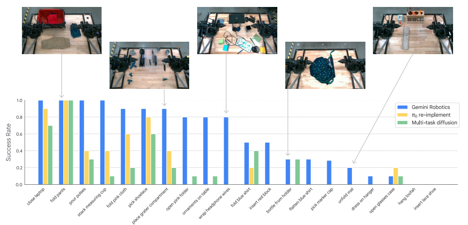

複雑なタスクができることもわかる（既知の物体でも、未知の物体でも）

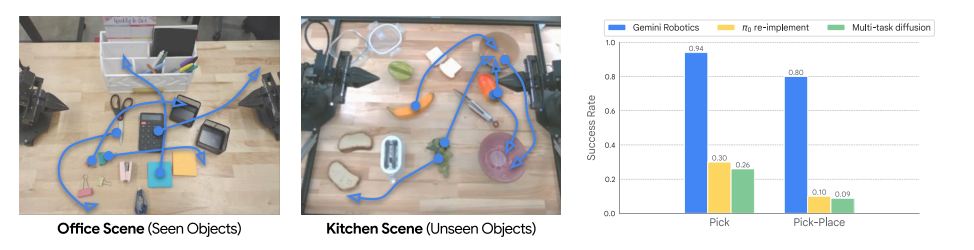

## 汎化性能

* visual generalization: 物体の色や形が変わっても、同じように動作できるか
* instruction generalization: 指示の内容が変わっても、同じように動作できるか
* action generalization: 訓練していない動作もできるか

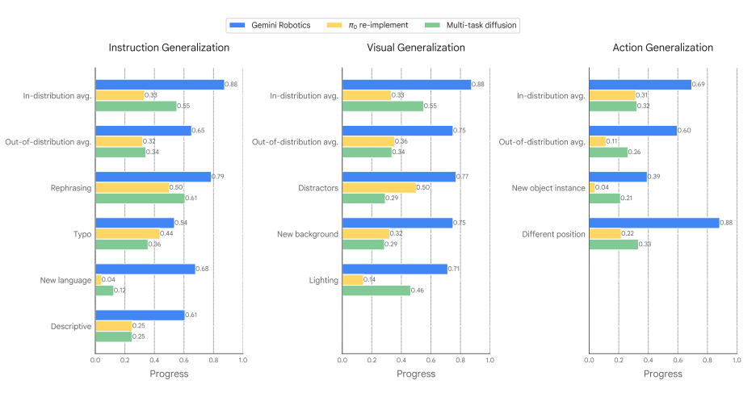

既存手法と比べて圧倒的によい。

## その他
### 動作例

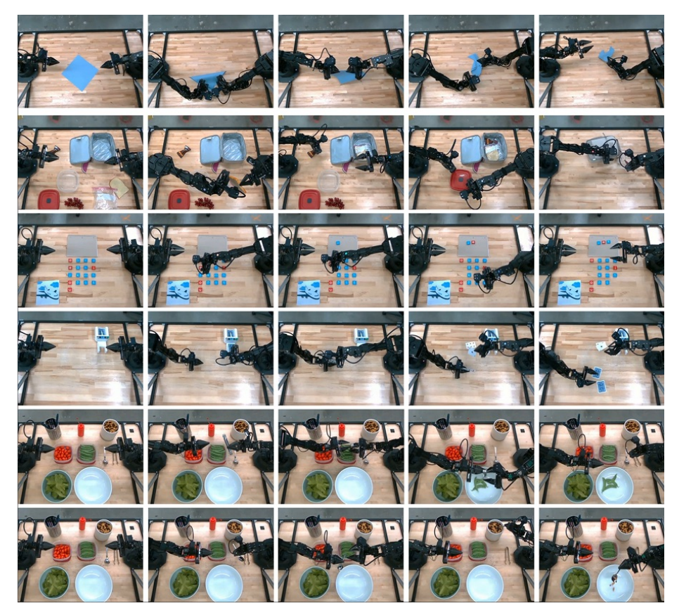

### 別ロボット
学習にはALOHA2を用いているが、bi-arm Frankaを用いた場合。少量のデータでファインチューニングしただけでうまく動作するようになった。

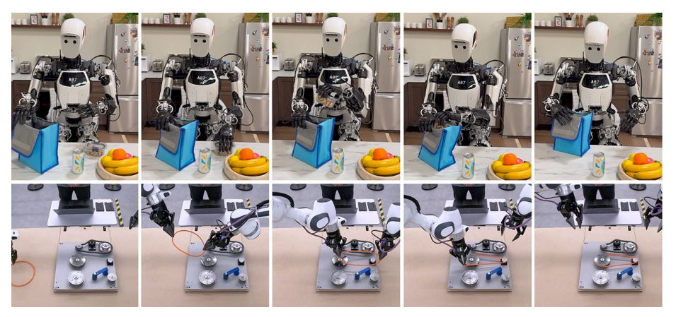

# 議論はある？
## 私見
ロボット応用の研究は、Google・DeepMindがリードしていて、GPTやClaudeとは別の機能を持っているように見える。

# 次に読むべき論文は？
* [π0(PliGemma)](https://arxiv.org/abs/2407.07726)
