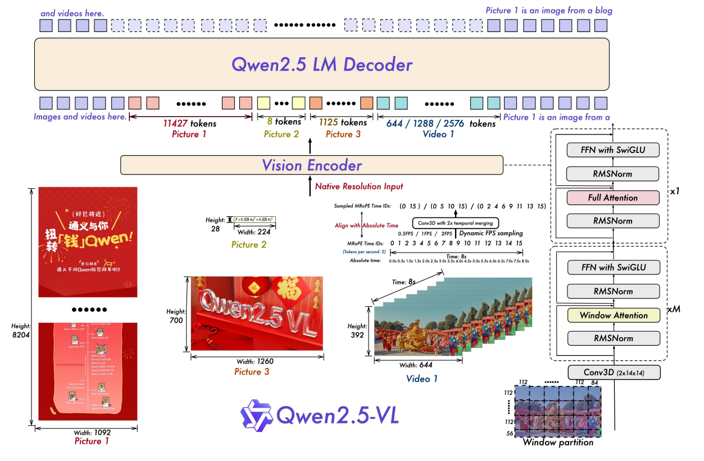
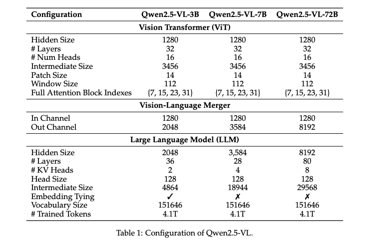
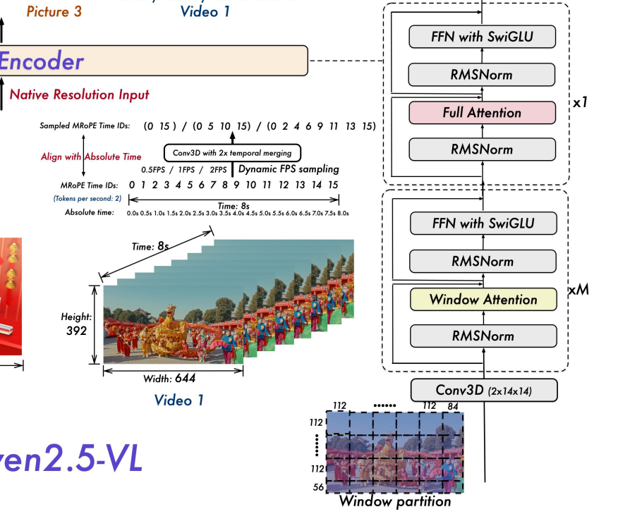
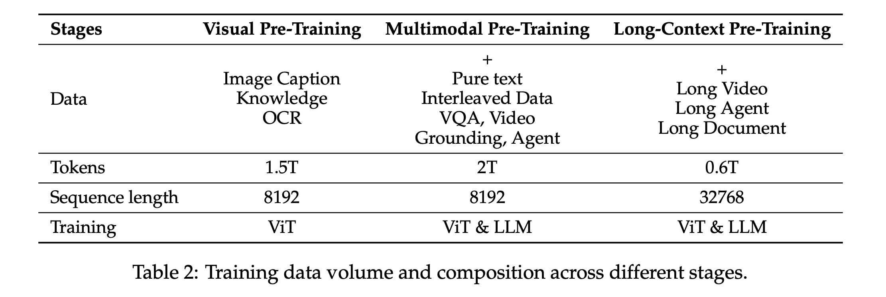
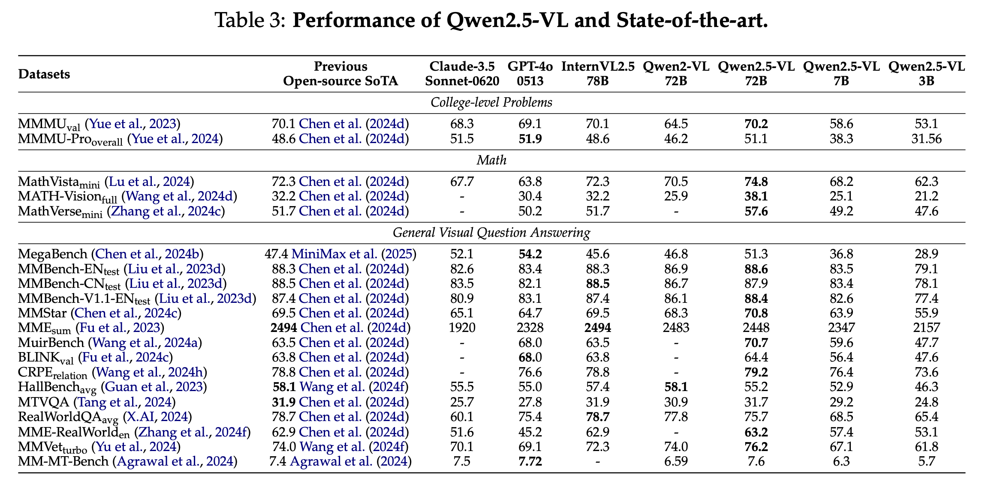
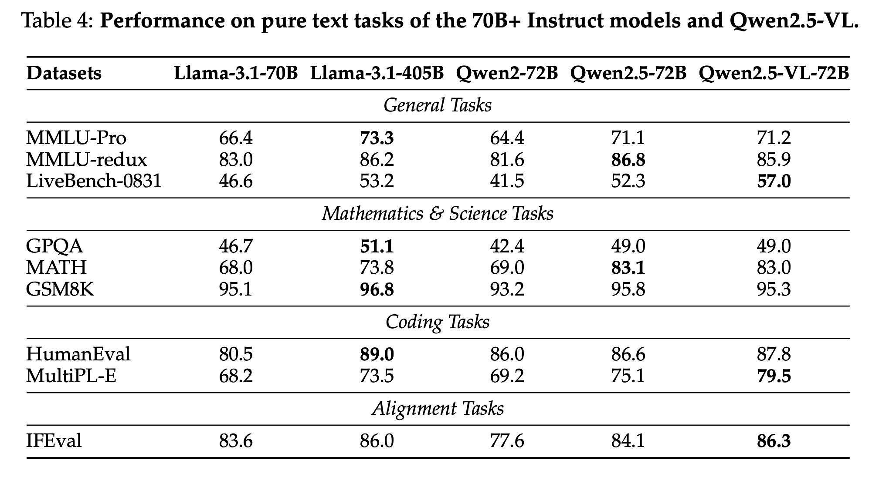

Qwen2.5-VL Technical Report
===

https://arxiv.org/abs/2502.13923

Qwen Team, Alibaba Group

Shuai Bai, Keqin Chen, Xuejing Liu, Jialin Wang, Wenbin Ge, Sibo Song, Kai Dang, Peng Wang, Shijie Wang, Jun Tang, Humen Zhong, Yuanzhi Zhu, Mingkun Yang, Zhaohai Li, Jianqiang Wan, Pengfei Wang, Wei Ding, Zheren Fu, Yiheng Xu, Jiabo Ye, Xi Zhang, Tianbao Xie, Zesen Cheng, Hang Zhang, Zhibo Yang, Haiyang Xu, Junyang Lin (additional authors not shown)

（まとめ：Hiroki Narita）

---

## どんなもの？

- Alibaba Groupが開発したQwenシリーズ最新のマルチモーダルLLM (Vision-Language Model)

- 72B / 7B / 3B の3サイズを同時公開し、72B は GPT‑4o・Claude 3.5 Sonnet と肩を並べる性能を達成​
    - 論文内では記載されていないが、32B も公開している
    - https://huggingface.co/Qwen/Qwen2.5-VL-32B-Instruct
    - https://chat.qwen.ai/

- Window Attention と 動的解像度 + 動的 FPS で ViT を再設計し、ネイティブ解像度のまま計算量を線形スケールに抑制​

- 時間軸まで拡張した Absolute‑Time MRoPE により、秒単位でイベントを特定できる長時間動画理解を実現​​

- 4.1 T tokens の巨大マルチモーダルコーパスで事前学習し、文書解析・オブジェクトグラウンディング・GUI エージェントなど多様な下流タスクで SoTA​

## 先行研究と比べて何がすごい？
以下の技術貢献を行った。
- 動的解像度処理
    - 様々なサイズの画像や異なるフレームレートのビデオを効率的に処理できるように
    - ネイティブ解像度をなるべく保つことで文書処理能力を強化
- 絶対時間エンコーディングの導入
    - 時間軸に沿ったイベントを秒単位で正確に特定
- 先端モデルに匹敵する性能：GPT-4o、Claude 3.5 Sonnetなどと同等以上の性能を多くのベンチマークで達成

## 技術や手法の肝は？

- Vision Transformer, Vision-Language Merger, Large Language Model (LLM) からなるアーキテクチャ

### Vision Transformer

- 基本はViTを再設計する形で構成される

- Conv3D(2x14x14)によるパッチ化 + RoPEを付与
    - 動画の場合
        - 2frame分をConv3Dで1つに圧縮する.動画ならConv2D.
        - fpsが変化してもその分トークン数を増やすだけで良い
    - MRoPE(Multimodal Rotary Position Embedding)
        - 回転変換を用いることで相対位置を埋め込むことができる

- Window Attention x M と Full Attention x1を繰り返す。
    - 7, 15, 23, 31層のタイミングでFull Attentionを行う
    - 計算効率の良い、RMSNorm, SwiGLU(Swish)を採用

- Full Attention
    - 全パッチ間でAttention
    - 計算コストが高いが、グローバルな特徴を考慮可能

- Window Attention
    - あらかじめ区切った 局所ウィンドウ（8 × 8 patch = 112 × 112 px）内部だけでAttentnionを行う
    - 計算コストが低く、局所特徴を考慮可能

### 学習
- 事前学習
    - 以下で一からViTを学習する
        - CLIP pre-training
        - Vision-Language Alignment
        - End-to-end Fine-tuning
    - 元のアスペクト比に従ってランダムサンプリング
        - 多様な解像度に適応させる
- 事前学習データ
    - クリーニングしたWebデータ, 合成データからなる、約4兆トークンのデータ.
    - 多様なタスク対データを用意
        - Captioning, OCR, visual knowledge, localization, video description, ...
        - 画像とテキストが交互に現れるようなInterleaved Image-Text Data
    - 表、チャート、楽譜、化学式の認識といった文書解析タスクはHTMLタグ構造に落とし込み、学習
    - Agent Data
        - スクリーンショットのキャプション、UI要素のGroundingアノテーションの生成
        - モバイルやウェブの操作を目的としたデータ
### 学習手順

DataCompといくつかの社内データでVision Encoderを学習
#### 事前学習

1. Image Caption, Knowledge, OCRタスクを解く
    - テキスト情報と効果的に統合できるようにする
    - ViTのみ学習
2. 多様なマルチモーダルデータで学習
    - ViT & LLMを学習
3. 長い動画、長いテキストで学習
    - ViT & LLMを学習
    - シーケンス長を増やす

#### Post-Training
- ViTを凍結して以下を行う
    - 教師ありFine-tune
        - 事前学習とdown-stramタスク間とのギャップを埋める
        - ChatMLフォーマットに最適化する
    - 強化学習(DPO)

## どうやって有効だと検証した？

- Open-sourceのVLMにてSoTA
- Claude-3.5 Sonnet-0620, GPT-4o 0513を上回る
- https://huggingface.co/spaces/lmarena-ai/chatbot-arena-leaderboard

- 一部のタスクでは、405BのLlama-3.1を上回る

## 議論はある？
- フレーム数・解像度に対してどの程度の推論速度となる？
- 現実的なモデルサイズは？(72B / 32B / 7B / 3B)

## 次に読むべき論文は？
- InternVL
    - Previos Open-source SoTA
    - https://arxiv.org/abs/2312.14238
- Qwen2-VL
    - 一つ前のQwenシリーズのVLM
    - https://arxiv.org/abs/2409.12191
- Qwen2.5
    - Text Decoderとして用いられているLLM
    - https://arxiv.org/abs/2412.15115