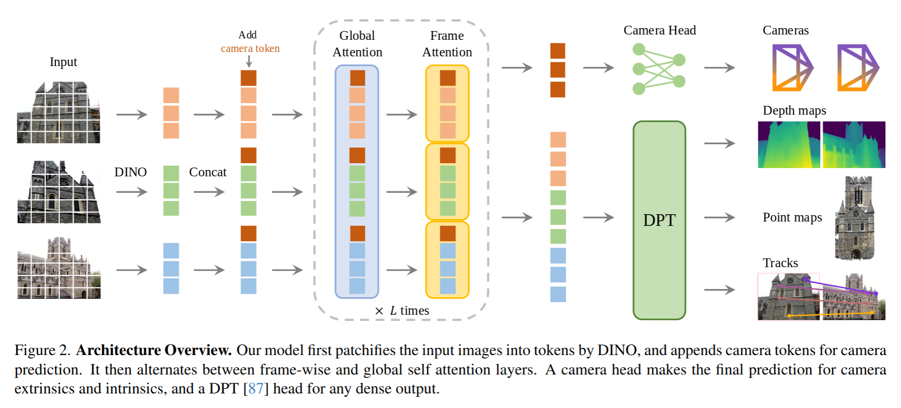
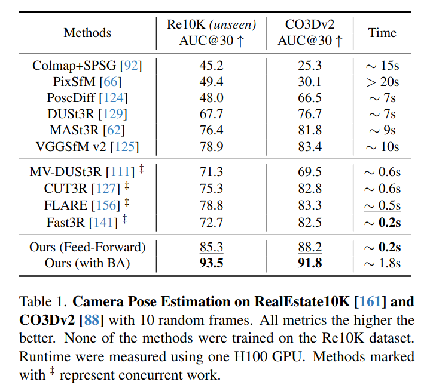
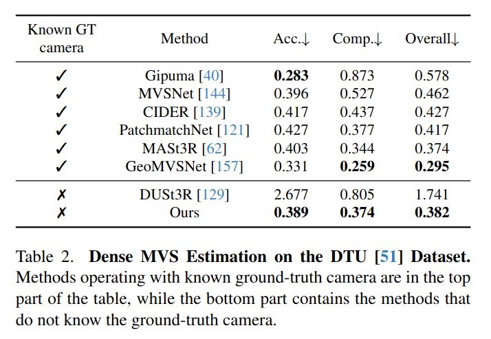
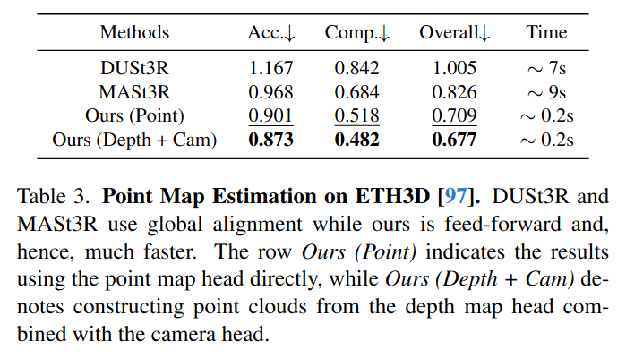
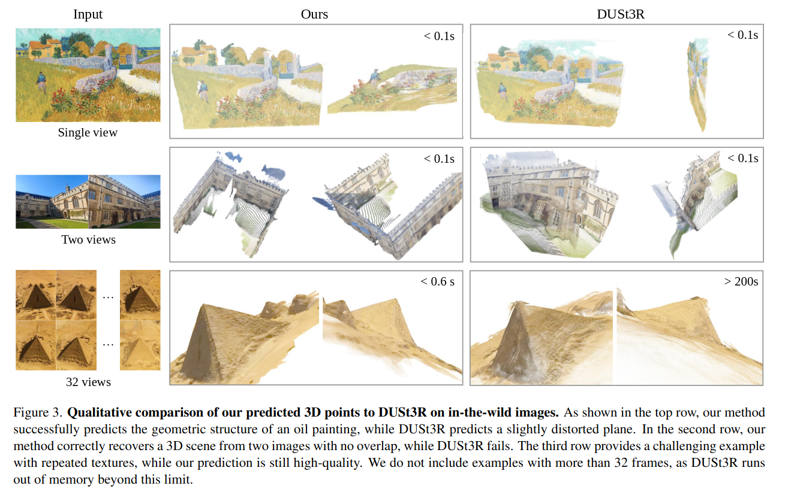
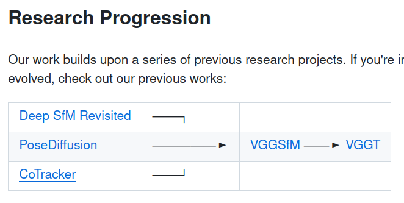

VGGT: Visual Geometry Grounded Transformer
=====

arXiv:2503.11651 by VGG と Meta の人たち

CVPR 2025 (Oral)

https://vgg-t.github.io/

## どんなもの
1枚から数百枚の画像を入力として、カメラパラメータ、深度マップ、点群、3Dポイントトラックなどの3D属性を直接推定するモデル。

## 先行研究と比べてどこがすごい？
-従来の手法 (例：DUSt3R、MASt3R、VGGSfM) は、2枚の画像を処理し、後処理で複数画像の統合を行う必要がある。
- VGGT は、幾何学的制約に基づく後処理をせずに Transformer を使って End-to-End にマルチビュー画像からの3次元復元を行う

## 技術や手法のキモ

- 入力は (マルチビュー) 画像のみ
  - 概ね同じものを映しているという条件はある
- 4つのマルチタスクになっている。
  - 各画像に対応するカメラのパラメータ (回転、移動、FoV) を予測する
  - 各ピクセルの深度推定
  - 各ピクセルに対応する点の3次元座標 ... これは第1画像の座標系で統一された3次元座標
  - 点のトラッキング ... ある点がカメラのどの位置に見える
- DINO(v2) をバックボーンにしている
- Alternating Attention
  - ローカルな Attention (各ビューに閉じて、パッチのアテンションを取る) とグローバルなアテンション (各ビューの画像同士のアテンションを取る) を交互にやる L=24
- 画像と3次元点群の対応がとれる大量のデータセットで訓練している。
  - Co3Dv2
  - BlendMVS
  - DL3DV
  - MegaDepth
  - Kubric
  - WildRGB
  - ScanNet
- これらの3次元情報は LiDAR、人工的に作ったデータの場合は生成エンジン、SfM などから得ている

## どうやって有効だと検証した？

### Camera Pose Estimation
画像のペアに対してそれのカメラ姿勢の回転と移動の差を測るタスク

### Multi-view Depth Estimation
複数のカメラで撮影した画像から深度を推定

### Point Map Estimation
カメラ画像からの点群予測

## 議論はある？
- 魚眼レンズとかパノラマ画像はできない
- メモリ使用量
  - 
  - 画像の解像度は 518x336
- DINOv2 にしたほうが学習も安定するし、性能もいい
- Differential BA は必要か？
  - BA (Bundle Adjastment: バンドル調整) は複数のカメラから再現した情報が整合するように調整するタスクのこと。SfM などでは使用されいてる。
  - ただしこれをいれると学習が4倍遅くなる。
  - 今回の手法では明示的にいれていないが、将来の拡張はできる

## 次に読むべき論文は？

- Deep SfM Revisited: Deep Two-View Structure-from-Motion Revisited. https://arxiv.org/abs/2104.00556
- PoseDiffusion: Solving Pose Estimation via Diffusion-aided Bundle Adjustment https://arxiv.org/pdf/2306.15667
- CoTracker: It is Better to Track Together https://arxiv.org/abs/2307.07635
- VGGSfM: Visual Geometry Grounded Deep Structure From Motion https://arxiv.org/abs/2312.04563
