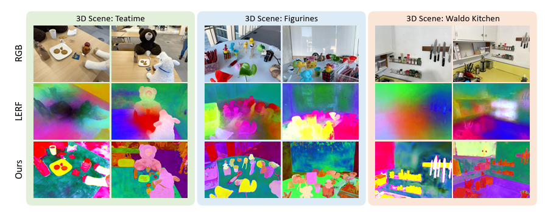
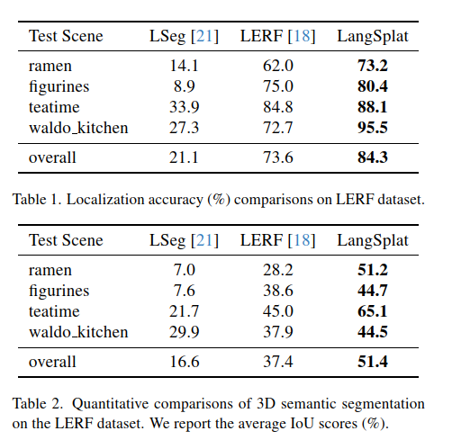
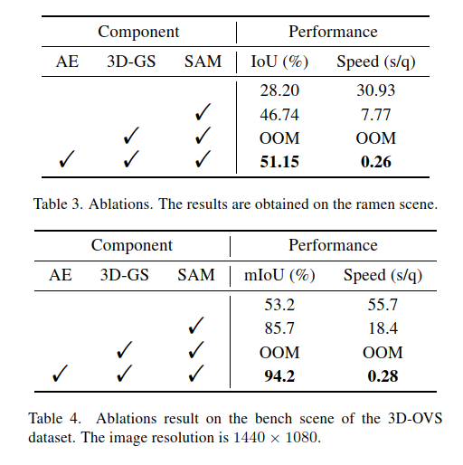
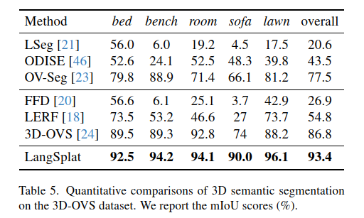
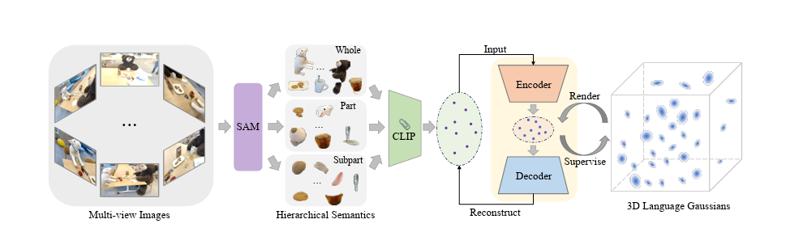

LangSplat: 3D Language Gaussian Splatting
===

2024/03/31 Minghan Qin, Wanhua Li, Jiawei Zhou, Haoqian Wang, Hanspeter Pfister (Tsinghua University, Harvard University)

論文
https://arxiv.org/abs/2312.16084

[LangSplat: 3D Language Gaussian Splatting](https://langsplat.github.io/)

（まとめ：寿＆ChatGPT）

---

## どんなもの？

+ 3Dシーンに自然言語でクエリを投げる「3D Language Field」の構築手法LangSplatを提案
+ 従来のNeRFベースに比べて高速（最大199倍）かつ高精度な3D言語空間を実現
+ [Segment Anything Model（SAM）](https://segment-anything.com/
)を活用してセマンティック階層を学習し、意味曖昧性を解消

---

## どうやって有効だと検証した？

+ LERF(iphoneアプリPoly-camでキャプチャした画像のデータセット)と3D-OVSデータセットを用いて評価
    1. 3Dオブジェクトのローカライゼーション
    2. セマンティックセグメンテーション
    + LERFと比較して精度で最大+14%、速度で最大199×向上
+ アブレーション実験により、SAMの有効性やオートエンコーダによる圧縮の効果を検証

（評価）

---

## 技術や手法の肝は？

The framework of our LangSplat. Our LangSplat leverages SAM to learn hierarchical semantics to address the point ambiguity issue.

+ NeRFの代わりに「3D Gaussian Splatting」を採用し、高速かつ高解像度のレンダリングを実現

従来のNeRF（Neural Radiance Fields）ベースの手法に比べ、LangSplatは3D Gaussian Splattingを採用することで、レンダリング速度を大幅に向上させています。​具体的には、同解像度での処理において、先行手法のLERFと比較して最大199倍の高速化を実現しています。

+ SAMによるセグメンテーションから、階層的（部分・全体）CLIP特徴を抽出して3Dガウスに割り当て
  
LangSplatは、SAMを用いてオブジェクトの階層的なセマンティクス（部分、全体、シーン）を学習します。​これにより、従来の手法で問題となっていたオブジェクト境界の曖昧さや、マルチスケールでのクエリ処理の非効率性を解消しています。

+ 高次元なCLIP特徴をシーン固有のオートエンコーダで低次元に圧縮し、メモリ効率を改善（3次元まで圧縮可能）
  
高次元のCLIP特徴を直接格納する代わりに、LangSplatはシーンごとの言語オートエンコーダを訓練し、低次元の潜在空間にマッピングします。​これにより、メモリ使用量を削減しつつ、高精度な言語特徴の再構築が可能となります。

---

## 議論はある？

+ 多スケールのクエリ処理を不要にしたことで、従来法のボトルネックを解消
+ 学習した潜在空間の可視化が可能で、意味的一貫性を維持
+ デコーダを1×1 Convに置き換えることでさらに高速化の余地あり

---

## 先行研究と比べて何がすごい？

+ LERF（NeRF + CLIP）に比べ：
    + 高精度（+14% IoU）で、ノイズの少ない3D言語表現
    + 高速（199×）、明確なオブジェクト境界を獲得

※IoU:
IoU は、Intersection over Union（交差部分／和集合部分） の略で、
「予測結果と正解データがどれくらい重なっているか」を表す指標です。
主に 物体検出 や セグメンテーション（領域分割）タスクで使われます。
100%= 完全に重なる
50％＝半分位重なる
0％＝全く重ならない

| 項目|CLIPmodel|LangSplat |
| ---- | ---- | ---- |
|目的|画像と言語の対応関係を学習し、ゼロショット分類や検索を可能にする。|3Dシーン内での自然言語によるオープンボキャブラリのクエリや対話を実現する。|
|入力データ |2D画像とテキストのペア。 |複数の視点から撮影された画像と対応するテキスト情報。 |
|出力|画像とテキストの埋め込みベクトル。|3D空間内の各点に対応する言語的特徴を持つガウス分布。|		
|応用範囲|画像分類、検索、キャプション生成など。|3Dオブジェクトのローカライゼーション、セマンティックセグメンテーション、対話型VRなど。|		

代表的な手法 LERF（Language Embedded Radiance Fields）は、CLIP特徴をNeRFに蒸留することで3D言語フィールドを構築する。
しかし NeRF を使うと、
+ レンダリングが極めて遅い（数十秒レベルのクエリ時間）
+ CLIP特徴がピクセル単位ではなく画像単位であり曖昧 → 境界がぼやけた3D表現になる
+ 複数のスケールでCLIP特徴を計算・検索する必要があり、非常に非効率（最大30スケールの検索）	
  
という問題点があった。

+ 既存の3D-OVS（事前カテゴリリスト必要）に対して、LangSplatは任意テキストに基づく柔軟なクエリが可能

3D-OVSの制約：事前定義カテゴリが必要
+ あらかじめ用意された**「カテゴリリスト（例：sofa, table, bottle...）」に限定**された範囲でクエリを行う。
+ クエリテキストがこのリストに含まれないと、正しくセグメンテーションできない。
+ これは「クローズドボキャブラリ（closed-vocabulary）」に相当し、柔軟性に欠ける。

LangSplatの利点：任意テキストでのクエリが可能
+ CLIPによって学習された視覚・言語の共通空間を活用し、画像中の任意の物体に対して自然言語での意味付けが可能。
+ モデル側に固定のカテゴリリストが存在しない。ユーザーが自由に「red apple」「glass of tea」「waldo」などのクエリを与えることができる。
+ セグメンテーションやローカライゼーションも、そのテキストに対応する特徴マップから直接推定される。

---

## 次に読むべき論文は？

+ [LERF: Language Embedded Radiance Fields](https://arxiv.org/abs/2303.07362)
    + NeRFベースでCLIP特徴を3Dに転写する先行研究
+ [Segment Anything](https://arxiv.org/abs/2304.02643)
    + LangSplatで活用されたセグメンテーション基盤モデル
+ [FFD: Feature Field Distillation](https://arxiv.org/abs/2210.04679)
    + NeRFに意味特徴を蒸留する編集可能な3D表現

