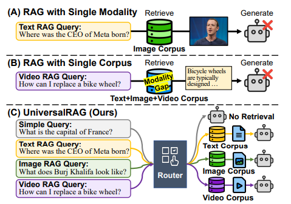
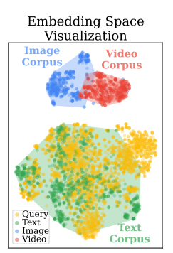
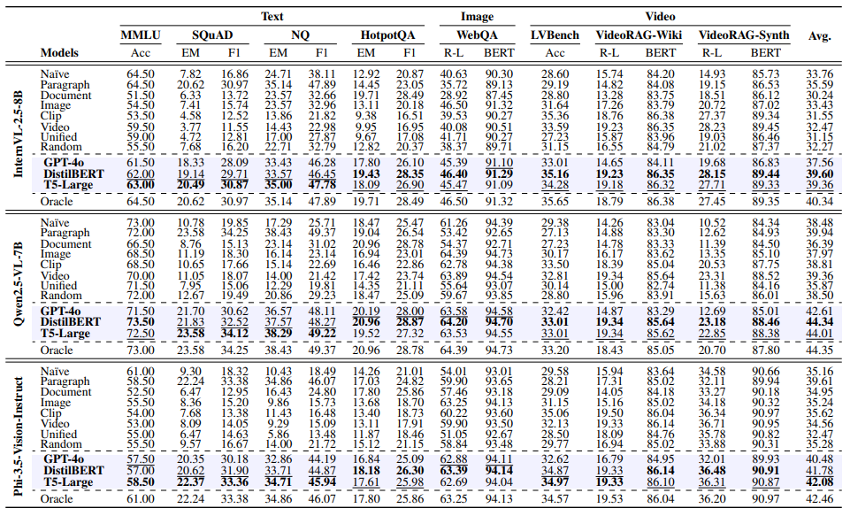
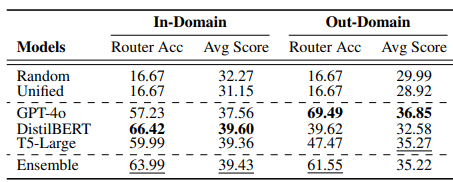
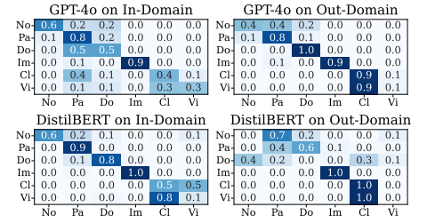

# UniversalRAG: Retrieval-Augmented Generation over Multiple Corpora with Diverse Modalities and Granularities
[https://arxiv.org/abs/2504.20734](https://arxiv.org/abs/2504.20734)

（まとめ @n-kats）

著者
* Woongyeong Yeo
* Kangsan Kim
* Soyeong Jeong
* Jinheon Baek
* Sung Ju Hwang

KAIST(韓国科学技術院)とDeepAuto(韓国の企業）の人たち

# どんなもの？
通常のRAGはテキストが中心だった。一部の例で画像・動画を扱うものも出てきた。しかし、実応用では、いろんな種類のデータが混ざったデータソースを扱うことになる。

論文では、modality gap(後述)と呼ばれる偏りを問題視し、その対策としてUniversalRAGを提案している。

# 先行研究と比べてどこがすごい？
一般的なRAGはテキストが中心、テキスト外のRAGでは、VideoRAGなどのようにビデオ特化のRAGがあった。

こららの手法は、「この問題ならいい感じだけど、こっちはそんなに」という特化したものだった。

UniversalRAGは、modality gapの対策を行い、どこかに特化することなく、特化手法と同等レベルの性能を発揮することができた。

# 技術や手法の肝は？
## 概要

手法としては、とてもシンプル。質問と回答の生成の間にルーターを挟んで、質問に応じたデータソースを選択するだけ。

## modality gap

データソースによって、インデックスの偏りがある。

埋め込みベクトルの分布を可視化すると次のようにテキストと画像・動画で隔たりがある。

質問がテキストのため、テキストのデータソースと類似性が高く、画像・動画のデータソースは無視されてしまう。

ルーターを挟んでどのデータソースを使うかを選択することで、本当にアクセスすべきデータにアクセスしやすくするようになる。

## ルーターの作り方

大きく、2種類、即席のLLMをルーターとして使う方法と、小さなモデルを学習させてルーターとする方法がある。

論文では、LLMとしてGPT-4o、小さなモデルとしてDistilBERTとT5-Largeを使っている。

良し悪しとしては、学習したドメイン内のデータなら小さなモデルを学習した方が良い結果となった。そうでないと、LLMを使った方が良い結果となった。(後述)

# どうやって有効だと検証した？
## 利用データソースの比較
段落・ドキュメント・画像・クリップ・動画の5種類のデータソースを用意。

一つだけ採用・何もなし（Naive）・Unified（全部混ぜ）・ランダム・ルーター利用（UniversalRAG）・Oracle（ベストなデータソースを選択）で比較。

表の見方：
* 青い部分がUniversalRAG
* 左端：回答に使うモデル
* 左から2番目：RAGの種類・UniversalRAGのルーターの種類
* 評価値：テキスト・画像・動画の3種のグループがある

表から読み取れること
* Unified（全部混ぜ）の平均スコアが下から2番目（Naiveやランダムより悪い！）
* Videoは確かに動画のスコアが良いものの、テキスト系のタスクは弱い（SQuADだと3.77）
* UnivarsalRAGは、どのデータでもOracleに近いスコアを出している。
* ルーターは小さなモデルを使った方が少し良い結果を出している。（とはいえGPT-4oでも良い）

## 既成LLM v.s. 小さいモデルを訓練

表から、
* 学習したドメイン内のデータなら小さなモデルを学習した方が良い
* そうでないと、LLMを使った方が良い
* アンサンブルはあまり効果がない

といえる。

混同行列を見ると、どのスケールでデータを取るか（ClipとVideoのどちらを使うか、段落と文章のどちらを使うか）が混乱していることがわかる。訓練すると、これが良くなる。とはいえ、ドメイン外への汎化性能は低い。

# 議論はある？
複数種類のデータソースを扱うためのフレームワークを提案できた。
特に、ルーターのモデルを訓練することで改善が見込めることもわかったのも大きい。

## 私見
とてもシンプルな方法で、この問題を解決していて良い。RAGを検索外部ツールとして追加するのであれば、ツール選択がルーターとして機能するので、何もしなくても使える手法ってレベルかもしれない。

ルーターの訓練が面倒な気もしなくもないが、面倒ならLLMでも大丈夫そうなので、気にしなくても良いかも。

実験に使っているモデルが数ヶ月前のものなので、今のモデルでやるとそれなりに違いがあるかも。ルーターにLLMの1Bモデルを訓練して使う手もありそう。

# 次に読むべき論文は？
* [VideoRAG](https://arxiv.org/abs/2501.05874)
* [RAG-MCP](https://arxiv.org/abs/2505.03275) ・・・UniversalRAGってMCPで良くない？って思っていたら見つけた論文