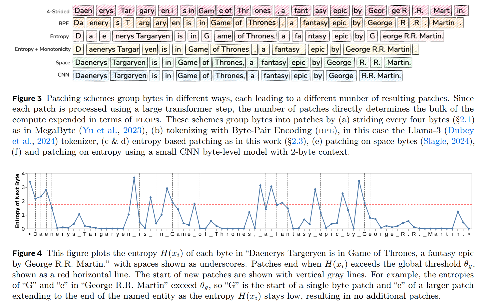
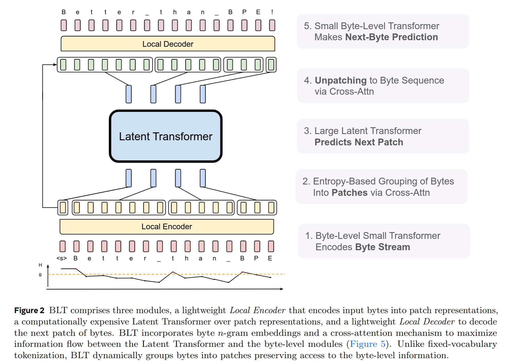
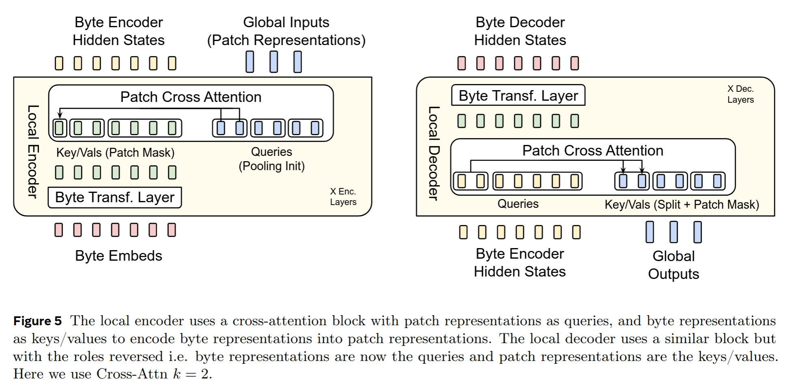
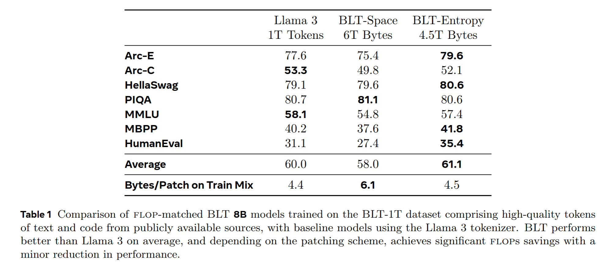
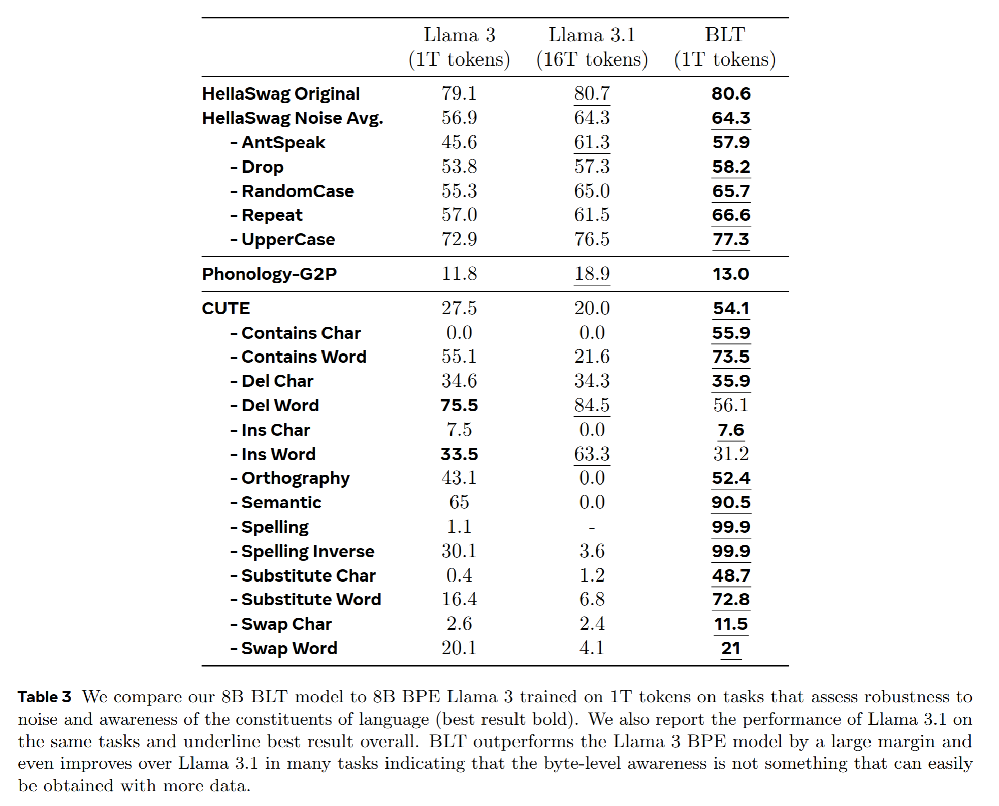
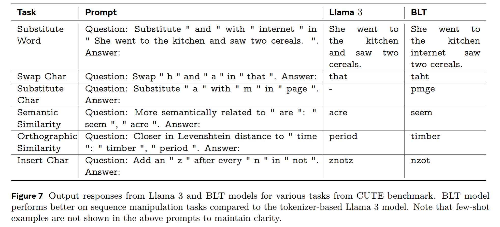
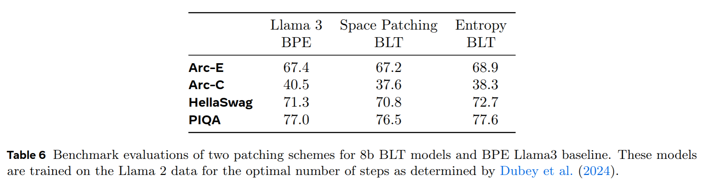

Byte Latent Transformer: Patches Scale Better Than Tokens
=====

by FAIR, University of Washington, University of Cicago

http://arxiv.org/abs/2412.09871

## どんなもの
文字列をトークン化せずに、バイト列としてそのまま扱う LLM

## 先行研究と比べてどこがすごい？
- 通常の LLM は入力された文字列を固定の語彙のトークンに分割して処理を行う。このトークン化にはいくつかの問題がある。
  - ドメインやモダリティに対して敏感
  - 入力のノイズ (誤字脱字など?) に対して脆弱
  - 文字レベルの理解の欠如
  - 多言語間での不公平さ
- 一方で単純にバイト列として扱うのも困難だった。
  - バイト列は長いシーケンスを持つため、計算コストが高い
  - 先行研究では省力的な Attention を使ったり、Attention 機構を使わないアーキテクチャがあるが、それらはいずれも小規模なモデルでの実験にとどまっていた
- Byte Latent Transformer (BLT) は、バイト列を動的な潜在的パッチとして扱うことで、固定の語彙を使わずに LLaMa3 と同等の性能を達成。

# 技術や手法のキモ

## Entropy Patching

- バイト列を処理する非常に小さな自己回帰モデルを訓練する。これは次のバイトを予測するようなモデル
- 予測のエントロピーを使用してパッチの境界を決定する
  - 方法1: グローバルなエントロピーのしきい値を超える点をパッチ境界とする
  - 方法2: 直前のエントロピーと比較して差しきい値を超える点をパッチ境界とする

## Latent Global Transformer

- 普通の Transformer だが、入力はトークンではなくパッチを扱う。
- Attention は block-causal つまり、未来と自分自身のパッチの情報にアクセスできる
- 計算量の大部分はこの部分で行われる。

## Local Encode/Decoder

- 文字列のバイト列と動的な大きさを持つパッチを変換する軽量な Transformer
- バイト列→パッチは Encoder で、パッチ→バイト列は Decoder で行う
- 通常の Transformer と異なり、Self-Attention ではなくバイト表現-パッチ表現の Cross-Attention を使用する

# どうやって有効だと検証した？

## ablation

# 議論はある？

- BLT は LLaMa3 と同様のスケーリング則に従うとして、データ量やパラメータ数を決めたが、BLT においては最適でない可能性がある
- 既存の Transformer はトークン化される前提で最適化されるので FLOPS は低下しても実際の計算時間は削減されない
- BLT 用にパッチ化を行う小さな Transformer は独立して訓練している。将来的には End-to-End にしたい

# 次に読むべき論文は
- トークン化に関する問題提起
  - Gautier Dagan, Gabriel Synnaeve, and Baptiste Roziere. Getting the most out of your tokenizer for pre-training and domain adaptation, ICML 2024.
  - Lukas Edman, Helmut Schmid, and Alexander Fraser. CUTE: Measuring llms’ understanding of their tokens. arXiv, 2024.
  - Davis Liang, Hila Gonen, Yuning Mao, Rui Hou, Naman Goyal, Marjan Ghazvininejad, Luke Zettlemoyer, and Madian Khabsa. Xlm-v: Overcoming the vocabulary bottleneck in multilingual masked language models. In Proceedings of Empirical Methods in Natural Language Processing, 2023.
- 他のバイト列を扱うモデル
  - MambaByte by Wang et al., 2024
