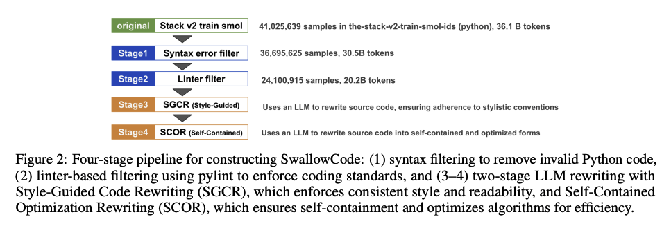
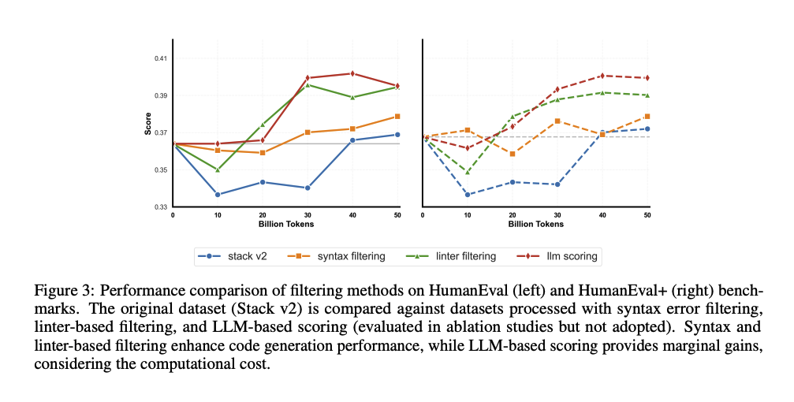
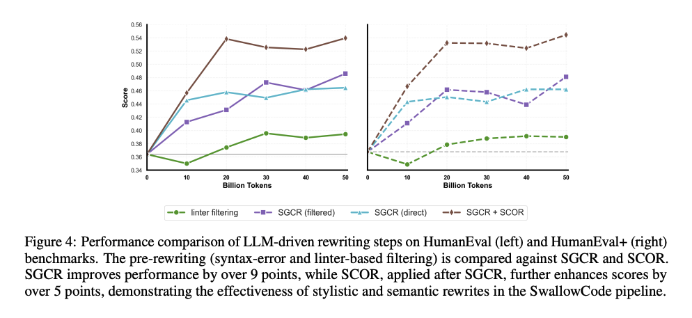

Rewriting Pre-Training Data Boosts LLM Performance in Math and Code
===

https://arxiv.org/abs/2505.02881

Kazuki Fujii, Yukito Tajima, Sakae Mizuki, Hinari Shimada, Taihei Shiotani, Koshiro Saito, Masanari Ohi, Masaki Kawamura, Taishi Nakamura, Takumi Okamoto, Shigeki Ishida, Kakeru Hattori, Youmi Ma, Hiroya Takamura, Rio Yokota, Naoaki Okazaki

Institute of Science Tokyo, Department of Computer Science

National Institute of Advanced Industrial Science and Technology

Institute of Science Tokyo, Institute of Integrated Research, Supercomputing Research Center

https://swallow-llm.github.io/index.ja.html

（まとめ：Hiroki Narita）

---

## どんなもの？


- LLMにおける事前学習データセットを系統的に書き換えることで、コード生成能力と数学的推論能力を大幅に向上させる手法を提案

- 既存のデータセットを単に選別するのではなく、「変換して保持する」アプローチを採用

- 本研究により作成されたデータセットを公開
    - [SwallowCode](https://huggingface.co/datasets/tokyotech-llm/swallow-code)
        - The-Stack-v2から派生した書き換えられたPythonコードコーパス
    - [SwallowMath](https://huggingface.co/datasets/tokyotech-llm/swallow-math) 
        - Finemath-4+から派生した書き換えられた数学コーパス

## 先行研究と比べて何がすごい？
- 従来手法
    - 低品質なデータを除外するフィルタリングして破棄するタイプ
        - The-Stack-v1/v2、Stack-Edu等
    - LLM駆動でコーパスを書き換えるタイプ
        - [link](https://arxiv.org/abs/2311.14904)
        - 変数の名前変更、モジュール化、コメントの追加に焦点を当ててfine-tuning
    - 合成コードの活用
        - 多様性を制限してしまう
- 本手法
    - 事前学習コーパスのフィルタリングとコード書き換えによって大幅な精度向上を達成

## 技術や手法の肝は？

### SwallowCode


- Syntax Error filter
    - 構文エラーが起きているデータをフィルタリングする
- linter filter
    - lintエラーが起きているデータをフィルタリングする
- スタイルガイド付きコード書き換え(SGCR)
    - Style-Guided Code Rewriting
    - LLMを使って、Google Pythonスタイルガイドの10の基準に沿うように変更
        - [url](https://google.github.io/styleguide/pyguide.html)
- 依存関係の解決、アルゴリズムの最適化(SCOR)
    - Self-Contained Optimization Rewriting
    
### SwallowMath
- Removing boilerplate (定型句の削除)
    - 冗長なテキストとメタデータを削除.
- Restoring context (コンテキストの復元)
    - 問題にすべての必要な情報が含まれるようにする。
- Solution reformatting (解答の再フォーマット)
    - Llama-3.3-70B-Instructを使用して、解答を明確なステップごとの説明に変換。
```
# 書き換え前
Problem: 2つの公正なサイコロを振って、合計が7または11になる確率は？
Solution: 合計が7または11になるイベントをEとします。
2つのサイコロを振ると、36の可能な結果があります。
合計が7の場合、（1,6）、（2,5）、（3,4）、（4,3）、（5,2）、（6,1）- 6つの方法があります。
合計が11の場合、（5,6）、（6,5）- 2つの方法があります。
したがって、36の可能な結果のうち、8つの有利な結果があります。
したがって、P(E) = 8/36 = 2/9。

# 書き換え後
Problem: 2つの公正なサイコロを振って、合計が7または11になる確率は？
Solution:
Step 1: 2つのサイコロを振ったときの可能な結果の総数を計算します。
   合計結果 = 6 × 6 = 36

Step 2: 合計が7になる方法の数を見つけます。
   (1,6), (2,5), (3,4), (4,3), (5,2), (6,1)
   7になる方法の数 = 6

Step 3: 合計が11になる方法の数を見つけます。
   (5,6), (6,5)
   11になる方法の数 = 2

Step 4: 有利な結果の総数を計算します。
   有利な結果 = 6 + 2 = 8

Step 5: 確率を計算します。
   確率 = 有利な結果 / 合計結果
   確率 = 8/36 = 2/9

したがって、2つの公正なサイコロを振って、合計が7または11になる確率は2/9です。
```

## どうやって有効だと検証した？
- 評価指標
    - **pass@1**
        - モデルがk(=1)回まで出力を許された時、そのうち一回でも正解に到達する確率
        - k=1の場合、一回しか出力が許されない
        - 正解したか否かはユニットテストなどで自動的に検証

### SwallowCode


- Stack v2 データセットに提案手法を適用 
    - Githubコード、Githubイシュー、Githubプルリク、ジュピターノートブック、Kaggleノートブック、パッケージマネージャのドキュメント、教科書、数学とコーディングに関する小規模な高品質データ、自然言語データ...
- 評価
    - HumanEval, HumanEval+
    - BigCodeBench, lm-evaluation-harness
        - 実務に近いデータセット


- step1, step2: データの削減では大きな効果は見られなかった。


- step3, step4: データの書き換えで、14pt程度向上した

### SwallowMath

- finemath-4+ データセットに提案手法を適用
- Llama3.1-8Bに、500億トークンデータで継続事前学習
- GSM8K(小学校レベル), MATH(複雑な数学) データセットで評価
- GSM8Kで12.4pt, MATH7.6ptの向上

## 議論はある？
- 最近だと、ruffなどの最新のlinterもリリースされ、エディタがリファクタリングを手伝ってくれる。適切なルールを設定した、これらを組み合わせたときに性能がどう変わるか気になるところ

## 次に読むべき論文は？
- 