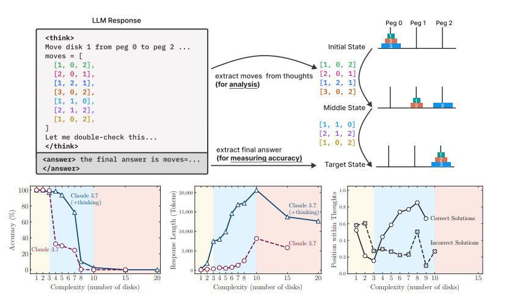
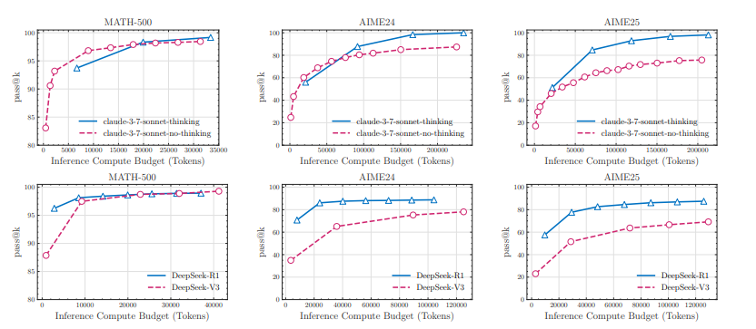
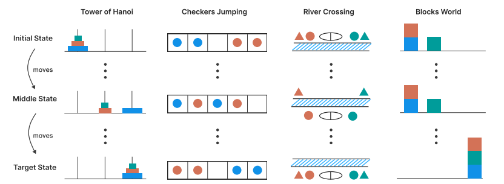
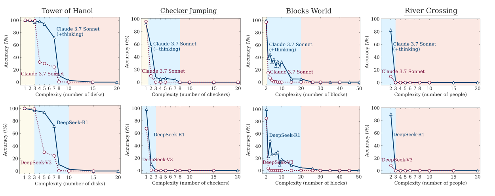
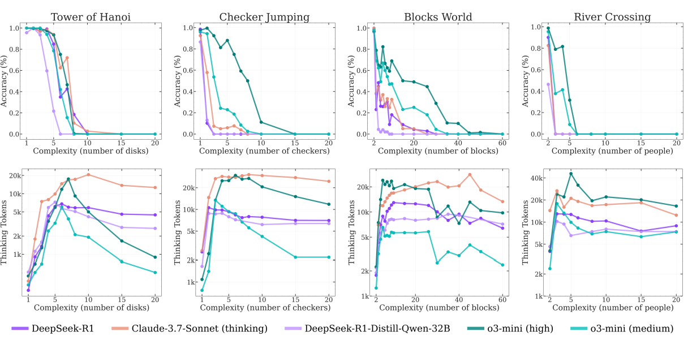
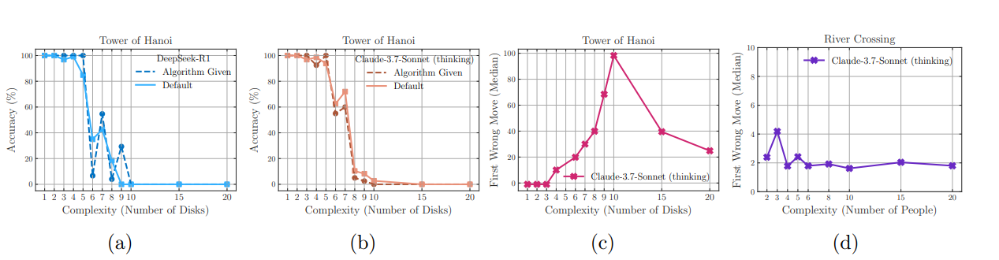

# The Illusion of Thinking: Understanding the Strengths and Limitations of Reasoning Models via the Lens of Problem Complexity
[https://arxiv.org/abs/2506.06941](https://arxiv.org/abs/2506.06941)

（まとめ @n-kats）

著者
* Parshin Shojaee
* Iman Mirzadeh
* Keivan Alizadeh
* Maxwell Horton
* Samy Bengio
* Mehrdad Farajtabar

Appleの人たちの論文。

少し前に、「LLMはやっぱり思考していない。学習したことの貼り合わせ」みたいな雑理解でツイッターで話題になった論文だが、ちゃんと読んでその雑理解を正すために読んでみた。

# どんなもの？
LLM（特にreasoningモデル）の推論能力を評価した論文。

ハノイの塔などの、難易度調整がしやすいパズルを解かせて、LLMの推論能力を解析している。

結果、その能力の限界・特性を示している。

# 先行研究と比べてどこがすごい？
世の中のベンチマークは、AIME（アメリカの数学オリンピック）などの問題を使って評価しているが、

* 難易度調整が難しく分析が難しい（連続的に調整できるパラメータが乏しい）
* そのそもAIME24ではリークの疑惑がある（人間はAIME25の方が成績が良かったが、AIは逆）

といった問題がある。
ハノイの塔などのパズルを使うことで、難易度調整がしやすく、分析がしやすいベンチマークを作成している。

## 私見
* AIMEはo3やo4-miniでpython利用でほぼ満点になったが、pythonを使うと整数問題総当たりが可能なのでインチキ疑惑もある（OpenAIのサイトには図が取り除かれている？）
* ハノイの塔等自体の知識があったら簡単に解けてしまうのでは？

# 技術や手法の肝は？
## 利用したパズル
次のパズルの動きを出力して、機械的に正誤判定する

* ハノイの塔
* チェッカージャンピング
* Rivers Crossing(川を渡る問題)
* Blocks World（任意の配置にブロックを移動させる問題）

## 難易度調整
|パズル | 難易度調整の方法 | 最小移動数|
|---|---|---|
| ハノイの塔 | ディスクの数 | 2^n - 1 |
| チェッカージャンピング | チェッカーの数 | (n+1)^2-1 (2n=チェッカーの数) |
| Rivers Crossing | 人数 |
| Blocks World | ブロックの数 |

## 出力例
|パズル | 出力例 | |
|---|---|---|
| ハノイの塔 | [[3, 2, 1], [], []] | それぞれの棒にディスクがどのように配置されているかを出力する |
| チェッカージャンピング | [["R", 0, 1], ["B", 2, 0], ["R", 1, 2]]| 移動するチェッカーの色と位置を出力する |
| Rivers Crossing | [["A_2", "a_2"], ["A_2"], ["A_1", "A_2"], ["A_1"], ["A_1", "a_1"]] | 川を渡る人の組み合わせを出力する |
| Blocks World | [["C", 1, 2], ["B", 0, 1]] | ブロックの色と移動元と移動先の位置を出力する |

## 分析方法
（図は後ほど）
* 難易度と正答率・・・難易度が上がると、一気に正答率が下がる現象が見られる
* 難易度と思考トークン数・・・難易度が上がると、諦めて思考トークンが減る現象も見られる
* 中間解の位置・・・reasoning中のmoves=...の部分を中間解として取り出し、正答率と比較する。中間解が正答率に寄与しているかを調べる。
* 解法を教える・・・解法を教えても、難易度が上がると正解できなくなることが観測される

# どうやって有効だと検証した？

## 難易度VS正解率

3領域に分かれている。
1. 簡単：非reasoningモデルが優位（黄緑）
1. 中間：reasoningモデルが優位（青）
1. 難しい：どのモデルも壊滅（赤）

## 難易度VS思考トークン数

難易度に合わせてトークンが増えると予想されるが、ある程度の難易度で減少し始める。

難しすぎて諦めているかのような挙動。

## 中間解の位置

中間解の分布（正解・不正解に分けて）

* 簡単な問題では、早い段階で正解に到達するが、思考を続けると誤答が発生している。
* 難しい問題では、その逆（早い段階で誤答が多い）
* 右図のようにトークン毎の正解率を見ると、難易度が上がるごとに右下に移動しているような形状変化が見られる
  * 全体的に正解率が減少。特に少量のトークンでは正解できない。

## 解法を教えたときの難易度と正解率

* 解法を教えても、難易度が上がると正解率が下がる（aとb）
  * そもそも解法を教えても大して精度に影響はない
* 最初に間違えるmoveの位置
  * (c) ハノイの塔
    * 超簡単なところでは、正解するので0になっている
    * 簡単～中間では、動きの総数が少ないため増加している
    * 難しい問題では、逆に間違い易くなっている
  * (d) Rivers Crossing
    * 一定の位置で間違える傾向がある
    * ハノイの塔のように手数が多すぎて問題が発生しているわけではなさそう（すぐ間違う）

# 議論はある？
* Reasoningモデルといっても、挙げたパズルのように難易度を上げると限界が生じる。
* 難易度よって3つの領域に分かれる。
* 解法を教えても意味が薄い。

## 私見
難易度＝手数のような調整になっている。活用できるトークン長の問題のようにも見える。別の意味で難易度を変えるようなことはできないかと思う（数独のようなもので、ヒントが少ないものとか？）

「LLMはやっぱり思考していない。学習したことの貼り合わせ」のような解釈は
* そもそも正解手順を教えても間違っている
* 手数が多い問題で限界が発生する（コード生成の問題にすると解けるのかも）・・・「人間はつかれて、途中で作業できなくなる」というのがAIもそうっだって解釈ができる？

# 次に読むべき論文は？
overthinkingに関する論文がいくつかあるので、そちらを読むと良いかも。
* [Do NOT Think That Much for 2+3=? On the Overthinking of o1-Like LLMs](https://arxiv.org/abs/2412.21187)
* [Stop Overthinking: A Survey on Efficient Reasoning for Large Language Models](https://arxiv.org/abs/2503.16419)