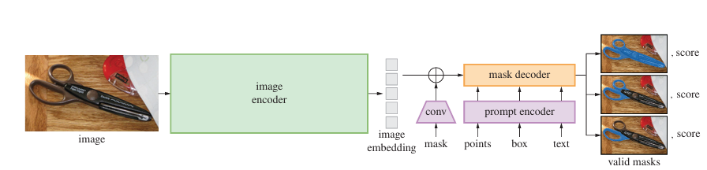

Segment Anything Model (SAM)
===

2023/04 Meta AI Research (Alexander Kirillov et al.)

論文
https://arxiv.org/abs/2304.02643

プロジェクトサイト
https://segment-anything.com/

---

## どんなもの？

+ 任意の画像に対してプロンプト（点・ボックス・テキストなど）を与えることで、有効なセグメンテーションマスクを即時生成
+ セグメンテーションのための基盤モデル「SAM (Segment Anything Model)」を提案
+ 大規模なマスク付き画像データセット「SA-1B」（11M画像、1.1Bマスク）を自動生成し公開

---

## どうやって有効だと検証した？

+ 23種類の既存ベンチマークデータセットにおいて、ゼロショット評価（ファインチューニングなし）を実施
+ 主な評価項目：
    - **1点プロンプトでのマスク予測**
    - **境界検出・物体提案生成・インスタンスセグメンテーション・テキスト→マスク**
+ 人手評価（ヒューマンスタディ）では、既存手法よりも高品質なマスクと判定
+ COCOやLVISのような実際のアノテーションバイアスに左右されず、汎用性が高いマスク予測を実現

---

## 技術や手法の肝は？

Segment Anything Model （SAM） の概要。
高性能な画像エンコーダーが画像埋め込みを出力し、多様な入力プロンプトに対して効率的にクエリを実行することで、平均化リアルタイム速度でオブジェクトマスクを生成します。複数のオブジェクトに対応する曖昧なプロンプトの場合、SAMは複数の有効なマスクと関連する信頼度スコアを出力できます。

+ **構成要素**：
    - **画像エンコーダ**：ViT（Vision Transformer）ベースのMAE事前学習済みモデル
    - **プロンプトエンコーダ**：点、ボックス、マスク、テキストなどをエンコード
    - **マスクデコーダ**：トランスフォーマーベースの軽量構造で高速マスク出力（~50ms）

+ **プロンプト対応性**：
    - 点・ボックス・マスク・テキストすべてに対応（CLIPテキストエンコーダ利用）
    - 曖昧な入力に対し最大3つのマスクを出力可能

+ **データ生成：データエンジン**：
    - 手動補助 → 半自動 → 全自動の3段階で1.1Bマスクを生成
    - 自動生成には32×32の点プロンプトを使用し、SAMでマスクを生成しNMSで選別

---

## 議論はある？

+ 通常の教師あり手法よりも高品質かつ効率的な学習が可能（SA-1Bの自動生成含む）
+ モデル自体は完全に「汎用型」（特定タスクやカテゴリに依存せず）
+ 処理はリアルタイムであり、ブラウザでも利用可能（50ms程度で応答）

---

## 先行研究と比べて何がすごい？

| 項目 | 既存手法（例：RITM, FocalClick） | SAM |
|------|----------------------------|-----|
| 入力 | 点/ボックスなど             | 点、ボックス、テキストなど多様 |
| 出力 | 単一マスク                 | 最大3種マスク出力（階層セマンティクス） |
| 学習データ | 少量の手動アノテーション     | 11M画像・1.1Bマスク（自動生成） |
| 性能 | 高精度（特定タスクに強い）  | ゼロショットで多タスクに対応 |
| 応答速度 | 数秒                      | 約50ms（ブラウザでも可） |

---

## 次に読むべき論文は？

+ [CLIP: Learning Transferable Visual Models from Natural Language Supervision](https://arxiv.org/abs/2103.00020)
+ [RITM: Reviving Iterative Training with Mask Guidance](https://arxiv.org/abs/2203.14102)
+ [FocalClick: Towards Practical Interactive Image Segmentation](https://arxiv.org/abs/2209.11061)
+ [SA-1B Dataset (デモとデータ公開)](https://segment-anything.com/demo)

