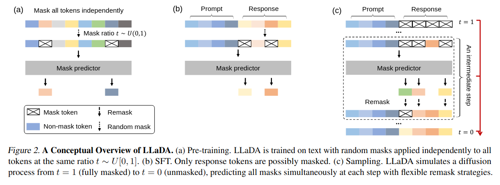
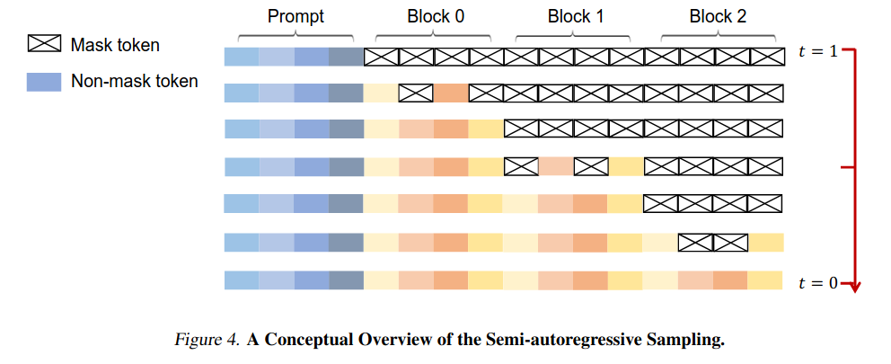
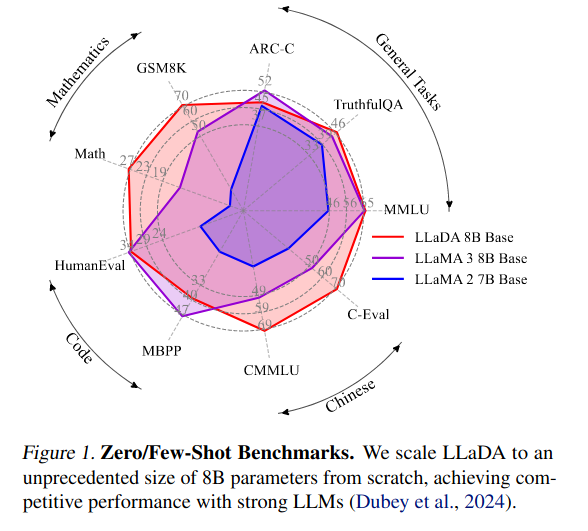
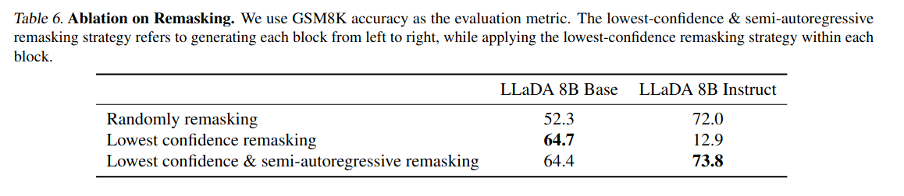
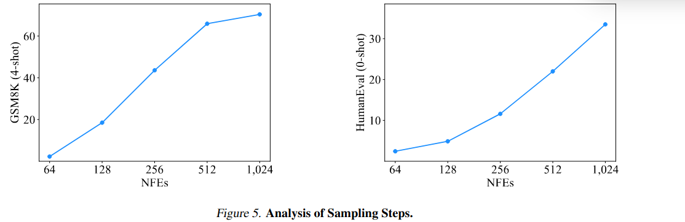

Large Language Diffusion Models
=====
http://arxiv.org/abs/2502.09992

## どんなもの？
- 一般的な自己回帰型 (前のトークン列から次のトークン1つを予測する) ではなく、拡散モデルを使った LLM。
- 蒸留により得られた軽量なモデルを使って特徴抽出を行うことで速度と精度を大きく改善

## 先行研究と比べてどこがすごい？

- 拡散モデルを言語モデルに応用する研究は先例がある
- テキストを連続のベクトルとみなして生成する方法がある。ただし、自己回帰モデルの64倍遅い
- マスクされたトークンを予測するモデルが離散の拡散モデルとして扱えることを示した論文もすでにある。(Masked Diffusion Model; MDM)
    - ただしこのときは GPT-2 程度のスケールだった
- 本論文では MDM を 8B の規模で学習し、LLaMA 3 に匹敵する性能を達成した。

## 技術や手法のキモはどこ？

### Probabilistic Formulation
- 画像における拡散モデルでは、画像にノイズを与え (順方向)、そのノイズを除去する (逆方向) ようにモデルを訓練することで画像を生成する。
- テキストにおいてはノイズを与えるかわりに、トークン列の一部をマスクすることをする。t=0 でマスク無し、t=1 で全てのトークンがマスクされるとうプロセスを考える。
  - 時刻 t のとき確率 t でトークンはそのまま、(1 - t) でマスクされる。
- 逆方向では、t=1 からはじめ t=0 のトークンを予測するように訓練する。
  - 訓練はマスクされたトークンの予測に対する Cross Entropy Loss を使う

### Pre-training
- モデルはよくある LLM と同様に Transformer になっているが、自己回帰ではないので Causal Attention (過去のトークンとのみ Attention を取り、未来のトークンとの Attention を取らない) は使わない。
- モデルのパラメータは 1B と 8B の2つ。どちらも概ね LLaMa3 と同じ構造、パラメータを持つ
  - 微妙な差異もある
- 訓練も LLaMa3 と同じようなものを使っている。2.3T トークンの文書で特別な工夫とかはない。

### Supervised Fine-tuning
- プロンプトとその回答のペアを使ってファインチューニングを行う。

## Inference
- s の時刻で、(1 - s) の割合でマスクされたトークン列から全てのマスクを予測する。
- 予測されたトークンのうち、次の時刻ステップの割合で再マスキングする。
- 再マスキングはランダムではなく、予測されたトークンの確信度が低いものを優先的にマスクする。
- 長いトークン列は分割して半自己回帰モデル的に推論する。

## どうやって有効だと検証した？

よくあるベンチマーク

### Reversal Reasoning 能力

中国語の詩 (漢文？) 最初の行を見て、次の行を予測する問題 (forward) と
次の行を見て最初の行を予測する問題 (reversal) を解く能力を比較。

### 再マスキングの影響

### サンプリングステップの影響

## 議論はある？

- 8B よりも大きなモデルの比較ができていない。これは計算資源の問題
- アテンションの構造、位置エンコーディングなど拡散言語モデルにふさわしい設計の探索はできていない
- まだ強化学習 (RLHF) に適合できない
- まだマルチモーダルもできない

## 次に読むべき論文は？
- MMaDA: Multimodal Large Diffusion Language Models, https://arxiv.org/abs/2505.15809
  - マルチモーダルが扱える拡散言語モデル。
- Your Absorbing Discrete Diffusion Secretly Models the Conditional Distributions of Clean Data, https://arxiv.org/abs/2406.03736
  - 拡散モデルを自然言語に適用した論文。
