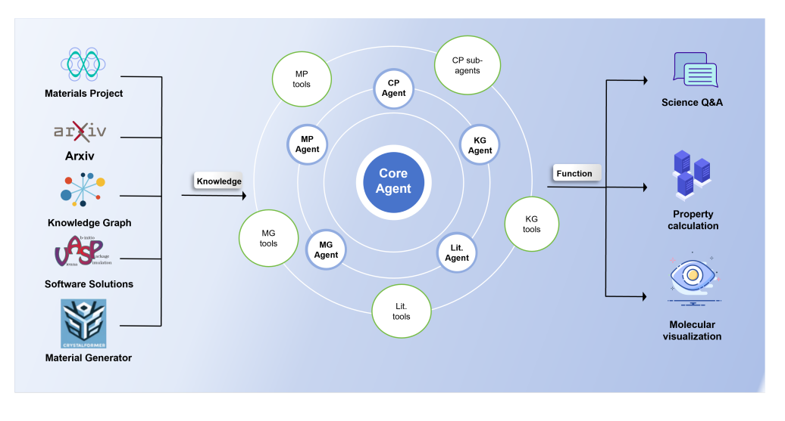
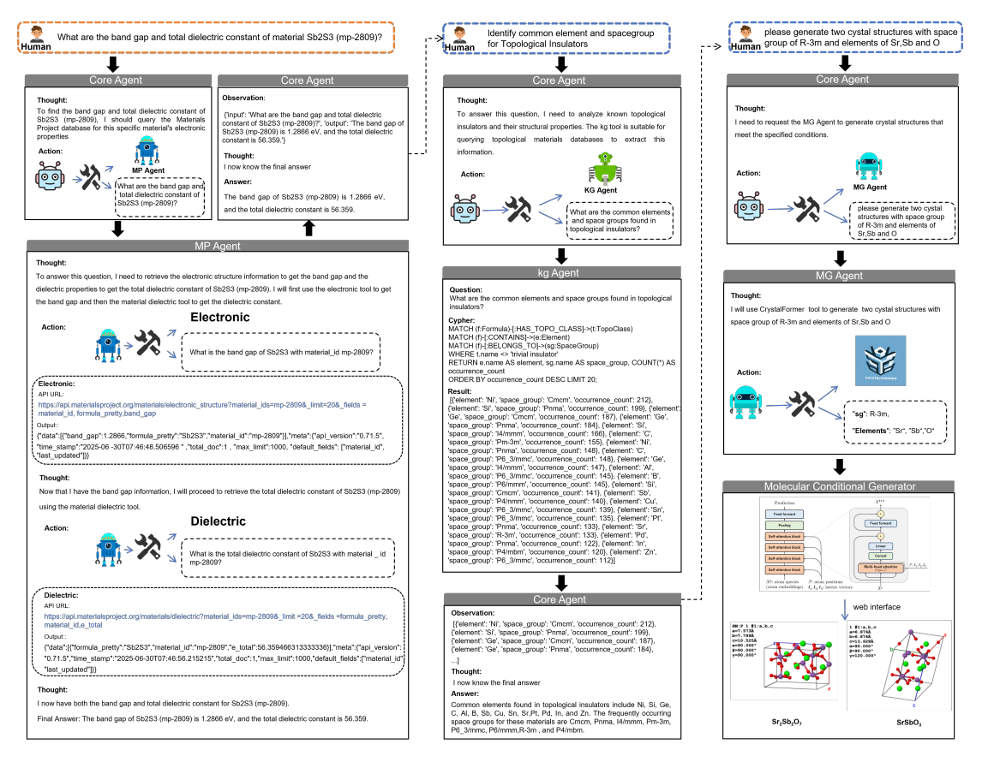
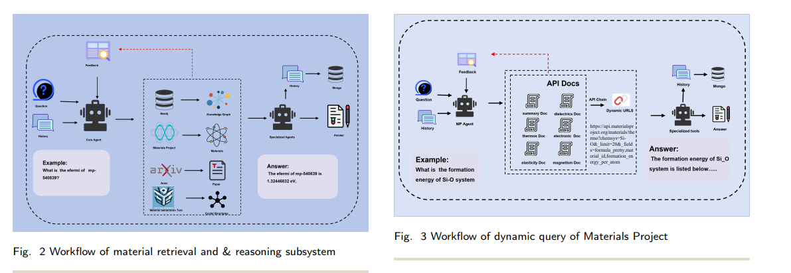
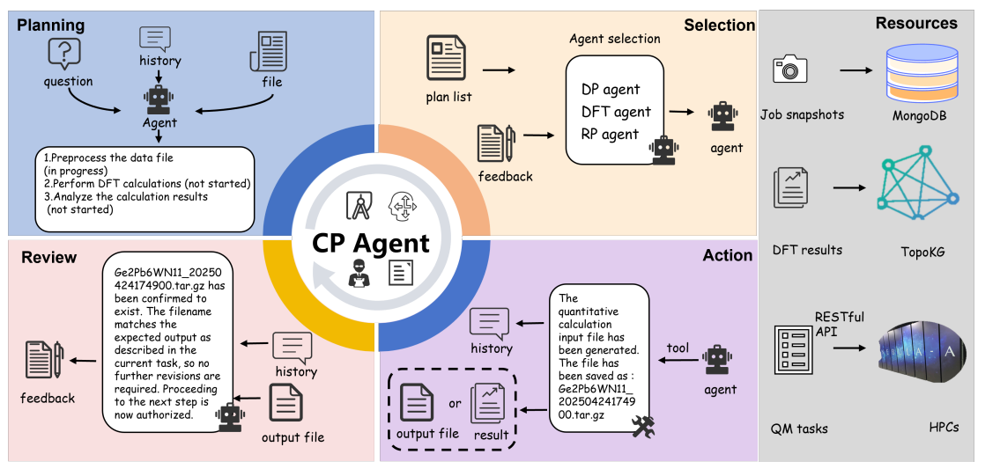
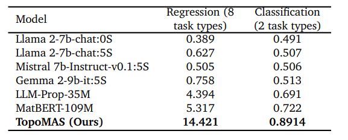
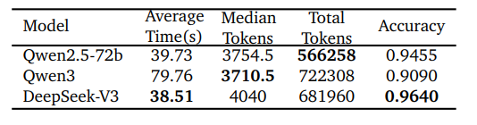
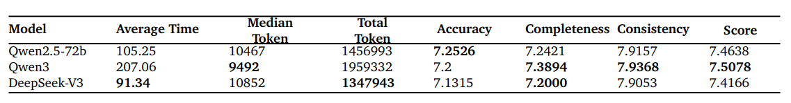

# TopoMAS: Large Language Model Driven Topological Materials Multiagent System
[https://arxiv.org/abs/2507.04053](https://arxiv.org/abs/2507.04053)

（まとめ @n-kats）

著者
* Baohua Zhang
* Xin Li
* Huangchao Xu
* Zhong Jin
* Quansheng Wu
* Ce Li

中国科学院コンピュータネットワーク情報センター、中国鉱業大学、中国科学院物理学研究所 の人たち。
（中国科学院は、世界的なランキングに上位に入る研究機関）

# どんなもの？
固体物理学のトポロジカル物性の分野向けのLLMベースのマルチエージェントシステムTopoMAS（Topological materials Multi-Agent System）を作成。
（トポロジカル物性を持つ物体は、物体の境界と内部で特性が異なり、独特の性質を持つ物体らしい。位相幾何学的な値を使ってその特性が分析される）

このシステムを専門家が使って、SrSbO3のトポロジカル物性の特定を行った。

# 先行研究と比べてどこがすごい？
従来の研究では、第一原理的な予測をしてその計算検証を行うのが一般的。これだと、大量の計算やスクリーニングが必要なだけでなく、異なる分野の専門家同士の連携が必要で、サイロ化・コミュニケーションギャップが発生しやすい。

* やや小型のモデル（QWEN2.5-72Bくらい）を使ったマルチエージェントシステムを構築
* エンドツーエンドで自動研究
  * 材料の取得・推論、密度汎関数理論（DFT）計算、結果解析
  * 様々なソースを利用
  * 解析結果をナレッジグラフに保存
  * ...

が特徴。

固体物理学の分野では、以前からNNをつかった研究は多く、結晶構造を推測するモデル（ConCDVAE）などがある。
マルチエージェントの研究システムとしては、
* Darwin1.5
* Eunomia(化学）
* MatAgent,MatPilot ・・・GNNを使ったもの
* Prim
などがある。

# 技術や手法の肝は？
## 概要
* コアエージェント
* 専門タスク実行レイヤー
* 専門サブエージェント・ツール
の3層構造。

例:

人間↔️コアエージェント↔️各種エージェント↔️ツールのようなのやり取りで、物質の取得・推論、属性計算を行う。

## データソース
* TopoKG
  * トポロジカル物性に関するナレッジグラフ
  * 28000物質、37種のノードタイプ、24関係カテゴリ
  * 著者らの前作（TopoChat）で作成
* arXiv
* 論文
  * リアルタイムに情報更新される
* materils project database
  * 物質の標準的な結晶構造と基本的な属性を持ったデータベース
* 物質生成モデル
  * Conv-CDVAE,CrystalFormerを利用
* 第一原理計算ソフトウェア

## 物質取得・推論のエージェント
* MP Agent
  * Materials Project から物質の情報を取得
  * 物質概要・熱力学的属性取得・弾性特性・誘電特性・電子構造・磁気特性 を取得（langchainのtoolとして実装）
* Lit Agent(literatureのlit)
  * arXivから情報収集
  * Leiden community検出を使って、構造化
* KG Agent
  * TopoKGから情報収集
  * （複雑になりうる）検索クエリを生成して、検索
  * 2段階で生成
    1. 事前準備した50パターンのものから適当なテンプレートを選ぶ
    1. コンテキストとテンプレートを使って生成
* MG Agent(materials generation)
  * Conv-CDVAE,CrystalFormerを使って、物質の生成（状況に合わせて使い分ける？）
  * Con-CDVAEは、条件に基づき結晶構造を生成する
  * CrystalFormerは、対称性を考慮して結晶構造を生成する

コアエージェントはReActエージェントとして実装され、上記のエージェントがツールとして登録されている。
MPエージェントには更に子要素のツールがあり、それもReActエージェントとして実装されている。

## 物性計算エージェント
DFT(密度汎関数）計算や位相不変量の計算を行うエージェント。以下のようなループを回して推論する。

1. Planning
1. Selection（ツール選択とツール用の形式に変換）
  * DP(DaData Processing) Agent
    * VASP（VASPはDFT計算のソフトウェア）の入力形式に変換
  * DFT Agent
    * HPCサーバーに計算ジョブをリクエストするためのパラメータ生成
  * RP(Results Processing) Agent
    * DFTの結果をSymTopoで位相不変量の計算をするための形式に変換
1. Action
  * Selectionで選択されたツールを実行 
1. Review
  * Planngingを更新するために反省を行う

# どうやって有効だと検証した？
## LLM4Mat Bench
物性に関する8種の回帰タスクと、2種の分類タスクを含むベンチマーク。
QWEN2.5-72Bを利用。

## TopoQA
110問のQA問題集。空間群・結晶構造・対称性・バンドギャップ・（トポロジカルな）分類の問題。

特にDeepSeek-V3が良い結果を出している。（意外とQWEN3が微妙）

## TopoOQ
オープンエンドな質問集。100問。物質のレコメンデーション・物性解析・研究トレンドなどの問題。

# 議論はある？
* 多様なソースをもとに動くエージェントシステムを構築した
* query-resoning-calculation-updateのワークフローを回す
* SrSbO3の研究に使えた

# 次に読むべき論文は？
* [TopoChat](https://arxiv.org/abs/2409.13732v1)