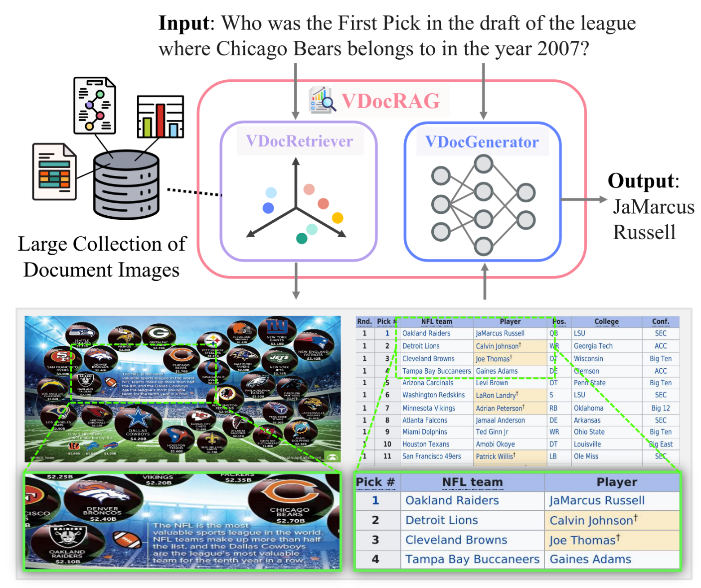
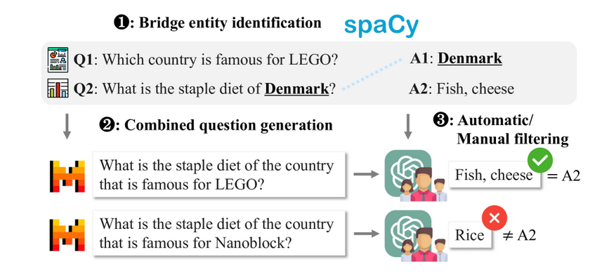
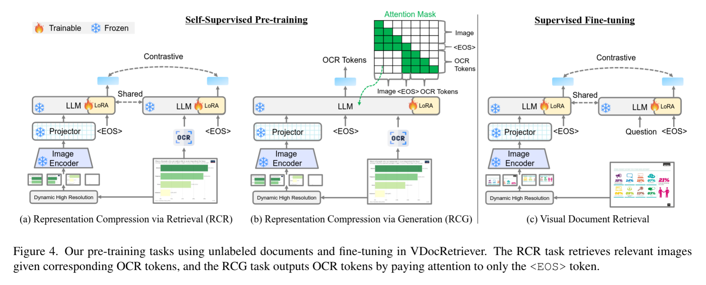
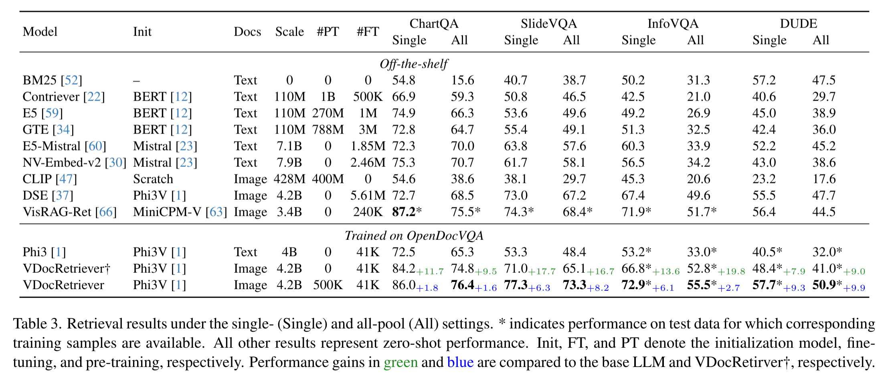
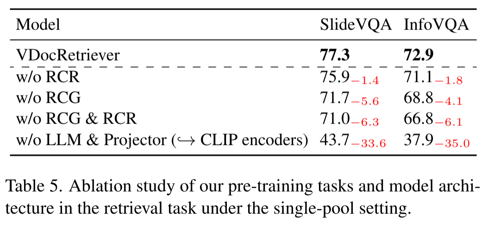

# VDocRAG: Retrieval-Augmented Generation over Visually-Rich Documents

CVPR 2025

Ryota Tanaka(1,2), Taichi Iki(1), Taku Hasegawa(1), Kyosuke Nishida(1), Kuniko Saito(1), Jun Suzuki(2),
(1): NTT Human Informatics Laboratories, NTT Corporation, (2): Tohoku University

https://vdocrag.github.io/
http://arxiv.org/abs/2504.09795

## どんなもの？
- リッチな画像からなる文書 (ポスター、スライドなど) を直接参照して RAG できるモデルを作った

## 先行研究と比べてどこがすごい？

- よく使用される RAG はテキストベースが多い
- 画像を扱うものも OCR ベースなので視覚的な情報が欠落する

## 技術や手法のキモはどこ？

### データセット

OpenDocVQA というデータセットを作った。

画像を検索しないと質問に回答できないようなタスクになっている。
「この画像のタイトルは？」のような質問と画像がセット前提のものを排除している。

さらに、複数の画像、文書の情報を参照しないと答えられないような質問も含む。
これは LLM 等をつかって半自動的に生成している。

さらに、質問との単語的な類似はしているものの、回答はできないような画像・テキストセットも含むようにする。(Negative mining)

### モデル

関連文書を検索するための VDocRetriever と、回答を生成するための VDocGenerator という2つからなる。

### VDocRetriever

- 画像を 336x336 のパッチにバラした上で Encoder、MLP に通した上で LLM に入力する。EOS トークンという特別なトークンの結果をこの画像の埋め込みとして利用
- 質問も同様に LLM に入力して埋め込みを得る。
- 埋め込みの内積で関連度を計算し、上位の文書を取得する。

### VDocGenerator

- 質問文と関連の画像複数を受け取って回答する

### 事前学習

- RCR (Representation Compression via Retrieval)
  - LLM を画像の RAG 用に適応させるための事前学習を行う。
  - 画像から OCR して取得したテキストと画像自体のペアの類似度が高くなるように訓練する。
- RCG (Representation Compression via Generation)
  - 画像から OCR テキストを予測する
  - ただし、EOS トークン以降の予測は画像を参照できないようにマスクしている。
    結果として、EOS トークンに画像の情報を全て埋め込むように学習される。

## どうやって有効だと検証した？

### Abration Pretrain の重要度

## 議論はある？

## 次に読むべき論文は？
