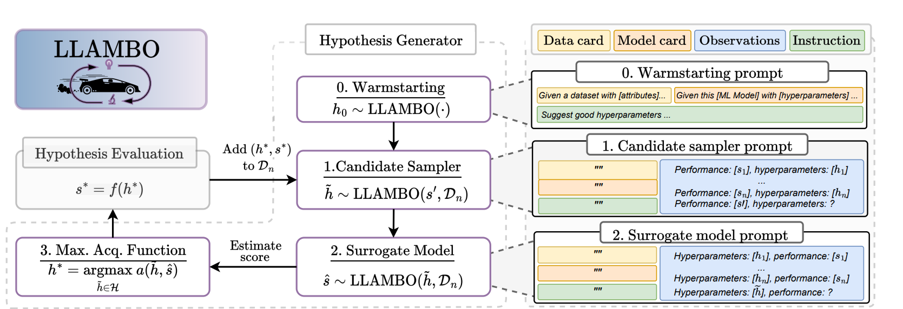
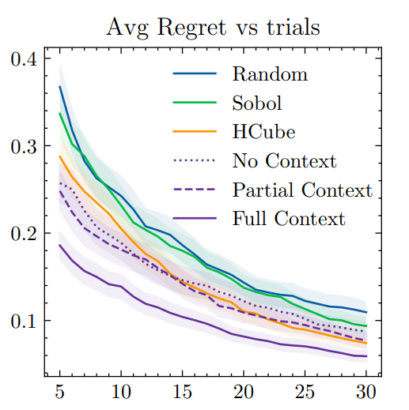
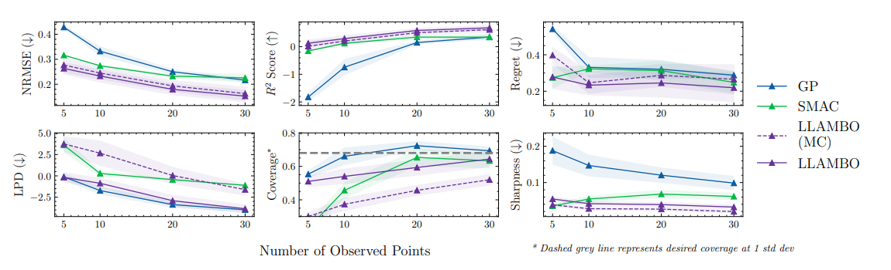
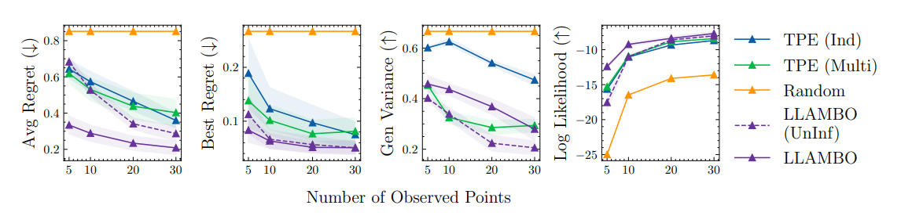
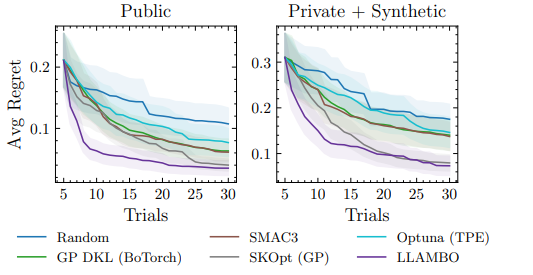

# Large Language Models to Enhance Bayesian Optimization
[https://arxiv.org/abs/2402.03921](https://arxiv.org/abs/2402.03921)

（まとめ @n-kats）

著者
* Tennison Liu
* Nicolás Astorga
* Nabeel Seedat
* Mihaela van der Schaar

ケンブリッジ大学のDAMTP（応用数学の研究所）の人たち


# どんなもの？
LLM（in context learning）を使ってベイズ最適化を行う研究。

optuna×LLMの手法を調べていたら出てきた。（プロンプトチューニング自動化を期待して調べていたが、これはそういうことが目標ではない（プロンプトを調整したらできなくもない））

# 先行研究と比べてどこがすごい？
LLMでベイズ最適化を行う研究はあったが、サロゲート関数の箇所を中心に行うものが多かった。
この研究では、ベイズ最適化の全体をLLMで行うことを目指している。

# 技術や手法の肝は？
## ベイズ最適化（BO）
問題設定は、ブラックボックス関数の最適化。つまり、具体的な内容がわからない関数の最適化を行う。

model-based BOは、このブラックボックス関数を近似するサロゲート関数を学習し、そのサロゲート関数を使って最適化を行う。（サロゲート＝代理）

(model-free BOは、グリッドサーチや遺伝的アルゴリズムなど)

## 全体像



* f : ブラックボックス関数（評価など）
* h*: サロゲート関数で最適化したパラメータ
* s*: h\*を実際に使って計算した結果
* D_n: パラメータと結果のペアの集合（データセット）・・・in context learningに使う

0. Warmstarting: 最初のn組のパラメータ作成
1. Candidate Sampler: サロゲート関数を学習するためのパラメータを生成（スコアがs'になるパラメータを予想させる）
2. Surrogate Model: サロゲート関数で結果を予想
3. Max.Acq.Function: サロゲート関数の結果をもとに、次に評価するパラメータを決定


## Warmstarting
zero-shotで（例を与えず）パラメータを生成する。

例はそのそもこの段階では無いので、以下の統計値を与える。
* 数量（サンプル数・特徴量数）
* 特徴量のタイプ（分類値か連続値か）
* 問題設定
* 各特徴量の分布、特徴量間の相関（Fullのみ）

この情報の効果は以下の図の通り。（5例Warmstartingで作って、以降はLLAMBOで最適化する）



何も与えない（No Context）とPartial Contextはそんなに変わらないが、統計値を与えたFull Contextが圧倒的に良い結果を出している。

## Surrogate Model
サロゲート関数は、LLMのin-context learningを使って実現する。（以下のようなプロンプトを差し込む）

```
max depth is 15, min samples split is 0.5,..., accuracy is 0.9
...
```

単純にこれだけでスコアを予測させるのではなく、以下の工夫をする。
* 予測結果と確信度を出力させる
* 複数回予測させて、確信度で重み付けした平均・分散を出力させる（モンテカルロ方的なアプローチ）
* ICLの例をシャッフルする



（LLAMBO(MC)はICLのシャッフル無しの意味）

事例を増やすと改善が見られるのも変わるし、他手法を上回る結果にもなっている。あと、シャッフルの効果が地味にある。

プロンプトには、特徴量の分布や相関は与えていない様子。

## Candidate Sampler
効率的にサロゲート関数を学習するためにうまいことパラメータをサンプリングする。

具体的には、スコアの目標値を決めて、それになりそうなパラメータを生成させる。

目標値のスコアは、

$$ s' = s_{\text{min}} + \alpha (s_{\text{max}} - s_{\text{min}}) $$

でのように決める（これまでの最小値より若干小さい値を目指す）



スコアと分散を表示したもの。LLAMBO(UnInf)はタスクの情報を除いたバージョン。

LLAMBOのスコアが速いことが確認できる。分散はランダムサンプリングが最も大きいが、LLAMBOも決して小さいわけではない（適度にばれしてサンプリングできている）

# どうやって有効だと検証した？
BaysMarkというベンチマークとプラーベートなデータを使って実験（BaysMarkは25種類のタスクを選択）



LLAMBOの圧倒的勝利。

# 議論はある？
この手法は、LLMのファインチューニングを行わず（gpt3.5-turbo）に達成できているのも良いポイント。

注意点としては、使ったデータセットの特徴量の種類が少ないから上手く行った疑惑がある。

* 公式実装・・・[https://github.com/vanderschaarlab/LLAMBO](https://github.com/vanderschaarlab/LLAMBO)
* OptunaHub版・・・[https://hub.optuna.org/samplers/llambo](https://hub.optuna.org/samplers/llambo)

# 次に読むべき論文は？
* [TopoChat](https://arxiv.org/abs/2409.13732v1)