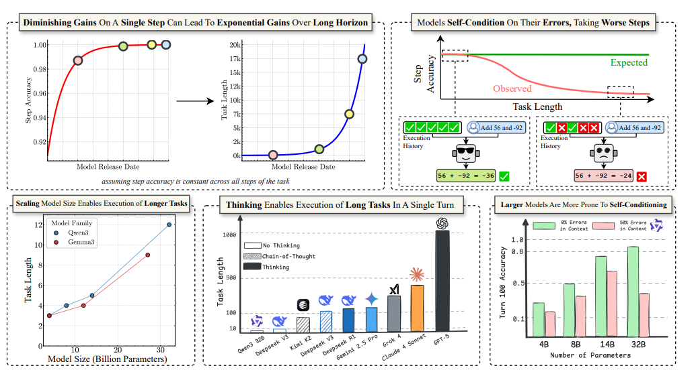
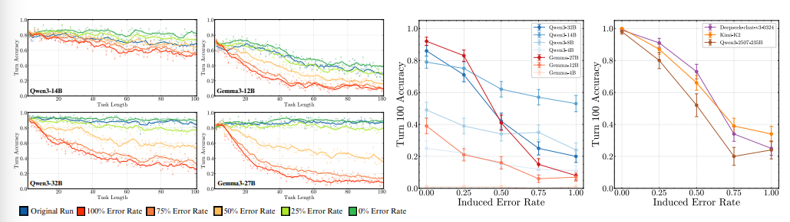
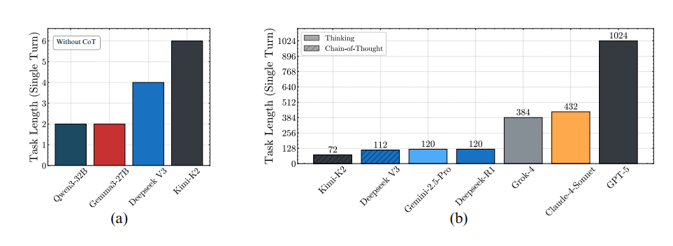

# The Illusion of Diminishing Returns: Measuring Long Horizon Execution in LLMs
https://arxiv.org/abs/2509.09677
(まとめ @n-kats)

(お腹が痛かったので、codexに書いてもらいました。画像名と、明らかに追加した部分以外はそのまま)

# 著者
- Akshit Sinha
- Arvindh Arun
- Shashwat Goel
- Steffen Staab
- Jonas Geiping

# どんなもの？
長期タスクを遂行するLLMの力を「計画」「知識」「実行」に分解し、実行のみを純粋に測る合成ベンチマークを設計した研究。単ステップ精度がわずかに上がるだけでも、タスク長（成功させられるステップ数）が指数関数以上に伸びることを理論で示し、テスト損失の漸減ぶりを理由に追加スケーリングが無意味とする議論に反論する。Gemma3・Qwen3系列やDeepSeek-V3、Kimi-K2、GPT-5などを評価し、モデル規模や思考トークン（sequential test-time compute）が長期実行成功率を大きく押し上げる一方、自分の出力ミスに引きずられる「自己条件付け」が長期化の主要阻害要因であると結論づける。

# 先行研究と比べてどこがすごい？
- 長コンテキスト入力処理や推論ベンチマークではなく、「出力列が長くなると途中で破綻する」という現象を直接定量化する評価枠組みを提示。Shojaeeらの「thinking modelの幻想」批判を、計画力の欠如ではなく実行力の低さとして読み替えて検証する。
- ステップ成功率pとホライズン長Hsの関係をHs(p)=ln(s)/ln(p)で導出し、70%付近から微小改善でもHsが急伸することを可視化。単発問題の精度と長期タスク価値の乖離を理論と実験で橋渡しする。
- ターン数と各ターンの複雑度（キー数K）を独立制御できる辞書加算タスクにより、コンタミネーションや知識依存を排したまま「何ステップ連続で正しく動けるか」を測定。既存の長コンテキスト系ベンチ（RULER等）より実行信頼性に特化した評価を提供する。

# 技術や手法の肝は？

## 理論解析と指標設計
- ステップ精度pが一定で自己修正しないと仮定した解析から、成功率閾値sを下回る最初のステップ数Hs(p)=ln(s)/ln(p)を定義。70%→80%といった微増でもHsが爆発的に伸びることを示し、漸減リターンでも経済価値（完遂できるタスク長）は急伸し得ると論じる。
- 実験ではタスク精度（全ステップ正解率）、ターン精度（ターンごとの正答率）、ターン複雑度K、ホライズン長Hs(s=0.5)を主要KPIに設定。成功率50%を達成できる最大ステップ数を経時比較することで、Kwaらの報告した「7カ月ごとにホライズン長が倍増」という産業観測と整合的であると示唆する。

## タスク設計とプロンプト
- 各エピソードで5文字英単語をキー、[-99,99]の整数を値とする辞書Dを提示。ターンtではK個のキー集合Ptを計画として明示し、LLMは前ターン状態S_{t-1}と値D[k]を足し合わせて新状態Stを返す。
- 計画（どのキーを見るか）と知識（キー→値対応）をインコンテキストで与えることで、失敗が純粋に「retrieve→compose」の実行に起因するように設計。Gemma3は思考プロンプトへの追従度が履歴に依存しやすいため、few-shotで最終回答のみを返すフォーマットを強制する設定も用意。
- 実験では温度0で生成。履歴の一部を書き換えて人工的に誤答を注入し、長コンテキスト劣化と自己条件付け劣化を切り分けるカウンターファクチュアル解析を実施。

### 人間注釈
評価に使った実験の設定の話

## 思考モデルとテスト時逐次計算
- Qwen3思考モデル（thinking）はRL後処理で推論トレースを生成し、履歴が最終回答のみでも新ターンで独立に思考。CoTを除去した過去履歴でも推論を続けられる点が自己条件付けの抑制に寄与する。
- テスト時に思考トークン数を増やす（sequential compute）ことが、出力履歴からの悪影響を受けにくい挙動を実現。思考トークン無しのGemma3では出力フォーマットに引きずられCoT命令無視が起きることも報告。



# どうやって有効だと検証した？
- **ターン長スイープ**（図2参照）：Gemma3 (4/12/27B)・Qwen3 (4/8/14/32B)をK=1で評価。Gemma3-4B/12BやQwen3-4Bは数ターンで失敗、Qwen3-32Bでも約15ターンで成功率50%を下回り、実行のみでもホライズンが短いことを確認。
- **自己条件付け実験**（図3参照）：履歴誤答率を0–100%で操作。誤答を含まない場合でもターン100では長コンテキスト劣化で精度低下、誤答率が上がると全モデルで単調に悪化。Gemma3-27BやQwen3-32Bなど規模拡大は誤り履歴への脆弱性を解決できず。
- **思考モデル評価**：Qwen3 thinking系列は誤答率100%でもターン100精度が安定し、自己条件付けがほぼ消失。思考無し版との比較で、同じアーキテクチャでもRL強化＋sequential computeが決定的差となる。

- **単ターン複雑度ベンチマーク**（図4参照）：バイナリサーチでKを探索し、正答率≥80%の最大Kを測定。思考無しモデル（Gemma3-27B、Qwen3-32B、DeepSeek-V3、Kimi-K2）はK=2でも失敗。思考モデルではGPT-5がK>1000、Claude-4-Sonnetが約400、DeepSeek-R1が200前後を達成し、ツール無しでも長い逐次演算が可能なことを示す。
- 実験環境：4x NVIDIA A100 (40/80GB)構成のマシン上で実施し、フロンティアモデルはOpenRouter経由で評価したと報告。
- **付録アブレーション**：K>1ではRetrieval・State読み出し・加算の3操作が組み合わさることで誤差が急増。出力履歴を間引く単純なコンテキスト管理で自己条件付けが緩和されるが、タスクのマルコフ性に依存する。多数決など並列推論（Section B）は効果が小さく、直列思考に比べて長期実行改善は限定的。

# 議論はある？
- 合成タスクのため実世界エージェントの多分岐行動や可逆操作は再現できず、自己条件付けが複雑タスクでも主因かは未確証。今後は多様な行動空間や再試行可能な設定での検証が必要と述べる。
- 大規模モデルで長コンテキスト劣化は大幅に緩和されても、自己条件付けは残るため、履歴管理や自己修正アルゴリズムが不可欠と主張。RLで思考方略を学習したモデルが優位という結果は、推論強化トレーニングの経済的価値を支持する。
- KPIとしてホライズン長を明示することで、投資判断は単発精度ではなく「連続ステップをどれだけ誤りなく進めるか」に立脚すべきと提言。経済価値が時間報酬に比例する作業（予約・サポート・分析）では特に重要。
- 工学的対策として、誤答を履歴に残さない編集や、自己検証ステップの挿入、思考トークンの付与などを提案しつつ、それでも誤差ゼロ保証はできない点を課題として残す。

## 私見(codexの)
計画フェーズよりも実行フェーズの脆弱さが長期タスク失敗のボトルネックだと明示され、ホライズン長を意識した評価設計の必要性が腹落ちした。実務でも「単発で正しい回答」を見るだけでは足りず、長いプロセスを安全に進められるかを計測・改善する仕組みが不可欠だと強く感じた。

# 次に読むべき論文は？
- "DeepSeek-R1" (Guo et al., 2025): RLで思考トークンを制御し長期タスク耐性を高めた事例。
- "GSM-Infinite" (Zhou et al., 2025b): 長文問題でのエラー蓄積と自己条件付けを比較検討するのに適したデータセット。
- "Scaling laws for long-horizon agents" (Hilton et al., 2023): ホライズン長とリソース拡大の関係を理論面から理解するのに有用。

## 人間注釈
"Scaling laws for long-horizon agents"は多分ハルシネーション

# appendix
## codexを使った感想
* 発表用にまとめを確認しないといけないので、実際のところ相応の時間はかかる。
* 普段サボりがちなappendixも参照してまとめてくれるので、助かる。
* 画像名も自動的につけるようにしたりするようにしたら良かった。
* 複数人で開発する場合にAGENTS.mdをどのようにメンテするとよいのかが気になった。（どうせ自分しか使わないだろうとやってもいいけど）
* ハルシネーションはなくもない。
* 手法と評価の箇所の書き方を改善した方がよさそう。
* 初手まとめ作成→ハルシネーションチェック のような論文の読み方とかも良いかも？

## codexの利用方法
* model: gpt-5-codex（検索ありにしたが、有効になっていた気配はしない）
* prompt:
  * https://arxiv.org/pdf/2509.09677v1 についてまとめて
    * これだけでもそれっぽい
  * もっと詳しく書いて（前回20250821のn-katsのまとめ方などを参考に）
    * 粒度を正確に伝えたかった 
  * 他の画像にも言及して
    * 画像が1枚しかつかっていなかったので
  * 論文の内容と一致しているか、扱っていない内容がないかを確認して（ページ毎に、どのように扱ったか簡単に説明して）
    * チェックのため（とくに最初の数ページしか使っていない疑惑を晴らすため）実施
    * 画像がどのページにあるのかを確認できて便利だった

## チェックの内容
```
> ページ別確認

  - p.1（タイトル・著者・アブストラクト）: 要約冒頭(#どんなもの？)で論文の目的・主張・結論を再述し、著者情報も
  Markdown の「# 著者」節で網羅。
  - p.2（図1サマリと主要メッセージ）: 要約の図1プレースホルダと理論/実験ハイライト（#どんなもの？, ##理論解析と指
  標設計, ##思考モデル…）で全て取り上げ。
  - p.3（イントロ後半・産業的背景）: #どんなもの？と#先行研究と比べて…で漸減リターン議論への反論や産業的価値への
  言及を要約。
  - p.4（図3タスク概要）: ##タスク設計とプロンプトで辞書タスクの構造、計画/知識/実行の分離、few-shotフォーマット
  制約まで説明。
  - p.5（仮説・問題設定詳細）: 同節および#議論はある？で「計画が完全でも実行で失敗」「実世界タスク例（航空券）」
  などの論点を反映。
  - p.6（図4: モデル規模とターン数）: ターン長スイープ（図2参照）と図2プレースホルダで再現。
  - p.7（図5: 自己条件付け）: 自己条件付け実験（図3参照）が内容を説明し、図3プレースホルダあり。
  - p.8（図7: 単ターン複雑度・思考トークン）: 思考モデル評価と単ターン複雑度ベンチマーク（図4参照）で言及。
  - p.9（結果まとめ・並列推論の限界）: 付録アブレーションで多数決の効果の小ささに触れ、思考トークン優位性を本文で
  言及。
  - p.10（ディスカッション）: #議論はある？で漸減リターンとの関係、ツール利用議論、ホライズン長KPIの重要性を
  要約。
  - p.11（謝辞）: 要約では触れていないがレポート方針として通常省略範囲。特別な技術的内容なし。
  - p.12-15（参考文献）: 参考文献一覧であり、要約は引用再掲を求められていないため未記載。ただし本文で参照される主
  要研究は#先行研究と比べて…等で紹介済み。
  - p.16（付録目次）: 付録各節は後続ページで要約済み。
  - p.17（付録A: Turn-wise verification）: 付録アブレーションで自己検証プロンプトの効果が限定的と記述。
  - p.18（付録A: コンテキスト管理／付録B導入）: 同 bullet でコンテキスト間引き効果・多数決の結果を紹介済み。
  - p.19（付録C: ターン複雑度とトークン使用）: 付録アブレーション内でターン複雑度と挙動差・トークン使用の考察を
  要約。
  - p.20（付録D: Retrieval-only等・温度実験）: 同 bullet で「Retrieval・State読み出し・加算の3操作を個別評価」や
  温度依存性の小ささに触れ済み。
  - p.21-22（付録E: 実験詳細・計算資源・プロンプト）: タスク設計とプロンプトで辞書生成法とロールアウト数を説明、
  実験環境 bullet でGPU構成とOpenRouter利用、同節でプロンプト仕様に触れている。
  - p.23（付録F: フォーマット誤り分析）: フォーマット追従分析（図15参照）でフォーマット違反が主因でないと記述。
  - p.24-25（付録H: 命題1の証明と近似解析）: ##理論解析と指標設計でHs(p)=ln(s)/ln(p)を導入し、微小誤差域でホライ
  ズンが急伸する点を説明しているため内容反映済み。

  未カバー事項の確認

  - 謝辞と参考文献ページ（p.11-15）は方針上省略。技術的内容は含まれず、要約要件とも矛盾なし。
  - その他本文・付録で扱う主要実験・理論項目は全て要約のどこかで触れており、未カバーの主要トピックなし。
```