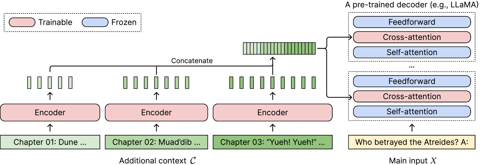
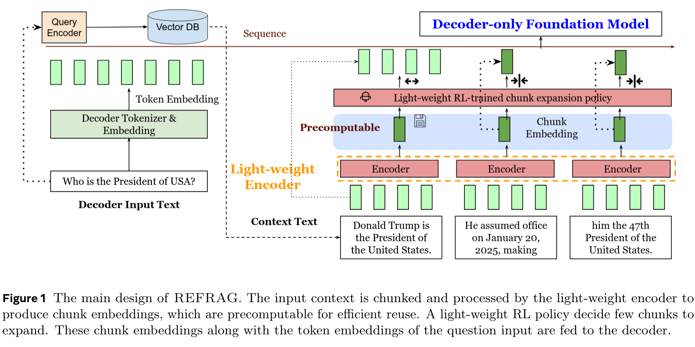
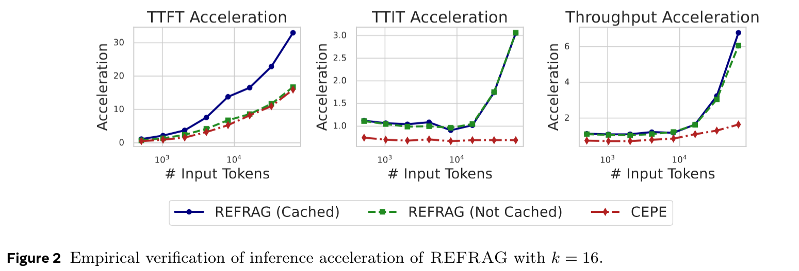
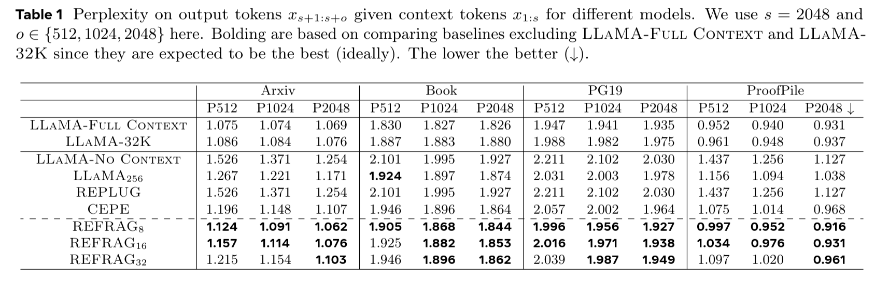
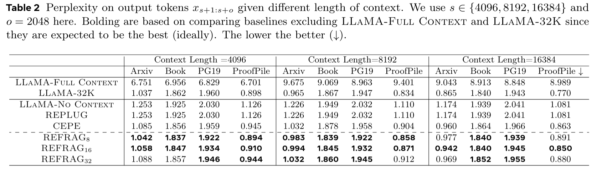

# REFRAG: Rethinking RAG based Decoding

Xiaoqiang Lin(1,2,∗), Aritra Ghosh1, Bryan Kian Hsiang Low(2), Anshumali Shrivastava(1,3), Vijai Mohan1 (1)

(1) Meta Superintelligence Labs, (2) National University of Singapore, (3) Rice University (∗) Work done at Meta

https://arxiv.org/abs/2509.01092v1

## どんなもの？
- 入力コンテキストを効率的に処理する RAG 手法
- LLM は Fine Tune は不要
- チャンク化した文書を事前処理で圧縮
- 処理性能 30 倍、コンテキストサイズ 1/16 にしつつ、精度は同等以上を達成。

## 先行研究と比べてどこがすごい？

RAG は質問に関連する大量の文書をコンテキストに入力したうえで回答を生成する。
既存の RAG は以下のような問題があると主張している。

- チャンクは質問とは無関係な情報や重複した情報を含むことが多い。それらにも LLM の計算リソースを使用してしまうのは非効率。
- 事前にチャンクを検索する際に、質問のクエリとの類似度などを使うが、回答の生成の際にはこれらの情報はあまり加味されない。
- 集められたチャンク間の関連性は通常低く、文脈もないが、LLM は通常の文章と同じように Attention を計算してしまう。

これらを改善するための既存手法もある (CEPE) が、こちらは LLM 内部にクロスアテンションを追加する必要があるなど LLM モデルの再学習が必要。

REFRAG は LLM には手を入れずにこれらの問題に対処する手法。

## 技術や手法のキモはどこ？

### アーキテクチャ

軽量なエンコーダモデル (Roberta など) とデコーダモデル (LLaMa など) を使う。

検索されたチャンクは通常は k 個のトークンになるが、それをエンコーダモデルを通すことで1つの圧縮されたトークンにする。

### Encoder

- 元のトークンからの生成結果と、エンコーダにより圧縮されたトークンの生成結果が一致するようにエンコーダを訓練する。
- 最初は1チャンクからはじめ、徐々に学習対象のチャンクを増やすカリキュラム学習を行う。
- 重要なチャンクはあえて圧縮しない、ということも行う。

## どうやって有効だと検証した？

- LLaMa-2 7B を使って評価

## 速度の向上

## Context が与えられたときの Perplexity

- LLaMa-Full ... Context と回答あわせて Perplexity を評価
- LLaMa-No ... 回答だけで Perplexity を評価
- LLaMa 32K ... コンテキスト長を 32K に拡張した LLaMa

## 議論はある？

私見

- 7B よりも大きなモデルの比較ができていない。速度面は以前有利だとは思うが精度の面でどうかは不明
- エンコーダの学習が必要だが、それがどれくらい汎用的なものか？
  - 日本語対応は別途必要そう

## 次に読むべき論文は？
- CEPE: Long-Context Language Modeling with Parallel Context Encoding
  - コンテキスト情報をクロスアテンションで取り込む手法
- LLMLingua-2: Data Distillation for Efficient and Faithful Task-Agnostic Prompt Compression
  - GPT を使ってトークンを選別することでコンテキストを圧縮する
  - REFRAG と組み合わせることも可能とのこと
