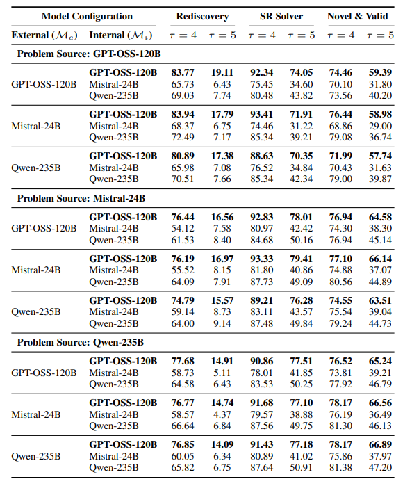

# AINSTEIN: ASSESSING THE FEASIBILITY OF AI-GENERATED APPROACHES TO RESEARCH PROBLEMS
https://arxiv.org/abs/2510.05432
(まとめ @n-kats)

著者
- Shambhavi Mishra
- Gaurav Sahu
- Marco Pedersoli
- Laurent Charlin
- Jose Dolz
- Christopher Pal

カナダの研究機関・大学のメンバーが参加

# どんなもの？
LLMに論文と同じテーマを考えさせて、解決策を作らせる。これによってLLMの性能を評価する（ファインチューニング・ネット検索とかは使わず）。


<details>
<summary>codex</summary>

- ICLR 2025 採択論文 1,214 本（Oral 213・Spotlight 379・Poster 622）を題材に、LLM のみで研究問題を再構築して解決策を提案できるかを測定する評価基盤 AINSTEIN を構築。
- Generalizer がアブストラクトから解答ヒントを排した問題文を抽出し、Solver が純粋なパラメトリック知識だけで解法を生成する 2 段構成を採用。
- 両段階とも内部批評（Mi）と外部批評（Me）の二重ループで最高 20 回まで反復し、査読サイクルを模した「生成→批評→改訂」を強制的に実行。
- LLM-as-a-judge と人手確認を組み合わせ、Success Rate・Rediscovery・Novel & Valid の 3 軸で推論と創造性のバランスを可視化。
</details>

# 先行研究と比べてどこがすごい？
既存研究は、研究支援ができるか、どこまでできるかを工夫して達成しようとしているが、この研究は、LLMの評価に特化している。

LLMと人間の評価により、研究支援に特化した評価を実施し、複数のモデルを比較。

モデルが発見のプロセスそのものを再現できるかを検証している。（理解と記憶を区別したいというモチベーション）

<details>
<summary>codex</summary>

- 既存評価（SciBench など）はリトリーバや事前知識に依存しがちだが、AINSTEIN は外部検索・微調整を完全排除し、LLM 単体の推論力と創造性を切り分け。
- 問題抽出品質を Fidelity・Information Loss・Ambiguity・Leakage の 4 指標で可視化し、欠損スコア d によって Generalizer の性能を統制。
- LLM-as-a-judge だけでなく、人間審査による ELO トーナメント、埋め込み類似度、可読性メトリクスまで使って結果の一貫性を多角的に検証。
- Generalizer と Solver の組み合わせを全面探索し、内部批評モデルの能力がボトルネックであることを定量的に示した点が新規性。

</details>

# 技術や手法の肝は？
## アーキテクチャ


* アブストラクトから問題文を生成する（評価データセット作成）
* 生成した問題文から解決策を生成する
* 両方に二重ループの批評を導入
 * 内側は軽量なアプローチを採用
 * 最大20×20くらいループ

（図は、solverだけ二重ループに見えるが、generalizerも同じ構成）

## 問題生成
論文のアブストラクトから、問題の要約文をLLMで生成。曖昧さや解法のリークがない範囲で、抽象度・忠実度を最大化するように指示して生成。

プロンプトは評価指標に対応するような指示がある程度で、意外とそのまま。

<details>
<summary>プロンプト（日本語訳）</summary>

```
System Role（システム役割）：
「あなたは20年間の研究経験を持つAI研究者です。研究のアブストラクトを読み、その論文が取り扱っている核心的な研究課題を特定することがあなたの任務です。以下の点に特に注意してください：

基本的な科学的チャレンジを忠実に保存すること。

特定の解法手法を示唆しないこと。

明確さと正確さを維持すること。」

User Prompt（ユーザ提示）：
「元の研究アブストラクト：
{abstract}
あなたのタスク：
そのアブストラクトに記された、核心的な研究課題（コアリサーチクエスチョン）を書いてください。」

Requirements（要件）：

Semantic Fidelity（意味的忠実性）：論文の本質的な研究チャレンジを正確に保存すること。

Information Preservation（情報保持）：重要な制約・洞察を保持すること。

Specificity（具体性）：あいまいさなく明確に記述すること。

Solution Blindness（解法盲性）：特定の解法手法を示唆・記述しないこと。

Output Format（出力形式）：

問題文（problem statement）を2〜3文で明確かつ簡潔に提供。

その問題文を導出した理由（justification）を付記。

問題文を <problem statement>…</problem statement> タグで囲む。

理由を <justification>…</justification> タグで囲む。
```
</details>

## 解決策生成

問題文から解決策を生成。こちらもプロンプトも評価項目を示すのがポイントで、ほかはあまり工夫していない。

<details>
<summary>プロンプト（日本語訳）</summary>

```
System Role：
「あなたはAI研究の専門家です。与えられた科学的問題に対して、実現可能で創造的な技術的アプローチを発案してください。」

User Prompt：
「問題文：
{problem}
あなたのタスク：
その問題を解決可能な、具体的で革新的な技術アプローチ、仕組み、あるいはアーキテクチャを提案してください。研究論文に書かれる “コアアイデア” のように、3〜5文で説明してください。」

Requirements（要件）：

Novelty & Creativity（新規性・創造性）：非自明・革新的な解を提案する。

Technical Feasibility（技術実現可能性）：論理的に整合・実装可能であること。

Completeness（完結性）：コアメソドロジーを理解できる十分な詳細を提供する。

Output Format：

提案した技術アプローチを3〜5文で記述。

その提案に対する簡単な理由（justification）を付記。

解法を <solution>…</solution> タグで囲む。

理由を <justification>…</justification> タグで囲む。
```
</details>

## 二重ループ


### 内部ループ
高速・低コストの方法で、生成→批評→改稿を繰り返す。

### 外部ループ
強力なモデルの忠実度の高いレビューを実施。


<details>
<summary>codex</summary>


- Generalizer/Solver の両方に内部批評 Mi（コスト軽）と外部批評 Me（高精度）の二重ループを実装し、内部 20 回・外部 20 回の反復で「生成→批評→改稿」を厳格に遂行。
- Generalizer では GPT-OSS-120B・Qwen-235B・Mistral-24B を組み合わせ、欠損スコア d が 2.5（大型モデル）〜3.5（Mistral）になるまで問題文を洗練。
- Solver も同三系統を全組合せで検証し、Mi=GPT-OSS-120B のときのみ成功率が 70% 超まで上昇するなど内部批評が支配的と判明。
- 評価系は GPT-OSS-120B ベースの LLM ジャッジに τ=4/5 の閾値を設け、再発見（元論文一致）と Novel & Valid（新規かつ妥当）を分離。
- 埋め込みは Qwen3-Embedding-8B を使用し、コサイン類似度や可読性指標（Flesch Ease -10 前後、Grade 23〜26）でテキストの密度と整合性を定量化。

</details>

# どうやって有効だと検証した？
## データセット
ICLR 2025から1214本を採用。内訳は以下の通り。


## モデル選定
訓練データにICLR 2025が含まれないように、知識カットオフが提出期限より前のモデルを選択。

具体的には、Qwen-235B、Mistral-24B、GPT-OSS-120Bを選択。

（arXivやopen reviewの内容とかで実はリークしていたという落ちはないよね？）

## 評価
GPT-OSS-120Bを採用。
1~5のスコアで評価。

### 問題生成の評価
* 元課題への忠実性
* 実装の詳細からの抽象化
* 曖昧さの欠如
* 問題の定式化品質

### 解決策の評価
* 一致率
* 成功率
* 新規性・有効性

### 人手評価
人間がペアワイズで評価。どちらが好ましいかでELOレーティングを算出。


### 他のテクスト分析
テキスト分析で評価を補う
* 意味の一貫性・・・各観点ごとに情報を抽出して、埋め込みベクトルのコサイン類似度・ユークリッド距離を計測（Qwen3-Embedding-8Bを採用）
* テキストの複雑さ・・・Flesch-Kincaid Grade Levelなど

## 結果
### 問題生成の評価


内部ループ・外部ループを3モデル（3×3組）で比較。

Qwen-235BとGPT-OSS-120Bが良く、Mistral-24Bが悪い。モデルの大きさ・賢さが反映された結果といえる。

外部ループの影響は小さい。


リークと情報欠損が相関しそうなイメージだが、実際は相関係数は小さい。

忠実性だけ大きいほど良いので、青い（良いモデル・簡単な問題で、２つの指標で同時に良くなりやすい）

### 解決策の評価
問題は単一モデル（9通り中、3通り）、解決策は3×3の9通り、合計27通りの組み合わせを試行。



（τは5段階スコアの値）

* Rediscovery ・・・ 一致率
* SR・・・成功率（一致しなくても良い）
* Novel & Valid ・・・新規性・有効性

全体的に、内部ループでGPT-OSS-120Bを使うとスコアが高い。

問題生成と同様に、外部ループの影響は小さい。

面白いことに、問題生成の良し悪しが解決策に大きく影響している。（GPT-OSS-120Bがよい）

Qwen-235Bの一致率が少ないが、別のアイデアで解決していて、悲観的に見る必要はない（他指標も見るべき）


### 人間評価のELOレーティング

問題生成＋解決策生成の組み合わせで、GPT-OSS-120BとMistral-24Bを使って2×2の4通りと人間の比較。


（人類はまだ負けていなかった（このモデルの中では））

GPT-OSS-120Bが問題生成で、Mistral-24Bが解決策生成の組み合わせが最も悪いのが意外。

### 定量的テキスト分析


意味の一貫性、テキストの複雑さを測定。

一貫性はモデル差が小さい

複雑さは単語数・音節数をもとに計算される。
* Flesch Reading Ease ・・・どれも平均がマイナスで、非常に難しい文章（60くらいが高校卒業レベル）。低いほど難しい。
* Flesch-Kincaid Grade Level ・・・どれも25前後で、大学院レベルを超える難易度（16くらいが大学院レベル）。高いほど難しい。

### 定性的テキスト分析


Qwen-8Bの埋め込みでKMeans++を実施し、11クラスに分類。UMAPで可視化。左は高頻度のキーワード。

多様な分野のデータをカバーしていることが確認できる。

<details>
<summary>codex</summary>


- ICLR 2025 採択論文 1,214 本を Generalizer に通し、抽出した問題文を Solver 全組合せ（3×3×3）に入力して計 32,778 通りの試行を実施。
- GPT-OSS-120B ジャッジは τ=4（やや寛容）と τ=5（厳格）の 2 段階でスコアリングし、Success Rate・Rediscovery・Novel & Valid を切り替えて比較。
- GPT-OSS-120B を Mi に使う構成は τ=5 でも成功率 70〜79%、Novel & Valid 57〜67% を達成するが、再発見率は 15〜20% と急落し「既存手法の完全再現」は困難。
- Mi=Qwen-235B/Mistral-24B は成功率が 40% 前後まで低下し、内部批評モデルの性能差がそのまま出力品質に反映されることを確認。
- ジャッジを Qwen-235B に差し替えても順位と指標差はほぼ不変で、Human-in-the-loop の ELO トーナメントでも GPT-OSS-120B 構成が高勝率。
- 解法テキストを Qwen-8B 埋め込みで KMeans++ し、11 クラスに分類（例: Diffusion Models, RL, Graph Learning）。UMAP でクラスターが分離し、多様なアーキタイプが創出されていることを確認。

</details>

# 議論はある？
LLMがそれだけで研究問題を解決できるかを評価するフレームワークAInsteinを提案した。

* 解決策の質がコア推論モデルの能力に強く依存する
* 完全一致できなくても代替案を生成するようなことも多い

とわかった。

今回はICLR 2025に限定しているが、他の分野や拒否論文でどうなるかは不明。

<details>
<summary>codex</summary>


- Mi が最重要で Me は二次的という結果は、LLM が自己批評で論理破綻を除去できるかが最終品質を左右し、外部評価だけでは補えないことを示唆。
- τ を厳しくすると再発見率が激減する一方で Novel & Valid はほぼ変動せず、LLM が「新規で妥当な代替案」を得意とする証左になっている。
- プロンプト設計の複雑度を「概念的活性化エネルギー」と呼び、一定以上の条件付けがないと推論能力が発揮されない閾値現象を報告。
- 評価系が LLM ジャッジ中心であるため、バイアスや幻影一致の可能性が残る。人手確認は部分的で、完全な再現性保証にはさらなる検証が必要。
- 問題抽出ステップの欠損スコアは高相関（情報欠落と曖昧さが d と強く結びつく）で、Generalizer の改善余地が残る。

</details>

## 私見
これはAIを評価する研究だが、どこかで人間が評価される側になりそう。「AI超えの論文」みたいなフレーズが現れそう。

リークがないようにと気をつけているが、漏れていてもおかしくなさそう。とはいえ、フレームワークとしては良い。

<details>
<summary>codex</summary>

- LLM 自発の再発見は限定的だが、Novel & Valid の高さは「既存知識を活用した創造的提案」の芽を示す。実際に採用するにはリスク評価と実験計画の自動生成が鍵。
- Mi 依存はエージェント設計で重要な示唆。研究支援エージェントにも自己批評モジュールを組み込んで回帰的に検証する必要がある。
- 現状の評価は文章レベルで止まっているため、今後はコード生成・計算資源見積り・実験プロトコルを含む多段評価へ拡張すると実務適用が進みそう。
- データセットが ICLR 採択論文に偏っており、拒否論文や別領域に拡張した際の性能やバイアスを検証する価値が高い。

</details>

# 次に読むべき論文は？
- [https://arxiv.org/abs/2505.03418](https://arxiv.org/abs/2505.03418) (Da Zheng et al., 2025)  
  LLMで複雑な問題を解くための手法のサーベイ
<details>
<summary>codex</summary>

- Wei et al., 2022: Emergent abilities を論じる代表作で、モデルスケールと閾値現象の関係を補足的に理解できる。
- Romera-Paredes et al., 2024: 数学分野での自動発見フレームワークと比較し、領域特化学習と汎用 LLM の差異を把握。
- Schaeffer et al., 2023: 測定手法が「出現」に与える影響を議論しており、AINSTEIN の評価設計を批判的に見直す材料になる。
- Zheng et al., 2025: Retrieval 強化型問題解決のサーベイで、外部知識導入時の改善幅と AINSTEIN の制限付き設定を対比できる。

</details>