# Detect Anything via Next Point Prediction

Qing Jiang, Junan Huo, Xingyu Chen, Yuda Xiong, Zhaoyang Zeng, Yihao Chen, Tianhe Ren, Junzhi Yu, Lei Zhang

International Digital Economy Academy (IDEA)

https://arxiv.org/abs/2510.12798

## どんなもの？
- 物体検出タスクができる 3B スケールのマルチモーダル LLM (MLLM)
- 従来の MLLM が苦手とする回帰タスクをアーキテクチャの工夫で克服
- Zero-shot で COCO, LVIS などのベンチマークで回帰ベースモデル (DINO など) に匹敵する精度を達成
- 物体検出以外にも、Visual Prompting、レイアウト認識、OCR、キーポイント検出などのタスクにも応用できる

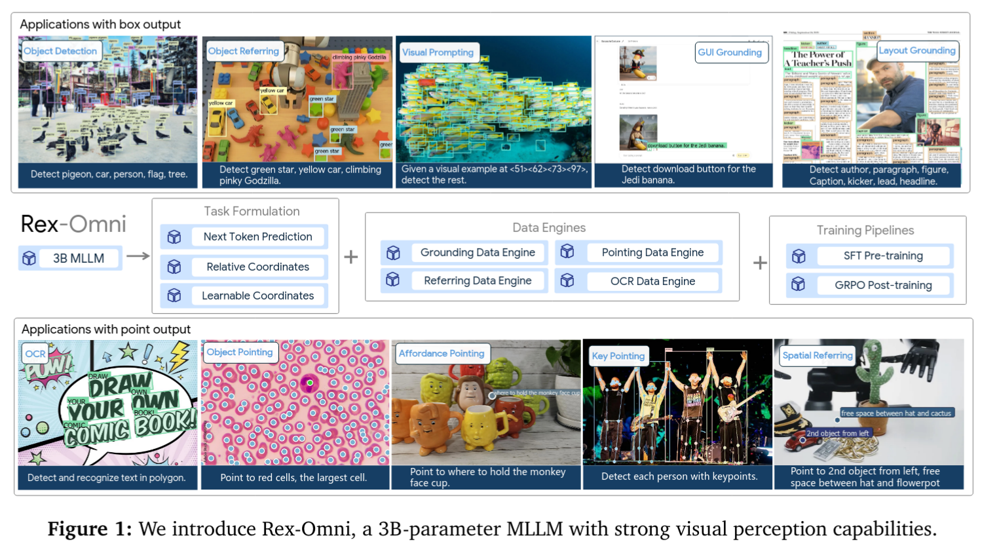

## 先行研究と比べてどこがすごい？

- Faster R-CNN や DETR などの物体検出は決められたカテゴリの検出しかできない、closed set な検出である。
- Grounding DINO、DINO-X などのような CLIP や BERT などを使った open set な検出もある。これらは効率的ではあるものの、テキストの理解力は限定的で、複雑なクエリには対応できない。
- Qwen2.5-VL や InternVL3 などマルチモーダル LLM (MLLM) を使った検出が近年注目されているが、これらは回帰タスクがまだ苦手。Recall が低かったり、位置のズレが大きかったりする。

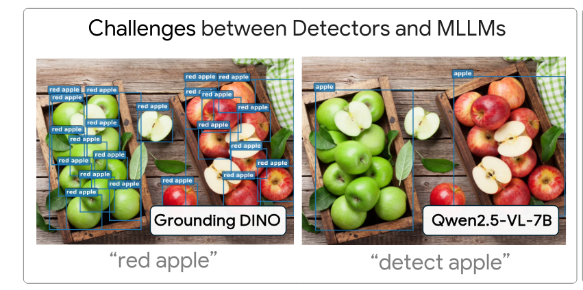

## 技術や手法のキモはどこ？

### アーキテクチャ

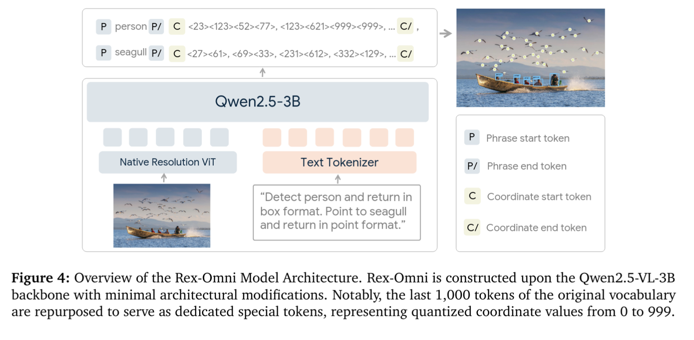

- 座標値はすべて 0-999 の整数として扱う。これにより枠の座標を4トークンで扱える。
  - Qwen などでは1文字1トークンという扱いのためセパレータも併せて15トークン必要だった。(123,456,789,012)
- 0-999 は画像のピクセル値ではなく、検出枠の相対的な位置を表す。
  - 例えば、画像の左上が (0,0)、右下が (999,999) となる。
- 出力の際も座標値とそうでないテキストを区別するための特別なトークンを用意する。

```
<|object_ref_start|>person<|object_ref_end|><|box_start|><12><42><512><612>,<24><66><172><623>, ...<|box_end|>, ... (more phrases)
```

### データセット

様々な物体検出、キーポイント検出などのオープンなデータセットを使って学習。

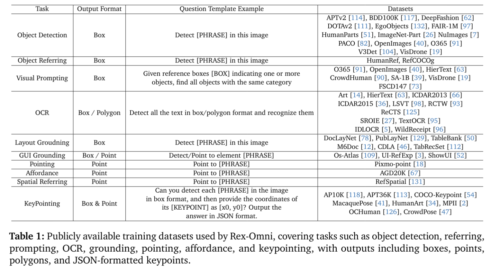

- LLM として学習するための QA セットにする
  - おそらく物体検出用のデータセットであれば「Q. 画像中の物体を検出して」のような質問文をつけるということか
- それ以外にもいろいろ情報を増やす
  - Qwen2.5-VL-7B を使ってキャプションを生成
  - SpaCy を使って名詞を抽出
  - Green Lemon のような文言から Green のような形容詞を取り除く。これは後段の DINO-X が誤検出するため
  - 単語を元に DINO-X で枠を生成する

### 訓練

- まず SFT
- その後 GRPO で微調整
  - 枠の精度 (F1score) を報酬として強化学習

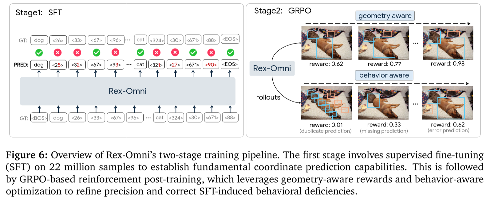

## どうやって有効だと検証した？

### COCO zero shot

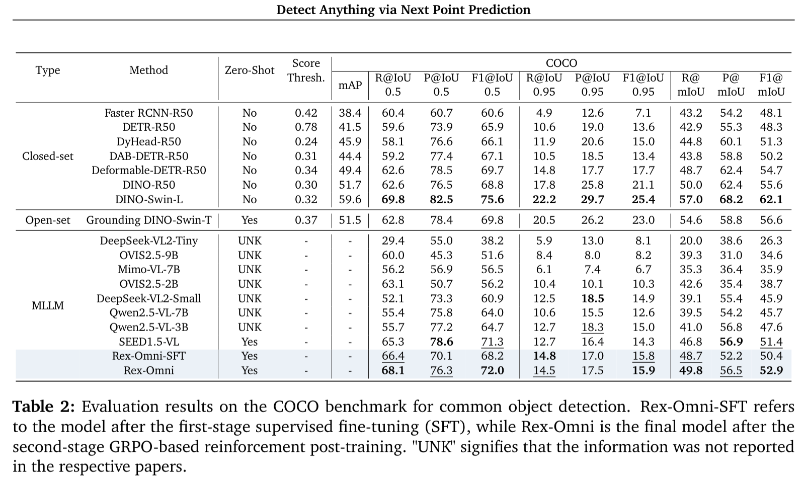

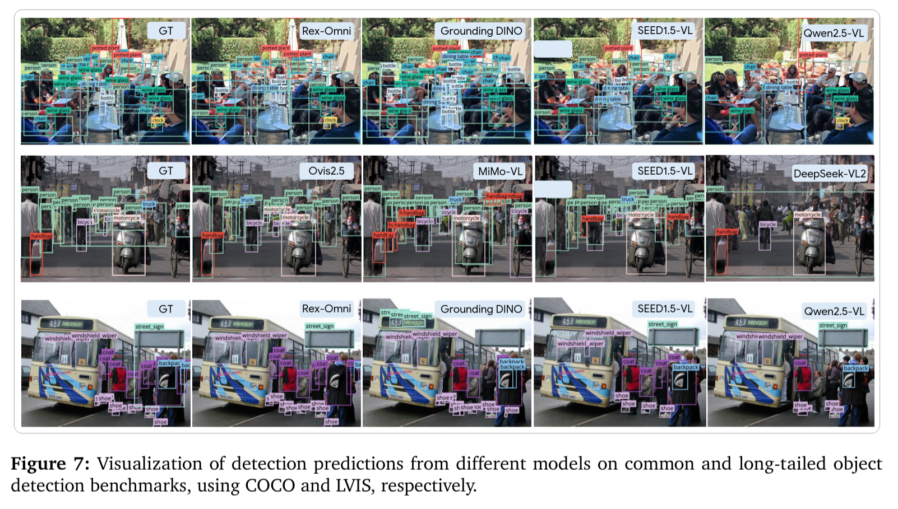

### LVIS zero shot

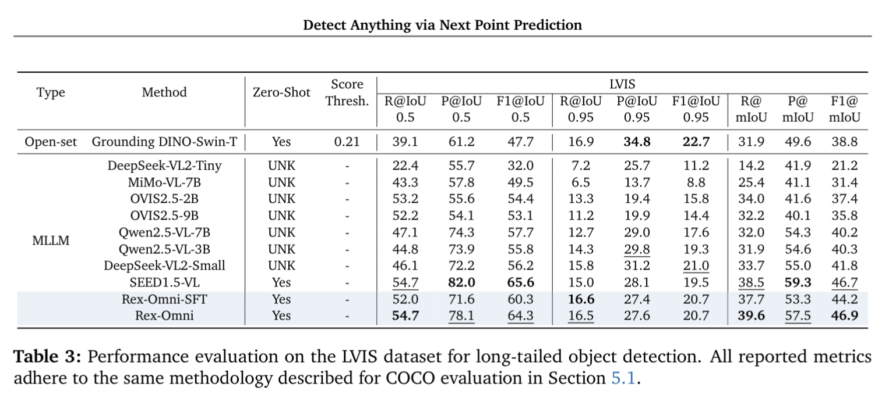

### その他

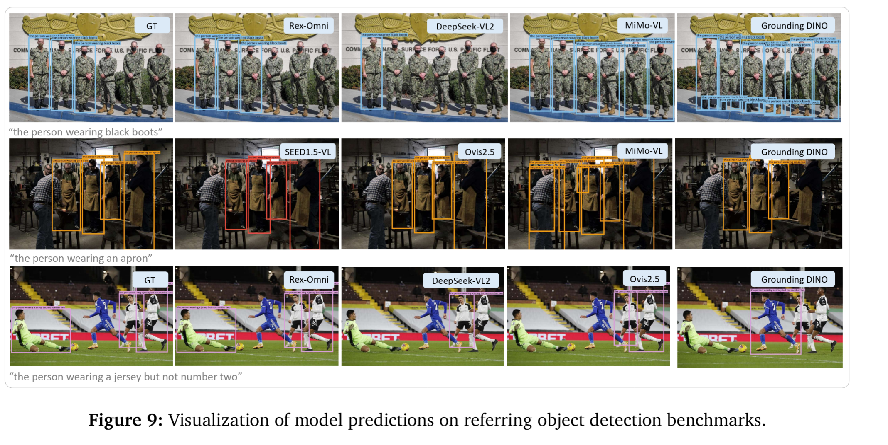
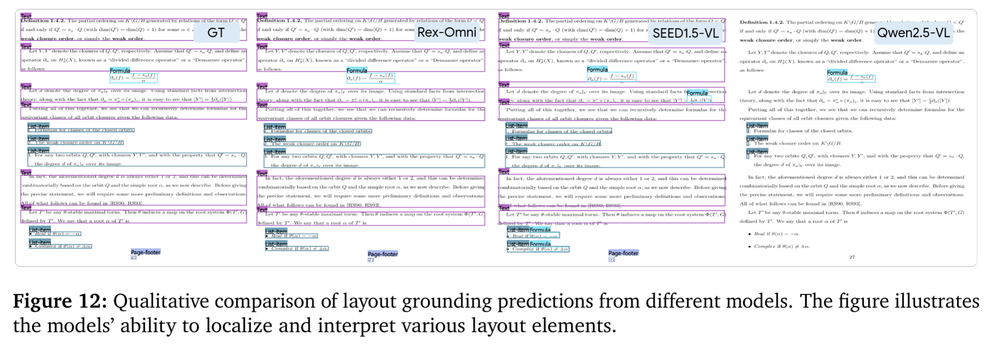
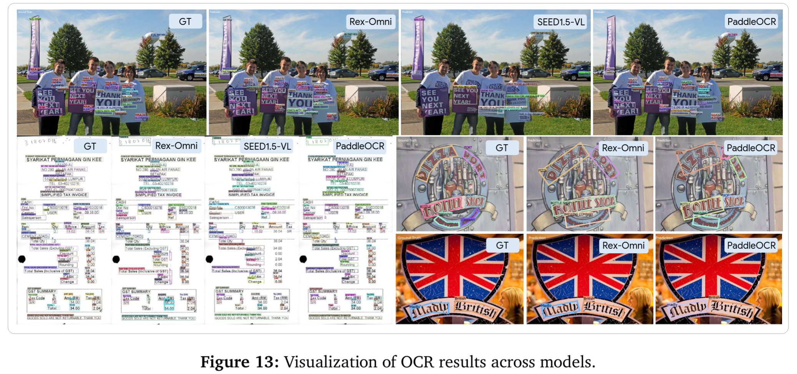

## 議論はある？

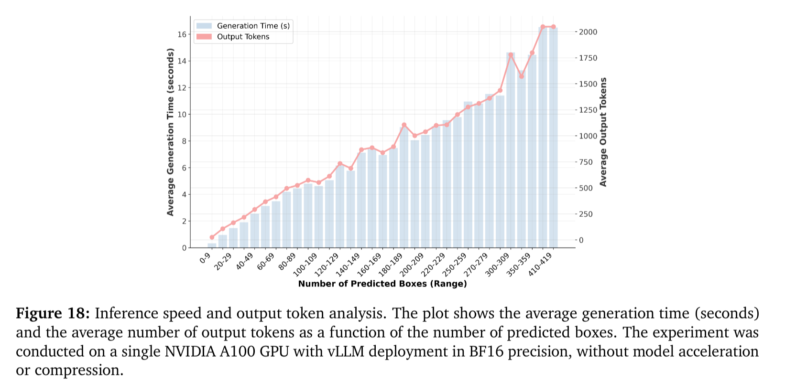

- 推論が DINO-X などの回帰モデルよりも遥かに遅い
  - 将来的には量子化や蒸留などで改善できる可能性もある

私見

- COCO はリークしていないか？
  - とはいえ使用していなさそうな LVIS というデータセットでもまぁまぁの精度は達成できている
- Qwen3-VL が出たのでそれとの比較が気になる

## 次に読むべき論文は？

- Qwen3-VL (論文はない...)
- Seed1.5-VL Technical Report (https://arxiv.org/abs/2505.07062)
