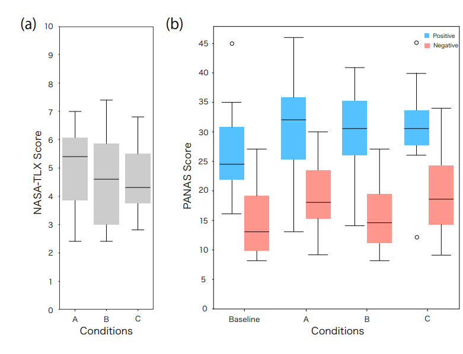
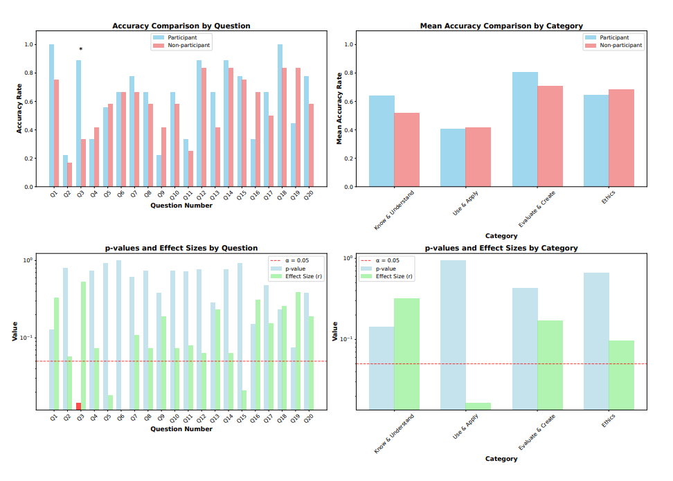

# Knowing Ourselves Through Others: Reflecting with AI in Digital Human Debates
https://arxiv.org/abs/2511.13046
(まとめ @n-kats)

## 著者
- Ichiro Matsuda
- Komichi Takezawa
- Katsuhito Muroi
- Kensuke Katori
- Ryosuke Hyakuta
- Jingjing Li
- Yoichi Ochiai

落合先生のグループの研究（百田さんだけMSの人）

# どんなもの？
デジタルヒューマンディベート（DHD）というLLMを使ったディベートの新しい形を提案。

DHDでは、人間が議論をするのではなく、議論をするAIエージェントを作成する。

9人の中学生・高校生に取り組ませた結果、自分を模したLLMエージェントなどの作成を通して、自己認識の学習を促すことになったことを紹介。

このような学習をReflecting with AIと呼んで、新しいリテラシーとして提唱。

codex draft

LLM を使って「自分そっくりの Digital Human（人格付きエージェント）」を設計し、その同士にディベートさせることで、人間側の自己理解や AI リテラシーがどう変化するかを探った HCI / AI 教育系の研究。
9 名の中高生が 3 チームに分かれ、プロンプトエンジニアリングと RAG を用いて自分たちの価値観や思考パターンを埋め込んだ Digital Human を作成し、自動ディベートを観察する。
ディベート前後のテスト・アンケート・インタビュー・ログ分析から、AI を「第三者としての他者」かつ「自分を写す鏡」として用いることで、AI の能力理解と自己省察の両方が深まることを示し、「Reflecting with AI」という新しい生成 AI リテラシーの枠組みを提案する。

# 先行研究と比べてどこがすごい？

従来のディベートは、人間が直接実施して、相手の論理を予測しながら反論を考え、批判的思考力を鍛えることができる。

DHDでは、人間はAIエージェントを設計する。自己投影したエージェントだが、意図しない動きもするし、完全な他人ともいえないようなものでもあるし、という存在を観測する体験を提供できる。
そのような体験がどのような影響を与えるかを調べたのが新規性。

ディベート×AIの過去の研究としては、IBMのProject DebaterやDebateBrawl ArgueTutorなどがある。ディベート自体を目指すものや、そのアシスタントを作成する研究で、性能や特徴的な機能を追求するものが多かった。

教育×AIの研究では、AIリテラシーとして、知識、応用、評価・創造、倫理の4領域に分けられたりする。LLMの影響でこの議論が活発になっているが、この研究は、作成したAIの観測を通して学びを得るという新しい視点を提供している。

codex draft

- 従来の AI リテラシー教育は「使い方・限界・倫理」の習得が中心だが、本論文は「AI で自分を捉え直す」自己省察リテラシーに軸足を置いている。
- 既存の対話エージェント研究は AI を教師や相談相手など「対話相手」として扱うのに対し、本論文はユーザが設計した Digital Human を第三者視点で観察する「自己投影＋観察」の体験を設計している。
- HCI の Research Through Design の枠組みで、少人数の中高生を対象に、プロンプト設計・RAG 構築・ディベート観察・振り返りを一連のプロセスとして追っている点が特徴的。
- ディベート体験を「遊び（Homo Ludens）」かつ「他者を通した自己理解」として位置づけ、図やスコアを通じてその心理的効果を多面的に検討している。

# 技術や手法の肝は？
## 事前研究
* そもそもDHDシステムが議論を遂行できるか
* どんな感情体験をするか、精神負荷が発生するか

を確認。研究室メンバー間で実施。

A. 人間同士
B. 人間と他の人のAI
C. 人間と自身のAI

を行い、感情状態評価（PANAS）と精神的作業負荷(NASA-TLX)の評価とインタビューを実施。

ウィルコクソンの符号順位検定（施策の前後などを比較して、有意差がありそうかを調べることができる）で検証。

感情変化や精神負荷が人間もAIもあまり変わらないという結果だった。

見つかった違いとしては、他の人のAIの場合は肯定的な評価だったが、自身のAIの場合は中立的な評価になるものがあった。
インタビューで、自身体験したことを述べつつも別の価値観を構築して回答してきたというものがあった。自己と他者の中間的な存在の体験をしていることが分かる。

## 本番（ディベートコンテスト）
* 9人（中3～高2）が参加
* 3人チームに分かれて実施
* ディベート経験・プログラミング経験のない人もいる
* 各チームにアシスタントとして、教員（連絡係）と著者（技術指導）が協力
* 審査は、別の著者と外部研究者×2の3人が実施
* 生徒・保護者・教師・審査員に十分な説明をしてインフォームドコンセントを得た上で実施
* サンプルコードを提供して、それをカスタマイズする形でAI作成

（たぶん日本人）

### サンプルアーキテクチャ

* 音声入力、音声＋動画出力
  * Google Cloud Text-to-Speech API、React Speech Recognition
  * Wav2Lip（Replicate APIで利用）←画像と音声から口パク動画を生成
* RAG
  * LangChain
  * gpt-4o

（openaiの音声処理は高校生には高いので不採用）

### ディベートのトピック
* 高齢ドライバーは一定年齢で運転免許を返納すべきか
* リモートワークは恒久的な雇用形態になるべきか
* 安楽死は合法化されるべきか
* ベーシックインカムは導入されるべきか

### 開発
主に、プロンプト・ドキュメント部分をカスタマイズ。
* 議論関係
  * 議論進行ルール
  * 推論制約
  * 応答戦略
* ペルソナ関係
  * デジタルヒューマンとしての背景
  * 価値観
  * 話し方
* 知識DB
  * それぞれのトピックの肯定・否定の両立場の情報を収集

開発期間は6ヶ月。2ヶ月ごとに進捗ミーティング。日常的には、Discordでサポート。

### コンテスト形式
全国中学・高校ディベート選手権の簡易形式に準ずる。 [https://nade.jp/koshien/rules/rule/](https://nade.jp/koshien/rules/rule/)

1. 肯定側が説明
1. 否定側が質問（反論はまだ）
1. 否定側が説明
1. 肯定側が質問
1. 肯定側が反論
1. 否定側が反論

それぞれに数分の持ち時間や準備時間がある。反論とかも時間が決まっているので、クリティカルなものを選ばないといけない。

どちらが有力な根拠を示せたかだけでなく、説明の分かりやすさなども評価される。

LLM的には、準備時間＝推論時間として扱う。

### 評価方法
1. 定量評価: 参加者9人と、同じクラス・クラブに属する学生12人で、生成AIリテラシーテスト（日本語版GLAT、20問）を実施し、ウィルコクソンの順位和検定で分析（2つのグループの違いを分析）。
1. 定性評価：インタービュー（審査員・参加者・教師）、ディベート映像、開発ログ、プロンプト・コード
1. AIコンピテンシーフレームワーク：DHDに必要なAIリテラシー要素を特定

codex draft

本研究は (1) Digital Human を生成する対話システムの設計、(2) 中高生による Digital Human Debates（DHD）の実施、(3) そのプロセスと効果の質的・量的分析、という三段構成になっている。
技術的には、LLM＋RAG を用いた対話エージェントを、プロンプトと知識ドキュメントを通じて「自分の分身」として設計させる点に特徴がある。
HCI 的には、参加者を「ユーザ」でなく「デザイナ」として位置づけ、設計→観察→振り返りのループ全体を体験させる Research Through Design の構成になっている。

## Digital Human Debates（DHD）の全体像
- 参加者はチームごとに、自分たちの価値観や議論スタイルを反映した Digital Human を設計する。
- 各 Digital Human は LLM をコアに、(1) persona を規定する interview transcript、(2) 行動方針を決める system prompt、(3) 知識を補う RAG ドキュメント、の 3 要素で構成される。
- 準備ができたら、チーム A・B など複数の Digital Human を組み合わせてディベートを自動実行し、人間参加者はそのやり取りを「観客」として観察する。
- ディベート後には、ログや印象をもとに参加者同士が振り返りディスカッションを行い、その内容も分析対象とする。

## システム構成と実装のポイント
- 基盤モデルとしては API でアクセス可能な LLM を用い、system prompt でキャラクター性・話し方・思考プロセス・ディベート戦略を細かく指定できるようにしている。
- RAG では、参加者が自作した資料（肯定側・否定側の原稿、背景情報、統計など）を埋め込み検索で引き当て、発話前に参照させる構成になっている。
- 実装は Python ベースのサンプルコードが用意され、interview_transcript.txt・system_prompt_template.txt・RAG 用フォルダなどを編集することで各チームが独自の Digital Human に仕立てる。
- Debate セッション自体は、指定した Digital Human 同士の交互発話を自動で進め、ログとして保存する。参加者はその過程で「自分の分身が予想外のことを言う」「相手の分身が思ったより説得力がある」といった体験を得る。

## 参加者とタスク設計
- 参加者は中学生・高校生 9 名で、3 チーム（A/B/C）に分かれて活動する。
- テーマ設定や立場はチームごとに異なり、安楽死の是非など倫理的・社会的議論を含むトピックが扱われる。
- 各チームは、事前に与えられたテンプレートコードを基に、自分たちの興味や価値観を反映させる形で Digital Human を設計するタスクを数日〜数週間かけて行う。
- その後、Digital Human 同士のディベートを観察し、感じたこと・気づきをインタビューや振り返りワークシートに記述する。

## チームごとの設計スタイルの違い（Result 1 に対応）
- Team A は、人物像・口調・思考スタイル・戦略を極めて詳細に書き込んだ「キャラクター重視」の設計。
  - system_prompt_template.txt には「Basic Persona」「Debate Strategy」などのセクションを設け、対立相手の典型的主張とその反論パターン（例: 「それは cognitive shutdown だ」）を半ばアルゴリズム的に埋め込む。
  - モデルのトークン上限が増えたことで、長大な論証を吐かせて相手を圧倒するスタイルを実現している。
- Team B は、歴史上の人物（芥川龍之介や Gandhi など）を再現しつつ、対話ログを見ながら prompts を細かく修正する「反復的チューニング重視」の設計。
  - 「Heian period poet characteristics をもっと出せ」といったフレーズを何度も繰り返すなど、試行錯誤を通じて「効くプロンプト表現」を体感的に学んでいる。
  - さらに ChatGPT によるフィードバック表を system_prompt に取り込み、「証拠の弱さ」「経済的説得力の不足」など具体的な改善点をプロンプトとして反映するメタ的アプローチを取る。
- Team C は、system prompt は最小限のまま、インタビュー記録と RAG 文書に詳細な個人経験・論証原稿を詰め込む「資料重視」の設計。
  - RAG ドキュメントには、安楽死肯定側の完全な立論原稿などがそのまま含まれ、AI はそれを読み上げて代理主張する「メッセンジャー」として振る舞う。
  - これにより、AI の自律性よりも「自分が構成したロジックを安全に・安定して代弁してくれる存在」として Digital Human を捉えている。

## 体験・認知への影響構造
- 論文は、DHD 体験が (1) 自己投影としての設計行為、(2) 自分の分身を「他者」として観察する体験、(3) その結果としての認知・価値観の揺さぶり、という 3 層構造を持つと整理する。
- 特に、デザイナとして Digital Human を作る段階で、「自分はどんな価値観・議論スタイルを良しとするのか」を言語化せざるを得ない点が、自己理解に効くと指摘している。
- 観察段階では、「自分の分身」が思わぬ論理展開をしたり、相手の分身に言い負かされたりすることで、自分自身の思考の弱点や新しい視点に気づく。
- その後の振り返りでは、「AI は万能ではなく、設計次第で偏る」「自分の価値観もまた一つの偏りに過ぎない」といったメタ認知が醸成される。

# どうやって有効だと検証した？
実験結果は以下のようになった。

## インタビュー
### AIを使った学び(Reflecting with AI)
* 自分の録画を見るのは不快だが、デジタルヒューマンでは、それが抑えられる
* 自分とは独立して動く。データを提供する責任はあるが、表現する部分はAIの責任で、解放感があった。
* AIを通して、自分の発言が衝動的なことに気が付き、論理的かどうかに敏感になるようになった。
* （教師のコメント）思考停止するような使い方をしないように指導した。

学びがあったことを回答するコメントが多かった。

自己の思考をAIに投影して、半自律的な自己を観察して、メタ認知的省察を通じて思考が洗練され、この体験が「Reflecting with AI」と言える。

（ほんとかー盛ってないかー）

## プロンプト
プロンプトを観察すると、自己の思想・価値観を真似るだけでなく、理想的なペルソナを組み込むようなチームもあった。

* チームA：挑発的なフレーズを使うパワフルなディベーター
* チームB：歴史上の偉人を模した人格
* チームC：ミニマルな構成

（自分自身の性格を反映させていないのがポイントなのかも？）

## 定量評価
「生成AIがどのタスクを高精度で実行できるか」とういうタイプの問題で大きな差が出ていた。

逆にそれ以外は大きな差がなかった。（使い慣れて、AIのレベル感が身についただけでは？）

## 定性評価
プロンプト・コンテキストチューニングのノウハウを取得していた。
* 通常は削除する議論もデータベースに入れる
* ペルソナの定義が話し方以外にも影響する
* パラメータ（温度、トークン数）の調整をした

他にも、記事がAI製か疑うようになった人もいた。

一方で、プログラミングやプロンプトチューニングに関する知識、倫理的・法的な側面の理解はあまり深まらなかった。

codex draft

- 事前・事後で generative AI リテラシーテストを実施し、AI の得意・不得意や情報源の信頼性、バイアスや幻覚への理解などを自己評価と知識テストで測っている。
- さらに、(A) 人間パートナー、(B) 相手チームの Digital Human、(C) 自分の Digital Human の 3 条件で、対話の満足度・理解の深まり・楽しさを 5 段階で評価している（Figure 3）。
- PANAS に近い感情尺度や認知負荷の指標も用いて、ポジティブ感情・ネガティブ感情・精神的負担が各条件でどう変わるかを分析している。
- インタビューとログ分析では、プロンプト設計の意図と実際の Digital Human の振る舞いのギャップ、他チームの Digital Human を通じて見える他者の価値観、自分の分身に対する愛着や違和感などをテーマ別にコード化している。
- 量的には、Human 対話と Digital Human 対話の間で極端な差はなく、「Digital Human でも人間に近いレベルで意味のある対話体験が得られる」ことを示しつつ、質的には「自分の Digital Human を通して自分の考えを外から見る体験」が強調される。
- 総じて、DHD は従来の「AI を使いこなす力」だけでなく、「AI を鏡として自己認識を深める力」を育てる教育的な手段になりうる、と結論づけている。

# 議論はある？
Reflecting with AI というリテラシーを見出した。
自己と他者の中間的な存在をうまいバランスで用意することが重要だと考えられる。

AIは自己置換ではなく、自己理解に活用するための道筋を示している。

codex draft

- 著者は、Reflecting with AI を既存の「理解・適用・批判・倫理」に加わる第 5 の generative AI リテラシーとして位置づけ、AI を通じた自己省察が今後のデジタル社会で重要になると主張する。
- 一方で、サンプル数が少なく、日本の特定の文脈（中高生・ディベート経験者を含む）の事例に依存しているため、一般化には注意が必要だと認めている。
- また、Digital Human への愛着や擬人化が進みすぎると、AI への過信や依存を生むリスクがあること、設計者のバイアスや知識の偏りがそのまま強化される危険性も指摘する。
- 将来的には、学習カリキュラムへの組み込み方や、メンタルヘルス・倫理教育との境界線、AI モデル側のバイアス対策などを含めて、より慎重な設計とガイドラインが必要とされる。

## 私見

アンケート、都合よく解釈してない？内省(refrection)って言葉を都合よく使ってない？自己理解っていうには、狭い範囲を指していない？

学習の妨げになるいくつかの要素をケアすることがある一方で、近そうなことまで学習できるかというとそういうわけではないので、多くを期待できなさそう。

9人中8人が、今後の参加に関心を示していると書いてあったが、これはむしろ、1人がプロンプトチューニングが大変で嫌になっただけでは？

アンケートベースの研究で、ふんわりしているけど（無駄にかっちりしている部分もあるけど）、そういう分野なのかな・・・

AIが学習に使えた理由としては、自身との差分がほどよく小さいからでは？何を近づけて、何を遠ざけるべきかというのを議論すべきなのかなとおもった。論文では、自分の声が嫌という話があったが、自身の経験でも、トラウマ的な体験や恥ずかしい体験は避けたいはず。

そもそも、同じくらいの期間、他の人とディベートの訓練をしたらどうだったのかを比較してほしい。（内省を鍛えるならそれに特化して効率的に関わるようなものにすべきでは？）

codex draft

「自分の分身にディベートさせてそれを観察する」という構図は、単なる対話エージェントを超えて「思考実験としての AI」を教育現場に持ち込むアイデアとして面白いと感じた。
一方で、分身の設計がうまくいかないと「自分の価値観が誤解されて再生産される」体験にもなりかねず、そのストレスや違和感をどう扱うかは慎重さが要ると感じる。
個人的には、この種の体験はディベート経験者やメタ認知に興味がある学習者に特に刺さりそうで、汎用カリキュラムというより「上級者向けの AI リテラシーワークショップ」として位置づけるのが良さそうだと感じた。

# 次に読むべき論文は？
- [https://arxiv.org/abs/2412.12107](https://arxiv.org/abs/2412.12107): 生成AIコンピテンシーフレームワーク
- 統計学の本

codex draft

- Robin Dunbar, “Grooming, Gossip and the Evolution of Language”: 言語と社会的つながりの進化を押さえ、本論文で参照される「vocal grooming」仮説の背景を理解する。
- Johan Huizinga, “Homo Ludens”: ディベートや Digital Human Debates を「遊び」として捉える文化論的な視点を補強する古典。
- Zimmerman et al., “Research Through Design as a Method for Interaction Design Research in HCI” (CHI 2007): 本論文が採用する Research Through Design の方法論的な位置づけや評価の仕方を把握するのに役立つ。

