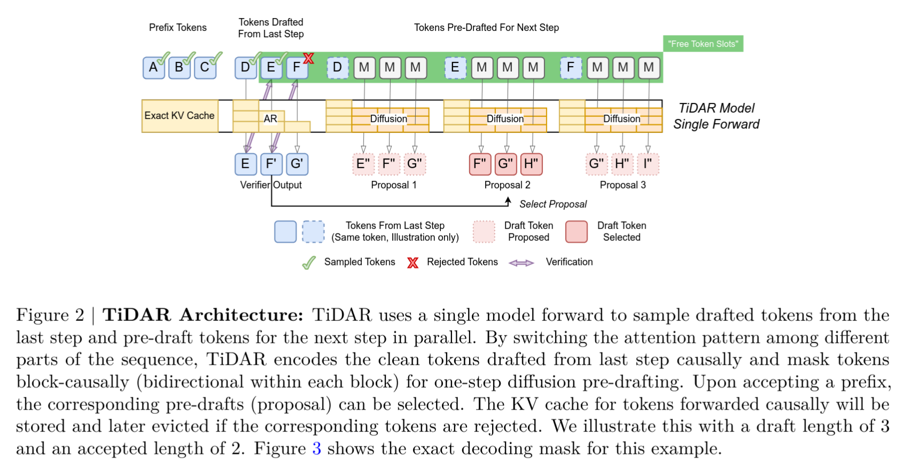
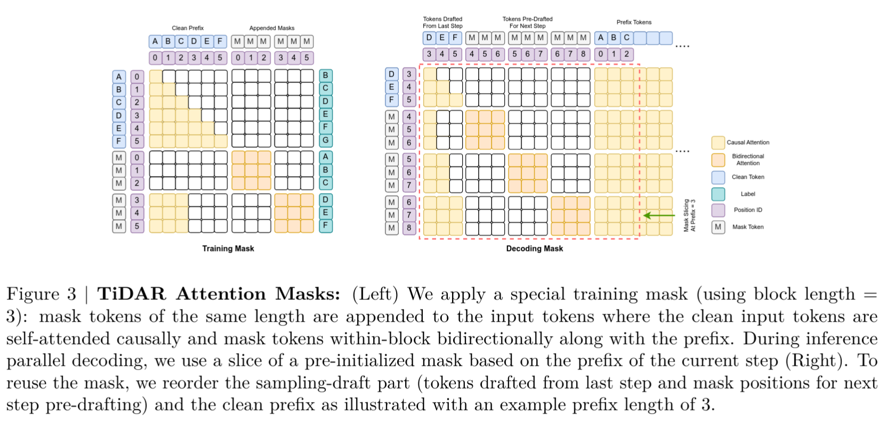
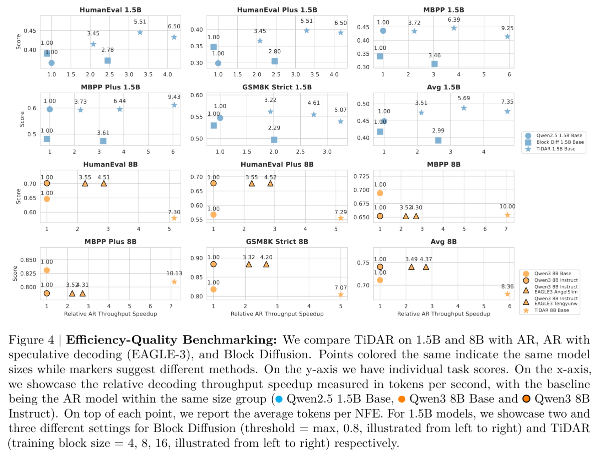

# Detect Anything via Next Point Prediction

Jingyu Liu, Xin Dong, Zhifan Ye, Rishabh Mehta, Yonggan Fu, Vartika Singh, Jan Kautz, Ce Zhang, Pavlo Molchanov

NVIDIA (のインターンシップ)

https://arxiv.org/abs/2511.08923v1

## どんなもの？
- 拡散モデルと自己回帰モデルのハイブリッドアーキテクチャの LLM
- 1.5Bモデルで 4.71 倍、8Bモデルで 5.91 倍のスループット (tokens/sec) 向上

## 先行研究と比べてどこがすごい？

- よくある自己回帰モデル型の LLM は GPU ハードウェア性能を活用しきれていない。1トークンごとの処理が並列プロセッサと相性が悪い
- 拡散モデルを使った LLM もあるが、性能面では自己回帰モデルに劣る
- 投機的実行 (speculative execution) を使う手法もあるが、追加のモデルが必要で複雑になる

## 技術や手法のキモはどこ？

### アーキテクチャ

1つのモデル、パスで拡散モデルによるドラフト生成と自己回帰モデルによる検証を行う。

1. まず拡散モデル的な動作で複数トークンを一度に生成。これはドラフト (下書き) として使う。
2. 自己回帰モデル的な動作で、ドラフトのうち何個目まで採用するかを決める
3. 2と並行して、次のドラフトの予測も同時に行う
  - ドラフトは複数の候補がある。これは前のドラフトが1文字受理されたとき、2文字受理されたとき、... といったように何文字目まで受理されたかによって挙動が変わる候補を生成する
4. 受理されたトークン数に応じた候補を次のドラフトとする

### アテンションマスク

## どうやって有効だと検証した？

## 議論はある？

- バッチサイズ=1 のときの効率を最適化することを主眼においている。一応バッチサイズ>1 のときも効率化できるよということは書いてはあるけど効果は検証されていない
- Long Context への対応は今後の課題

## 次に読むべき論文は？

- Block diffusion: https://arxiv.org/abs/2503.09573
  - 拡散モデルを使った LLM の先行研究
- Fast inference from transformers via speculative decoding. In International Conference on Machine Learning, pages 19274–19286. PMLR, 2023.
  - 投機的デコーディングの先行研究
