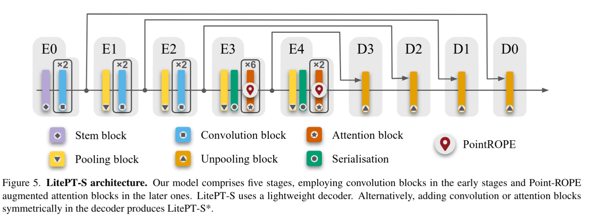
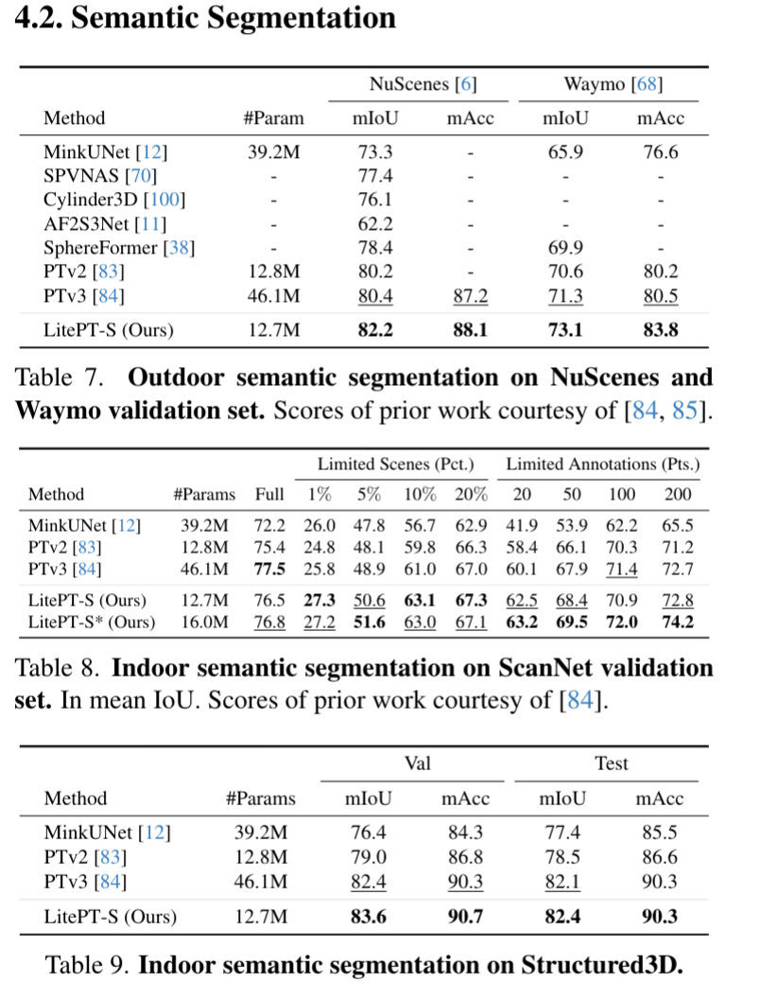
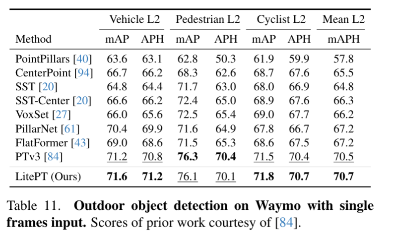
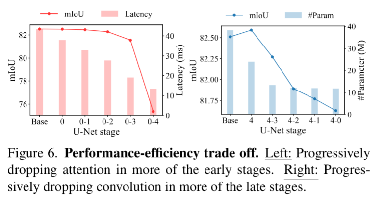
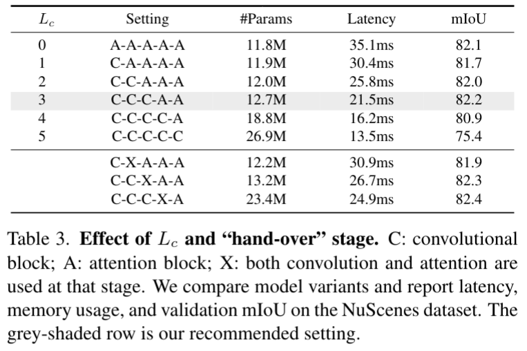
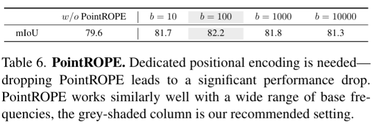

# LitePT: Lighter Yet Stronger Point Transformer

Yuanwen Yue, Damien Robert, Jianyuan Wang, Sunghwan Hong, Jan Dirk Wegner
Christian Rupprecht, Konrad Schindler

ETH Zurich, University of Oxford, University of Zurich

https://arxiv.org/abs/2512.13689

## どんなもの？
- 3D点群認識のための軽量な Transformer アーキテクチャを提案
- 従来の Point Transformer よりもパラメータ数を3.6倍削減、推論時間を2倍高速化

## 先行研究と比べてどこがすごい？

- 点群の認識では (上から見た画像のように) 2D に投影する手法やボクセルとして扱い3D CNN を使う手法があるが、近年は Transformer ベースで直接点を扱う手法が主流になってきている。e.g. PointTransformer (PTv1), PointTransformer v2 (PTv2)
- 単に点を Transformer にするとコンテキスト長の問題があるため、基本的には近傍など局所的なアテンションを取る手法が多い
  - k-NN で近傍を取る手法 (e.g. PointTransformer v2)
  - ボクセルグリッドを使って近傍を取る手法 (e.g. OctFormer)
  - ヒルベルト曲線など空間を充填する1D曲線を使って近傍を取る手法 (e.g. PointTransformer v3 (PTv3))
  - これらはいずれも U-Net のように階層的に特徴を抽出するが、浅い層ではトークンの数が多く計算コストが依然として高い
- Transformer アーキテクチャでは位置エンコーディングの重要度が高い
  - PTv1 や PTv2では相対位置エンコーディング (RPE) を利用
  - Straitified Transformer では contextual relative positional encoding (cRPE) を仕様。これは RPE に加えて、x, y, z の情報も加味する。ただし計算コストが高い
  - PTv3 では conditional positional encoding (CPE) を仕様。これはつまり depthwise 畳み込みのこと。もちろん計算コストが高い。
  - 提案手法では rotary positional encoding (RoPE) を利用。これは追加のパラメータがないため計算コストが低い一方で表現力が高い。
- Convolution とのハイブリッドアーキテクチャが実は有効
  - 局所的な特徴は依然として Convolution のほうが優れている
  - Straitified Transformer などの先行研究では Transformer よりも KPConv のほうが Attention よりも良い特徴が抽出できることが示されている
  - Transformer ベースとされる PTv3 も CPE が畳み込みなので実質的にはハイブリッドアーキテクチャになっている
  - いずれも Transformer と Convolution を交互に適用するアーキテクチャであり、局所的な特徴を畳み込みに、大域的な特徴を Transformer に担当させるというアーキテクチャはあまり検討されていない

## 技術や手法のキモはどこ？

### アーキテクチャ

浅い層では畳み込みを、深い層では Transformer を使うハイブリッドアーキテクチャ

1. まず拡散モデル的な動作で複数トークンを一度に生成。これはドラフト (下書き) として使う。
2. 自己回帰モデル的な動作で、ドラフトのうち何個目まで採用するかを決める
3. 2と並行して、次のドラフトの予測も同時に行う
  - ドラフトは複数の候補がある。これは前のドラフトが1文字受理されたとき、2文字受理されたとき、... といったように何文字目まで受理されたかによって挙動が変わる候補を生成する
4. 受理されたトークン数に応じた候補を次のドラフトとする

### Point RoPE

位置エンコーディングの計算コストを削減するために RoPE を利用。
これを点群に適用するために Point RoPE を提案。

## どうやって有効だと検証した？

### 点群セグメンテーションの結果

### 点群物体検出の結果

### 浅い層に Conv、深い層に Attention の効果

すべてのブロックに Convolution と Attention を含めたモデルを準備して、
- 左: 浅い層から徐々に Attention を除外
- 右: 深い層から徐々に Convolution を除外
したときの精度と速度を比較

* 0-2 (つまり浅い順に3層) の Attention を除去しても精度はあまり下がらないが速度は向上
* 0-2 (つまり浅い順に3層) の Attention を除去しても精度はあまり下がらないが速度は向上

### Point RoPE の効果

## 議論はある？

- 提案手法は新規性をアピールしているものの、画像の分野では同様のアーキテクチャはすでに提案されている (e.g. CvT, CoAtNet)
- Point RoPE が本当に有効化は謎。単なる RoPE と比べての比較実験がない

## 次に読むべき論文は？

- PointTransformer v3: https://arxiv.org/abs/2312.10035
  - 点群を Transformer で扱うための先行研究
- CoAtNet: https://arxiv.org/abs/2106.04803v2
  - 画像分野における Convolution と Attention のハイブリッドアーキテクチャ
  - 過去に本研究会でも紹介されている (https://github.com/mlnagoya/surveys/blob/master/20211118_reports/arxiv_2106.04803v2/readme.md)
