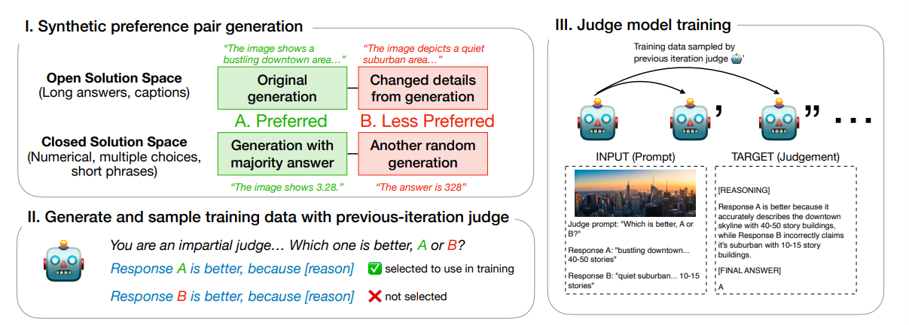
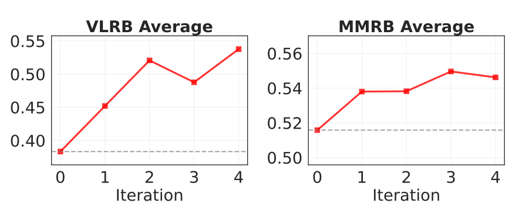
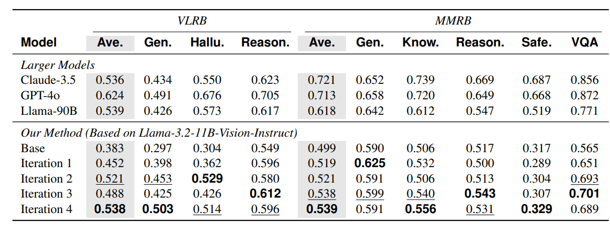
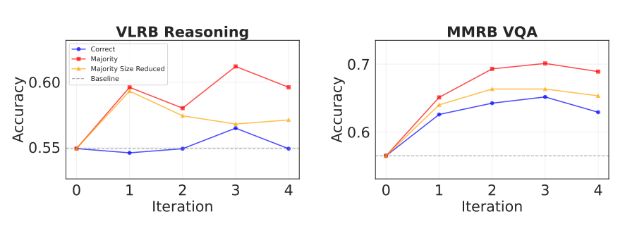

# Self-Improving VLM Judges Without Human Annotations
https://arxiv.org/abs/2512.05145
(まとめ @n-kats)

## 著者

- Inna Wanyin Lin
- Yushi Hu
- Shuyue Stella Li
- Scott Geng
- Pang Wei Koh
- Luke Zettlemoyer
- Tim Althoff
- Marjan Ghazvininejad

所属: FAIR at Meta と University of Washington の研究者グループ。

# どんなもの？

人手の preference アノテーションなしに、VLM の出力だけで VLM judge（報酬モデル）を自己改善させる学習枠組みを提案する論文。
多様なマルチモーダル指示と応答を自己生成し、それらに対する reasoning と評価を繰り返し合成・フィルタする三段階の自己学習プロセスで学習する。
この枠組みにより、Llama-3.2-11B ベースの VLM judge を Multimodal RewardBench や VL-RewardBench で大きく改善し、設定によっては Llama-3.2-90B や GPT-4o、Claude 3.5 Sonnet などの大規模モデルと十分に競合できる水準の性能を示す。

# 先行研究と比べてどこがすごい？

従来の VLM judge 学習は、人手 preference ラベルか GPT-4 / Claude などクローズド judge によるラベルが前提だった。

一方でテキスト専用の LLM judge では、自己生成データだけで reward model を鍛える手法がすでに提案されていた。

本論文はその自己改善の発想をマルチモーダルな VLM judge に広げ、人手ラベルなしでも既存の人手ベース・大規模モデルと戦える品質に達することを示した点が新しい。

# 技術や手法の肝は？

## 概要

提案手法は「自己合成した preference データで VLM judge を自己改善する」三段階パイプラインになっている。
1. 擬似ペア生成・・・オープンエンド／クローズドエンドに応じて、好ましい回答と意図的に劣化させた回答のペアを自動生成する。
2. 判定のふるい分け・・・ひとつ前のイテレーションの judge にペアを評価させ、合成した好ましさの向きと一致する判定だけを残す。
3. 反復学習・・・フィルタ済みの判定と reasoning trace で judge を再学習し、このループを何度か繰り返して性能を高める。

## 用語

1. オープンエンド・・・キャプションや長文のように、正解が一つに決まらないタスク。
2. クローズドエンド・・・数値や選択肢など、正解が明確に定まるタスク。

## 擬似ペア生成

### 共通

画像と指示を入力にしてモデルから回答候補を集め、それらを加工して「好ましい回答」と「劣る回答」の二択ペアにまとめる。
表現の細かな違いではなく、事実誤りや見落としなど内容の差がはっきり出るようにして、失敗パターンが見えやすいペアにしている。

### オープンエンドの場合

キャプションや長文回答のように正解が一つに決まらないタスクでは、まず自然な回答を出させる。
そのあとで物体の属性や個数、位置関係などを意図的にずらした回答を作り、元の回答とのペアを「好ましい vs 好ましくない」として扱う。

### クローズドエンドの場合

数値・選択肢・短文回答のように正解が決まっているタスクでは、同じ問題に対して何度も回答をサンプリングして候補を集める。
多数決で「多数派の回答」を好ましい側とし、内容が異なる別の候補をランダムに選んで組にし、好ましい側とそうでない側を決める。

## 判定のふるい分け

1. 評価の役割・・・前イテレーションの評価用 VLM が「中立な審査員」として A/B のどちらが良いかを選び、その理由（reasoning）もあわせて出す。
2. 一致チェック・・・合成時に決めた「どちらが好ましいか」と評価モデルの最終判定が一致しているペアだけを残し、それ以外は自己強化ループを避けるために捨てる。
3. reasoning の活用・・・残ったペアでは、最終ラベルだけでなく reasoning のテキストも教師として使い、どの観点で評価しているかまで学習させる。

絶対的な正解が分からなくても、合成時に決めた優先度と一致した判断だけを集めることで、相対的な良し悪しに一貫して沿ったデータだけで学習できる。

## 反復学習と自己改善

1. 小さな評価モデル・・・土台の評価用 VLM は Llama-3.2-11B ベースのコンパクトなマルチモーダルモデルを固定し、イテレーションごとに同じモデルを少しずつ更新する。
2. 反復更新・・・新しい擬似ペアからフィルタ済みデータを作り、判断と reasoning でファインチューニングするサイクルを繰り返して、徐々に評価能力を高める。
3. 停止条件・・・ベンチマーク上の性能改善が小さくなったところでイテレーションを止め、過学習や無駄な計算を避ける。

大きなモデルに切り替えるのではなく、同じ 11B モデルを安価に回し続ける設計にして、自己訓練だけでどこまで評価能力を引き上げられるかを見ている。

# どうやって有効だと検証した？

## ベンチマークと設定

評価には VL-RewardBench と Multimodal RewardBench を使う。  
general / hallucination / reasoning / VQA など複数の観点で judge の精度を見る。

ベースラインは Llama-3.2-11B-Vision-Instruct の素の judge。  
同じモデルに自己学習パイプラインを数回回したものと比べている。

## イテレーションごとの伸び

VL-RewardBench では、全体精度がおおよそ 0.38 から 0.54 前後まで伸びている。  
Multimodal RewardBench でも 0.50 前後から 0.54 前後まで改善し、とくに general と hallucination、VQA あたりの伸びが大きい。一方で reasoning や safety はほとんど伸びず、合成データが効きやすい能力とそうでない能力が分かれている。

## 大規模モデルとの比較

大きなモデルとの比較も行っている。  
Llama-3.2-90B や GPT-4o、Claude 3.5 Sonnet と比べても、general や hallucination では 11B ベースの judge が同等か、それ以上に戦える設定が多い。

## 多数決とクローズドエンド

reasoning や VQA のようなクローズドエンドタスクでは、多数決で「多数派の回答」を好ましい側とする合成データの方が、正解ラベルだけで作った合成ペアより良いことがある。  
多数決側のデータ量を正解フィルタと同じに揃えても有利な場面が残り、フィルタ方式そのものが効いていることも示している。
絶対的な正解というより、「よりましな方」を選ぶ能力に寄せたほうが、実際の judge の役割に近い信号になっている。

# 議論はある？

人手ラベルも強い外部 judge も使わずにここまで性能を上げられるので、ラベルがない新しい画像ドメインやタスクでも応用しやすいという主張をしている。
一方で、合成データに寄りすぎると distribution mismatch で safety や reasoning のような次元はあまり伸びないことも示されており、万能な枠組みではない。
多数決や一貫性ベースのフィルタは「よりましな方」を選ぶ力には効くが、誤った理由付けやスタイル優先の判断が残る例もあり、judge の内側の基準をどこまで信頼するかは慎重に見るべきだと議論している。
自己改善で judge を作る方向性自体は有望だが、どのタスク次元に効きやすいか・どこに効きにくいかをセットで分析することが重要だ、というトーン。

## GPT意見

一番のインパクトは「評価までモデルが自分で回し続ける」構図がかなり現実味を帯びてきたことだと感じた。

人手アノテーションやクローズド judge なしでも、そこそこ信頼できる VLM judge を安く量産できるなら、評価フローの作り方そのものが変わりそうだ。

自分が使うなら、プロダクションの最終判定ではなく、探索フェーズや A/B テストのスクリーニング用の一段目フィルタとして慎重に使う、くらいの距離感がちょうどよさそうだと感じた。

## 私見

用途を絞った専用モデルであれば、特化して賢いモデルがつくれて、その分だけ judge がうまく機能したのだろうと感じる。

検査で評価すべき項目をもっと増やしていけば、今は伸びていない課題にも自己改善の効果が広がっていくのではないかと感じた。

一方で、データ生成と学習あわせて H100 でおおよそ 400 GPU 時間は使っており、「人手ラベルや GPT-4 distillation よりは安いが、それなりの計算コストは覚悟する必要がある」タイプのアプローチだなという印象も持った。

# 次に読むべき論文は？

- Self-Rewarding Language Models（Yuan et al., 2024）テキスト LLM で自己合成データから reward model を学習する枠組みで、本論文の発想のテキスト版にあたる。
- GPT-4V(ision) as a Generalist Evaluator for Vision-Language Tasks（Zhang et al., 2023）GPT-4V を汎用 VLM evaluator として使う話で、「強いクローズド judge 依存」の代表例。
- Multimodal RewardBench / VL-RewardBench（Yasunaga et al., Li et al., 2025）本論文の主な評価ベンチで、どんな次元で reward model を測っているかを把握しておくと読みやすくなる。