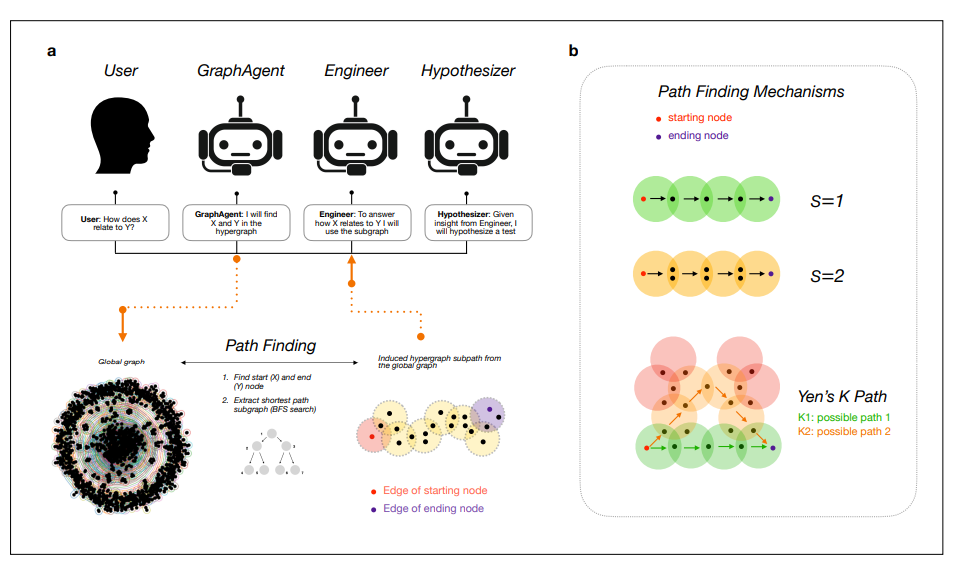
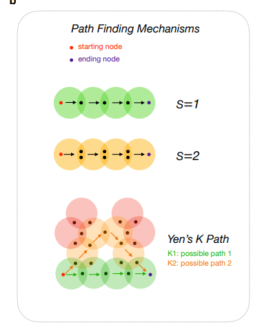
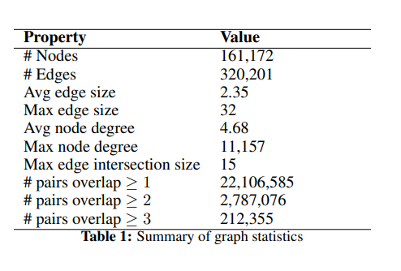
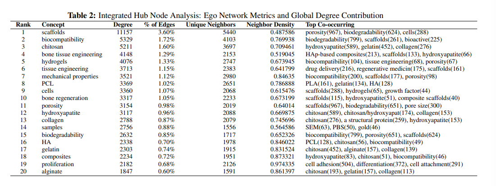
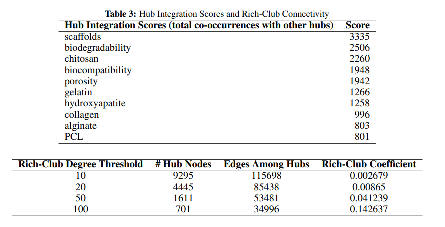
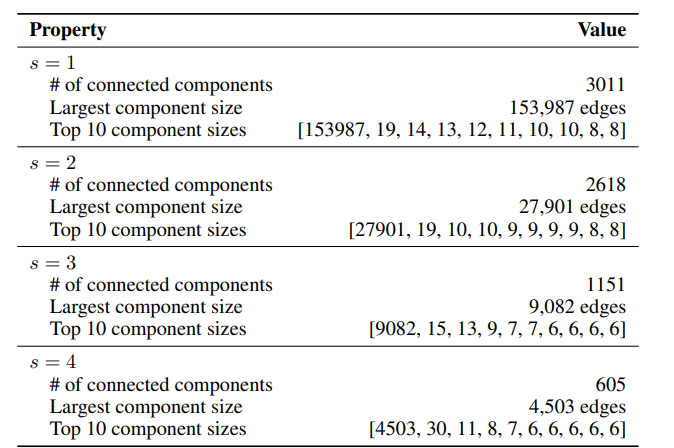

# Higher-Order Knowledge Representations for Agentic Scientific Reasoning
https://arxiv.org/abs/2601.04878
(まとめ @n-kats)

# 著者
- Isabella A. Stewart
- Markus J. Buehler

# どんなもの？
バイオマテリアルの分野でRAGをしようと合成研究データベースを検索するときに、単に特定の物質とかの単発的な検索ではなく、物質間の関係・プロセスを踏まえた検索が重要。
それをハイパーグラフを使って実現し、ハイパーグラフ特有の検索方法の提案をしている。
実際のデータセットを使ってハイパーグラフを構築して、その構造を分析している。

codex draft

科学論文コーパスから「多者関係（n-ary）」を保ったまま知識を取り出し、エージェントの推論に使える形にする話。
従来のKnowledge Graphのようなペア（2者）関係ではなく、hypergraph（hyperedgeが複数ノードを同時に結ぶ）で科学知識を表現する。
biocomposite scaffoldに関する約1,100本の論文から巨大なhypergraphを構築し、トポロジー解析と、GraphAgent→Engineer→Hypothesizerの多段推論デモを示す。
材料A＋材料B＋加工法＋評価法…のような「同時に出てくる組」を、ペアに分解せずに持ちたい、という問題意識が中心。
hypergraph上でノード間の最短経路（hyperpath）を見つけ、その経路を根拠としてエージェントに説明と仮説生成をさせる。
例として、PCLとcerium oxideのあいだをchitosanでつなぐ、といった経路を使って複合材料の機械的仮説と実験案を組み立てる。

# 先行研究と比べてどこがすごい？
元来、ハイパーグラフを知識表現に用いる取り組みは多くあった。
また、LLMの文脈では、CoTにハイパーグラフを使う方法を考える人もいた（Hyper-COT）。
RAGの文脈だと、GraphRAGが有名で、その亜種としてHyper-RAGがある。
しかし、これはハイパーグラフを作って、検索して、その多数のノードからなるエッジの内容をコンテキストに追加する程度のもの。
本研究では、ハイパーグラフ特有の方法でエッジを手繰って検索する方法やそれなりの規模のデータセットでの分析が特徴。

codex draft

従来はRAGでテキストを追加してLLMを賢くする方向が多いが、本論文は「多者関係を落とさない構造化（hypergraph）」をまず作り、構造そのものを推論のガードレールにする。
従来のKnowledge Graphは2者関係の積み上げになりやすいが、本論文はhyperedgeで共起文脈を保持して、pairwise展開の組合せ爆発と文脈喪失を避ける。
大規模コーパス（約1,100本）から実際にhypergraphを作り、スケールフリー性などの解析と、エージェントの経路探索デモまで一気通貫で見せている。
従来のpairwise KGは、n個の同時関係をペアに割るとエッジが増えすぎるし、「同じ出来事の一体感」も失われるという指摘が分かりやすい。
GraphRAG/Hyper-RAGの文脈にも触れつつ、本論文は「科学的な多要素関係そのもの」をhypergraphで持つ側に振っている。
推論も、LLMの雰囲気ではなく、intersection（共通ノード）などのトポロジー制約に寄せているのが売り。
従来はRAGで関係をテキストから拾わせることが多いが、この論文は関係をhypergraphとしてデータベース側に刻んで、辿れる検索を前提にしている。
pairwiseなKnowledge Graphだと、複合材料（材料A+B+C）やプロセスがペアに分解されて文脈が薄まったりエッジが増えたりするが、hyperedgeで同時関係をそのまま持てる。
さらに、intersection制約つきの経路探索など、hypergraph特有の検索方法を具体的に出しているのが良い。

# 技術や手法の肝は？

## 前提知識/ハイパーグラフ
ハイパーグラフとは、通常のグラフのエッジが2つのノードをつなぐのに対して、1本のエッジが任意個のノードを同時につなげるというもの。
通常のグラフのように向きを考えることもある（ソースのノードとターゲットのノードとに分ける）

## ハイパーグラフ作成
1. チャンク化
  - だいたい1万文字くらいで
2. 要素・関係の抽出
  - 「ソース側の要素の集合・関係・ターゲット側の要素の集合・チャンクID」の形で抽出。
    - ソース/ターゲットが複数要素になってもよい
    - 向きを考えている（ソースとターゲットを区別している）が、本質的ではなさそう（以降出てこない）
3. クリーニング/統合
  - ノードをベクトル化して、類似度計算して、適当なしきい値で同一化する（次数の多いノードへ統合する）。
  - 10ドキュメントくらい毎に実施。

## ハイパーグラフでの検索
AとBに関する質問に答えようと思ったら、AからBへの経路を何パターンか検索する方法が思いつく。

普通のグラフだったら、エッジに沿って、A → C → B のようにたどる（今のエッジのターゲットが次のエッジのソースになるようにたどる）。Yenのアルゴリズムを使って、上位Nパターンを用意することもできる。

（向きのない）ハイパーグラフでは、
- 今のエッジと次のエッジに共通部分があったらOKというルールでたどる
- 共通部分の要素数に下限を設けることができる（2個以上じゃないとだめみたいに）
- これによって、類似性の高いエッジを辿ってゴールに到達することができる
  - 類似性の高いエッジ＝似た要素が関係する類似性の高い構造

バイオマテリアルは「材料＋添加剤＋加工法＋形状（スキャフォールド）＋評価（強度/生体適合）」みたいに要素が多く、何個かセットになっていないと全く別の情報になってしまう。
それをハイパーグラフのエッジやそれの辿り方でケアしている。

codex draft

全体は「論文→イベント抽出→hypergraph構築→経路探索ツール→多エージェント推論」の流れ。
GraphAgentが質問文からエンティティをhypergraphノードにマッチし、intersectionサイズ制約（IS）付きのBFSで最短hyperpath（必要ならYenでK本）を回収する。
回収した誘導部分hypergraphをEngineerが機械的に解釈し、Hypothesizerがテスト可能な実験仮説に落とす。

## 表現（Higher-Order Knowledge Representation）
higher-orderは「複数エンティティが同時に成立する関係」を、ペアに分解せずhyperedgeとして保持することを指している。
論文テキストから得たsource/targetの集合を1つのhyperedgeにして、relationと出典（chunk id）をメタデータとして持たせる。

## エージェント構成
User→GraphAgent→Engineer→Hypothesizerの役割分担。
GraphAgentは「検索・経路探索」、Engineerは「経路からの機械的説明」、Hypothesizerは「仮説と実験プロトコル」の担当。

## 推論・探索・検証の設計
探索は「hyperedge間を遷移」するBFSで、隣接条件として「共通ノード数がS以上（IS）」を課す。
K本の最短経路を返す設定にすると、追加文脈が増えて、媒介ノード（例: chitosan）を使ったより筋の良い仮説に寄りやすい、というデモになっている。

# どうやって有効だと検証した？
## データセット
Biocomposite Scaffold Corpora を元に、論文テキストからハイパーグラフを構築している。
規模感としては、だいたい論文が約1,100本で、ノードが161,172、エッジが320,201。

## ハブノードの分析

一部のノードが高頻出。特にscaffolds（データベース作成時のクエリに含まれる）は次数が1万を超えている。でもって、高頻出ノードと同じエッジに出現しやすい。
このような次数が多いノードをハブと呼んでいる。検索キーワードにするには絞りきれないが、調べたいことの情報が詰まったもので、ハブをうまく扱う手法が重要（本手法はそれにアプローチしている）

Hub Integration Scores（他のハブと同じエッジに出る回数の合計）や、Rich-Club係数（次数kより大のノードだけを残したときの、エッジの数/(ノード数×(ノード数-1)/2))を分析。

Hub Integraiton ScoresもRich-Club係数も、ハブ同士が同時に出現しやすいかを表現している。

## エッジの類似度

エッジ同士がs個以上ノードを共有していたら接続するというルールで、エッジの連結成分の統計を出したもの。これからわかるように、それなりに似た組み合わせのノードが何度も出てきていることがわかる。そして、提案の検索手法でかなり多くのものに到達可能なことがわかる。

codex draft

データはbiocomposite scaffoldに関する約1,100本の論文で、そこからglobal hypergraph（161,172 nodes / 320,201 hyperedges）を構築している。
構築したhypergraphがスケールフリー（power law exponent ≈ 1.23）などの性質を持つことや、ハブ概念の周りに構造が集約することを解析している。
推論の有効性はベンチマークでの精度比較というより、GraphAgentが回収した最短経路を根拠に、機械的説明と実験仮説を出せるかのケーススタディ（cerium oxide↔PCL、grass↔PCL、hydrogel↔PCLなど）で示している。
特に、K=1（経路1本）よりK=3（複数経路）の方が媒介概念の拾い方が変わり、仮説がリッチになる、という見せ方。

# 議論はある？

codex draft

この論文の主張は「hypergraphにすると表現がリッチ」だけでなく、「トポロジー制約がteacherlessなガードレールになる」という点に寄っている。
一方で、得られる仮説はコーパスの記述（抽出品質）に強く依存し、最終的な妥当性は実験・人手検証が必要という前提は残る。
intersectionサイズ（IS）やK本返す設定は、探索の振る舞いと“それっぽい説明”の出方に効くので、適用時はチューニングと監査の設計が重要になりそう。

## 私見
あんまり比較実験みたいなのがないので、この効果があったのかわからない論文。

今回のアルゴリズムだと、同じ内容を表現しているエッジを消す処理がない。s-connected-componentsの分析を見ると、杞憂な気もする（もしそうならもっと多くのエッジがs=4に残りそう）。

文句をつけたが、ハイパーグラフを考えて、構造が近いエッジをたどるアイデアは面白い。
部分圏の類似度検索みたいな話に一般化して捉えるとよいかも。

codex draft

「構造化した知識を入れる」系は多いが、hyperedgeのintersectionを推論の足場として使わせる発想は、LLMの“もっともらしさ”を抑える方向として筋が良いと感じる。
ただ、ケーススタディ中心なので、次は「この設計が何をどれだけ改善したか」を測る評価設計が欲しくなる。

# 次に読むべき論文は？
- Hyper-COT
- https://www.youtube.com/watch?v=tgMFc4OdGFo
  - scaffold がどうのこうのがわかる動画（長い）

codex draft

- GraphRAG: グラフでRAGの根拠を組む代表例。テキストRAGとの差分の整理に向く。
- Hyper-RAG: hypergraphをRAGに持ち込む流れ。fact groundingや幻覚低減の話につながる。
- LightRAG: RAGの設計を軽量化して回す方向。実装・運用観点の比較軸になる。

