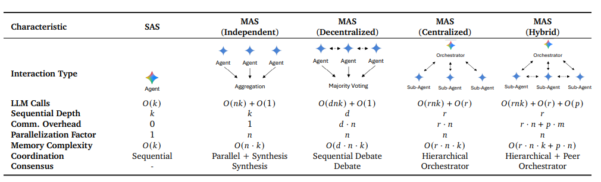
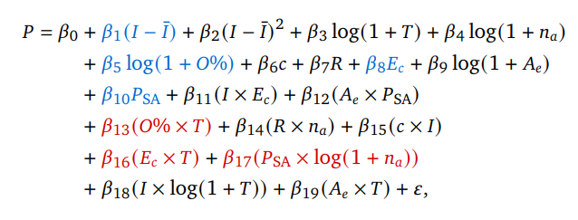
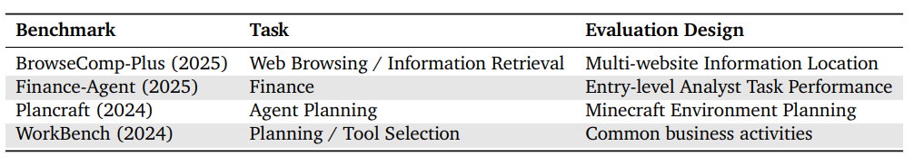
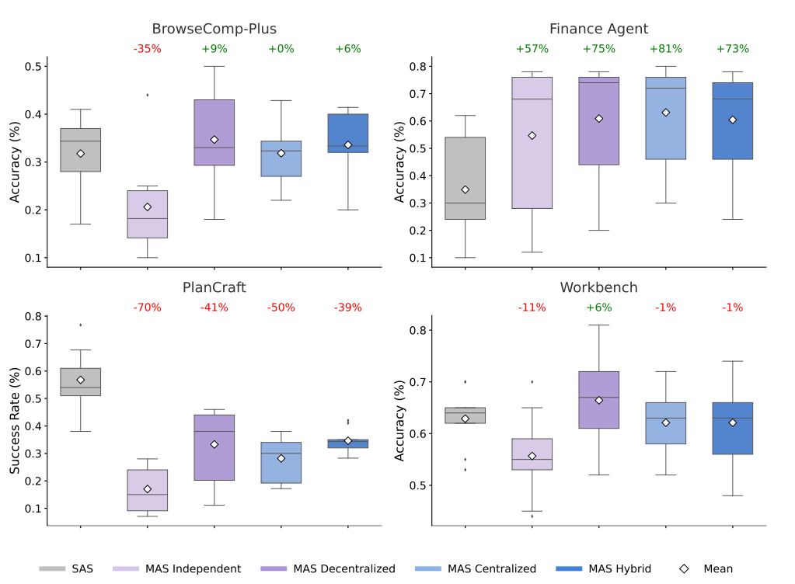
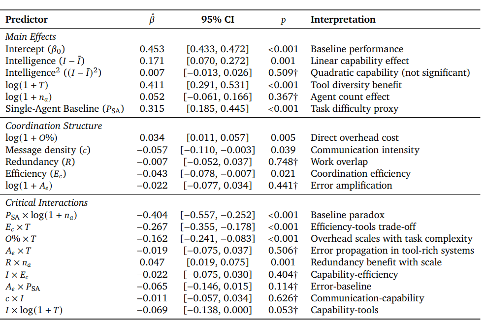
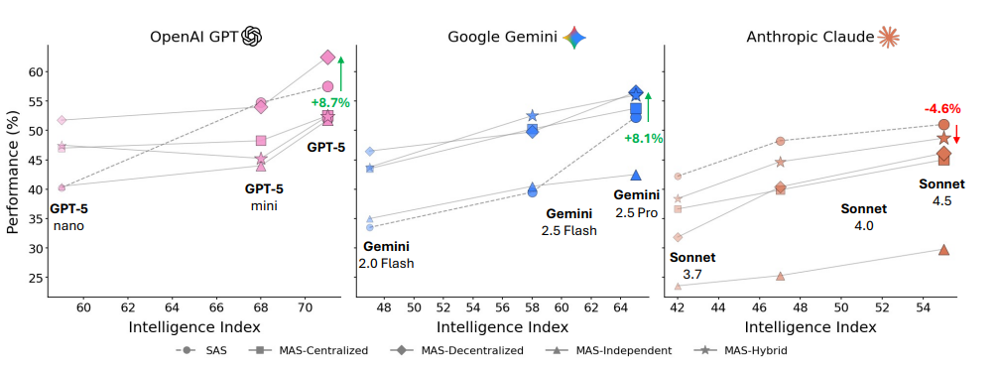
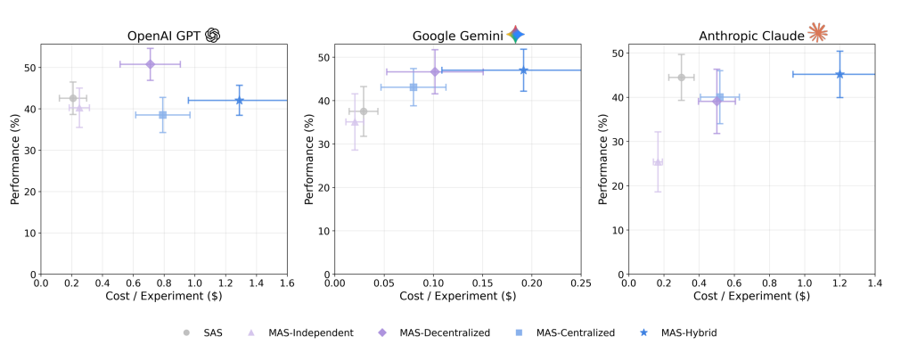

# Towards a Science of Scaling Agent Systems
https://arxiv.org/abs/2512.08296
(まとめ @n-kats)

# 著者
* Yubin Kim
* Ken Gu
* Chanwoo Park
* Chunjong Park
* Samuel Schmidgall
* A. Ali Heydari
* Yao Yan
* Zhihan Zhang
* Yuchen Zhuang
* Mark Malhotra
* Paul Pu Liang
* Hae Won Park
* Yuzhe Yang
* Xuhai Xu
* Yilun Du
* Shwetak Patel
* Tim Althoff
* Daniel McDuff
* Xin Liu

google researchとdeepmindの人たち

# どんなもの？
LLMマルチエージェントシステムのスケーリング則の研究。

複数のエージェントパターンを考えて、効果的に機能する要素が何かを分析した。

# 先行研究と比べてどこがすごい？
* [Are More LLM Calls All You Need? Towards Scaling Laws of Compound Inference Systems(https://arxiv.org/abs/2403.02419)](https://arxiv.org/abs/2403.02419)
  * マルチエージェントシステムのスケーリング挙動についての初期の研究
* [A Survey on Large Language Model based Autonomous Agents(https://arxiv.org/abs/2308.11432)](https://arxiv.org/abs/2308.11432)
  * マルチエージェント設定で普遍的なパターンを見つけられず、分野ごとに変わると示唆

これら以外に、最近の研究では、規模よりもアーキテクチャーとタスクの連携が重要ということがわかってきた。

この論文では、4タスク・5アーキテクチャ・3モデル・3思考レベルで180設定で実験。
パフォーマンスを19個のパラメータの関数として回帰し、どのパラメータが重要なのかを特定した。

# 技術や手法の肝は？

## アーキテクチャーパターン

シングルエージェント（SAS)とマルチエージェント（MAS）4種

* k: エージェント毎の最大イテレーション数
* n: エージェント数
* r: ラウンド数（オーケストレーターの実行回数）
* d: ディベート回数（エージェント間の議論）
* p: 接続数（Hybridのみ。HybridはCenterizedとスパースなディベートを行う。その回数がp）

## パフォーマンス近似式

（赤：大きく影響、青：有意な影響）

* P: パフォーマンス（正解率など）
* I: 知能（[https://artificialanalysis.ai/evaluations/artificial-analysis-intelligence-index](https://artificialanalysis.ai/evaluations/artificial-analysis-intelligence-index)）
* T: ターン数
* n_a: エージェント数
* P_SA: SASの場合のスコア
* O: オーバーヘッド（SASと比べたターン数の増量）
* c: メッセージ密度（1ターンのエージェント間の通信回数）
* R: 冗長率（それぞれのエージェントの出力の埋め込みベクトルの類似度の平均）
* S: 成功率
* E_c: S/(T/T_SAS) ターン数の差で補正した成功率
* A_e: E_MAS/E_SAS 相対的な失敗率（E_MASはエラーの数？）

# どうやって有効だと検証した？
## タスク

Fianceはサブタスクに分解して実行でき、マルチエージェントが有効。一方、PlanCraftは並列思考がしにくいタスクで、下がる。

## 各パラメータの影響

* エージェント数は関係が薄い。
* オーバーヘッドは正の相関
* メッセージ密度は負の相関（エージェント間の相談はむしろマイナス）
* 冗長性は関係ない

## モデルの違い
高スコアのアーキテクチャはモデルによって違う

# 議論はある？

シンプルなアーキテクチャ・エージェント数は9までで研究。

ツールを多用するタスクでは、ツール数とシステム効率に負の相関がある。

エージェント数が増えるごとにコストが上がるため、より大きな実験の実現可能性が課題。

具体的なマルチモーダルタスク（ロボット・医療・・・）でも同様のスケーリング則があるかに関心がある。

## 私見

マルチエージェントのスケーリング則は関係しそうなパラメータが多すぎる問題がありそう。この研究のやり方は、一般的なやり方かもしれないが、どこかでマネできるといいなと思った。

# 次に読むべき論文は？
* [Are More LLM Calls All You Need? Towards Scaling Laws of Compound Inference Systems(https://arxiv.org/abs/2403.02419)](https://arxiv.org/abs/2403.02419)
  * マルチエージェントシステムのスケーリング挙動についての初期の研究
* [A Survey on Large Language Model based Autonomous Agents(https://arxiv.org/abs/2308.11432)](https://arxiv.org/abs/2308.11432)
  * マルチエージェント設定で普遍的なパターンを見つけられず、分野ごとに変わると示唆
