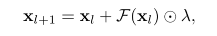
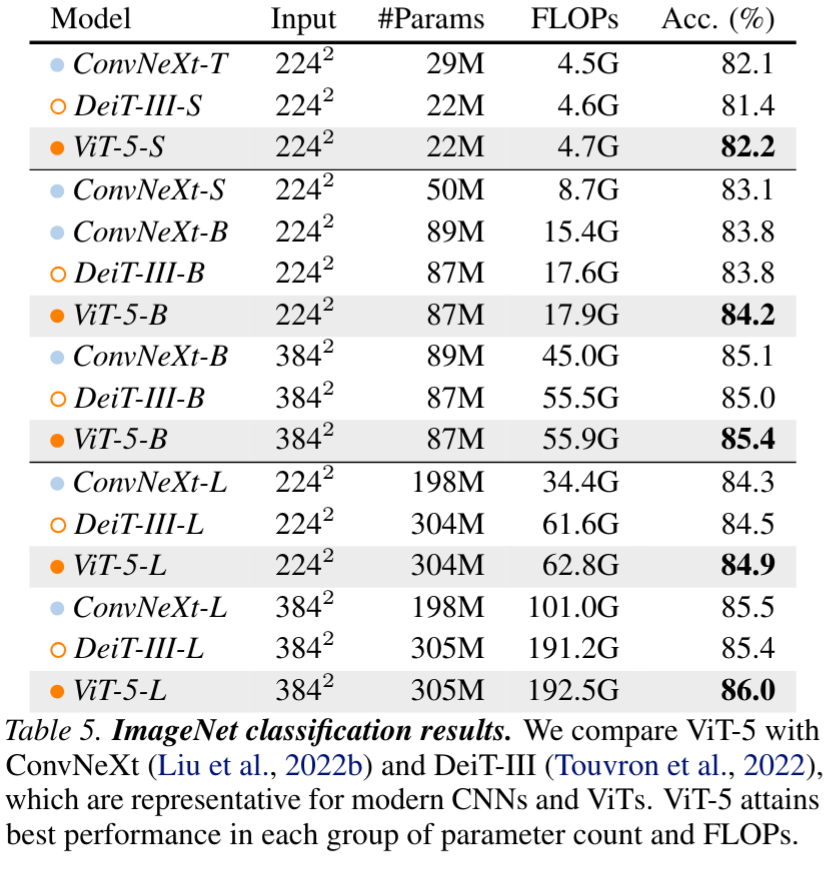
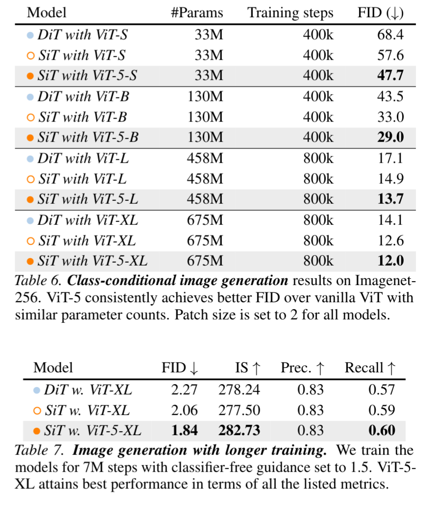
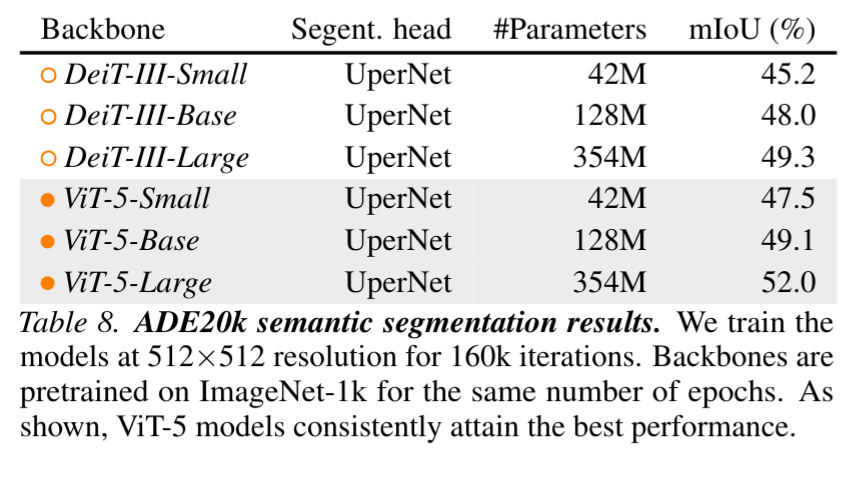
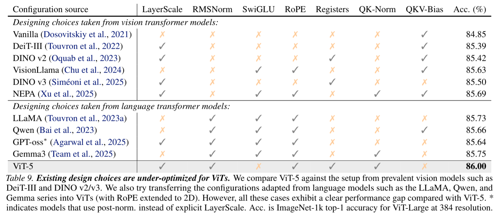
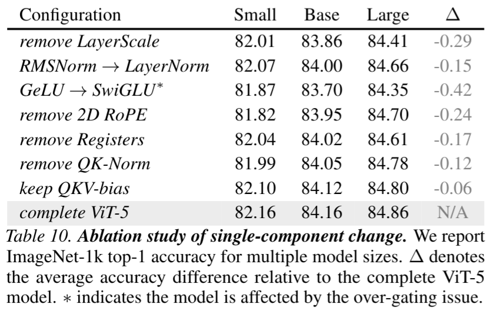

# ViT-5: Vision Transformers for The Mid-2020s

Feng Wang, Sucheng Ren, Tiezheng Zhang, Predrag Neskovic, Anand Bhattad, Cihang Xie, Alan Yuille

https://arxiv.org/abs/2602.08071

## どんなもの？
- LLM の精度改善を画像向けの Vision Transformer (ViT) に適用した ViT-5 を提案
  - 論文タイトルは多分 ConvNeXt のオマージュ (A ConvNet for the 2020s)
- 分類、セグメンテーション、画像生成のタスクで既存手法よりも優れた性能を示す

## 先行研究と比べてどこがすごい？

- LLM はここ5年で大きな進歩を遂げているが、画像向けの ViT はあまり進歩していない
  - CNN とのハイブリッドや階層化などの工夫はあるが、これらは中規模のベンチマークに合うように帰納バイアスを入れたもので、真に汎用的な精度向上には繋がっていない。
- LLM 側の発展を見ると、モデル側の基本的な構成 (Attention-FFN) は変えずにコンポーネント単位の改良を行っている。画像に対してもこの考え方を活用する。

## 技術や手法のキモはどこ？

### LayerScale

- Attention や MLP からなる `F(.)` に対してチャネル数個からなる学習可能な係数 `λ` を掛ける。
- 簡単な割に、学習が安定する効果があり
- DINOv3 などの画像系のモデルで採用されている
- LLM ではあまり採用の実績はないが、LLM でよく見られる Post-Normalization と近い効果があり、LayerScale の方が柔軟性と計算コストの点で優れている。

### RMSNorm

- LLaMA (2023) あたりから LLM で使われる Normalization レイヤの標準は LayerNorm から RMSNorm に変わっている。
- ViT-5 でも RMSNorm を採用。計算コストがわずかに下がり、精度も若干上がる

### Activation に SwiGLU は不採用

- LLM では SwiGLU (Swish-Gated Linear Unit) がよく使われるが、ViT-5 では採用しない。
- 実験の結果、LayerScale と組み合わせて使う場合に over-gating により精度低下が見られた。

### Positional Encoding

- Absolute Positional Encoding (APE) と Rotary Positional Encoding (RoPE) の両方を採用 (単に足すだけ)

### Register Token

- Vision Transformer では学習可能な追加のトークン (レジスタトークン) を追加で与えると良いことが知られている。
- Vit-5 でもこれを採用。

### QK-Normalization

- Qwen3 などで使われている手法で、Attention の Q と K それぞれに正規化層 (RMSNorm) を入れる。

### QKV からのバイアス項の除去

- QKV のそれぞれのプロジェクションからバイアス項を除去する。RMSNorm がバイアスを含まないのでそれとの一貫性のため。

## どうやって有効だと検証した？

分類、画像生成、セグメンテーションのタスクで既存手法と比較して ViT-5 の性能を評価

### 画像分類 (ImageNet)

### 画像生成 (ImageNet256)

Diffusion Transformer のバックボーンを変更して実験

### セグメンテーション (ADE20K)

UperNet のバックボーンを変更して実験

### Ablation

## 議論はある？

- 最近の LLM の発展を知れて良かった
- 試したがダメだった手法があれば知りたかった

## 次に読むべき論文は？

- Touvron, H. et al., Going deeper with image transformers. In ICCV, 2021b
  - LayerScale を提案した論文
- Shazeer, N. Glu variants improve transformer. arXiv preprint arXiv:2002.05202, 2020.
  - SwiGLU を提案した論文
- Darcet, T., Oquab, M., Mairal, J., and Bojanowski, P. Vision transformers need registers. In ICLR, 2024.
  - レジスタトークンを提案した論文
