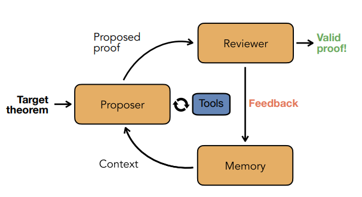
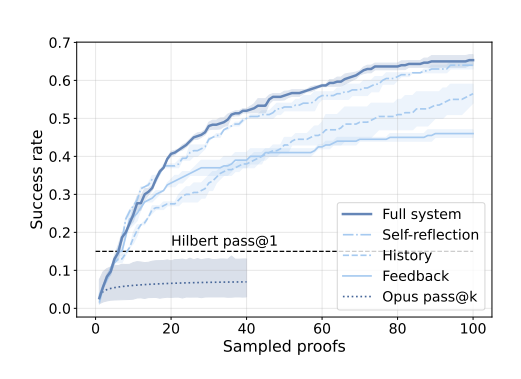
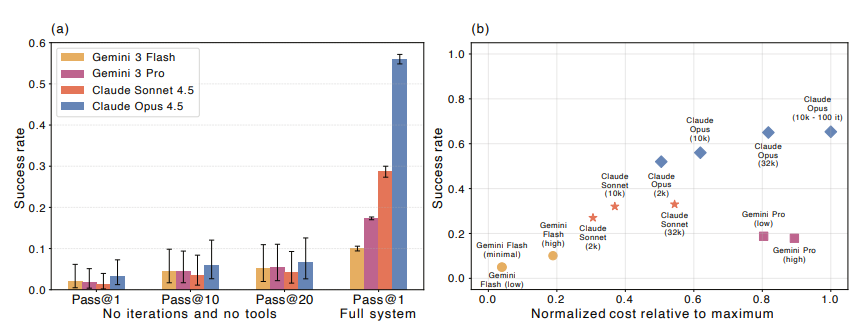
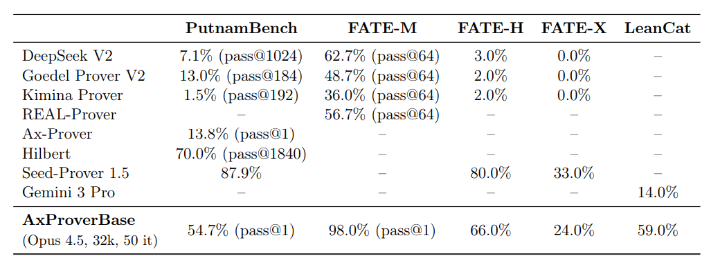

# A Minimal Agent for Automated Theorem Proving
https://arxiv.org/abs/2602.24273v2
(まとめ @n-kats)

# 著者
* Borja Requena
* Austin Letson
* Krystian Nowakowski
* Izan Beltran Ferreiro
* Leopoldo Sarra

Axiomatic AIの人たち（スペインの会社っぽい）

# どんなもの？
定理証明系（Leanコード生成）のAIのシンプルなベースライン手法AxProverBaseを提案。

複数のベンチマークで評価し、SoTAと比較。

単純なループでまずまずの評価値を達成している。

コード: https://github.com/Axiomatic-AI/ax-prover-base 

# 先行研究と比べてどこがすごい？

これまでのコードを生成する手法の多くは、複雑で導入が難しかったり、そもそもモデルを公開していない問題があった。

ものによっては生成データを使ったファインチューニングや高度な再帰的な分割をしていたりする。

FTとかだとleanやmathlibが更新されると使えなくなる問題がある。

昔は確かにLean専用に学習する効果があったが（モデルが賢くなくて）、今はそうでもない。

先行手法例
* 木構造ベースの手法
  * AlphaProof
  * REAL-Prover: Mathlib検索をする例
  * Aristotle: 専用の幾何学用エンジンを用意する例
* Whole-proof方式（Leanによるフィードバックを使って修正しながらゴールを目指す）
  * DeepseekProver V2: MiniF2Fでは正解率が89%だったが、PutnameBenchで7.4%。
  * Self-play LLM theorem provers: DeepseekProver V1.5を使って生成データを作って、ファインチューニング
  * Hilbert prover: PutnameBench70%。問題を簡単な補題に分割して、特化モデルで証明を生成する方式。性能は酔いが、1840回トライしている。
  * Seed Prover V1.5: 改善ループ・コンパイラーフィードバック・ライブラリ検索、補題分解、証明ドラフト作成、複雑なコンテキスト管理、幾何学用エンジンすべて利用した結果。
  * Aleph Prover: PutnamBenchのSoTAだが、ほとんど情報なし

この研究によって、ループ ＞ メモリー機能 ＞ 検索ツール利用 の順で効果があることを確認し、提案したシンプルな方法で応用に十分な性能が出ると期待できることを示した。

# 技術や手法の肝は？
## アーキテクチャ

* Proposer・・・証明を生成する
* Reviewer・・・証明をレビューする
* Memory・・・レビュー内容を記録する

## Proposer
対象の命題・関係するコンテキスト・過去の試みの結果を入力して証明のコードを生成する。

モデルや方法は自由度が高いが、最も汎用的に使われているReActエージェントで実施。ツールとして、

* ライブラリ検索（LeanSearchをカスタマイズ）・・・埋め込みベクトルベースのMathlibのコード検索
* ウェブ検索・・・tavilyを利用

## Review
* コンパイルが通るか
* sorryなどのワーニング
  * sorry: 証明をしないでスキップする機能、コンパイルは通るがワーニングが出る
  * apply?: そのコンテキストで使える定理を検索する機能？

実装はLeanInteractライブラリを使った。

## Memory
3パターンを検討
* 無し
* n回履歴
* 反省（LLMに反省させて、その内容を記録）

# どうやって有効だと検証した？
## ベンチマーク

* MiniF2F・・・数学オリンピックなどの問題集
* PutnamBench・・・大学生向けの問題集
* FATE・・・複数難易度の代数学の問題集
  * FATE-M: 学部レベル
  * FATE-H: 修士レベル
  * FATE-X: 博士レベル
* LeanCat・・・圏論的な形式に変換する問題集

ablation study では、PutnamBenchから100問選んで実施。

## ablation / メモリー

横軸：イテレーション数、縦軸：正解率

一番悪い破線は、単にフィードバックなどなにも入れずに生成を繰り返した場合。

全部乗せ≒メモリー（反省）＞メモリー（履歴n=5）＞メモリー（履歴n=1）の順でよい。

回数が少ないうちは、n=1の方がn=5よりよい。（簡単な問題とそうでない問題とで必要な履歴長が違うのか？）

全部乗せは、ツールも利用しているケースだが、大きな変化はなかった。
## ablation / LLMの差

Opus4.5強い。
（なぜgptをつかっていないのか？）

出力トークン数の大きさはあまり関係なさそう。

## ベンチマーク結果

シンプルな方法で、過去の手法より良い結果が出せる。

HilbertやSeed Proverのような数学のらしい問題分割ができる手法には劣るが、それら以外と比べると良い結果になっている。

ただ、1事例12.6ドルらしい。

# 議論はある？

## 私見
とても教科書的な構成。

ツールの精度がでないのは、ツールが悪い気がする（さすがに埋め込みベクトルベースの検索は・・・）

過去の特化モデルアプローチより、汎用モデルアプローチの方がよいことを示せており、特化モデルの価値は低いといえる。

シンプルでよくなったと言いつつ、SeedProverやHilbertのような補題に分割するアプローチを導入しないと、SoTAには劣る状況になる。それをシンプルに達成するのが次の課題に見える。

# 次に読むべき論文は？
* SeedProver
* Hilbert