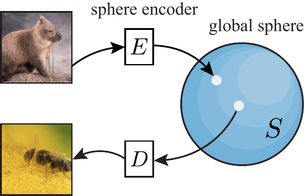
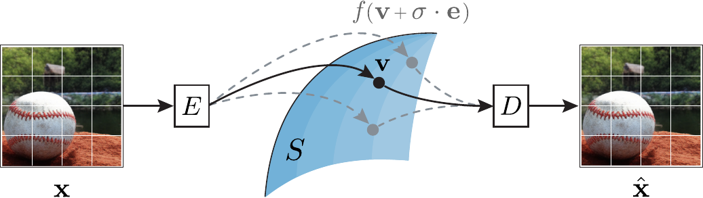
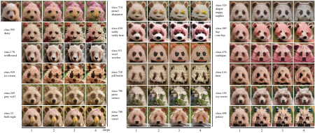
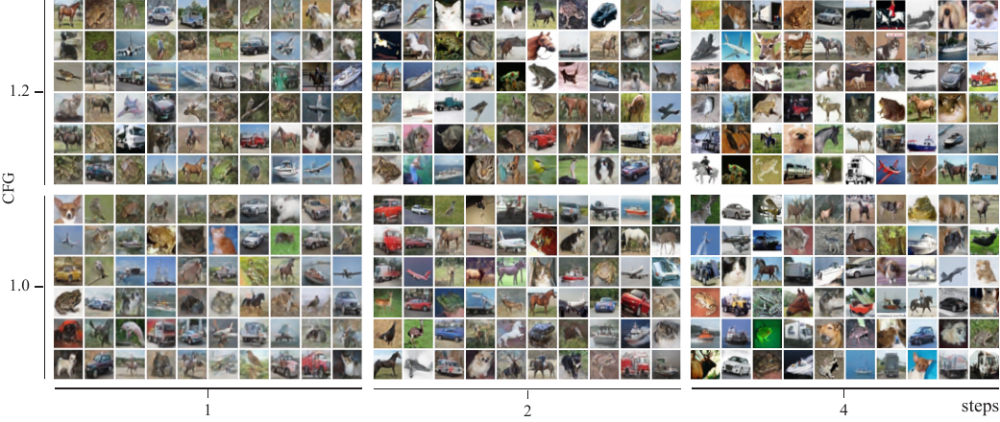
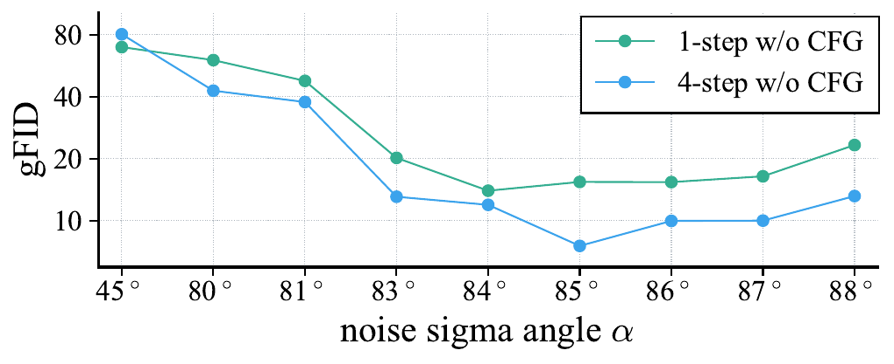

# Image Generation with a Sphere Encoder
https://arxiv.org/abs/2602.15030
(まとめ @cohama)

# 著者
- Kaiyu Yue, Menglin Jia, Ji Hou, Tom Goldstein

Meta と University of Maryland

# どんなもの？
- 画像生成を、diffusion の長い反復を使わずに autoencoder だけで少ステップ生成しようという論文。
- Encoder が自然画像を球面上へほぼ一様に写し、Decoder が球面上のランダム点から画像を復元する Sphere Encoder を提案。
- 1 step でもそれなりに生成でき、4 step 前後の反復で ImageNet でも competitive な品質まで持っていける、という主張

# 先行研究と比べてどこがすごい？
- 従来の VAE は latent を Gaussian prior に合わせようとするが、その分布合わせが再構成と衝突しやすく、posterior hole のせいで prior からそのまま引いた点を decode しても良い画像になりにくい。Sphere Encoder は latent を球面上一様に置くことで、この噛み合わなさを避けている。
- 従来の latent diffusion は VAE が作る潜在分布の穴を diffusion が埋めるが、この論文は潜在を最初から球面上一様に寄せて、「直接サンプルできる autoencoder」にしている。
- 従来の few-step diffusion や consistency model は元の diffusion 軌道を近似するが、この論文は diffusion 自体を捨てて、encode-decode の反復だけで画質を上げる。
- 1-step GAN より FID で常に勝つわけではないが、conditional/unconditional の両方を同じ枠組みで扱え、編集タスクまで自然につながる点は面白い。

# 技術や手法の肝は？
- 全体の流れはかなり単純で、`image -> encoder -> latent -> spherify -> decoder` という形。
- 推論時は球面上のランダム点を decode して 1-step 生成し、必要なら encode-decode を数回回して few-step refinement を行う。

## 球面潜在空間
- Encoder `E` は画像 `x` を latent `z` に写し、`v = f(E(x))` で半径 `sqrt(L)` の球面へ RMS 正規化する。
  - z の次元数は L = H/p * W/p * d

## ノイズ付き spherify
- 学習時は clean latent `v` だけでなく、`v_NOISY = f(v + σe)` も decoder に入れる。
- `σ` は Eq. (5) で `0` から `σ_max` まで jitter させる。これで各画像の周りにノイズ雲を作り、有限個の訓練サンプルだけでなく球面の連続領域を decoder に覚えさせる。
- 著者の説明では、noise が弱すぎると latent cloud 同士が離れたままで球面を覆えず、強すぎると復元が壊れる。このバランスを角度 `α` と NSR で解釈している。

## 損失設計
- 損失は Eq. (10) の 3 項で、`L_pix-recon`、`L_pix-con`、`L_lat-con` を足すだけの比較的素直な設計。
- `L_pix-recon` は noisy latent から元画像を再構成する損失で、smooth L1 と perceptual loss を使う。
- `L_pix-con` は noise の強弱が違う 2 つの latent から似た画像を出させる損失で、latent 空間を局所的になめらかにする。
- `L_lat-con` は `D(v_NOISY)` をもう一度 encoder に通し、元の latent `v` と cosine 類似させる損失。これが off-manifold な画像を再エンコードで「きれいな latent に戻す」役を持ち、few-step refinement の効きに直結している。

## アーキテクチャと few-step 生成
- Encoder と Decoder はどちらも ViT ベースで、末尾と先頭に 4-layer MLP-Mixer を挟んで token mixing を強める。
- 条件付き生成では encoder 側も conditional にして、各クラス単独でも球面全体を覆う conditional uniformity を狙う。ここは decoder だけ conditional にする設計との差分。
- 推論時は Algorithm 1 のように、最初は `D(f(e), y)` で 1-step 生成し、その後は `x -> E(x, y) -> f(z, sampling=True) -> D(v, y)` を反復する。
- CFG は latent 側、pixel 側、両方で使えるが、付録 C.1 では pixel 側が強く、4-step では combo も有効である。

# どうやって有効だと検証した？
- 評価は CIFAR-10 (`32x32`)、ImageNet (`256x256`) 等で生成し評価

- Ablation では noise angle `α` が重要。これは clean latent `v` と、noise を足した `v + σe` のなす角で、高次元では `tan(α) ≈ σ_max`（≒ NSR `η`）とみなせる。角度が大きいほど latent の向きが大きくずれ、大画像では `85°` 付近、小画像では `80°` 付近が良い。loss も 3 項すべて効いていて、ImageNet 4-step の gFID は `L_pix-recon` のみ 13.58 から、3 項すべてで 7.53 まで改善。
- Sampling scheme では「fixed noise strength + 同じ noise を全 step で共有」が最良で、ImageNet 4-step の gFID 5.99 と他設定より良い。

# 議論はある？
- 著者自身が proof-of-concept と言っていて、現状の最良 FID を追い切った論文ではない。特に ImageNet では StyleGAN-XL や最新 diffusion に対して明確な SOTA ではない。
- 一方で「low FID が perceptual realism と一致しない」点をかなり意識していて、4-step を qualitatively strongest model として出している。step を増やすと FID はさらに下がるが、構造が抽象化しすぎることがある。
- 弱点として、学習時は encoder と decoder の両方が必要で、さらに latent consistency のため encoder をもう一度通すので、学習コストは軽くない。
- 付録 B では CIFAR-10 を長く学習すると near-duplicate が出る例もあり、小規模データでの memorization risk は残る。
- 今後は pixel loss ではなく latent-based similarity や multi-stage loss を入れること、text-to-image へ拡張することが方向として挙げられている。

## 私見
- 球面に押し込めれば prior sampling がそのまま生成になる、という整理がかなりきれいで、VAE+diffusion の「最後のひと押し」を要らなくする発想が面白い。
- 一方で実際の性能は「4-step ならかなり良い」くらいで、完全に diffusion を置き換えた感じではまだない。
- few-step diffusion を distill する流れとは別筋の設計なので、representation autoencoder 系と混ざるともう一段伸びそうに見える。

# 次に読むべき論文は？
- High-Resolution Image Synthesis with Latent Diffusion Models, Robin Rombach et al.: Sphere Encoder が何を省略したいのかを理解するための基準線。VAE が作る latent と diffusion の役割分担がわかる。
- Consistency Models, Yang Song et al.: 少ステップ生成を diffusion 側から実現する代表例。この論文の few-step 反復との違いが見やすい。
- Diffusion Transformers with Representation Autoencoders, Boyang Zheng et al.: 「強い表現 encoder を使うと diffusion の学習が楽になる」という近い問題意識の論文で、Sphere Encoder との接続点が多い。
- Latent Variables on Spheres for Autoencoders in High Dimensions, Daibin Zhao et al.: 高次元球面 latent を直接扱う先行研究。Sphere Encoder が何をスケールさせたのかを追いやすい。
