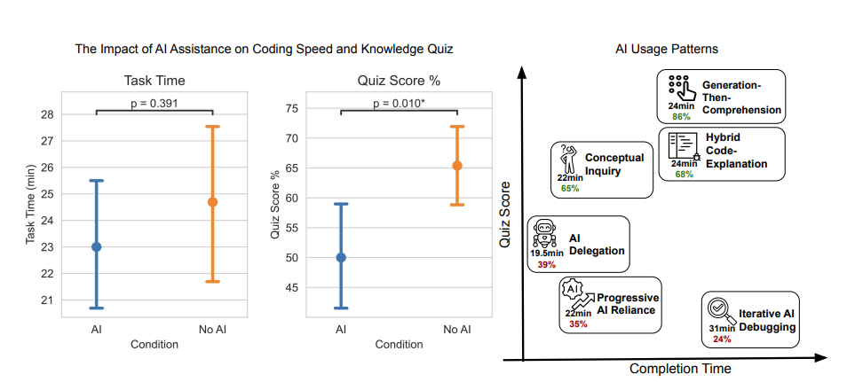
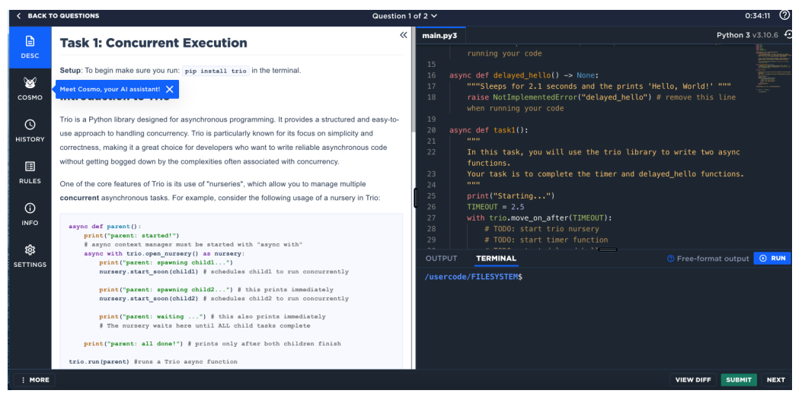
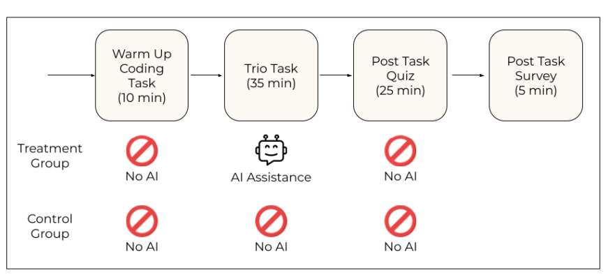
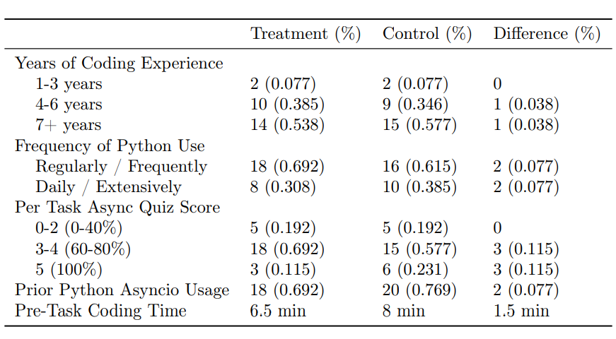
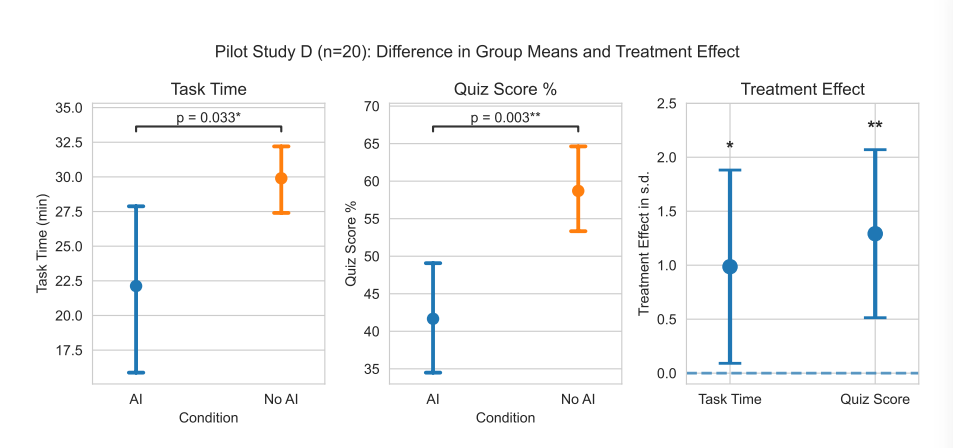
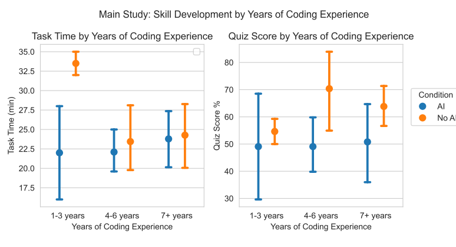
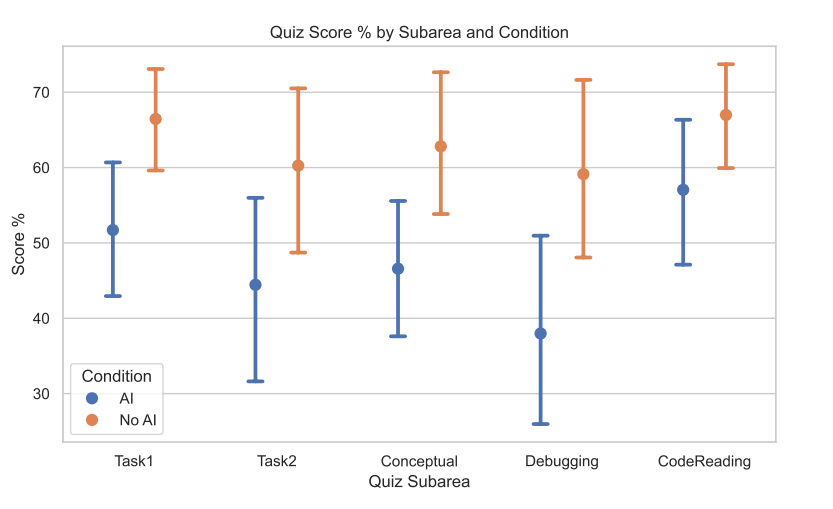
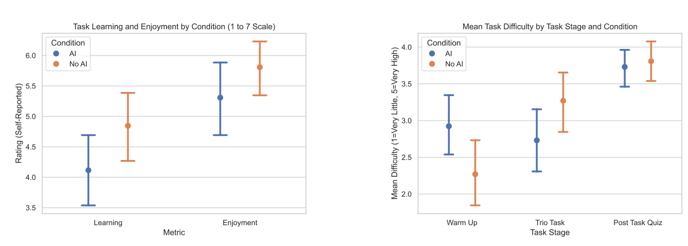
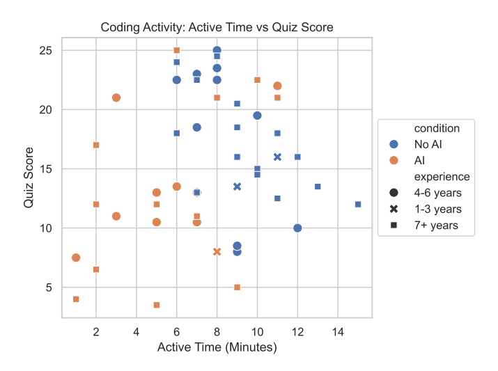

# How AI Impacts Skill Formation
https://arxiv.org/abs/2601.20245
(まとめ @n-kats)

# 著者
* Judy Hanwen Shen
* Alex Tamkin

Anthropicの研究

# どんなもの？

コーディングエージェントを使った開発が、プログラミング学習の妨げになるのか問題を実験した研究。

コーディングエージェントを使っても必ずしも妨げになるわけではなく、認知的関与を要求するいくつかのアプローチでは学習効果が確認できた。

* 横軸：かけた時間
* 縦軸：コーディング後にしたクイズの評価

AIを使うが、時間をかけて十分な理解を獲得するグループが存在

[【ジュニアエンジニア不要論】AI爆速開発は罠／本当に危険なのは中堅エンジニア？／ 和田卓人氏（テスト駆動開発実践者 t-wada氏）／前編（FOCUSTUDIO）](https://www.youtube.com/watch?v=BwqguC26MsY) でt-wadaさんが紹介してた。

# 先行研究と比べてどこがすごい？

Anthropicによる内部調査の公開に相当。

観測研究はいくつかある。

* 学生のケース
  * 能力の低い学生ほどAI支援を求める傾向が高かったことが指摘されている。（Generative ai in introductory programming instruction: Examining the assistance dilemma with llm-based code generators）

  * アンケート形式の調査でツールへの依存の懸念を確認 （Exploring the key factors influencing college students’ willingness to use ai coding assistant tools: An expanded technology acceptance model）
  * 授業課題にLLMを使うかの調査。上級生程LLMに頼らない傾向があった（Generating programs trivially: student use of large language models.）
* エンジニア？のケース
  * チャットモデルの使用パターンを調査。（Rocks coding, not development: A human-centric, experimental evaluation of llm-supported se tasks.）
  * AIツールでドキュメントアクセスが容易になり、支援効果を報告。（Developer experiences with a contextualized ai coding assistant: Usability, expectations, and outcomes.）

このように効果がありそうとか、みんなこう使っているんだって内容が多かった。

コーディングエージェントの使い方と学習の関係結び付けて考えた研究というのが特徴的なところ。

# 技術や手法の肝は？
## 問題設定

新しいスキルが必要な場面で、

1. AIはタスク完了は生産性向上に寄与するか
1. AIはスキル習得にどう影響するか

を調べる

## 課題
pythonの[trio](https://github.com/python-trio/trio)という非同期処理ライブラリで実験。asyncio程有名でないことと、このライブラリ固有の概念（構造化並列処理？）があることが選ばれた理由。

5タスクを作成したが、予備調査の結果をもとに2タスクに絞って本番は実施。
* タイマー作成の問題（ほかの処理が動作している中で動くようなもの）（ログに時間を吐き続ける感じ？）
* Trio関係のエラー処理の問題

実験専用UIを作成して、オンラインで実施。モデルはGPT-4oを利用（claudeじゃないんだ）。

## クイズ方針
「Design an assessment for an introductory computer science course: A systematic literature review」に基づき、習熟度を評価するために、デバッグ、コード読解力、コーディング、概念理解を問うクイズを作成しようとした。コーディングは構文エラーなどの凡ミスで正しく評価できないので、除去した。

無意味なクイズが無いこと（その問題の有無がトータルスコアと相関が十分あること）、適切な平均スコアであること、他のクイズから答えが推測できないこと、を満たすように予備実験で調整（5バージョンやった）。

最終的に、合計27点の14質問の構成に。

## 実験の流れ

* 事前に練習問題をする（UIになれるため）
* 本番タスクをする（AIOKのグループだけここでAIが使える）
* クイズをする
* アンケートに答える（一般的な属性・プログラミング経験）

## 対象者
52で実施し、26人ずつにわけた。
* python経験1年以上
* 週一以上pythonを書いている
* コーディングエージェントの経験あり
* Trio利用経験なし
の条件で募集（クラウドワーカープラットフォーム経由で150ドルで募集）

## 事前実験

### AI禁止ルールの徹底
AI禁止の参加者の35%がAIを利用していた。
禁止の説明をしっかりしても状況が変わらず、画面を撮影することで、ルール違反が起きないようにした。

### クイズのリーク
録画を見ると、クイズを行ったり来たりして、別のをヒントに回答しているのがわかった。クイズの内容を調整して対応。

### タスク数の調整
タスクが多い（AIを利用するとそうなりやすい）と、制限時間内に取り組めたタスク数が、クイズのスコアに影響する。なので、タスクを減らした。

### 説明文の調整
AIを利用しないグループだとpythonの構文で詰まっていることが見られた（try/except）。本題と関係ないので、ヒントを追加した。

# どうやって有効だと検証した？
## 主結果

エラーバーは95%信頼区間。AIによる、時間への影響は小さいが、クイズスコアへの影響は大きい。

## 経験の影響

経験の浅い人でAI無しの人はタスクに時間がかかっている。スコアはAIを使った人より平均はよい（ベテランよりも良い）。

## クイズ種類間の比較

ほとんどすべて大きな差がある。コード解読だけ差が小さい。

## 心理的影響の比較

AIを使わない法が勉強になって楽しかったという感想になった。

難易度は、クイズは変わらないが、練習問題への印象が分かれた（AIグループはタスクより練習のほうがやや難しいと言っている）。

## 定性的分析

画面録画を確認してアノテーションして分析した。以下のタイミングのタイムスタンプと一部はカッコ内の詳細属性をアノテーション。

* タスクの開始
* AI操作（+ 利用パターン）
* AIの結果取得（+ クエリ本文）
* 検索（+ 検索クエリ）
* 貼り付け
* コピー
* エラー（+ エラーメッセージ）
* ツール側のエラー
* タスク完了
* タスク提出（+ コード）

これらをもとに、AIの利用時間、クエリの種類（概念質問、コード生成、デバッグ、それらの組み合わせ）、エラーの回数、コーディング時間を抽出した。
### 相互作用パターン/低得点
* AI Dlegation: AI丸投げ（4人）
* Progressive AI Reliance: 少し質問したが実質AI任せ（4人）
* Iteraive AI Debugging: デバッグ・検証をAI任せ（4人）

### 相互作用パターン/高得点
* Generation-Then-Comprehension: 生成後、質問（2人）・・・AI丸投げに似ているが、理解するためにAIを使っているグループ
* Hybrid Code-Explanation: 説明と同時生成（3人）
* Conceptual Inquiry: 概念のみ質問（7人）・・・高得点グループかつ高速・・・AIなしと同程度くらい？

### コーディング時間とスコアの分布

AI利用者ははっきりとコーディング時間が減っているが、スコアも下がっている。（例外的な人は何をしたのだろう）

### その他の結果

* エラー発生頻度・・・AIありの方が当然のように少ない
* クエリのパターン
  * 説明(n=79)
  * コード生成(n=51)
  * デバッグ(n=9)
  * 能力に関する質問（「現在の質問は？」などのメタな質問）(n=4)
  * 感謝(n=4)

# 議論はある？
AIを使ってもクイズで高得点をとったグループは認知的関与が大きいグループだった。一方、AIを使って速くなるのは一部だけだった 。クエリ作成に時間を使っていた（平均19.5分中の10分）。

積極的に認知的に関与しないと悪影響が出る可能性がある。
AIでスキル形成が阻害されてた結果、身に着けるべきコード検証・デバッグにスキルが身につかなくなる可能性もある。

## 私見

UIへ慣れる時間が短すぎるのでは？

codexを魔改造しているけど、「デバッグ・検証をAI任せ」にしているので、確かに納得の結果（理解していない）

大規模なコードベースではどう学習すると効果的なのかが気になる（一回の生成が大規模になるから、理解しきれない問題）。何を理解するとよいのかってのが重要かも（概念のみ質問がAIなしと同じくらいだったので、概念を理解するのが重要だった？）

仕事で作っていたツールにクイズ機能を追加した。

# 次に読むべき論文は？
* trio
* リポジトリ・PRからクイズを出せるツールたち
  * https://github.com/anoopkarnik/git-grasp
  * https://github.com/tidewave-ai/pr-quiz
  * https://github.com/dkamm/pr-quiz