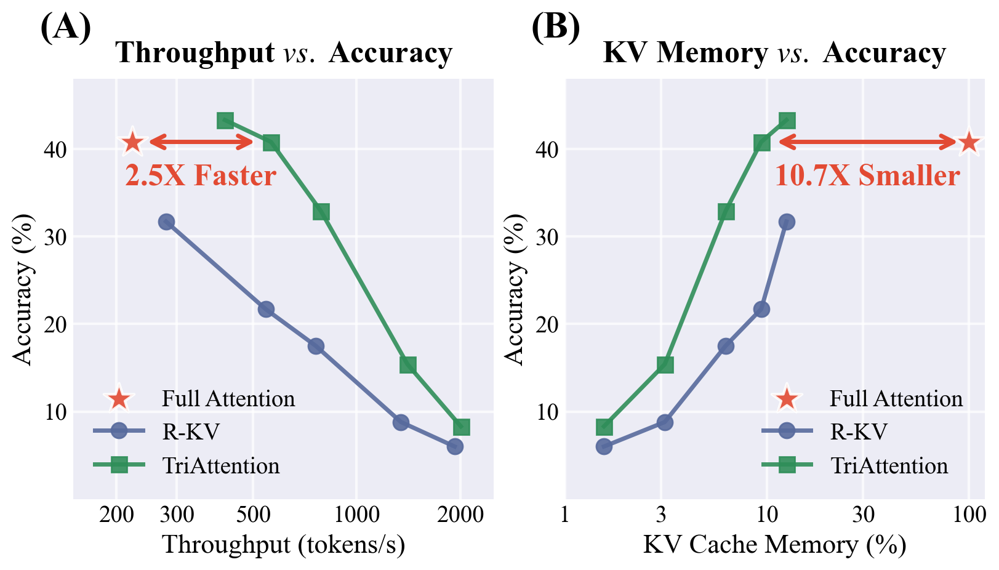
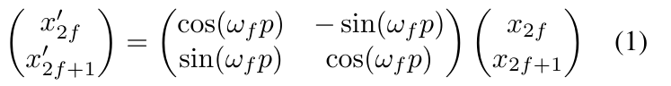
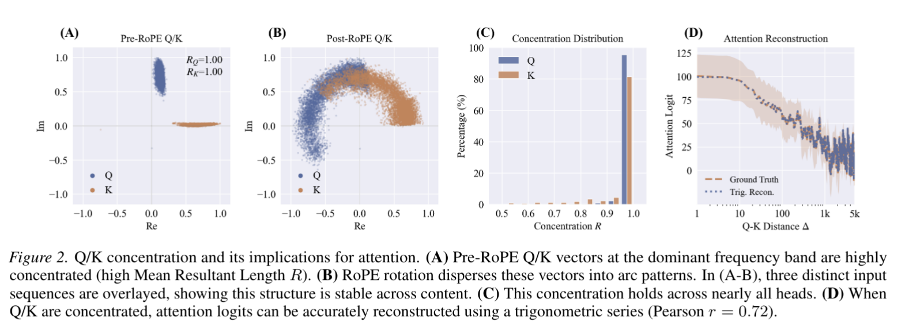
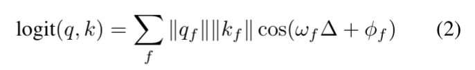
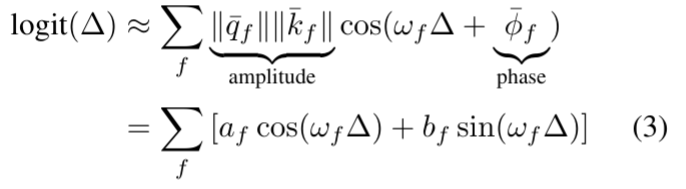
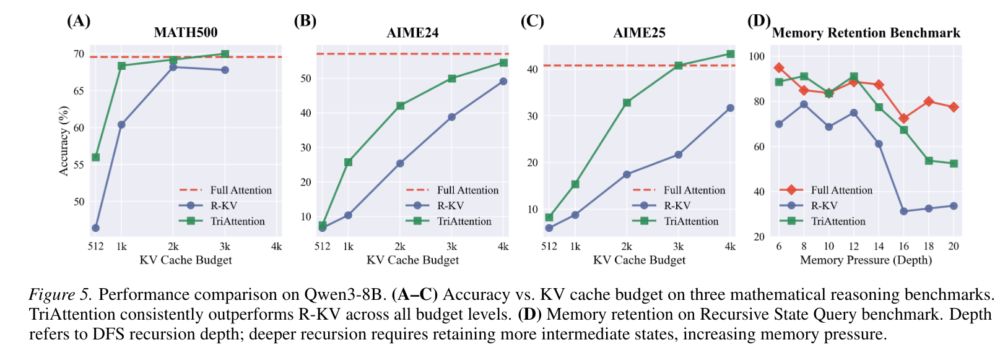
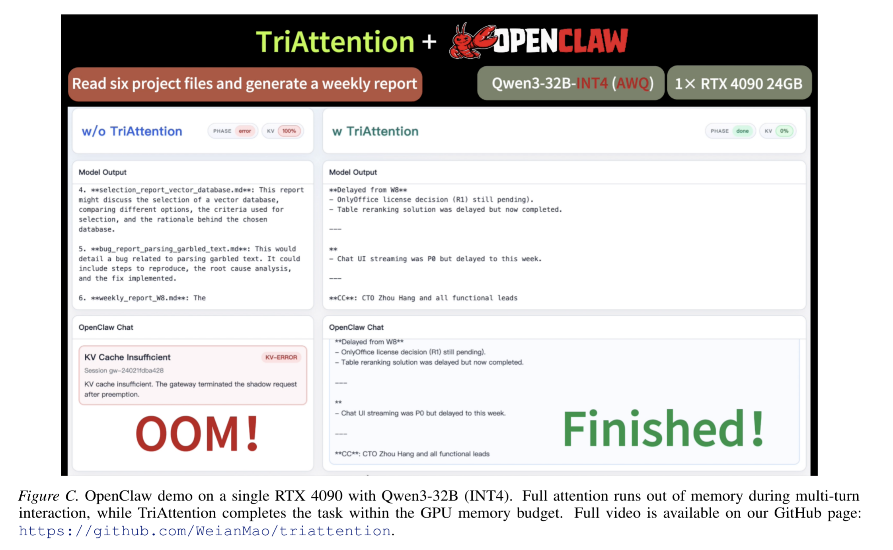

# TriAttention: Efficient Long Reasoning with Trigonometric KV Compression
https://arxiv.org/abs/2604.04921
(まとめ @cohama)

# 著者
- Weian Mao
- Xi Lin
- Wei Huang
- Yuxin Xie
- Tianfu Fu
- Bohan Zhuang
- Song Han
- Yukang Chen

MIT、NVIDIA、ZJU

# どんなもの？
- LLM における KV Cache の圧縮の新しい手法。圧縮なしと同程度の精度で 2.5 倍のスループット向上、10.7 倍のメモリ効率を実現

# 先行研究と比べてどこがすごい？
## 前提
### KV Cache
- LLM では通常 KV Cache という手法が使用される。これにより毎トークン生成時に、過去のトークンに対する Attention の計算を省略し、生成速度を向上させることができる。
- 一方で、KV Cache はトークン数に比例したメモリ量が必要でボトルネックになりうるため圧縮する手法が種々研究されている。

### RoPE (Rotary Position Embedding)
- 近年の LLM では Rotary Positional Embedding (RoPE) が主流

### 先行研究との違い

- この RoPE を適用する前をキャッシュする pre-RoPE と、適用した後をキャッシュする post-RoPE の 2 つの考え方があるが、現行の手法は Post-RoPE が主流だった。
- Pre-RoPE のベクトルのほうが性質がよいことを突き止め、そこから重要なトークンだけを残すような圧縮手法を設計

# 技術や手法の肝は？
## TriAttention

- Q, K は Pre-ROPE で密集していることを仮定すると、Q と K の計算 (Softmax に入れる前の logit) は Q と K の距離の関数とみなせる。

- これによって、あるヘッドにとって「近いトークンが好き」「少し離れたトークンが好き」「遠いトークンが好き」といった距離選好を予測できる
- 将来の距離 Δ に対して、key の重要度を見積もることができる。
- Score の重要度順に B (Budget) 個の key を残すことで、KV Cache を圧縮する。

# どうやって有効だと検証した？

- 特に、長文の推論が必要なタスクを中心にベンチマークを実施。
- 下手な KV Cache だと推論の仮定が圧縮された結果答えにたどり着けない

# 議論はある

(私見)

- RoPE 前提ではあるが、ベクトルの集中などをちゃんと観測して、数式のレベルで検討されているのがすごい
- OpenClaw をローカル LLM で動かして、Full Attention で OOM になるが、 TriAttention だと動く、みたいな実験もあっても面白い

# 次に読むべき論文は？
- SnapKV: LLM Knows What You are Looking for Before Generation, Yuhong Li et al.: 直近 query の attention score から token importance を推定する代表例
- R-KV: Redundancy-aware KV Cache Compression for Reasoning Models, Zefan Cai et al.: reasoning 特化 KV compression で window-based pruning という手法を採用
