# RoPE Distinguishes Neither Positions Nor Tokens in Long Contexts, Provably
https://arxiv.org/abs/2605.15514
(まとめ @n-kats)

# 著者
* Yufeng Du
* Phillip Harris
* Minyang Tian
* Eliu A Huerta
* Srikanth Ronanki
* Subendhu Rongali
* Aram Galstyan
* Hao Peng

イリノイ大学・ボン大学・アルゴンヌ国立研究所・AmazonAGIの人たち

# どんなもの？

トランスフォーマーでPositional embeddingの代わりにRoPEを使う方法で相対位置を反映する方法が最近多いが、コンテキスト長が長いと、アテンションがでたらめになることを理論的に示して、簡単なケースで例示した論文。

* 位置反転
* 位置エイリアシング
* トークン反転
* トークンエイリアシング

という現象が高確率で発生することを指摘。

# 先行研究と比べてどこがすごい？
既存のRoPE系の研究は、パラメータや運用を工夫して精度をあげる取り組みが多い。

その中で、RoPEが思ったほど効果がない（RoPEが目標としている長いコンテキスト長で苦労している）という観測がある程度あった。

この論文は、原因現象を突き止めて、それがRoPEの本質的な問題なのか、単にパラメータ設定の問題なのかを明らかにしたのがすごいところ。

（appendixにしっかり証明を書いているけど、そこまでは追えていない）

# 技術や手法の肝は？
## 指摘した現象

* 位置反転
* 位置エイリアシング
* トークン反転
* トークンエイリアシング

が指摘している。これらを説明する。

### 位置反転
同じトークンの位置を離したのに、逆にアテンションが大きくなってしまう現象。

近いものを強めたいのでは？できてなくない？って現象。

### 位置エイリアシング
同じトークンの位置を色々変えた結果、この位置とこの位置でアテンションが同じになるという組み合わせが発生する現象。

（位置反転を許したとしても、）位置が区別できていないという現象。

### トークン反転
ある位置に、異なるトークンを挿入する場合を考える。アテンションの大きさが挿入位置によって逆転する現象。

例えば

1. pet cat ...
2. pet number ... 
3. pet ... cat
4. pet ... number

の4ケースで、1＞2なのに、3＜4になってしまう現象。

### トークンエイリアシング

トークン反転と同じ設定で、挿入位置によって二つのトークンのアテンションが同じになってしまう現象。

## 復習/RoPE
AttentionのKとQの内積を計算する前に、位置に合わせて回転する手法。2次元ずつに分けて、以下の式で回転。

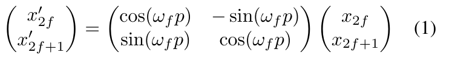 

（前回のTriAttentionから拝借）

この回転の内積の影響は、位置の差で決まるので、位置埋め込みのような役割をする。（平行移動しても、同じだけ回転が増えて内積が打ち消される）

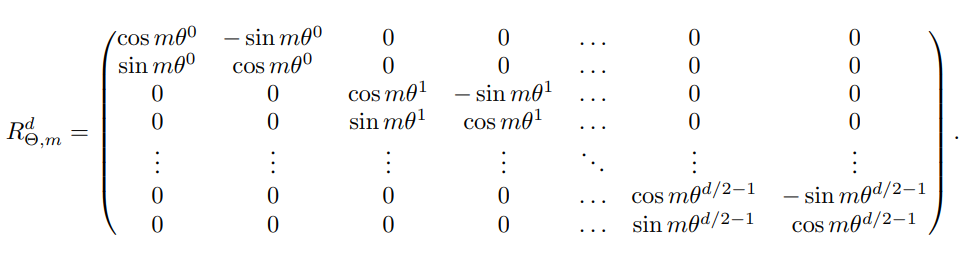 

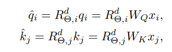 

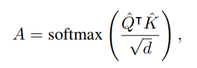 

（複素数と思って立式したら良いのでは？と最近思う）

### RoPEのパラメータ
* d: 次元
* h=d/2: 2x2のブロックの数
* B: RoPEの基本的なパラメータ（RoPE base）
* Θ = B^{-1/h} RoPE frequency
* m: 位置

## RoPEの式の簡易化
a * cos(mΘ^n) + b sin(mΘ^n) のような項の和になるので、和積の公式でcosにまとめる。

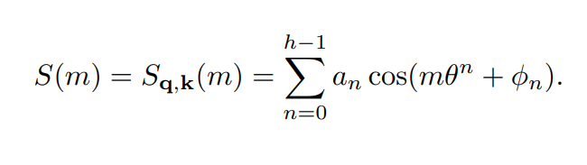 

ここで、mは相対位置で、a_nやφ_nはQとKの値のみで決まる値。Q,Kを固定した設定だったら、こういう三角関数で表現した関数の性質だけ考えればよいというのがポイント。

Θ^nはn=0のとき1、n=hのとき1/Bになる。この範囲で適当に係数つけてcosをかまして足す式。

## RoPEの分析
### 高周波帯と低周波帯の動きの違い

Mをコンテキスト長のリミットとして、h * log_B M くらいのスケールの値を閾値として（Θ^nが1/Mになるところ）、それよりnが少ないものを高周波、大きいものを低周波としてあつかう。

もっともシンプルなケースa_n=1,φ_n=0の場合をグラフにすると、以下のようになる。

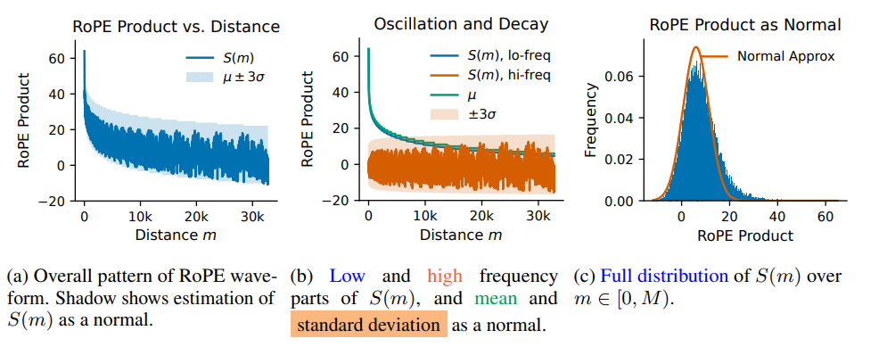 

左図: mを変化させたときのS(m)の変化（結構ギザギザしている）
中央図: 低周波と高周波に分けた図。高周波部分が激しく上下している。低周波で近くのものを、高周波で全体をとらえるような仕組みになっている。
右図: S(m)の値のヒストグラム。正規分布に近い形をしている

## 正規分布で近似できる
実際に、ある意味で極限をとると正規分布になる（中心極限定理で示す）

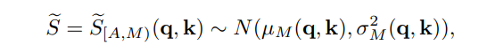 

理論的な部分はこの正規分布化がその根拠になっている

# どうやって有効だと検証した？
## 位置系

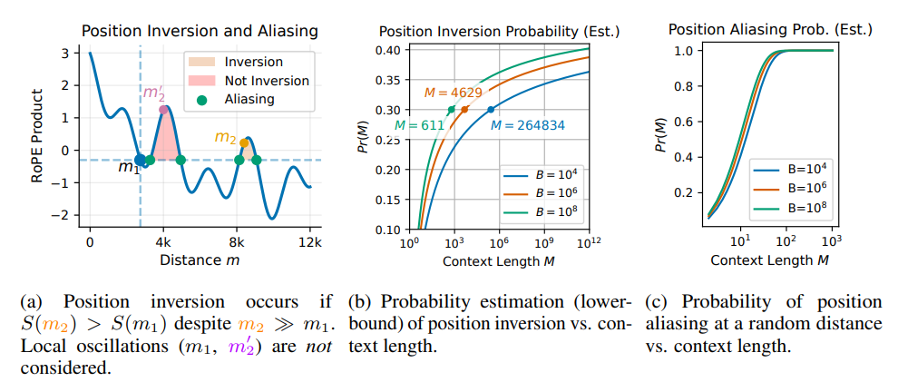 

左図のm1とm2のように、結構離れているのにm2の方が高い現象が位置反転。m1と同じラインのものが位置営利アッシング。

それぞれ、現実的なコンテキスト長Ｍでそれなりの頻度で発生する。

### 位置反転
同じトークンの位置を離したのに、逆にアテンションが大きくなってしまう現象。

式にすると、S(m1) ＜ S(m2), m1 ＜M/2≦ m2のようなケースのこと。

logM*logB → ∞ に従って、位置反転が発生する確率の下限が1/2に収束する。

Lamma3-1-8Bの最初のAttentionの部分で実験した結果が次。

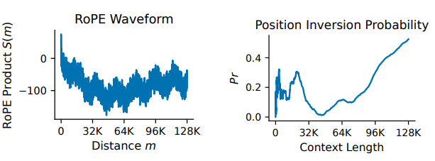 

attentionの値が、途中まで下がって行くのに、50Kあたりから徐々に増えていく。

Position inversionとして見ると、50kがスイートスポットのようになっていて、以降、どんどん増えていく。

## 位置エイリアシング
同じトークンの位置を色々変えた結果、この位置とこの位置でアテンションが同じになるという組み合わせが発生する現象。

Mが増えるにしたがって、位置エイリアシングの発生率が1に収束する。その個数もMやBにしたがって増える。

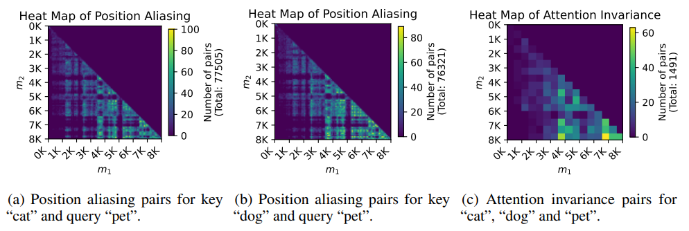 

m1,m2のどちらかが小さいと、位置エイリアシングはほとんど起きないが、長くなるにつれ、高頻度に発生する。

必ずしも対角成分のみで発生するわけでもない。

## トークン系

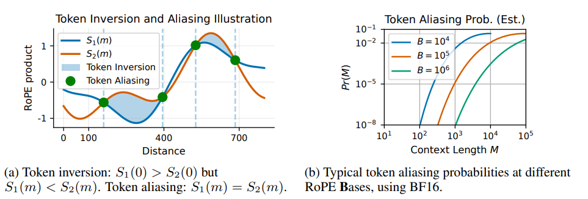 

* S1: petとcatの組でのアテンションの値
* S2: petとnumberの組でのアテンションの値

S2の方が全体的に低くなりそうなものだが、逆転現象（トークン反転）や重なる場所（トークンエイリアシング）が発生する

### トークン反転
ある位置に、異なるトークンを挿入する場合を考える。アテンションの大きさが挿入位置によって逆転する現象。

トークン反転は、Mが増えると発生確率の下限が増え、1/2に収束する。一方で、Bを増やすとトークン反転は減る。

実験では、以下のようになった。序盤はよいが、左図のDiffを見ると、正負を行き来している。

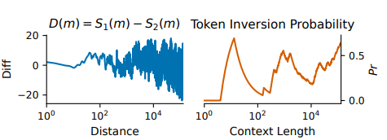 

### トークンエイリアシング

トークン反転と同じ設定で、挿入位置によって二つのトークンのアテンションが同じになってしまう現象。

トークンエイリアシングもMが増えると増え、Bが増えると減る関係にある。2^{-f}M√hのオーダーで発生する。（fは値のビット数）

（別のケースのグラフっぽいけど（numberじゃなくてdogを対象にしている？））このようにそれなりの頻度で発生している。

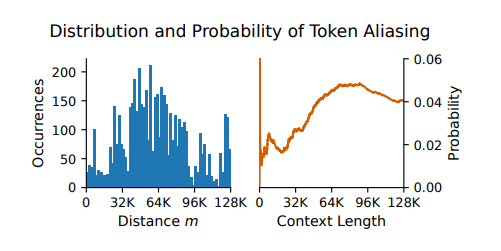 

## その他/値取得実験
数字の列を与えて、N番目を答えさせる佐をしたときに、トークン数によってどのモデルも精度が落ちる。このような現象の一因になっているのではないかと指摘している。

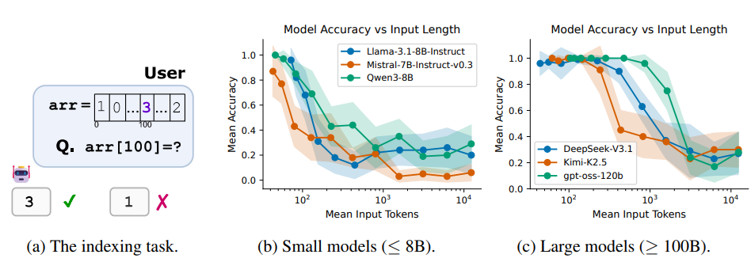 

# 議論はある？
長いコンテキスト長だと、RoPEのアテンションが位置やトークンの識別を本質的に区別できないことを指摘。

これらがうまく扱える方法だが、それだけでなく、長さを拡張する代わりの方法（再帰やエージェント的なアプローチ？）も検討すべき。

## 私見
RoPEが確定的なアプローチと思っていたが、決してそうでなく、たまたま扱っている範囲でうまくいっている（失敗しても他で満足している）だけと認識させられた。

GWにRoPEってK,VがU(1)（つまり2次元の回転）の作用があるものだよね？一般のリー群Gとその表現に拡張できる？（GRAPEって手法とかがあるらしい）などと考えていたので、RoPE熱が上がっていたが、確率計算で否定的な主張をするのも面白いと思った。

# 次に読むべき論文は？
* GRAPE: https://arxiv.org/abs/2512.07805
* Hecke代数（一般化しようとする話をチャッピーにしていて、出てきた）