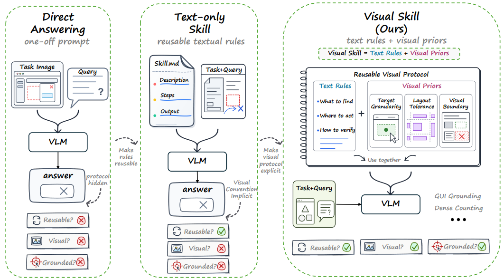
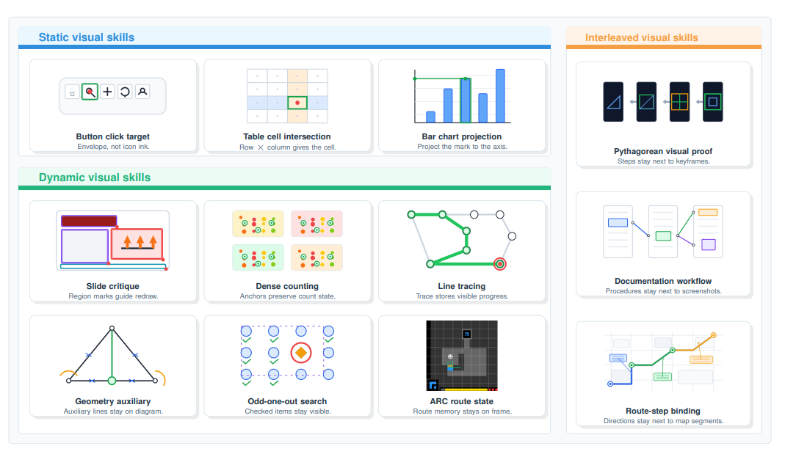
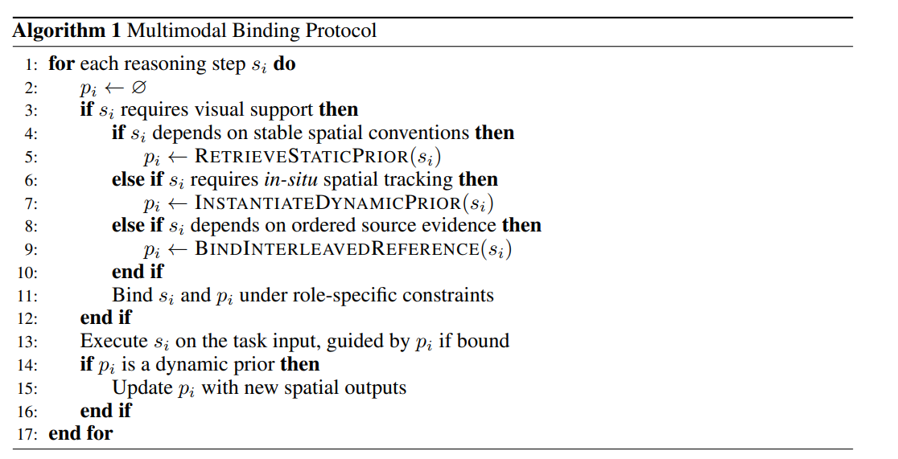
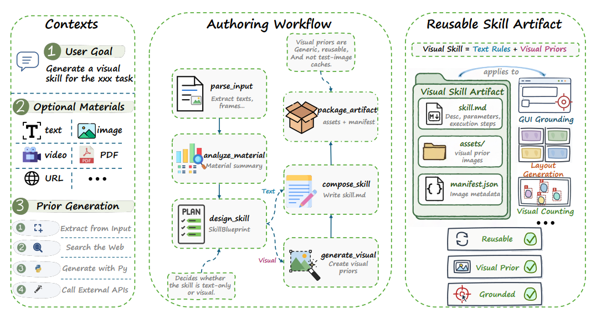
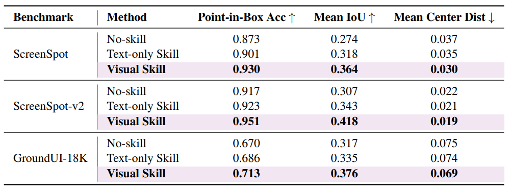
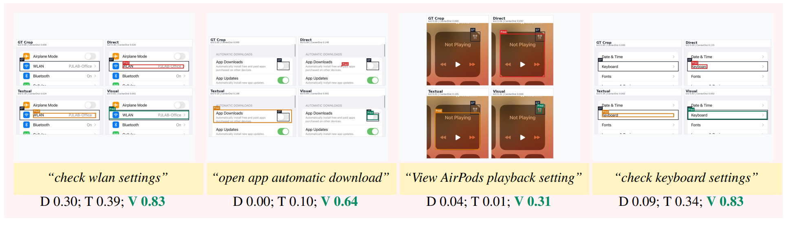
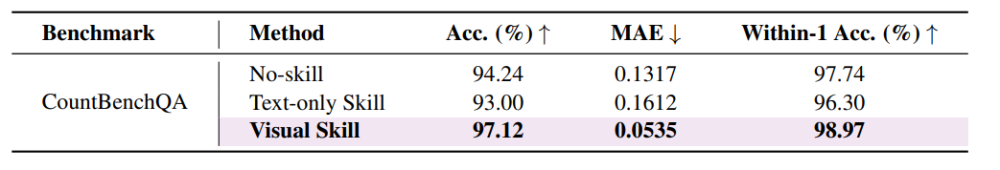
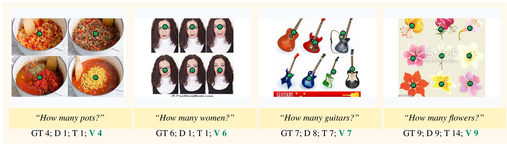

# Agent Skills Should Go Beyond Text: The Case for Visual Skills
https://arxiv.org/abs/2606.01414v1
(まとめ @n-kats)

# 著者
* Binxiao Xu
* Ruichuan An
* Bocheng Zou
* Hang Hua

北京大学、ウィスコンシン大学、MIT-IBM Watson AI Labのメンバー。

# どんなもの？

AIのドメイン知識を与えるために、テキスト形式でスキルの説明を準備する方法がとられている。

この論文では、テキストだけでスキルを表現するのではなく、画像も使うべきだ（ビジュアルスキル）と主張し、実際に精度改善に寄与したことを実験で示した。

また、ビジュアルスキルを自動で作るツールのAutoVisualSkill（(https://github.com/Little-Fridge/AutoVisualSkill)[https://github.com/Little-Fridge/AutoVisualSkill]）を紹介している。

# 先行研究と比べてどこがすごい？
LLM活用の新しいパラダイムとして、ビジュアルスキルを提案。その効果を実験で示し、どのような場合にそれが必要なのかを整理している。

つまり、
* テキストのあいまいさの対策
* 動的追跡（物体のカウントなど）

のような、ことが目指していること

視覚構造を再利用可能な手続き的知識に保持することが必要で、画像をそれに用いるという話。

# 技術や手法の肝は？
## 概要

実験ではこの3つを比較する

* Direct: 説明とかなく直接質問
* Text-only Skill: テキストで説明を追加する
* Visual Skill（提案手法）:画像の説明も追加する

## 想定用途

* 静的
  * 画面操作
  * 表・グラフ
* 動的（現在情報を伝えるなど）
  * スライド分析
  * カウンティんぐ
  * 線の追跡
  * 初等幾何学
  * 異常検知
  * 視覚パズル（ARC）
* 手順・組み合わせ
  * 証明の流れ
  * ワークフロー

## 疑似コード

推論ステップごとに、問題の種類で分岐させてから、画像を選ぶプロンプトを実行する。
動的タスクの場合は、そのステップでの情報を画像に反映する（カウンティングだったら、番号を振るなど）。

## AutoVisualSkill

[https://github.com/Little-Fridge/AutoVisualSkill](https://github.com/Little-Fridge/AutoVisualSkill)

コーディングエージェントの文脈のスキルの形式でスキルを作成する（skill.md、manifest.json、画像アセット、プロべナンスレコード（参照・素材元など））。

具体的なプロンプト・・・[https://github.com/Little-Fridge/AutoVisualSkill/blob/main/autovisualskill/prompts/templates.py](https://github.com/Little-Fridge/AutoVisualSkill/blob/main/autovisualskill/prompts/templates.py)

かなり具体的に（Pillowの使い方まで）説明している。

### 処理の流れ
1. 入力の準備・正規化・知識取得（検索など）
1. 視覚情報の必要性、種類（静的・動的・手順）を判定
1. ルールを作成
  1. テキスト部分: 宣言的なロジックを記述する
  1. 視覚部分: 必要なら画像に情報を上乗せする
1. メタ情報作成（manifest.json）

# どうやって有効だと検証した？
## 問題設定
Direct/Text-only/VisualSkillの3パターンで調べる。

タスクは、
* GUI操作箇所特定（ボタンとか）
  * ScreenSpot/ScreenSpot-v2/GroundUI-18K
* 物体カウンティング
  * CountBenchQA

## GUI操作箇所特定
Qwen3-VL-32B-Thinkingで実験。

大幅に改善するものの、満点になるほどではない。テキストのみのスキルで改善分よりも、テキストから視覚情報を追加した改善幅の方が大きい。

テキストだけでは説明が難しい部分を説明できるのがビジュアルスキルの魅力。

## 物体カウンティング
Gemini-2.5-Proで実験。

カウント済みの物体を座標で指示してもうまくいかず、視覚的に反映しないと効果がない。

テキストのみを加えても逆に混乱してスコアが落ちている。
ビジュアルスキルで大きく改善している。

# 議論はある？
* few shotとはちがう: 例（入力と正解）をfew shotではあたえる。コンテキストのキャッシュの役割。ビジュアルスキルは、永続的で再利用可能なあスキルの形にするのが目的
* 賢いモデルになれば解決するわけではない: テキストで表現が困難な内容（あいまいになる）を画像で表現した対応するのが目的。ただし、モデルによって、画像以外の与え方が有力になるかもしれない。（動画・音声など）
* どのような画像を用意するべきか: 単に事例ではなく、説明のための抽象化が必要。テキストで十分なものは不要（難しい形状・位置・境界・レイアウト・空間的手順がおすすめ）。
* ビジュアルスキルが向かない例: 記号的タスク（代数計算やコード生成）、モデルの自由な回答がほしいとき

## 私見
AutoVisualSkill自体をちゃんと評価しているわけではない。
似た実験をしたことがあるけど（してもらった）、VLMの性能ってそこまで完璧ではない（カウンティングなど）。ちょっとよくなるくらいの気持ちで扱うといいのかも。

# 次に読むべき論文は？
* GRAPE: https://arxiv.org/abs/2512.07805
* Hecke代数（一般化しようとする話をチャッピーにしていて、出てきた）