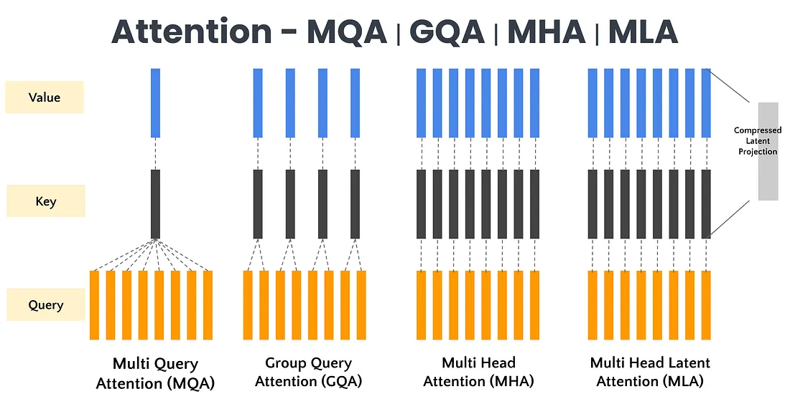
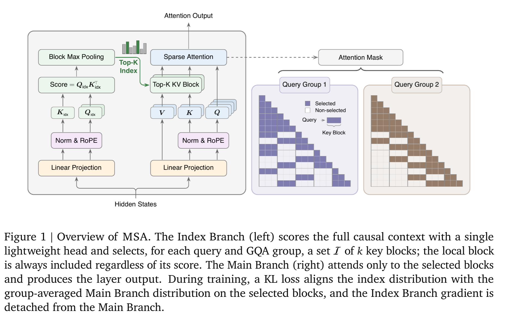
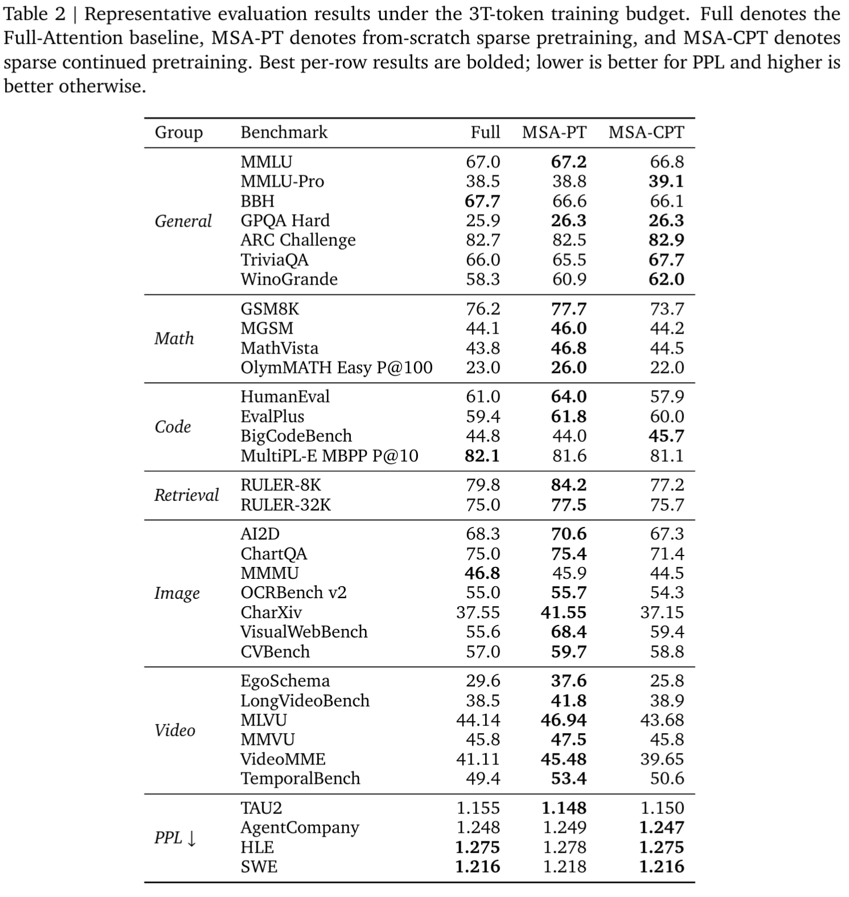
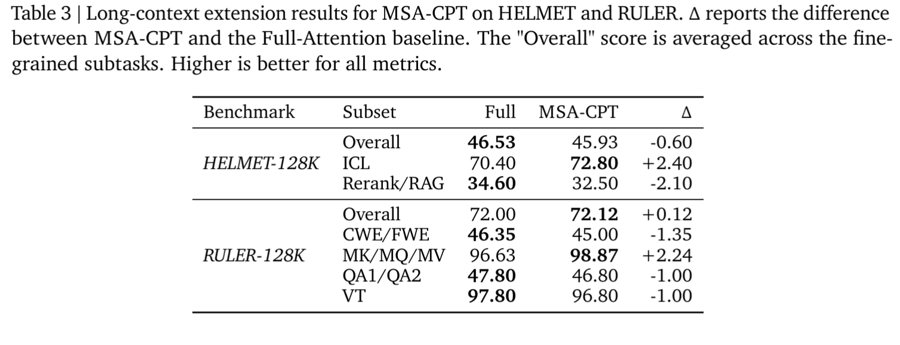
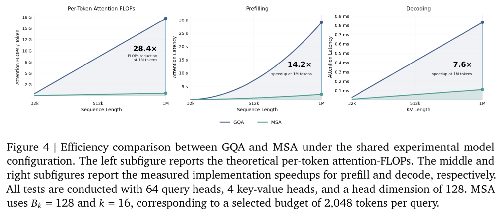

# MiniMax Sparse Attention
https://arxiv.org/abs/2606.13392
(まとめ @cohama)

# 著者
* MiniMax の人たち

# どんなもの？

- 1M token のコンテキストを効率的に扱うための軽量な Attention を提案した論文。
- 109B のモデルで 1M context 時の attention FLOPs を 28.4 倍削減
- 実測でも H800 で prefill 14.2 倍、decode 7.6 倍の実測高速化を出している。

# 先行研究と比べてどこがすごい？

- Attention の軽量化は2つの方向性がある
  - Full Attention の計算を Linear や Recurrent のような代替手段で置き換える方向
    - Linear Attention, Mamba など
  - 計算は Full Attention のまま、見る token を sparse に選ぶ方向
    - Fixed Pattern Attention など (Sliding window)
- 後者でも固定パターンでなく、入力に依存した範囲の限定する手法もある (adaptive sparse attention)
  - NSA は MQA/MHA の3本の並列ブランチでそれぞれ大域文脈用の compressed attention、細粒度の selected attention、近傍文脈用の sliding window attention を作る
  - DSA は軽量 indexer で token を選び、選ばれた token 上で dense attention をする
- MSA はこれらの後継

# 技術や手法の肝は？

## 予備知識

### GQA (Grouped Query Attention)

https://verticalserve.medium.com/group-query-attention-58283b337c65 より

よくある MHA (Multi-Head Attention) は、query head と key/value head が同数で、head ごとに attention をとる。
GQA では query head を複数の group に分けて、group ごとに同じ key/value を見るようにする。

### Sparse Attention

Sparse Attention は、どの key を選ぶかの Index Branch と、選ばれた key 上での attention 計算を行う Main Branch からなる。
MHA もヘッドごとに異なる K, V を参照するというのも (固定の) index を選ぶという意味として考えることもできる。

### GQA-based Block Sparse Attention

GQA の上で、Sparse Attention を組み立てることを考える。
GQA の各ブループで index を共有することができる。
また、token 単位でなく block 単位で選ぶ。

## MSA

MSA は GQA ベースの sparse attention を元にしている。
軽量な Index Branch が小さな集合の key block を選択、Main Branch がそれらの block 内の token に対して Attention を取る。

# どうやって有効だと検証した？

検証は 109B parameter、41-layer の MoE ベースモデルを使用。

比較対象は
* Full Attention の GQA baseline
* 最初から sparse で学習する `MSA-PT`
* 2.6T token 学習済み full-attention checkpoint を sparse 化して 400B token 継続学習する `MSA-CPT`

## 長文の場合

## 効率

左: 理論値
中: prefill (入力を読み込んで KV Cache を作るまで) 実測
右: decode (KV Cache から1token生成) 実測

# 議論はある？

- より長い sparse 学習、 推論時だけ大きい selection budget、 よりリッチな indexer scoring

## 私見

- Sparse Attention というのをあまり知らなかったので、この論文をきっかけに色々と調べてみると面白そう。
- LLM 以外にも Attention 計算はあるので (Vision とか) その応用があるかあ気になる (調べていない)

# 次に読むべき論文は？

* GQA: Training Generalized Multi-Query Transformer Models from Multi-Head Checkpoints, Joshua Ainslie et al.
* Native Sparse Attention: Hardware-Aligned and Natively Trainable Sparse Attention, Jingyang Yuan et al.
* MoBA: Mixture of Block Attention for Long-Context LLMs, Enzhe Lu et al.
  * NSA と同じく GQA 上の block sparse attention 系
