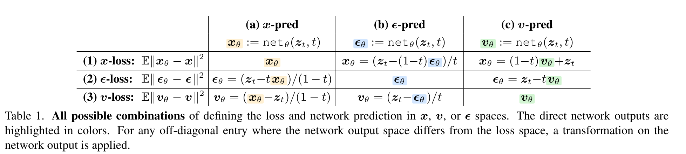
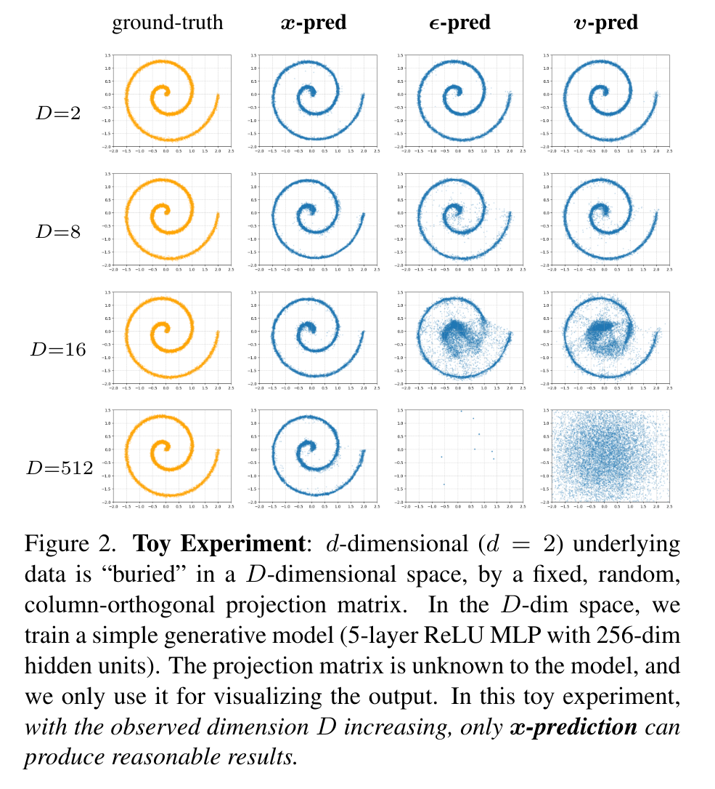
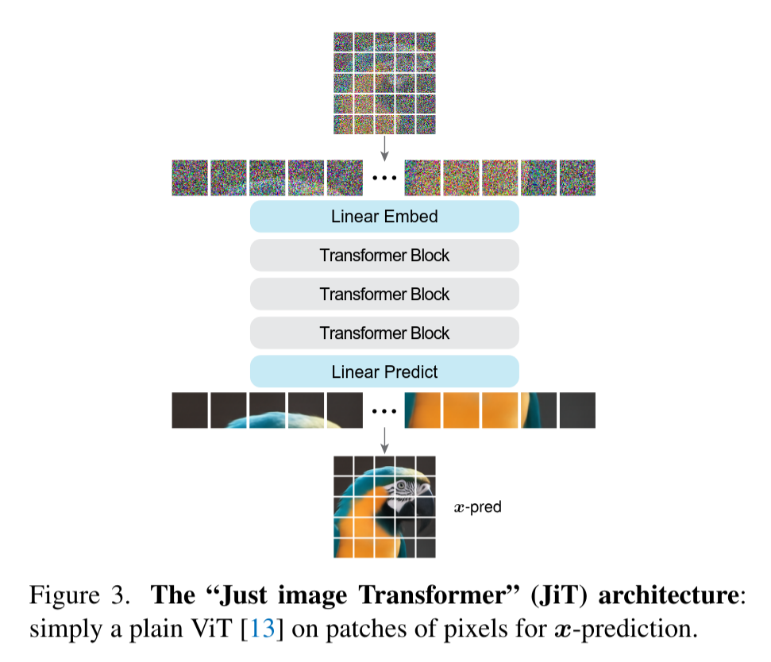
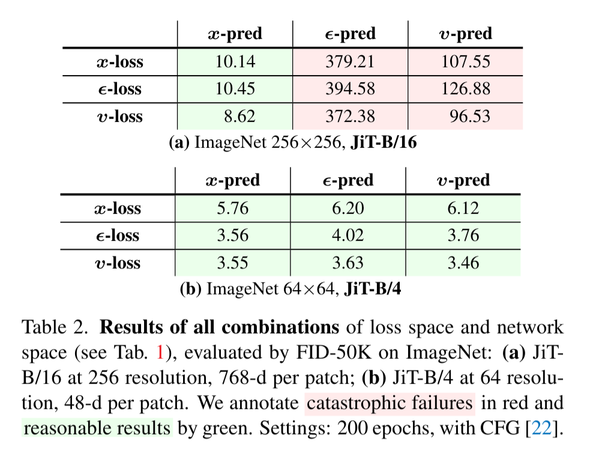
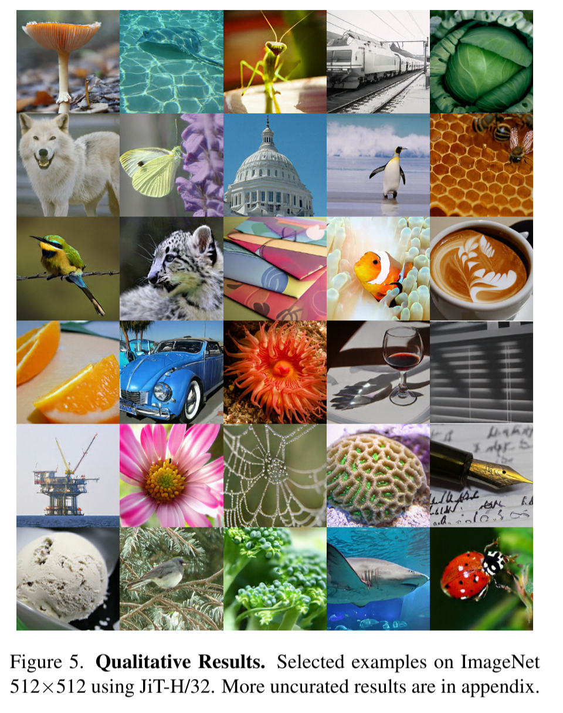

# Back to Basics: Let Denoising Generative Models Denoise

https://arxiv.org/abs/2511.13720
(まとめ @cohama)

# 著者

* Tianhong Li
* Kaiming He

# どんなもの？

- 拡散モデルのネットワークにノイズや velocity (ノイズの時間微分) ではなく、clean image を直接予測させるほうがよいと主張する論文
- プレーンな Vision Transformer を使った画像生成モデル (JiT) で ImageNet 512×512 の FID 1.78 を達成した。

# 先行研究と比べてどこがすごい？

- 従来の DDPM や Flow Matching は主にノイズや velocity を直接予測してきたが、ノイズは高次元であり、有限容量のネットワークにとって学習が難しいのではないかという課題を提示
- ノイズよりも clean image のほうが低次元 manifold 上にあるため、ネットワークのボトルネックを通す際に情報を保持しやすいという仮説を検証

# 技術や手法の肝は？

## 前提知識: 拡散モデル/Flow Matching

clean image を $x$、ノイズを $\epsilon$ とする。
diffusion model や flow-based model では、時刻 $t$ の状態を

$z_t=t x+(1-t)\epsilon$

と表す。

$t=0$ では noise、$t=1$ では clean image になる。

velocity はノイズを時間で微分した $v_t=dz_t/dt$。

予測したノイズを使って reverse diffusion するのが DDPM。
velocity を使って ODE solver で状態を反復更新するのが Flow Matching。

## Prediction space と Loss space

- 数式的には $x$, $\epsilon$, $v$ は相互に変換可能であり、どれを予測しても数式上は同じ生成過程を使える。
- 同様に損失関数も $x$-loss、$\epsilon$-loss、$v$-loss のどれを使っても同じ。
- 9 通りの組み合わせがある。
- 一つを予測すれば他の二つは変換できるが、変換に伴う時刻依存の重みが異なるので、9 通りは学習上は等価ではない。

自然画像 $x$ は高次元 pixel 空間内の低次元 manifold 上にある一方、$\epsilon$ と $v$ は空間全体に広がる。
ネットワークは noise の全情報を保持するのは難しいが、低次元の clean image に必要な情報は残せるという仮説

実際に D 次元に埋め込んだスパイラル (本質的には2次元) を生成する toy 実験でも x-prediction のみ高次元でも崩壊せずに元の分布を再現できる。

## Just Image Transformer (JiT)

- 割とプレーンな ViT

# どうやって有効だと検証した？

# 議論はある？

- 検証は class-conditional ImageNet が中心であり、他の modality や無条件生成でも manifold 仮説が同じ強さで効くかは未検証。

# 次に読むべき論文は？

* Scalable Diffusion Models with Transformers, William Peebles and Saining Xie：JiT の土台となる DiT と adaLN-Zero を提案した論文。
* Simpler Diffusion (SiD2): 1.5 FID on ImageNet512 with Pixel-space Diffusion, Emiel Hoogeboom et al.：階層的な pixel-space diffusion と JiT の精度・計算量を比較するための直接的な先行研究。
* Progressive Distillation for Fast Sampling of Diffusion Models, Tim Salimans and Jonathan Ho：$v$-prediction と prediction target の再パラメータ化を理解する基礎文献。
