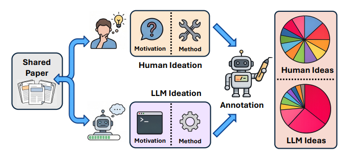
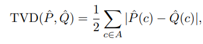
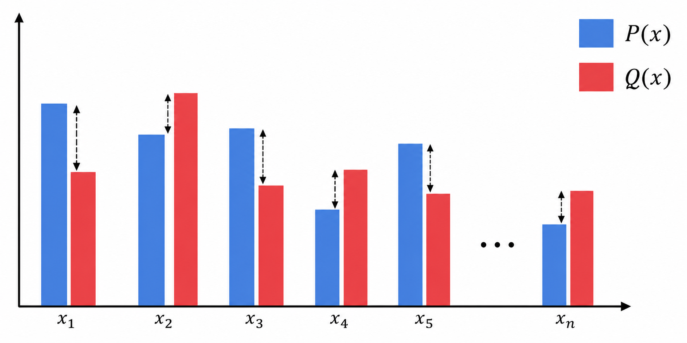
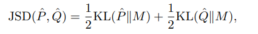
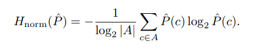
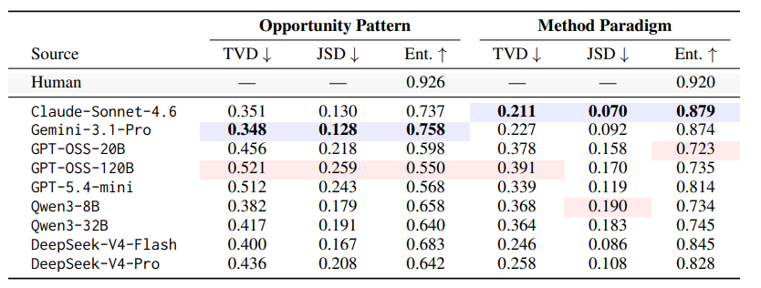
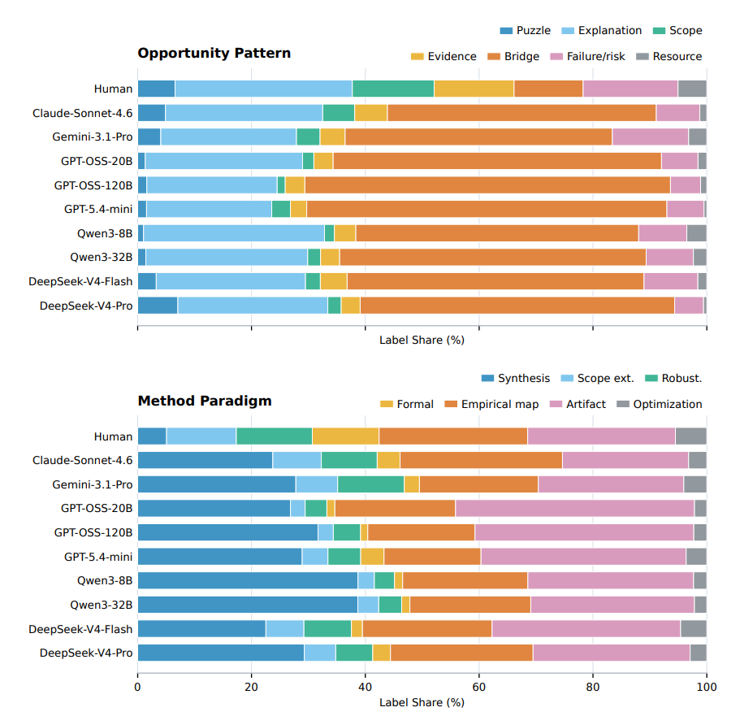
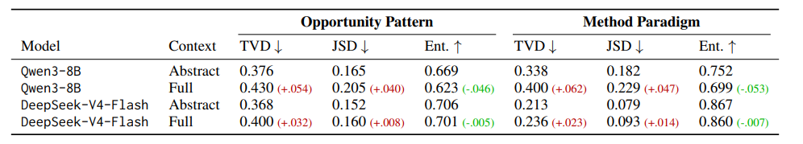
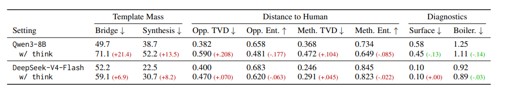
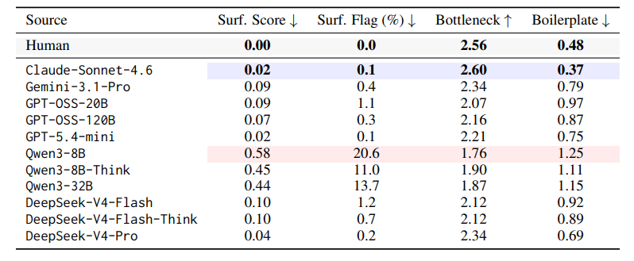

# Measuring the Gap Between Human and LLM Research Ideas

https://arxiv.org/abs/2607.01233
(まとめ @n-kats)

# 著者
* Ziyu Chen
* Yilun Zhao
* Arman Cohan

Yale大学、シカゴ大学の人たち

# どんなもの？

AIに研究アイデアを考えさせた場合に、実際の人間の研究とギャップがあることを確認した論文。

# 先行研究と比べてどこがすごい？
LLMを研究支援に使う場合、少数の成功例を提示していたり、アイデアの品質を評価して、実現可能で新規のアイデアが提案されるのを喜ぶので満足する研究が多い。

この研究は、LLMの生成するアイデアの分布を見るような俯瞰的な観点の研究。

俯瞰して分析する研究はそれなりにあり、人間との差が報告され、それをアイデア生成の文脈で研究したものになる（研究レビューだと妥当性を重視しすぎる）。

# 技術や手法の肝は？

## 問題設定
先行研究情報を与えて、研究アイデアを生成する。

標準的な設定は以下の通り。

* 先行研究情報（複数可）
  * 論文タイトル
  * 論文概要
* 生成
  * モチベーション
  * 提案手法

（プロンプトは論文間のギャップを調べて一貫性のあるアイデアを生成するように指示）

## 分析方法

### データセット
2023〜2026のICLR、ICML、NeurlPS、2023〜2025のNature Communications（科学分野）から抽出。

* 研究の最終目標の抽出
  * 新規性
  * 先行研究からの逸脱
  * 重要な洞察
* 先行研究抽出
  * 4〜8件、関係の高い先行研究を逆算する
  * 各論文で、タイトルと要約を取得

### 分類

アイデアを動機と方法の二種類のラベル付け。（NSF、NIH、AHRQ、DARPAの研究提案と問題定式化のガイダンスをベースに決定）

* 動機（7種）
  * Puzzle: 矛盾（トレードオフも含めて）
  * Explanation: 説明不足（理論解明が足りないとか）
  * Scope: 範囲の不一致（現実的な問題設定にしたいなど）
  * Evidence: 証拠のギャップ（データが少ないとか）
  * Bridge: 橋渡し（研究をつなげるようなもの）
  * Failure/risk: 失敗・リスク（疑惑をもつ）
  * Resource: リソースのボトルネック（計算能力など）
* 方法（7種）
  * Synthesis: 合成
  * Scope ext.: 範囲の拡張
  * Robust: 堅牢化（課題を減らす方向へなにかする）
  * Formal: 形式的導出（形式手法に限らず、証明や概念整理も）
  * Empirical map: データを使った実験・観測
  * Artifact: 成果物の構築（ソフトウェア作成等）
  * Optimization: チューニング

（最初は、動機11、方法9、プラスその他、最大2ラベルまで可のようなルールでやっていたが、ほぼ重複するラベルを統合したり、動機と方法の境界を調整したりして作成（150論文で初期実験））

## 自動アノテーション
LLM(gpt-5.4-mini)でラベル付けをおこなった。
* 動機・方法それぞれで第二候補まで（信頼度つきで）
* 診断スコア
  * 表面的な整合性
  * ボトルネックの特異性
  * 提携表現

150論文で人間（著者2人）の判断と比較し、コーエンのカッパ係数を計算して、信頼性の高さを確認した。

# どうやって有効だと検証した？
## 基本設定
11683論文を使って実験、モデルは9種利用
* Claude-Sonnet-4.6
* Gemini-3.1-Pro
* GPT-OSS-20B
* GPT-OSS-120B
* GPT-5.4-mini
* Qwen3-8B
* Qwen3-32B
* DeepSeek-V4-Flash
* DeepSeek-V4-Pro

## 指標
### TVD

（チャッピー製イメージ）

### JSD

ただしMはP,Qの平均の確率。

### 正規化エントロピー

高いほど、バラけている

### 評価値

3割くらいが人間とは違う観点に分類される（gptは特に大きい）。

### 内訳

圧倒的にbridge（橋渡し）やsyntesis（合成）の割合が多い。

### 先行研究論文全部入れたら？
むしろこの傾向が深まる

### リーズニングモデルなら？
むしろこの傾向が深まる

## 診断スコア

* 表面的な組み合わせか（低い方がよくねられている）
* ボトルネックの特異性（問題箇所をピンポイントで指摘できているか）
* 定形性（ワンパターンさ）

表面的な組み合わせでないモデルもあるものの、クリティカルな部分を指摘したり、独自色のある内容になっている部分が少ない。

## メカニズム分析
合成をしているがどういう合成なのか調べた。
結果、高頻度で出現する概念と別のそのような概念を統合するというパターンが多かった。

# 議論はある？

LLMのアイデア生成は分析で分析すべきことを提示した。

見つかった偏りを正すために、問題の特定方法・貢献方法・典型方法からの逸脱方法を与える必要がある。

今回の実験は引用文献を入力に生成しているが、実際の人間の研究者は暗黙知や失敗や他研究者のフィードバック等の色々な背景があって研究をしている。

今回の結果は分布の重要性をとくものであって、この結果だけから、LLMではアイデア生成ができないと言っているわけでない。

## 私見

プロンプトが悪いのでは？（研究ギャップを分析させているせいで、それを使うアイデアを出しているのでは？）

# 次に読むべき論文は？
* [ResearchBench](https://arxiv.org/abs/2503.21248)
  * 研究アイデアを出すというテーマのベンチマーク？