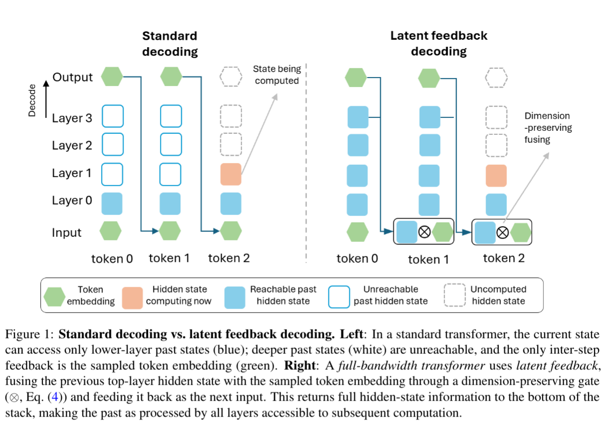
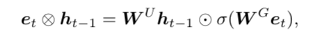
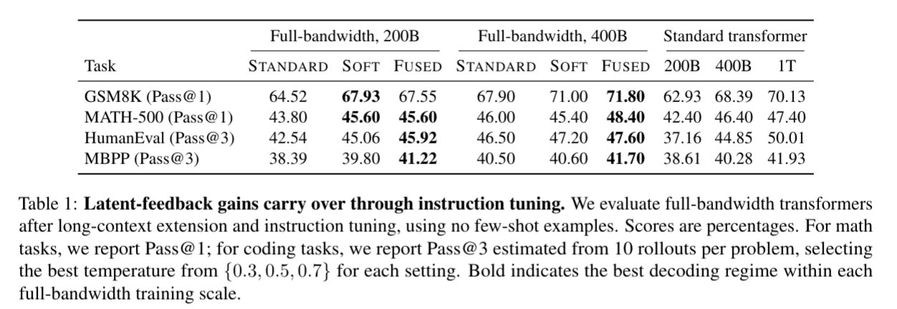

# Full-bandwidth transformer

https://arxiv.org/abs/2608.08888

(まとめ @cohama)

## 著者

- Xi Wang
- Ziyang Cai
- Zheng Zhan
- Harry Dong
- Ying Fan
- Gustavo de Rosa
- Tim Pearce
- John Langford

## どんなもの?

- LLM の Decoding の際に、通常出力した token が次のステップの入力として使われるが、最終層の hidden state も再利用することで、より深い情報を活用できるようにした Full-bandwidth Transformer を提案。
- 1B parameter の実験では、1 token あたりの推論コストをほぼ増やさず、約 1.5 倍多くの token で学習した標準 Transformer に近い性能。

## 先行研究と比べてどこがすごい?

### 通常の Transformer との違い

- 従来の Transformer は時刻 t-1 の出力 token を次の時刻 t の入力として使うが、時刻 t-1 の最終層 hidden state は次の時刻の入力に使われない。
  - hidden state は D 次元 (e.g. 1,536) のベクトルで情報量も豊富だが、token は log2(Vocab) bit (e.g. 16.6) のため、token だけを使うと情報の大半が失われる。
- そこで、最終層の hidden state も次の時刻の入力に使うことで、より多くの情報を活用できるようにする。

### 先行研究との違い

- Feedback Transformer はトークンを1つに集約した表現を未来の token から参照させるが、token 方向に逐次学習するため大規模化しにくい。
- T^2MLR や Latent Recurrent Transformer はモデル内部へ再帰経路を追加するが、本手法は入力だけを変更するだけなのでアーキテクチャの大幅な変更なしで対応可能。また、追加 parameter も控えめ。
- Coconut は token ではなく latent state を生成する手法。本手法は token を残して latent state を併用するため、通常の next-token prediction で学習できる。

## 技術や手法のキモはどこ?

### Latent feedback decoding

- 本手法は前時刻の最終層 hidden state と現在の token embedding を融合し、次の token の layer 0 へ入力する。
- 融合 (fusion) は以下のように定義する。

- W はいずれも DxD の線形変換
- σ は sigmoid
- e (token) がショートカットしないように sigmoid にしている。
  - 単純に h + a e のように加算すると、モデルが h を無視して e だけを使うことができてしまう

### multi-pass training

- latent feedback すると、前 token の forward pass 完了を待たないといけないため、並列に訓練ができないので効率が悪い。そこでマルチパスの学習を提案している。
- 最初のパスは通常の LLM と同じように hidden state を使わずに全 token を予測する。パス2以降は前パスの hidden state を 1 token 右へずらして embedding と融合し、sequence 全体を並列に再計算する。
- 後段のパスから 前段パスへの gradient は切らず、過去の hidden state が未来の予測にも使える表現になるよう学習する。
- 実際のパスのスケジュール: 1 pass 75%、2 pass 22%、3% を 3 pass にすると 30 pass、付録では 1,000 pass まで安定した。

### 推論方法

- Standard: prompt を 1 回 prefill し、生成にも token embedding だけを使う。
- Soft: prompt は通常どおり 1 回 prefill し、生成 token から latent feedback を使う。
- Fused: prompt にも feedback を行う。

## どうやって有効だと検証した?

- 24 layer、hidden size 1,536、context length 8,192 の 1B parameter causal LM を Phi-4 と同じ data mixture で学習した。
- Full-bandwidth model は 100B、200B、400B token、標準 Transformer は最大 1T token まで用意した。

### ベンチマーク結果

- Base model の GSM8K、MATH-500、HumanEval、MBPP では、同じ重みの Soft が Standard を全条件で上回った。
- 200B model の MATH-500 は Soft により Pass@1 が 0.27 から 0.37、HumanEval は Fused により Pass@3 が 0.31 から 0.34 へ改善した。

## 議論はあるか?

- 評価は 1B parameter に限られ、より大規模で深いモデルに同じ効果が出るかは未検証である。
- Feedback-pass schedule は heuristic であり、学習後半の長さや pass 数を決める原理的な方法と十分な ablation がない。

### 私見

- Transformer をループ的な構造にするというアイデアが結構前 (2018年) くらいからあったらしい。この手法に限らず、過去の hidden state を再利用する手法は今後も増えていくと思われる。
- multi-pass 結局 3パスしかしていないで十分というのは面白い。原理的な部分が明らかになればもっと効率的に学習できるかもしれない。

## 次に読むべき論文

- [Addressing Some Limitations of Transformers with Feedback Memory](https://arxiv.org/abs/2002.09402), Angela Fan et al.
  - 過去の全層表現を混合し、未来の attention から参照する直接の先行研究。
- [T^2MLR: Transformer with Temporal Middle-Layer Recurrence](https://arxiv.org/abs/2607.15178), Ziyang Cai et al.
  - 中間層間の時間方向 recurrence を使い、再注入位置と追加 parameter の違いを比較できる。
- [Latent Recurrent Transformer](https://arxiv.org/abs/2605.26797), Zeyi Huang et al.
  - 過去 token の hidden state を attention と residual stream へ注入する近接手法。
