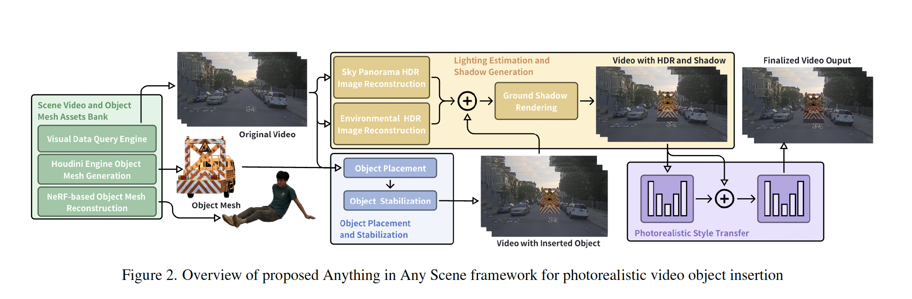
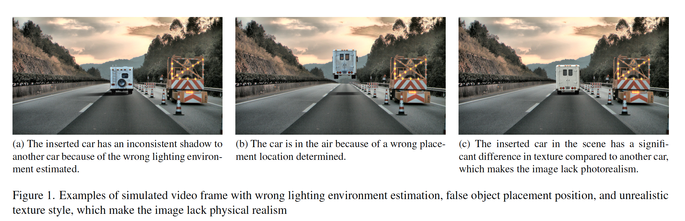
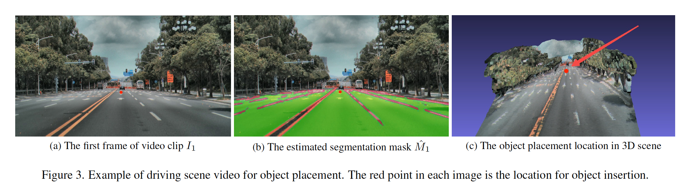
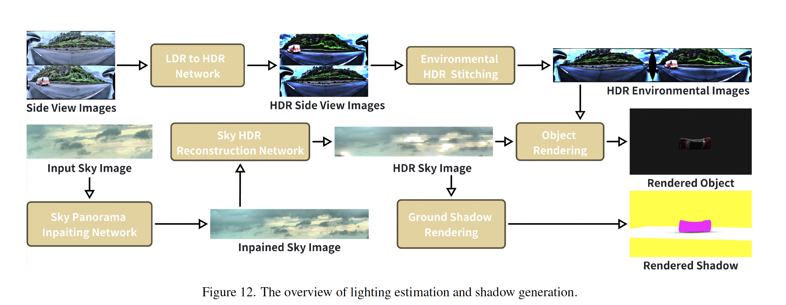
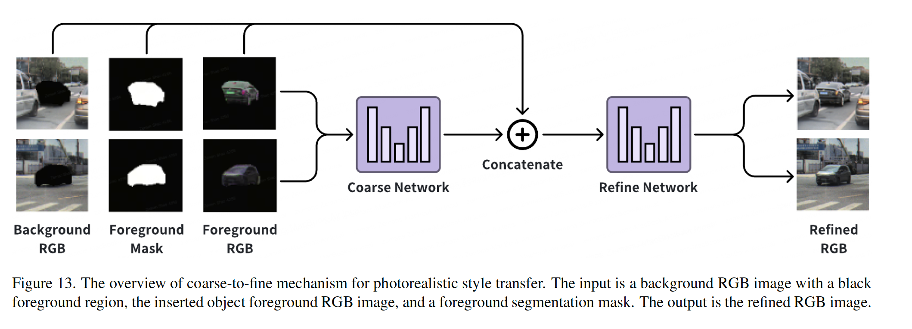
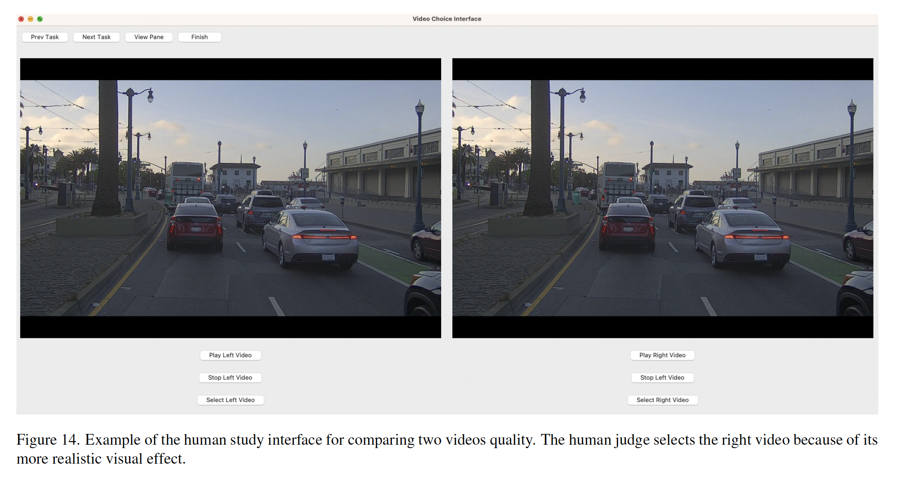
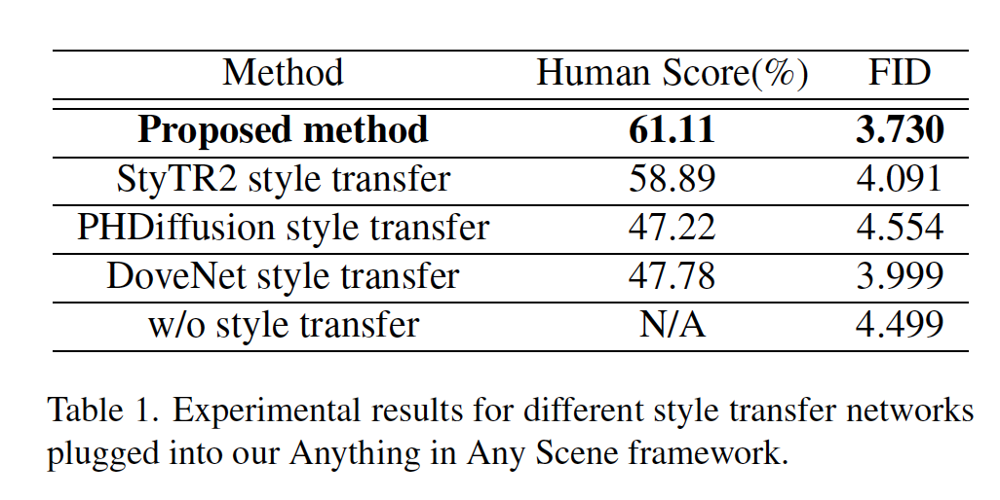
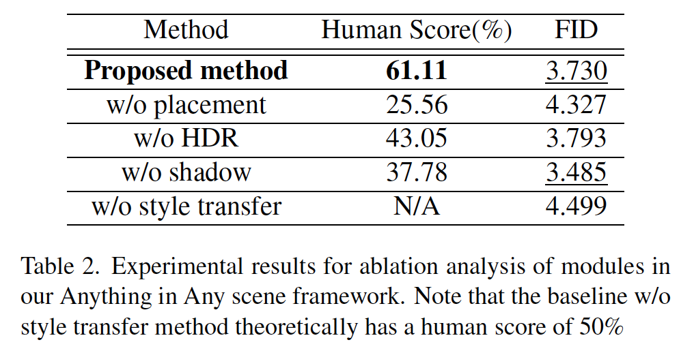
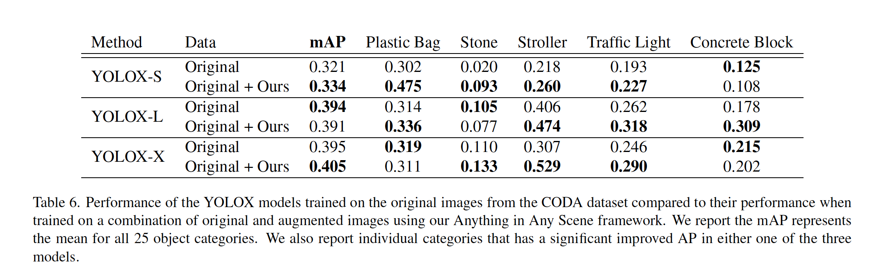
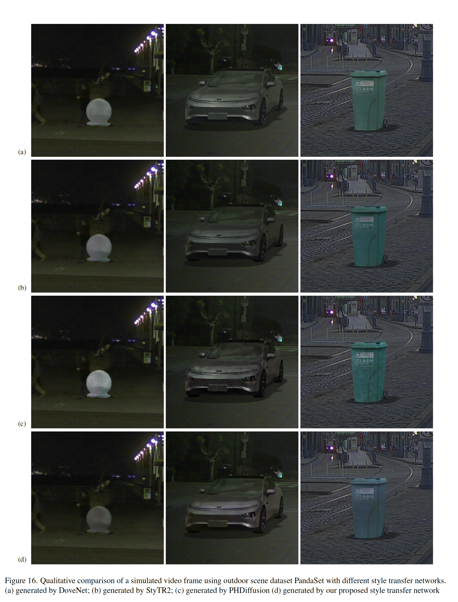

# 落合式まとめ — Anything in Any Scene: Photorealistic Video Object Insertion

(まとめ @meow)
n-katsさんの[AGENTS.md](https://github.com/mlnagoya/surveys/blob/master/AGENTS.md)でベースを作っています。

# 読もうと思った動機

- 2024年2月に流れてきたXの投稿を見て衝撃を受けた。

https://x.com/dutch_osintguy/status/1754924103163580862?s=20

- 当時イスラエルがガザ進行中で偽情報が多数の生成AIフェイクとともに流れてきていたが、見破れるものばかりだった。
	- そんな中で、こいつだけ桁違いにやばかったのを覚えている
	- 非常にリアルな合成でフェイクと言われてもわからない
		- 事後にはなるが、sora2よりも リアルすぎて気になっていた
- 論文を読んだ結論から言うと、「Deepでポン」みたいな感じではなく、3DCG動画合成の負担をMLによって減らす的なものだった

# 論文 基本情報
- 著者: Chen Bai, Zeman Shao, Guoxiang Zhang, Di Liang, Jie Yang, Zhuorui Zhang, Yujian Guo, Chengzhang Zhong, Yiqiao Qiu, Zhendong Wang, Yichen Guan, Xiaoyin Zheng, Tao Wang, Cheng Lu
- 所属: XPeng Motors ([小鵬汽車(](https://ja.wikipedia.org/wiki/%E5%B0%8F%E9%B5%AC%E6%B1%BD%E8%BB%8A)wikipedia))
- arXiv pdf (2024/1/30版)
	- https://arxiv.org/abs/2401.17509
- プロジェクトページ: https://anythinginanyscene.github.io
	- サンプルを見るのが一番早い
- 学会
	- IS&T Electronic Imaging 2025
	- https://www.imaging.org/IST/IST/Conferences/EI/EI2025/Program.aspx
- リポジトリ
	- https://github.com/AnythingInAnyScene/anything_in_anyscene
	- 部分的にしかコードが上がっていない。
		- パイプラインの核心であるレンダリングエンジン（`vulkan_render`, `pytorch_render`）が丸ごと欠落しており、そのままでは動作しない
		- [issue欄](https://github.com/AnythingInAnyScene/anything_in_anyscene/issues)がコードアップロード催促だらけ

# 1. どんなもの?

- 既存の走行動画（自動運転シーンの実写映像）に、任意の3Dオブジェクトを幾何・照明・質感の3面で違和感なく合成する汎用フレームワーク。
- カメラ幾何に基づく3D配置 → HDR照明推定＋Vulkanレイトレーシングによる影生成 → GANベースのスタイル転写、という3段のパイプラインで構成される。
- 自動運転データに含まれにくいレア物体（工事障害物・ベビーカー等）を実写動画に合成し、物体検出モデルの学習データ拡張に使える実用性を示した。

# 2. 先行研究と比べてどこがすごい?
- 既存手法（比較対象のGeoSim[7]等）は車など合成できるクラスが限定されていたり、屋内シーンに留まりがちだったのに対し、Houdini Engineによる既存3Dアセットの物理加工＋NeRFベースの3D再構成を組み合わせ、**任意の物体を挿入可能**にした
- **照明環境**・**オブジェクトジオメトリ(その物体が本来持っている3D的な形・大きさ・向き・位置がまとも)**・**写実性**の3要素を統合的に扱い、単純な2D貼り付け合成ではなく実測3D幾何復元に基づくVFXパイプラインに近い構成でレンダリングする点が新しい
- 定量評価（Human Score / FID）で既存のスタイル転写手法（DoveNet, StyTR2, PHDiffusion）を上回った

# 3. 技術や手法のキモはどこ?

## 素材の用意

- Assets Bank
	- 貼り付けるものについては2つ
		- Houdini Engine(既製3Dモデルの物理加工)で車の破損などを作成
		- 人のような既存3Dモデルはないが、多視点写真がある場合は、NeRFベースで再構成
	- 貼り付け元に適している動画は検索しやすいようにSIFT特徴量を取ったものでDB化しているらしい
		- ただ、どういう形のクエリで動画を検索するのかは不明
			- SIFTだと類似画像検索っぽくなりそうだが、、、

## 合成における3段パイプライン構成

そのまま物体を置くと、↓のように影がおかしかったり、宙に浮いたり、テクスチャがおかしくて現実っぽくなくなってしまう

- なので、伝統的なCGパイプライン（配置→ライティング→レンダリング→コンポジット）の各段を機械学習モデルで差し替えるようにしている
- なお、実験データである、PandaSetはドラレコ映像のようにみえるが、車にセンサーを取り付けているので、RGB情報だけでなく、フレーム単位でカメラ姿勢(世界座標)も、空間のLiDAR点群/ScanNet++の深度センサーも持っている

###  1. Object Placement and Stabilization(物体配置)
3D空間上で 合成したい物体を置く位置の調整

- カメラ内部/外部パラメータによる幾何投影＋セマンティックセグメンテーションによる遮蔽判定＋3D点群による設置面フィッティング＋オプティカルフローによるフレーム間の姿勢安定化。
	- 空間に物を置くために、セグメンテーションで地面(クラス)を推定しているようだが、なんのモデルを使っているかは不明。地面の部分に対応する点群に物体をおいていると思われる
- これにより、挿入物体は3D空間中の1点に固定され、フレームごとに異なるカメラ視点から再レンダリングすることでカメラの動きに応じて物体の見え方も自然に変化するのを実現できる

 

### 2.Lighting Estimation and Shadow Generation 

挿入する3Dオブジェクトに、そのシーン本来の光を当てて、正しい影を落とす作業

- ドラレコ画像、拡散モデル（グーグル社Palette）でパノラマinpaintingし360度画像を推定
- 加えて、GANにより画像を256階調からHigh Dynamic Range輝度復元(白飛びした太陽の実際の輝度を推定)
	- どういうGANモデル化は不明。re-trainingしたともかいてあるが
- これらの情報をレイトレーシング時の環境光源として入力し、物体の陰影＋影を物理計算でレンダリングする。これで合成する物体の画像とその影のpng画像をマスク情報付きでゲットできる

### 3. Photorealistic Style Transfer (コンポジット)

前の工程までで、配置する位置や照明を考慮した画像にはできたけど、それでも残る微妙な質感・色調のズレを最後に消して合成する工程

- GANベースのcoarse-to-fine inpaintingネットワークで、レンダリング済み画像と実写背景を最終的に画像空間で違和感なく合成する
- ※coarse-to-fine inpaintingネットワークとは
	- 「Coarse(粗い)からFine(精密)へ」、つまりまず大まかな結果を作り、それを段階的に磨き上げていくという、画像生成・画像処理でよく使われる設計パターン
		- Coarseネットワーク: reconstruction loss(単純な再構成誤差)だけで学習 → まず「だいたい合ってる」状態を目指す
		- Refineネットワーク: reconstruction loss + WGAN loss(GANで"それらしさ"を判定) → 細部のリアルさまで詰める
	- コードを見る感じ、DeepFill というinpaintingモデルっぽそう

# 4. どうやって有効だと検証した?

- **主観/客観評価**: PandaSet（屋外）/ScanNet++（屋内）でHuman Score（A/Bテスト）とFIDにより、提案スタイル転写ネットワークが既存手法（DoveNet/StyTR2/PHDiffusion）を上回ることを確認（Human Score 61.11% / FID 3.730で最良）

※主観評価について、アプリでは2個の比較しかしていないが、どうやって4つを比較したのだろう

- **Ablation**: placement/HDR/shadow/style transferを1つずつ除去して比較。特に「影の有無」はHuman Score（フル61.11% → 影なし37.78%）に大きく効くがFIDにはあまり反映されないというギャップを指摘（計算指標と人間知覚のズレ）

- **下流タスク評価**: CODAデータセット（KITTI/nuScenes/ONCE統合の道路コーナーケース集）にレア物体（9〜25カテゴリ）を合成挿入して物体検出器YOLOX-S/L/Xを再学習し、mAPが実際に改善（+1.1〜3.7pt）することを確認。合成データによる学習データ拡張の実用価値を実証

# 5. 議論はあるか?

- **評価指標の乖離**: FID（統計的画像分布の近さ）と人間の知覚評価（Human Score）が必ずしも一致しない、という指摘がある

# 6. 次に読むべき論文は?
- **GeoSim**（Chen et al., CVPR 2021）— 本論文が直接の比較対象・先行研究として位置づける、自動運転向け車両挿入のの手法

# 所感

- 評価について
	- yolox-sはそれなりだが... 思ったより上がらない。。。生成データあるあるという感じ。
	- 画像見るとけっこう優れているようにみえるのだが...(一番下の行の3つが今回の手法で合成したもの)
    	- チェリーピックしたもの載せているだけかもしれない

- 当初の学習データのロングテール問題は解決できるかの評価はしてない?
	- ゴミ箱や信号機みたいな道路にありがちなものしか配置していない。
	- 火災が起きた車両みたいなものを検知できるようになるかが大事な気がする
- またx投稿で示されたフェイクニュースみたいな議論は論文中にはまったくなく、純粋に自動運転学習データにおけるロングテール問題を解消するためにデータ作成している旨だけが書かれている。
	- 論文を読んでわかったが、手軽に合成動画をつくれる代物ではない(全フレームに3D空間情報、カメラパラメータが必要)
		- なので、素人が偽情報拡散目的でこの手法を悪用するシナリオはあまり現実的ではない。
	- 「Deepでポン」じゃなくて本当良かった
		- こんなのが情報戦で展開されたら、偽情報拡散仕放題なので
- 2026年9月だったら、視覚基盤モデルももう少しリッチになっているので、パイプラインも工夫できる?
	- データにカメラ姿勢推定必要なくなる?

