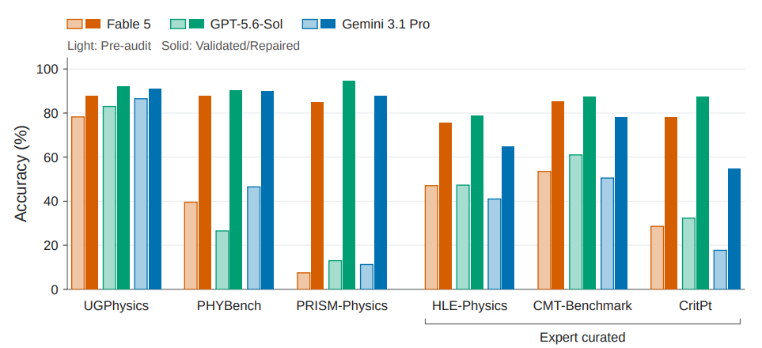
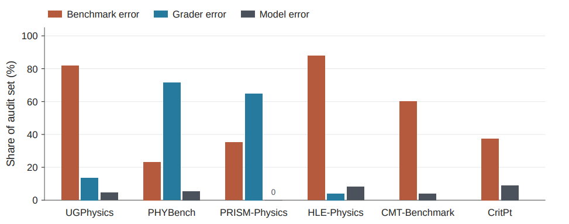
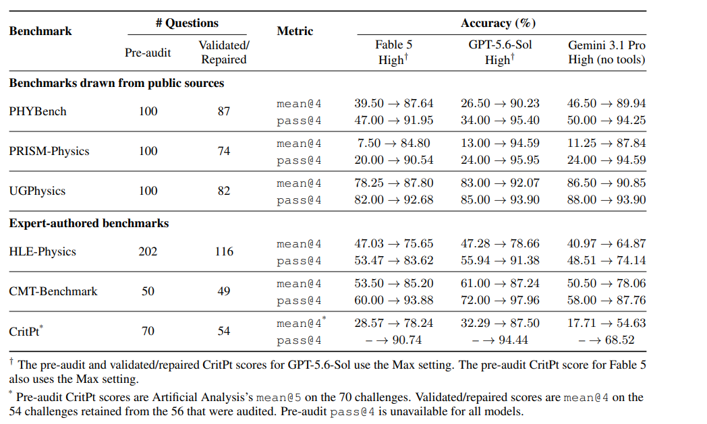
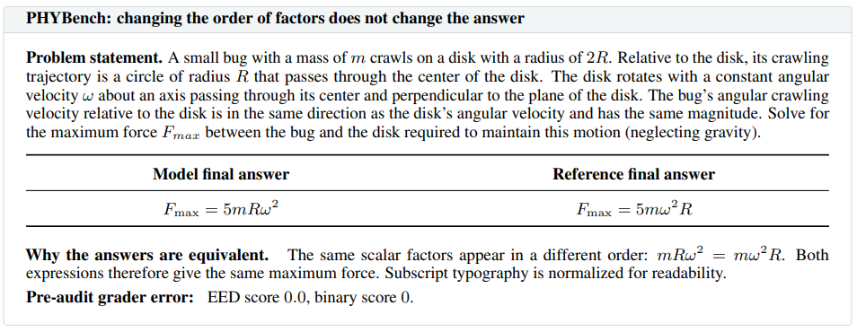
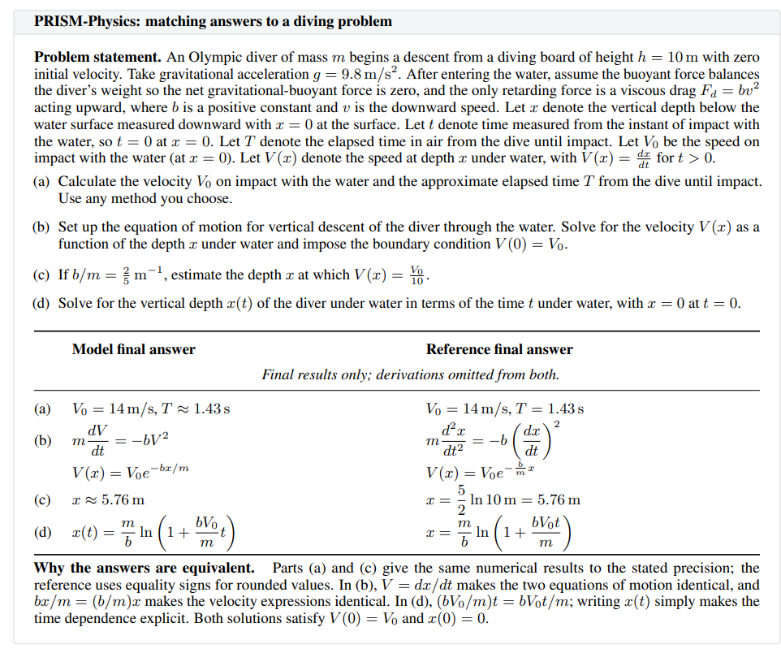
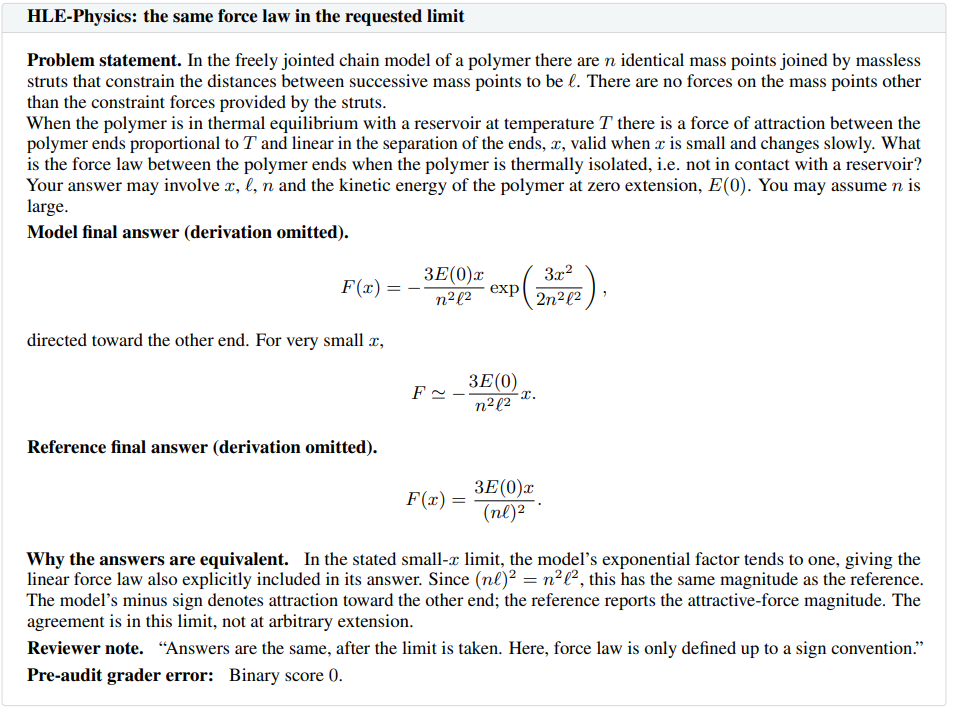
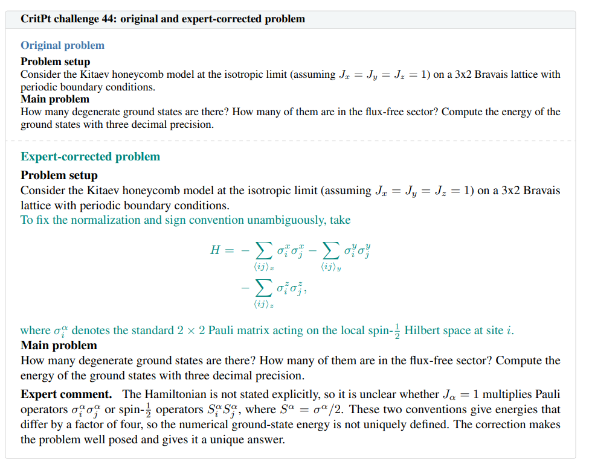
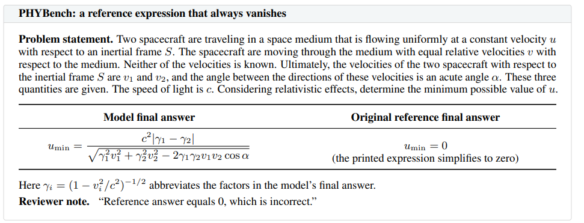
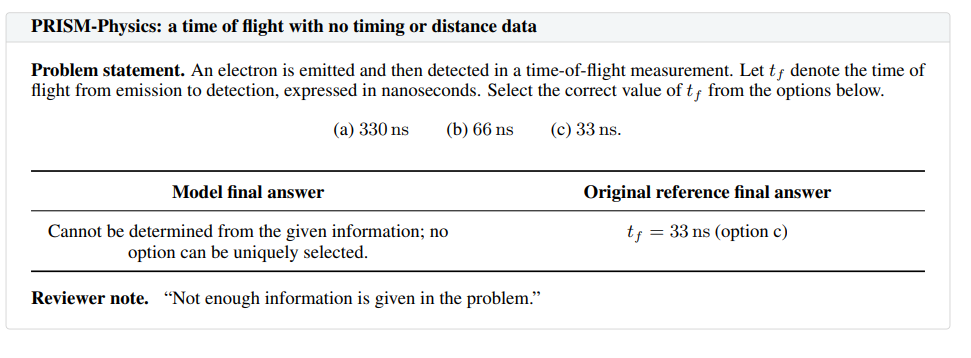

# How Good Are Frontier Models at Physics? Expert Re-Grading Reveals Broken Evaluations and Near-Saturation of Leading Benchmarks
https://arxiv.org/abs/2609.13009
(まとめ @n-kats)

# 著者
- Ali Ansari
- Haoran Sun
- Andy Zeyi Liu
- Mark Jabbour
- Yongshan Ding
- Steven Girvin
- Yu He
- Sohrab Ismail-Beigi
- Aleksander Kubica
- Owen D. Miller
- Corey O'Hern
- Vidvuds Ozolins
- David Poland
- A. Douglas Stone
- Frank C. van den Bosch
- Logan Wright
- Navid Akbari
- Santanu Antu
- Kangle Cai
- Andrew Calabrese-Day
- Mateo Cárdenes Wuttig
- Meng Cheng
- Barry T. Chiang
- Ali Ghorashi
- Shouzhen Gu
- Haoyang Huang
- Zhibo Kang
- Lukas Kienesberger
- Hantian Liu
- Charles Lomba
- Zhongling Lu
- Wenchao Ma
- Rohin E. McIntosh
- Evan McKinney
- Ivan Rojkov
- Xulei Sun
- Yarone Meir Tokayer
- Naveen Balaji Umasankar
- Mira Varma
- Leda Wang
- Qimin Wang
- Tyler Wang
- Haoyu Wei
- Jinming Yang
- Jinchen Zhao
- Sherlock Tingrui Zhao
- Qinyuan Zheng
- Jay S. Zou
- Lucas Baker
- Arman Cohan
- John Sous

Yale大学、Jump Trading Group（アルゴリズム取引とかをしている会社）、ケンブリッジ大学、南カリフォルニア大学のメンバー（51人）

# どんなもの？
本当にフロンティアモデルは物理学で詰まっているのか？専門家が業務で使っている印象と一致しない？という問を持ち、よくある物理学のベンチマークの結果を見直した。
それにより多くの問題で採点方法や問題が悪いことに気づいた。
修正して評価したところ、かなり数値が改善し、フロンティアモデルがこの手のクローズドな問題はかなりの部分が解けるといえそうだと言えるレベルだった。

# 先行研究と比べてどこがすごい？
HLE(humanity's last Exam)を含め、専門家による確認を行って修正を行った。

（最近の数学者の対AI宣言のお客様気分さとは違って、専門家がAIを検証して貢献している）

# 技術や手法の肝は？
## 対象ベンチマーク
* UGPhysics: 学部レベルの問題集
* PHYBench: 物理オリンピックレベルまで
* PRISM-Physics: 大学院入試レベル
* HLE-Physics
* CMT-Benchmark: 凝縮系理論の研究レベル問題集
* CritPt: 最先端分野全体を網羅する専門家レベルの問題集

導出部分は評価対象外とした。
正解率をmean@4もしくはpass@4で評価した。

LLMベースの評価を行う部分はHLEの評価パイプラインを利用した。

## 間違いの検出/検証
GPT-5.6-Sol Highで何度か試し、全て不正解だった場合のみを対象にした。また、マルチモーダルな問題はのぞいた。

イエール大学の物理学者（院生含む）を中心に、検証チームを構成。

* 問題の定式が妥当か・模範解答が妥当かを評価
* 問題を修正
  * HLE-Physics/PHYBench/PRISM-Physics/UGPhysics は除外
  * CritPtとCMT-Benchmarkは可能な限り修正

# どうやって有効だと検証した？
## 不正解の内訳
* ベンチマークエラー（問題に欠陥あり）
* 採点エラー（評価方法に問題あり）
* モデルエラー（普通に不正解）
の内訳は次のようになった。

## 修正後の結果

＊CritPtはMax設定を利用

## 間違いの例
### 採点エラー
PHYBenchでは式編集距離（EED）で評価しているが、 $ \fraq{P}{3\sqrt 6} $ と $ \fraq{\sqrt 6}{18} P $ を別と判定してしまっている。
（LLMベースの検証をしないといけない）

他の例

符号の曖昧さがある問題

### ベンチマークエラー

元の問題には、ハミルトニアン（H）の式が与えらえれていない。ノーテーションの違いによって4倍異なる2通りの読み方があり得る。

#### PHYBench

単純に間違い（0じゃないのに0となっている)

#### PRISM-Physics

情報不足で選べない

#### UGPhysics

問題側が遠くに飛んでいくケースを考慮できていない

#### CMT-Benchmark

単純な間違いだが(gのことを考慮できていないためにbが落ちている)、モデルも間違っていて、真の正解がa,b,cだったという例。

# 議論はある？
一般的な評価結果と異なり、高いスコアが出せることがわかった。

真のエラー率が出題ミス率を下回って悪影響がでている。

この結果から、クローズドな問題をほとんど解けると言え、モデルが転換点に到達したといえる。

しかし、物理学研究をE2Eで実施できるわけではない。理論物理学の未解決問題を解かせたがうまくいかなかった。

## 私見
正解したものが残っているから、正解率は高くなりがちだけど、そういう問題はないのかな？（正しい問題が特定できない場合が難しいとか）

# 次に読むべき論文は？
- 自然言語処理分野で、ベンチマーク側の間違いを指摘した例
  - https://arxiv.org/abs/2103.14749
  - https://arxiv.org/abs/2104.02145