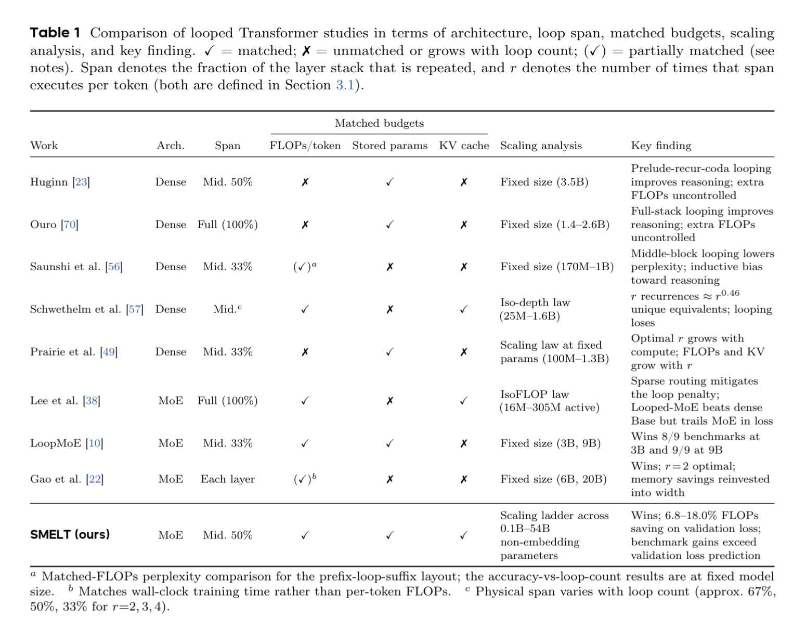
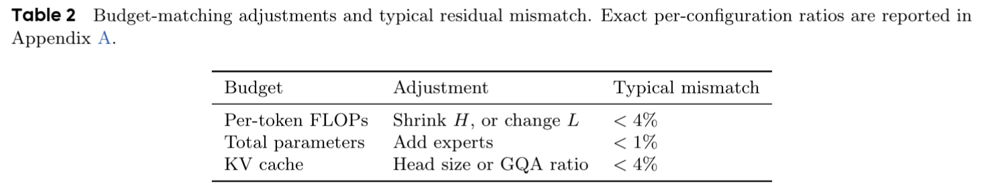
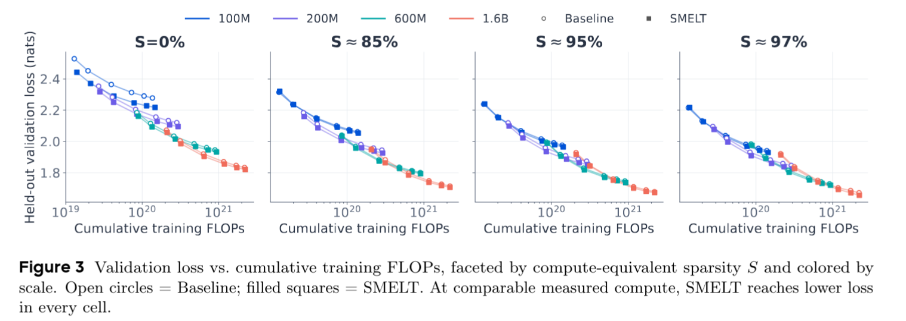
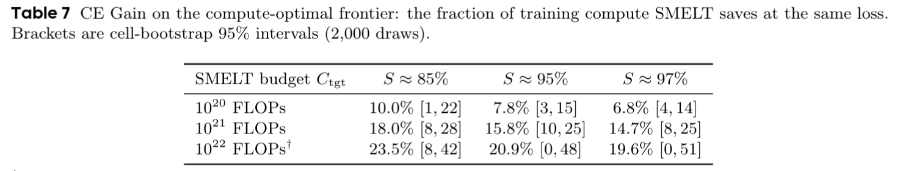
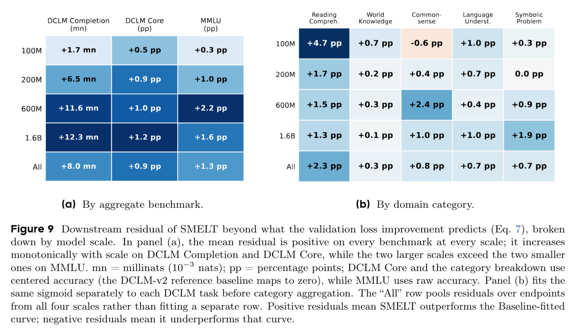

# SMELT: Scaling Laws for Compute-Matched MoE Looped Transformers
https://arxiv.org/abs/2609.01343
(まとめ @cohama)

# 著者

- Shaowen Wang
- Ge Zhang
- Kairong Luo
- Yuhao Wu
- Shaofan Liu
- Jiaheng Liu
- Wenhao Huang
- Shen Yan
- Jian Li

清華大学, ByteDance Seed, M-A-P, TokenWave.ai

# どんなもの？

- Transformer の中間層を繰り返す、Loop Transformer の一種
- 中間50%の層を2回通す SMELT を提案し、FLOPs、総パラメータ数、KV cache を通常の MoE とほぼ公平な条件に揃えた上で比較した
- Loop Transformer により学習計算量が 6.8〜18.0% 削減することを確認

# 先行研究と比べてどこがすごい？

- Loop Transformer は効果が高いという主張はこれまであったが、loop によって増える FLOPs や KV cache を揃えていなかった。
- FLOPs を揃えた既存研究も、loop 側の固有パラメータ数が減るため、重み共有の効果と容量低下を分離できていなかった。
- SMELT は MoE の expert 数で容量を回復し、FLOPs・総パラメータ数・KV cache の3つを同時にほぼ一致させることで loop の効果をより厳密に効果測定
- 最大54B総パラメータまで実験、scaling law を導いた

# 技術や手法の肝は？

- 通常の MoE Transformer をベースラインとする。
- Loop Transformer として中間層の50%を2回ループさせる。(50%, 2回 が良いというのは ablation により探索)
- loop による追加実行分があるので FLOPs が増えす。それを相殺するためチャネル数を狭め、per-token FLOPs を Baseline に近づける。
- チャネル数を減らすとパラメータ数が減るので、expert 数を増やして総パラメータ数を揃える。
- attention head size と grouped-query attention（GQA）比率を調整し、KV cache の容量も揃える。

# どうやって有効だと検証した？

- 100M・200M・600M・1.6B active parameter と、0%・約85%・約95%・約97% sparsity の4×4 grid で比較
- sparsity は総パラメータ数に対する、1token あたりの計算量の割合

- Downstream task でも評価

# 議論はある？

- loop 構成の探索は 200M でのみで、本当に大規模モデルでもこの構成が最適かは不明
- シンプルなループ構成のみを探索しているが、他のループ構成でどうかは検証できていない
- 実時間での効率という点が考慮できていない。ループは逐次計算なのでハードウェア上不利になりやすい
- なぜ loop が有効なのかの因果関係はまだ説明できない

## 私見

- Transformer 弄る系の手法は多くあるが、ここまで公平な条件で比較した論文は少なく、その上で Loop Transformer の有効性を示した点は面白い
- loop なしで MoE の expert 数を増やしたり、channel 数を変更したりしたときの影響も比較しないと本当に Loop の効果かどうかは厳密には分からない。

# 次に読むべき論文は？

- [Universal Transformers](https://openreview.net/forum?id=HyzdRiR9Y7), Mostafa Dehghani et al.
  - depth 方向の重み共有を反復計算として導入した出発点。
- [Recurrent Looped Transformer](https://yifanzhang-pro.github.io/recurrent-looped-tranformer/Recurrent_Looped_Transformer.pdf), Yifan Zhang et al.
- [Does Recurrence Pay? A Controlled Evaluation of the Recurrent Looped Transformer](https://www.alphaxiv.org/pdf/2609.recurrence-looped-transformer-evaluation)
  - トークン間をまたぐ情報の伝播をする手法、ただし後者の論文で実験的には有効性が示されなかった。
